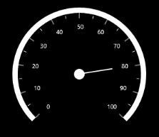
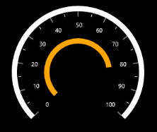
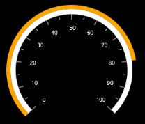
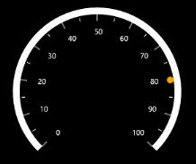
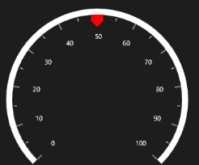
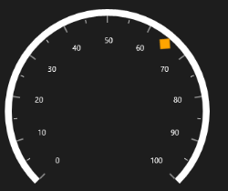

# Pointer Settings

Pointers

You can add multiple pointers to the gauge to point at multiple values on the same scale. This is useful for showing a low and a high value at the same time. The value of the pointer is set by using the Value property. There are three types of pointers. You can choose a pointer by using the PointerType property. Movement of the pointer can be animated by enabling the EnableAnimation property.

Needle Pointer

A needle pointer contains two parts, the needle and the pointer cap. The needle length is controlled by the NeedleLengthFactor property. The NeedleLengthFactor property’s minimum and maximum bounds are 0 and 1. The needle’s UI is customized by using NeedlePointerStroke and NeedlePointerStrokeThickness properties. You can modify the pointer cap’s size by changing the PointerCapDiameter property. Needle Pointer can be made visible or collapsed by using the NeedlePointerVisibility property.

Code Example:

[XAML]

&lt;syncfusion:SfCircularGauge x:Name="gauge"&gt;

   &lt;syncfusion:SfCircularGauge.MainScale&gt;

      &lt;syncfusion:CircularScale&gt;

         &lt;syncfusion:CircularScale.Pointers&gt;

            <syncfusion:CircularPointer Value="80"

                                        PointerType="NeedlePointer" 

                                        EnableAnimation="True"

                                        NeedleLengthFactor="0.5"

                                        NeedlePointerStroke="White" 

                                        NeedlePointerStrokeThickness="2" 

                                        PointerCapStroke="White" 

                                        PointerCapDiameter="20"  

                                        NeedlePointerVisibility="Visible"   /> 

         &lt;/syncfusion:CircularScale.Pointers&gt;

      &lt;/syncfusion:CircularScale&gt;

   &lt;/syncfusion:SfCircularGauge.MainScale&gt;

&lt;/syncfusion:SfCircularGauge&gt;

[C#]

            SfCircularGauge circularGauge = new SfCircularGauge();

            CircularScale _mainscale = new CircularScale();

            _mainscale.Pointers.Add(new CircularPointer() { Value = 80, PointerType = PointerType.NeedlePointer, EnableAnimation = true, NeedleLengthFactor = 0.5, NeedlePointerStroke = new SolidColorBrush(Colors.White), NeedlePointerStrokeThickness = 2, PointerCapStroke = new SolidColorBrush(Colors.White), PointerCapDiameter=20, NeedlePointerVisibility=Visibility.Visible});

            circularGauge.MainScale = _mainscale;

            this.Grid.Children.Add(circularGauge);

Screenshot:

{  | markdownify }
{:.image }

NeedlePointer Customization

NeedlePointer can be customized by using the NeedlePointerType property of Pointer and it is having the following options.

* Rectangle
* Triangle 
* Tapered
* Arrow

Code Example:

[XAML]

&lt;syncfusion:SfCircularGauge x:Name="gauge"&gt;

            &lt;syncfusion:SfCircularGauge.Scales&gt;

                &lt;syncfusion:CircularScale&gt;

                    &lt;syncfusion:CircularScale.Pointers&gt;

                        <syncfusion:CircularPointer 

                                        NeedlePointerType="Tapered"

                                        Value="70"

                                        PointerType="NeedlePointer" 

                                        EnableAnimation="True"

                                        NeedleLengthFactor="0.75"

                                        NeedlePointerStroke="Red" 

                                        NeedlePointerStrokeThickness="30" 

                                        PointerCapStroke="Green" 

                                        NeedlePointerVisibility="Visible"   />

                    &lt;/syncfusion:CircularScale.Pointers&gt;

                &lt;/syncfusion:CircularScale&gt;

            &lt;/syncfusion:SfCircularGauge.Scales&gt;

        &lt;/syncfusion:SfCircularGauge&gt;

[C#]

            SfCircularGauge circularGauge = new SfCircularGauge();

            CircularScale scale = new CircularScale();

            scale.Pointers.Add(new CircularPointer(){

                Value = 70,

                NeedlePointerType=NeedlePointerType.Arrow, 

                PointerType = PointerType.NeedlePointer, 

                EnableAnimation = true,

                NeedleLengthFactor = 0.75, 

                NeedlePointerStroke = new SolidColorBrush(Colors.Red), 

                NeedlePointerStrokeThickness = 30,

                PointerCapStroke = new SolidColorBrush(Colors.Green), 

                PointerCapDiameter = 20,

                NeedlePointerVisibility = Visibility.Visible 

            });

            circularGauge.Scales.Add(scale);

            this.Grid.Children.Add(circularGauge);

Screenshot:

{  | markdownify }
{:.image }

Range Pointer

Range Pointer is an accenting line or shaded background range that is placed on a gauge to mark values. The range pointer’s UI is customized by using the RangePointerStroke and RangePointerStrokeThickness properties. RangePointerVisibility property is used to set the visibility of the Range Pointer.

Code Example:

[XAML]

   &lt;syncfusion:SfCircularGauge x:Name="gauge"&gt;

      &lt;syncfusion:SfCircularGauge.MainScale&gt;

         &lt;syncfusion:CircularScale&gt;

            &lt;syncfusion:CircularScale.Pointers&gt;

               <syncfusion:CircularPointer Value="80"

                                           PointerType="RangePointer" 

                                           EnableAnimation="True"

                                           RangePointerStroke="Orange"

                                           RangePointerStrokeThickness="10"

                                           RangePointerVisibility="Visible"

                                           />

            &lt;/syncfusion:CircularScale.Pointers&gt;

         &lt;/syncfusion:CircularScale&gt;

       &lt;/syncfusion:SfCircularGauge.MainScale&gt;

   &lt;/syncfusion:SfCircularGauge&gt;

[C#]

            SfCircularGauge circularGauge = new SfCircularGauge();

            CircularScale _mainscale = new CircularScale();

            _mainscale.Pointers.Add(new CircularPointer() { Value = 80, PointerType = PointerType.RangePointer, EnableAnimation = true, RangePointerStroke = new SolidColorBrush(Colors.Orange), RangePointerStrokeThickness =10, RangePointerVisibility=Visibility.Visible});

            circularGauge.MainScale = _mainscale;

            this.Grid.Children.Add(circularGauge);

Screenshot:

<table>
<tr>
<td>

{:.image }
</td></tr>
<tr>
<td>
{{ '_Circular Scale with Range Pointer_' | markdownify }}</td></tr>
</table>
RangePointerPosition

The RangePointer in the scale can be placed inside the scale or outside the scale by selecting one of the options available in the RangePointerPosition property. These options are:

1. Inside (Default)
2. Outside

Code Example:

[XAML]

            &lt;syncfusion:SfCircularGauge x:Name="gauge"&gt;

                &lt;syncfusion:SfCircularGauge.MainScale&gt;

                    &lt;syncfusion:CircularScale RangePointerPosition="Outside"&gt;

                        &lt;syncfusion:CircularScale.Pointers&gt;

                            <syncfusion:CircularPointer Value="80"

                                                   PointerType="RangePointer" 

                                                   RangePointerStroke="Orange"

                                                   RangePointerStrokeThickness="8"/>

                        &lt;/syncfusion:CircularScale.Pointers&gt;

                    &lt;/syncfusion:CircularScale&gt;

                &lt;/syncfusion:SfCircularGauge.MainScale&gt;

            &lt;/syncfusion:SfCircularGauge&gt;

[C#]

      SfCircularGauge circularGauge = new SfCircularGauge();

            CircularScale _mainscale = new CircularScale();

            _mainscale.RangePointerPosition = RangePointerPosition.Outside;

            _mainscale.Pointers.Add(new CircularPointer() { Value = 80, PointerType = PointerType.RangePointer, EnableAnimation = true, RangePointerStroke = new SolidColorBrush(Colors.Orange), RangePointerStrokeThickness = 8 });

            circularGauge.MainScale = _mainscale;

            this.Grid.Children.Add(circularGauge);

Screenshot:

{  | markdownify }
{:.image }

Symbol Pointer 

In a Symbol Pointer, the value is pointed out by a symbol on the scale. You can modify the symbol pointer’s size by changing the SymbolPointerDiameter property. Its stroke is changed by using the SymbolPointerStroke property. The visibility of the Symbol Pointer can be set by using the SymbolPointerVisibility Property.

Code Example:

[XAML]

&lt;syncfusion:SfCircularGauge x:Name="gauge"&gt;

   &lt;syncfusion:SfCircularGauge.MainScale&gt;

      &lt;syncfusion:CircularScale&gt;

         &lt;syncfusion:CircularScale.Pointers&gt;

            <syncfusion:CircularPointer Value="80"

                                        PointerType="SymbolPointer" 

                                         EnableAnimation="True"        

                                        SymbolPointerStroke="Orange"

                                        SymbolPointerVisibility="Visible"

                                        />

         &lt;/syncfusion:CircularScale.Pointers&gt;

      &lt;/syncfusion:CircularScale&gt;

   &lt;/syncfusion:SfCircularGauge.MainScale&gt;

&lt;/syncfusion:SfCircularGauge&gt;

[C#]

            SfCircularGauge circularGauge = new SfCircularGauge();

            CircularScale _mainscale = new CircularScale();

            _mainscale.Pointers.Add(new CircularPointer() { Value = 80, PointerType = PointerType.SymbolPointer, EnableAnimation = true, RangePointerStroke = new SolidColorBrush(Colors.Orange), SymbolPointerVisibility=Visibility.Visible});

            circularGauge.MainScale = _mainscale;

            this.Grid.Children.Add(circularGauge);

Screenshot:

{  | markdownify }
{:.image }

Symbol pointer Customization

One advantage to the symbol pointer is its customizability. You can change the height, width, and appearance of the symbol pointer.

Symbol is an enum property that provides symbol options for the symbol pointer that contains several shapes like rectangle, ellipse, and triangle. The SymbolPointerHeight property is used to set the height of the symbol pointer. The value is given as a double value. The SymbolPointerWidth property is used to set the width of the symbol pointer.

Code Example:

[XAML]

        &lt;syncfusion:SfCircularGauge x:Name="gauge"&gt;

            &lt;syncfusion:SfCircularGauge.MainScale&gt;

                &lt;syncfusion:CircularScale&gt;

                    &lt;syncfusion:CircularScale.Pointers&gt;

                        <syncfusion:CircularPointer PointerType="SymbolPointer" 

                                   Symbol="Pentagon" 

                                   SymbolPointerStroke="Red" 

                                   SymbolPointerHeight ="20" 

                                   SymbolPointerWidth ="20"

                                   Value="50"/>

                    &lt;/syncfusion:CircularScale.Pointers&gt;

                &lt;/syncfusion:CircularScale&gt;

            &lt;/syncfusion:SfCircularGauge.MainScale&gt;

        &lt;/syncfusion:SfCircularGauge&gt;

[C#]

            SfCircularGauge circularGauge = new SfCircularGauge();

            CircularScale _mainscale = new CircularScale();

            _mainscale.Pointers.Add(new CircularPointer() { PointerType = PointerType.SymbolPointer, Symbol = Symbol.Pentagon, SymbolPointerStroke = new SolidColorBrush(Colors.Red), SymbolPointerHeight = 20, SymbolPointerWidth = 20, Value=50});

            circularGauge.MainScale = _mainscale;

            this.Grid.Children.Add(circularGauge);

Screenshot:

{  | markdownify }
{:.image }

Customizing the SymbolPointerTemplate

The default appearance of the SymbolPointer can be customized by using the SymbolPointerTemplate property. The SymbolPointerTemplate property is applicable only when Symbol type is set as Custom.

The SymbolPointerTemplate is a DataTemplate type, used to customize or override the default template of the SymbolPointer.

Code Example:

[XAML]

      &lt;syncfusion:SfCircularGauge x:Name="gauge"&gt;

            &lt;syncfusion:SfCircularGauge.MainScale&gt;

                &lt;syncfusion:CircularScale&gt;

&lt;syncfusion:CircularScale.Pointers&gt;

    <syncfusion:CircularPointer   Value="65" PointerType="SymbolPointer" 

                                  Symbol="Diamond"   >

         &lt;syncfusion:CircularPointer.SymbolPointerTemplate&gt;

               &lt;DataTemplate&gt;

                    <Polygon Fill="Red"  Points=" 0,7.5 5,5 5,0 15,0 15,5 10,5 10,10 15,10                      

                                        15,15 5,15 5,10  ">

                     &lt;/Polygon&gt;

                &lt;/DataTemplate&gt;

         &lt;/syncfusion:CircularPointer.SymbolPointerTemplate&gt;

      &lt;/syncfusion:CircularPointer&gt;

&lt;/syncfusion:CircularScale.Pointers&gt;

 &lt;/syncfusion:CircularScale&gt;

            &lt;/syncfusion:SfCircularGauge.MainScale&gt;

        &lt;/syncfusion:SfCircularGauge&gt;

Screenshot:

{  | markdownify }
{:.image }

