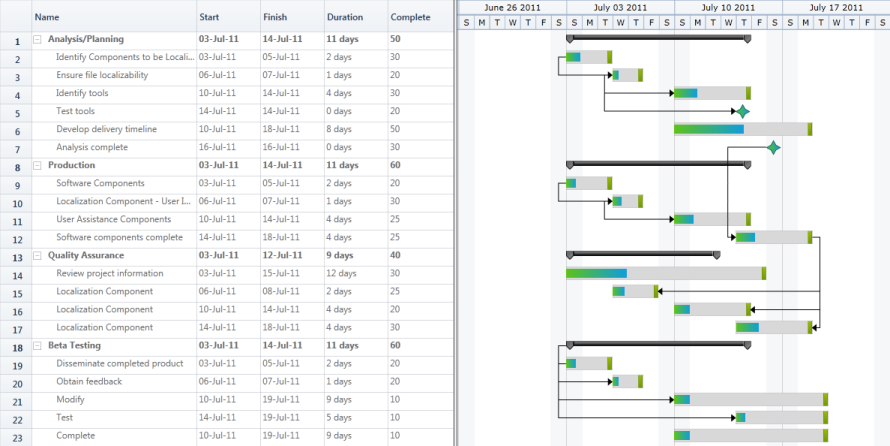
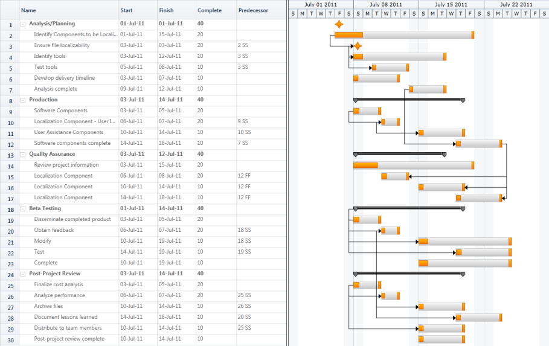

# Custom Node Style

Custom node style enables you to design your own style to the nodes that will be displayed in the Gantt. You can also customize the progress bar of the Task Node.Currently Gantt Control supports three types of node. They are:

* Header Node 
* Task Node
* Milestone

You can apply custom styles for all the three nodes. The basic functionalities of the Gantt nodes like resizing, drag and drop and tooltip are available only when the custom node style has the inbuilt node style’s such as drag and drop the thumb and resizing the thumbs. Otherwise the custom node will work properly, but you cannot access these features of Gantt. 

Use Case Scenarios

You can customize the node to give a similar look and feel of your product. For example if you are from a steel company, then you can add a style that gives steel rod like look and feel to the node. 

You can also design the node based on your organization’s logo.

Adding Custom Node Style to an Application 

The following are the steps to add custom node style to an application:

1. Define a style as needed with the target type for each node type as given in the following table:

_Custom Node Types_

<table>
<tr>
<td>
Node Type</td><td>
Target Type</td></tr>
<tr>
<td>
Header Node</td><td>
HeaderNode</td></tr>
<tr>
<td>
Task Node</td><td>
GanttNode</td></tr>
<tr>
<td>
Milestone</td><td>
MileStone</td></tr>
</table>

The following code illustrates how to define style:

[XAML]

<ResourceDictionary xmlns="http://schemas.microsoft.com/winfx/2006/xaml/presentation"

                    xmlns:x="http://schemas.microsoft.com/winfx/2006/xaml"

                    xmlns:gantt="http://schemas.syncfusion.com/wpf"

                    xmlns:chart="clr-namespace:Syncfusion.Windows.Controls.Gantt.Chart;assembly=Syncfusion.Gantt.Wpf"

                    >

   &lt;!-- Header Node style--&gt;

      &lt;Style TargetType="chart:HeaderNode"&gt;

          &lt;Setter Property="MaxHeight" Value="24"/&gt;

          &lt;Setter Property="Template"&gt;

              &lt;Setter.Value&gt;

                  &lt;ControlTemplate TargetType="chart:HeaderNode"&gt;

                      <Border Background="{TemplateBinding Background}" Name="PART_HeaderBorder" 

                            BorderBrush="{TemplateBinding BorderBrush}" BorderThickness="0">

                          &lt;Grid Width="{TemplateBinding NodeWidth}" VerticalAlignment="Center"&gt;

                              &lt;Grid.ColumnDefinitions&gt;

                                  &lt;ColumnDefinition Width="10" /&gt;

                                  &lt;ColumnDefinition Width="*" /&gt;

                                  &lt;ColumnDefinition Width="10" /&gt;

                              &lt;/Grid.ColumnDefinitions&gt;

                              &lt;Rectangle HorizontalAlignment="Left" Grid.Column="1" Height="6.4" VerticalAlignment="Top" Width="{TemplateBinding NodeWidth}" Stroke="#FF111111"&gt;

                                  &lt;Rectangle.Fill&gt;

                                      &lt;LinearGradientBrush EndPoint="0.5,1" StartPoint="0.5,0"&gt;

                                          &lt;GradientStop Color="#FF414141" Offset="0" /&gt;

                                          &lt;GradientStop Color="#FF6D6D6D" Offset="0.087" /&gt;

                                          &lt;GradientStop Color="#FF767676" Offset="0.304" /&gt;

                                          &lt;GradientStop Color="Black" Offset="0.957" /&gt;

                                          &lt;GradientStop Color="#FF343434" Offset="1" /&gt;

                                      &lt;/LinearGradientBrush&gt;

                                  &lt;/Rectangle.Fill&gt;

                              &lt;/Rectangle&gt;

                              <Path Data="M0.3,0.3 L9.834909,0.30036073 9.8351226,5.9832297 5.0695471,10.734966 0.32096295,5.9863821 z"

                                  HorizontalAlignment="Left"

                                  Grid.Column="0"

                                  Height="11.435"

                                  Stretch="Fill"

                                  Stroke="#FF111111"

                                  VerticalAlignment="Top"

                                  Width="10.135">

                                  &lt;Path.Fill&gt;

                                      &lt;LinearGradientBrush EndPoint="1.009,0.985" StartPoint="0.339,0.286"&gt;

                                          &lt;GradientStop Color="DimGray" Offset="0.008" /&gt;

                                          &lt;GradientStop Color="#FF7F7F7F" Offset="0.511" /&gt;

                                          &lt;GradientStop Color="#FF2A2A2A" Offset="1" /&gt;

                                      &lt;/LinearGradientBrush&gt;

                                  &lt;/Path.Fill&gt;

                              &lt;/Path&gt;

                              <Path Data="M0.3,0.3 L9.834909,0.30036073 9.8351226,5.9832297 5.0695471,10.734966 0.32096295,5.9863821 z"

                                  HorizontalAlignment="Left"

                                  Grid.Column="2"

                                  Height="11.435"

                                  Stretch="Fill"

                                  Stroke="#FF111111"

                                  VerticalAlignment="Top"

                                  Width="10.135">

                                  &lt;Path.Fill&gt;

                                      &lt;LinearGradientBrush EndPoint="1.009,0.985" StartPoint="0.339,0.286"&gt;

                                          &lt;GradientStop Color="DimGray" Offset="0.008" /&gt;

                                          &lt;GradientStop Color="#FF7F7F7F" Offset="0.511" /&gt;

                                          &lt;GradientStop Color="#FF2A2A2A" Offset="1" /&gt;

                                      &lt;/LinearGradientBrush&gt;

                                  &lt;/Path.Fill&gt;

                              &lt;/Path&gt;

                          &lt;/Grid&gt;

                      &lt;/Border&gt;

                  &lt;/ControlTemplate&gt;

              &lt;/Setter.Value&gt;

          &lt;/Setter&gt;

      &lt;/Style&gt;

    &lt;!-- Task Node style--&gt;
    &lt;Style x:Key="TaskNode" TargetType="{x:Type chart:GanttNode}"&gt;
        &lt;Setter Property="Template"&gt;
            &lt;Setter.Value&gt;
                &lt;ControlTemplate TargetType="{x:Type  chart:GanttNode}"&gt;
                    &lt;Border Name="PART_Border" Height="18" VerticalAlignment="Center" BorderThickness="0.5" BorderBrush="#FF4D4D4D"&gt;
                        &lt;Border.Background&gt;
                            &lt;LinearGradientBrush EndPoint="0.5,1" StartPoint="0.5,0"&gt;
                                &lt;GradientStop Color="#FFF6F6F6" Offset="0"/&gt;
                                &lt;GradientStop Color="#FFC5C5C5" Offset="1"/&gt;
                            &lt;/LinearGradientBrush&gt;
                        &lt;/Border.Background&gt;
                        &lt;Grid&gt;
                            &lt;Grid.ColumnDefinitions&gt;
                                &lt;ColumnDefinition Width="Auto" /&gt;
                                &lt;ColumnDefinition Width="*" /&gt;
                                &lt;ColumnDefinition Width="Auto" /&gt;
                            &lt;/Grid.ColumnDefinitions&gt;
                            &lt;!-- To access the drag and drop feature, have the thumb with specified name --&gt;
                            &lt;Thumb Cursor="SizeAll" x:Name="PART_DragDropThumb"  Grid.Column="0" Grid.ColumnSpan="3"&gt;
                                &lt;Thumb.Template&gt;
                                    &lt;ControlTemplate&gt;
                                        &lt;Border Background="Transparent"/&gt;
                                    &lt;/ControlTemplate&gt;
                                &lt;/Thumb.Template&gt;
                            &lt;/Thumb&gt;

                            &lt;Border HorizontalAlignment="Left" VerticalAlignment="Center" Width="{TemplateBinding ProgressWidth}" Grid.Column="0" Grid.ColumnSpan="3"&gt;
                                &lt;Grid HorizontalAlignment="Stretch" Width="{TemplateBinding ProgressWidth}"&gt;
                                    &lt;Rectangle HorizontalAlignment="Stretch" Height="12" Stroke="#FFD26202" VerticalAlignment="Center"&gt;
                                        &lt;Rectangle.Fill&gt;
                                            &lt;LinearGradientBrush EndPoint="0.5,1" StartPoint="0.5,0"&gt;
                                                &lt;GradientStop Color="#FFFEB300" Offset="0"/&gt;
                                                &lt;GradientStop Color="#FFFE7600" Offset="1"/&gt;
                                            &lt;/LinearGradientBrush&gt;
                                        &lt;/Rectangle.Fill&gt;
                                    &lt;/Rectangle&gt;
                                    &lt;!-- To access the progress resizing feature, have the thumb with specified name --&gt;
                                    &lt;Thumb Cursor="SizeWE" x:Name="PART_ProgressThumb" HorizontalAlignment="Right"&gt;
                                        &lt;Thumb.Template&gt;
                                            &lt;ControlTemplate&gt;
                                                &lt;Border Background="Transparent" BorderBrush="Transparent"&gt;
                                                    &lt;Rectangle Height="2" Width="5" Fill="Transparent" /&gt;
                                                &lt;/Border&gt;
                                            &lt;/ControlTemplate&gt;
                                        &lt;/Thumb.Template&gt;
                                    &lt;/Thumb&gt;
                                &lt;/Grid&gt;
                            &lt;/Border&gt;

                            &lt;!-- To access the resizing feature, have the thumb with the specified name --&gt;
                            &lt;Thumb Cursor="ScrollE" Grid.Column="2" x:Name="PART_RightThumb" HorizontalAlignment="Right"&gt;
                                &lt;Thumb.Template&gt;
                                    &lt;ControlTemplate&gt;
                                        &lt;Rectangle HorizontalAlignment="Right" Height="20" VerticalAlignment="Center" Width="6" Stroke="#FFD26202"&gt;
                                            &lt;Rectangle.Fill&gt;
                                                &lt;LinearGradientBrush EndPoint="0.5,1" StartPoint="0.5,0"&gt;
                                                    &lt;GradientStop Color="#FFFEB300" Offset="0"/&gt;
                                                    &lt;GradientStop Color="#FFFE7600" Offset="1"/&gt;
                                                &lt;/LinearGradientBrush&gt;
                                            &lt;/Rectangle.Fill&gt;
                                        &lt;/Rectangle&gt;
                                    &lt;/ControlTemplate&gt;
                                &lt;/Thumb.Template&gt;
                            &lt;/Thumb&gt;

                            &lt;!-- To access the resizing feature, have the thumb with the specified name --&gt;
                            &lt;Thumb Cursor="SizeWE" Grid.Column="0" x:Name="PART_LeftThumb" HorizontalAlignment="Left"&gt;
                                &lt;Thumb.Template&gt;
                                    &lt;ControlTemplate&gt;
                                        &lt;Border Background="Transparent" BorderBrush="Transparent" BorderThickness="0" Width="4" Height="20"/&gt;
                                    &lt;/ControlTemplate&gt;
                                &lt;/Thumb.Template&gt;
                            &lt;/Thumb&gt;
                        &lt;/Grid&gt;
                    &lt;/Border&gt;
                &lt;/ControlTemplate&gt;
            &lt;/Setter.Value&gt;
        &lt;/Setter&gt;
    &lt;/Style&gt;

 &lt;!--Milestone style--&gt;
    &lt;Style x:Key="MileStone" TargetType="chart:MileStone"&gt;
        &lt;Setter Property="Template"&gt;
            &lt;Setter.Value&gt;
                &lt;ControlTemplate TargetType="chart:MileStone"&gt;
                    &lt;Grid&gt;
                        &lt;Path Stretch="Fill" Data="F1 M 551.156,416.878L 552.734,419.766L 555.621,421.344L 552.734,422.922L 551.156,425.81L 549.577,422.922L 546.69,421.344L 549.577,419.766L 551.156,416.878 Z "                                               HorizontalAlignment="Left" Height="19" VerticalAlignment="Center" Width="19" Stroke="#FFD26202"&gt;
                            &lt;Path.Fill&gt;
                                &lt;LinearGradientBrush EndPoint="0.5,1" StartPoint="0.5,0"&gt;
                                    &lt;GradientStop Color="#FFFEB300" Offset="0"/&gt;
                                    &lt;GradientStop Color="#FFFE7600" Offset="1"/&gt;
                                &lt;/LinearGradientBrush&gt;
                            &lt;/Path.Fill&gt;
                        &lt;/Path&gt;
                    &lt;/Grid&gt;
                &lt;/ControlTemplate&gt;
            &lt;/Setter.Value&gt;
        &lt;/Setter&gt;
    &lt;/Style&gt;
&lt;/ResourceDictionary&gt;

1. Add the style as a resource to the Gantt control in your application.

The following code illustrates how to add the styles to the application:

[XAML]

 <sync:GanttControl Grid.Row="1"  x:Name="Gantt" ItemsSource="{Binding GanttItemSource}" ToolTipTemplate="{StaticResource toolTipTemplate}"

                                 VisualStyle="Office2010Silver">

                  &lt;sync:GanttControl.TaskAttributeMapping&gt;

                      <sync:TaskAttributeMapping TaskIdMapping="Id"

                                            TaskNameMapping="Name"

                                            StartDateMapping="StDate" 

                                            ChildMapping="ChildTask"

                                            FinishDateMapping="EndDate"

                                            DurationMapping="Duration"                                            

                                            ProgressMapping="Complete"

                                            PredecessorMapping="Predecessor">

                      &lt;/sync:TaskAttributeMapping&gt;

                  &lt;/sync:GanttControl.TaskAttributeMapping&gt;

                  &lt;sync:GanttControl.Resources&gt;

                      &lt;Style TargetType="chart:GanttNode" BasedOn="{StaticResource TaskNode}"/&gt;

                      &lt;Style TargetType="chart:MileStone" BasedOn="{StaticResource MileStone}"/&gt;

                  &lt;/sync:GanttControl.Resources&gt;

              &lt;/sync:GanttControl&gt;

{  | markdownify }
{:.image }

_Custom Node Style_

{  | markdownify }
{:.image }

_Custom Node Style_

Samples Link

To view samples: 

1. Select Start -> Programs -> Syncfusion -> Essential Studio x.x.xx -> Dashboard.
2. Click Run Samples for WPF under User Interface Edition panel.
3. Select Gantt.
4. Expand the Styles item in the Sample Browser.
5. Choose the Custom Node Style sample to launch.

