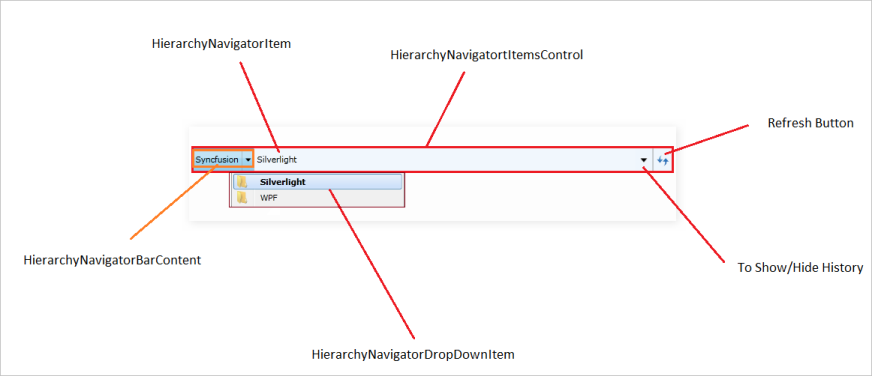
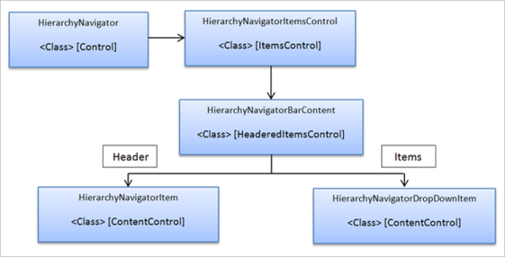
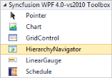
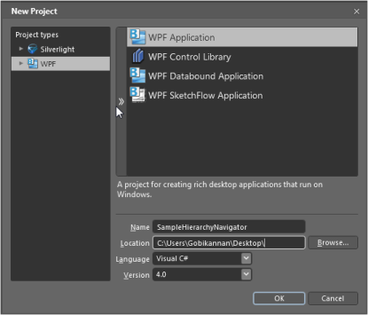
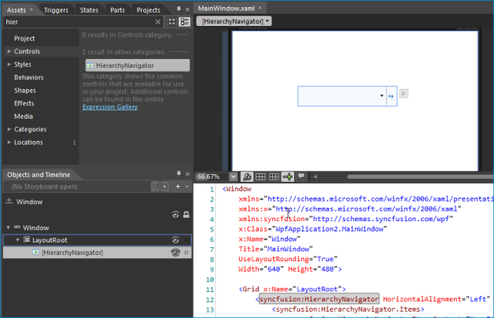
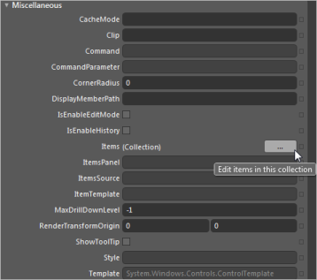
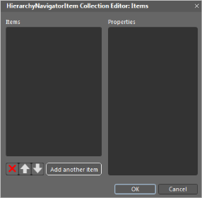
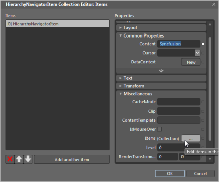
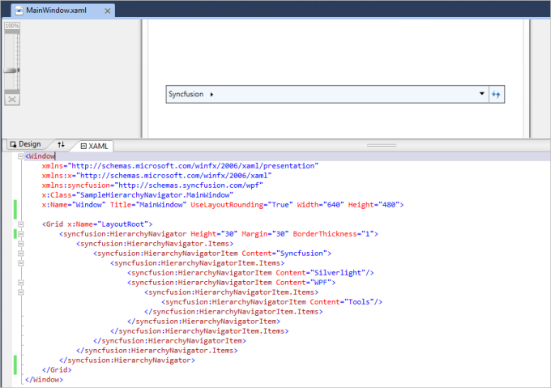
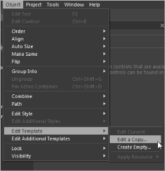

# Getting Started

The HierarchyNavigator control provides powerful data binding, which is fully customizable by using Expression Blend, making it easy to manage items and templates.

## Control Structure

{  | markdownify }
{:.image }

## Class Diagram

{  | markdownify }
{:.image }

## Properties

_Property table_

<table>
<tr>
<td>
Name</td><td>
Type</td><td>
Value it Accepts</td><td>
Description</td><td>
Reference Link</td></tr>
<tr>
<td>
IsEnableEditMode</td><td>
Boolean</td><td>
True or False</td><td>
Enables Edit mode.</td><td>
More details</td></tr>
<tr>
<td>
IsEnableHistory</td><td>
Boolean</td><td>
True or False</td><td>
Displays history.</td><td>
More Details</td></tr>
<tr>
<td>
MaxDrillDownLevel</td><td>
Integer</td><td>
Integers</td><td>
Restricts the drilled-down level.</td><td>
More Details</td></tr>
<tr>
<td>
ShowToolTip</td><td>
Boolean</td><td>
True or False</td><td>
Shows a ToolTip, if set to true.</td><td>
More Details</td></tr>
<tr>
<td>
Items</td><td>
ObservableCollection< HierarchyNavigatorItem></td><td>
HierarchyNavigatorItem</td><td>
Adds a hierarchical item to a control.</td><td>
More Details</td></tr>
<tr>
<td>
SelectedHierarchyNavigatorItem</td><td>
HierarchyNavigatorItem</td><td>
-</td><td>
Indicates the item that is currently selected.</td><td>
</td></tr>
</table>
## Methods

_Methods table_

<table>
<tr>
<td>
Name</td><td>
Description</td><td>
Return Type</td><td>
Overloads</td><td>
Reference Link</td></tr>
<tr>
<td>
ShowProgressBar</td><td>
Default TimeSpan of 500 ms will be set for progress bar timeline.</td><td>
void</td><td>
Empty</td><td>
More Details</td></tr>
<tr>
<td>
ShowProgressBar</td><td>
TimeSpan can be set to control the progress bar timeline.</td><td>
void</td><td>
TimeSpan</td><td>
More Details</td></tr>
<tr>
<td>
CancelProgressBar</td><td>
Default TimeSpan of 500 ms will be set for progress bar timeline.</td><td>
void</td><td>
Empty</td><td>
More Details</td></tr>
<tr>
<td>
CancelProgressBar</td><td>
TimeSpan can be set to control the progress bar timeline.</td><td>
void</td><td>
TimeSpan</td><td>
More Details</td></tr>
<tr>
<td>
SelectNavigationItem</td><td>
To Select Hierarchy Navigator Item in Code behind.</td><td>
bool</td><td>
object</td><td>
More Details</td></tr>
<tr>
<td>
ShowNavigationPopupItems</td><td>
To Show Hierarchy Navigator Items in pop-up.</td><td>
bool</td><td>
object</td><td>
More Details</td></tr>
</table>
## Events

_Events table_

<table>
<tr>
<td>
Name</td><td>
Event Type</td><td>
Event Args Parameter</td><td>
Description</td><td>
Reference Link</td></tr>
<tr>
<td>
HierarchyNavigatorSelectedItemChanged</td><td>
HierarchyNavigatorSelectedItemChangedEventHandler</td><td>
Selected Item</td><td>
Occurs when an item is changed.</td><td>
More Details</td></tr>
<tr>
<td>
HierarchyNavigatorRefreshButtonClick</td><td>
EventHandler</td><td>
HierarchicalNavigator Control</td><td>
Occurs when the Refresh button is clicked.</td><td>
More Details</td></tr>
<tr>
<td>
NavigationPopupOpening</td><td>
EventHandler</td><td>
Selected Item</td><td>
Occurs when the navigation pop-up window is opening.</td><td>
More Details</td></tr>
<tr>
<td>
NavigationPopupOpened</td><td>
EventHandler</td><td>
Selected Item</td><td>
Occurs when the navigation pop-up window is open.</td><td>
More Details</td></tr>
<tr>
<td>
NavigationPopupClosing</td><td>
EventHandler</td><td>
Selected Item</td><td>
Occurs when the navigation pop-up window is closing.</td><td>
More Details</td></tr>
<tr>
<td>
NavigationPopupClosed</td><td>
EventHandler</td><td>
Selected Item</td><td>
Occurs when the navigation pop-up window is closed.</td><td>
More Details</td></tr>
</table>
## Adding a HierarchyNavigator control to an application

The HierarchyNavigator control can be added to a WPF application by using Visual Studio and Expression Blend. 

### Creating a HierarchyNavigator control by using Visual Studio

The steps to create a HierarchyNavigator control in a WPF application by using Visual Studio are as follows:

1. Create a new WPF application in Visual Studio. 
2. In the Visual Studio Toolbox, click the SyncfusionWPF Toolbox tab, and select HierarchyNavigator.

{  | markdownify }
{:.image }

3. Drag the HierarchyNavigator to Design View, to add the HierarchyNavigator control.

{  | markdownify }
{:.image }

4. On the Properties window, customize the properties of the HierarchyNavigator control.
### Creating a HierarchyNavigator control by using Expression Blend

The HierarchyNavigator control is fully customizable by using Expression Blend. 

The steps to create a HierarchyNavigator control in a WPF application by using Expression Blend are as follows:

1. Open the Expression Blend application.
2. On the File menu, click New Project. This opens the New Project dialog box.

{  | markdownify }
{:.image }

3. In the Name field, type the name of the project, and then click OK.

{  | markdownify }
{:.image }

4. Add the following references with the sample project:
1. Syncfusion.Shared.WPF.dll
2. Syncfusion.Tools.WPF.dll
5. On the Window menu, select Assets. This opens the Assets Library dialog box.
6. In the search box, type HierarchyNavigator, and then press ENTER. This displays the search results.

{  | markdownify }
{:.image }

7. Drag the HierarchyNavigator control to Design View.

{  | markdownify }
{:.image }

8. Select the HierarchyNavigator control from the Objects and Timeline Pane and navigate to Miscellaneous, located in the Properties pane; click the button next to the Items collection. This will display the Object Collection Editor dialog box.

{  | markdownify }
{:.image }

{  | markdownify }
{:.image }

The HierarchyNavigator Collection Editor contains the Items and the Properties pane. The Items pane contains a list of items that can be added to the HierarchyNavigator control.

{  | markdownify }
{:.image }

9. Click the Add another item button, to add an item in the Items pane, and then in the Properties pane add content and items for the selected item.

{  | markdownify }
{:.image }

10. To add items in a hierarchical data format, in the Properties pane, find the Items field and add items to the next level.

{  | markdownify }
{:.image }

The items will then be displayed in XAML, as shown in the following figure:

{  | markdownify }
{:.image }

Editing a HierarchyNavigator Template in Expression Blend

You can edit a HierarchyNavigator control after it is added. The steps to edit a HierarchyNavigator control in Expression Blend are as follows:

1. Select the HierarchyNavigator control.
2. On the Object menu, select Edit Style, and then select Edit a Copy. This opens the Create Style Resource dialog box.

{  | markdownify }
{:.image }

3. In the Name field, type the style name.
4. In the Define in section, select This document, and then select the user control.
5. Click the OK button, to create a default style for the HierarchyNavigator control so that each part can be customized. Refer Customizing templates with Expression Blend.

{  | markdownify }
{:.image }

