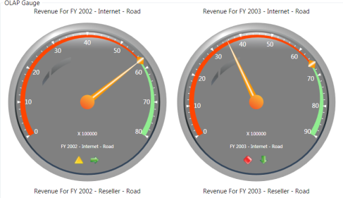

# XAML Configuration

XAML configuration is one of the important features of OlapGauge, as it helps the user to configure the control entirely using XAML by eliminating the required code in code behind. 

Use Case Scenarios

If the user wants to perform the entire configuration in XAML , then this feature will help the user to set the Data source, Report and UI properties simply and elegantly using XAML.

Properties 

_Property Table_

<table>
<tr>
<td>
Property</td><td>
Description</td><td>
Type</td><td>
Data Type</td></tr>
<tr>
<td>
DataSource.ConnectionString</td><td>
Specifies the connection string of the data manager</td><td>
Attached Property</td><td>
String</td></tr>
<tr>
<td>
DataSource.ConnectionName</td><td>
Specifies the connection name, which is available in App.Config file of the application</td><td>
Attached Property</td><td>
String</td></tr>
<tr>
<td>
DataSource.DataManagerName</td><td>
Specifies the data manager name</td><td>
Attached Property</td><td>
String</td></tr>
<tr>
<td>
SharedDataManagerName</td><td>
Specifies the data manager name, which is available in shared data manager collection</td><td>
Attached Property</td><td>
String</td></tr>
<tr>
<td>
ReportName</td><td>
Species the OLAP report name</td><td>
CLR</td><td>
String</td></tr>
<tr>
<td>
CurrentCubeName</td><td>
Specifies the current cube name of a OLAP report</td><td>
CLR</td><td>
String</td></tr>
<tr>
<td>
CategoricalAxis</td><td>
Specifies the categorical axis of the OLAP report</td><td>
Dependency Property</td><td>
CategoricalAxis</td></tr>
<tr>
<td>
SeriesAxis</td><td>
Specifies the series axis of the OLAP report</td><td>
Dependency Property</td><td>
SeriesAxis</td></tr>
<tr>
<td>
SlicerAxis</td><td>
Specifies the slicer axis of the OLAP report</td><td>
Dependency Property</td><td>
SlicerAxis</td></tr>
<tr>
<td>
CalculatedMembers</td><td>
Specifies the calculated members of the OLAP report</td><td>
Dependency Property</td><td>
CalculatedMembers</td></tr>
</table>

Adding a Report to OLAP Gauge

Adding an OLAP report to OLAP Gauge control in design time is described in the following code snippet:

[XAML]

<syncfusion:OlapGauge x:Name="olapChart" 

                      HorizontalAlignment="Stretch"

                      ReportName="SalesReport"

                      CurrentCubeName="Adventure Works" 

                      SharedDataManagerName="localManager"

                      olapshared:DataSource.DataManagerName="localManager"

olapshared:DataSource.ConnectionString="datasource=localhost; initial catalog=adventure works dw">

&lt;!- Adding Elements to Categorical Axis --&gt;

&lt;syncfusion:OlapGauge.CategoricalAxis&gt;

                    &lt;syncfusion:Dimension Name="Date" HierarchyName="Fiscal" LevelName="Fiscal Year" IncludeMembers="FY 2002, FY 2003"  /&gt;     &lt;!- Multiple Members where specified by comma separate --&gt;               

                    &lt;syncfusion:Kpi Name="Revenue" ShowGoal="True" ShowStatus="True" ShowValue="True" ShowTrend="True" /&gt;

&lt;/syncfusion:OlapGauge.CategoricalAxis&gt;

&lt;!- Adding Elements to Series Axis --&gt;

&lt;syncfusion:OlapGauge.SeriesAxis&gt;

                    &lt;syncfusion:Dimension Name="Sales Channel" HierarchyName="Sales Channel" LevelName="Sales Channel" /&gt;

                    &lt;syncfusion:Dimension Name="Product" HierarchyName="Product Model Lines" LevelName="Product Line" IncludeMembers="Road" /&gt;

&lt;/syncfusion:OlapGauge.SeriesAxis&gt;

&lt;/syncfusion:OlapGauge&gt;

{  | markdownify }
{:.image }

_OLAP Gauge with SalesReport created by XAML code_

Sample Link

A sample demo is available at the following link:     

..\Syncfusion\EssentialStudio\&lt;Versionnumber&gt;\BI\WPF\OlapGauge.WPF\Samples\Defining Reports\XAML Configuration Demo 

