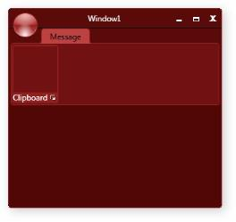
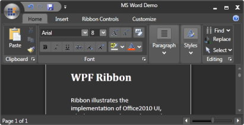
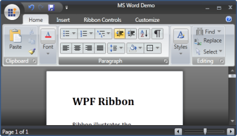
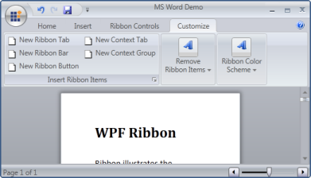
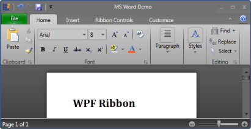
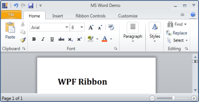
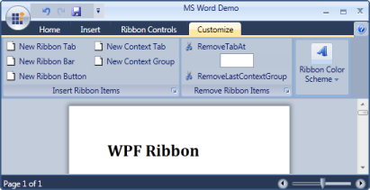
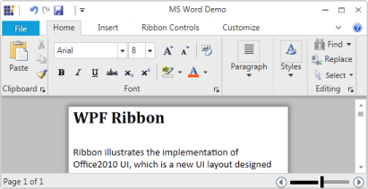

# Appearance

This section deals with the appearance of Ribbon control and contains the following topics:

## Active Color Scheme

Essential Tools WPF now provides support to set the active color scheme for the Ribbon control to enhance the appearance of the control. This is achieved by using the ActiveColorScheme attached property of the Ribbon Control.

The following standard Office 2007 color schemes are supported by the Ribbon control.

* Office 2007 Blue
* Office 2007 Black
* Office 2007 Silver
* Blend
* Office2003

By default, it is displayed in the Office 2007 Blue color scheme.

The following code example illustrates how to set Blend scheme for the Ribbon control.

[XAML]

<syncfusion:RibbonWindow x:Class="WpfApplication2.Window1" xmlns="http://schemas.microsoft.com/winfx/2006/xaml/presentation"

xmlns:x="http://schemas.microsoft.com/winfx/2006/xaml" xmlns:syncfusion="http://schemas.syncfusion.com/wpf" Title="Window1" Height="300" Width="320"  syncfusion:SkinStorage.VisualStyle="Blend" >

    &lt;syncfusion:Ribbon x:Name="ribbon"&gt;

        &lt;syncfusion:Ribbon.ApplicationMenu&gt;

            &lt;syncfusion:ApplicationMenu Width="38" Height="38" syncfusion:Ribbon.KeyTip="F" &gt;

            &lt;/syncfusion:ApplicationMenu&gt;

        &lt;/syncfusion:Ribbon.ApplicationMenu&gt;

        &lt;syncfusion:RibbonTab Caption="Message" syncfusion:Ribbon.KeyTip="H"&gt;

            &lt;syncfusion:RibbonBar Header="Clipboard" Name="barClipboaurd" &gt;

            &lt;/syncfusion:RibbonBar&gt;

        &lt;/syncfusion:RibbonTab&gt;

    &lt;/syncfusion:Ribbon&gt;

&lt;/syncfusion:RibbonWindow&gt;

Run the application. The following output is displayed.

{  | markdownify }
{:.image }

Setting Custom color scheme for Blend Theme:

You can also set 'custom' active color schemes for the Ribbon control. This enables you to display the Ribbon control in any color of your choice. To set "Red" color as the custom color scheme for the Ribbon control, use the below code

[C#]

' Set "Red" color scheme for the Ribbon control.

Ribbon.SetActiveColorScheme(ribbon, Brushes.Red);

{  | markdownify }
{:.image }

## Visual Style of Ribbon

Essential Tools WPF now provides support to set the visual style for the Ribbon control to enhance the appearance of the control. This is achieved by using the VisualStyle attached property of the Ribbon Control.

The following visual styles are supported by the Ribbon control.

* Blend
* Office2003
* Office2007Blue
* Office2007Black
* Office2007Silver
* Office2010Blue
* Office2010Black
* Office2010Silver
* ShinyBlue
* ShinyRed
* VS2010
* Metro
* Transparent

By default, it is displayed in the Office 2007 Blue visual style.

The following code example illustrates how to set the Blend visual style for the Ribbon control.

<table>
<tr>
<td>
[XAML]<syncfusion:RibbonWindow x:Class="EssentialRibbonApplication.RibbonWindow1"  xmlns="http://schemas.microsoft.com/winfx/2006/xaml/presentation" xmlns:x="http://schemas.microsoft.com/winfx/2006/xaml"                         xmlns:syncfusion="http://schemas.syncfusion.com/wpf"                          Title="Window1" Height="300" Width="320" Loaded="RibbonWindow_Loaded"  syncfusion:SkinStorage.VisualStyle="Blend">    &lt;syncfusion:Ribbon x:Name="ribbon" Loaded="ribbon_Loaded" &gt;        &lt;syncfusion:Ribbon.ApplicationMenu&gt;            &lt;syncfusion:ApplicationMenu Width="38" Height="38" syncfusion:Ribbon.KeyTip="F" &gt;            &lt;/syncfusion:ApplicationMenu&gt;        &lt;/syncfusion:Ribbon.ApplicationMenu&gt;        &lt;syncfusion:RibbonTab Caption="Message"  syncfusion:Ribbon.KeyTip="H" IsChecked="True"&gt;            &lt;syncfusion:RibbonBar Header="Clipboard" Name="barClipboaurd" &gt;            &lt;/syncfusion:RibbonBar&gt;        &lt;/syncfusion:RibbonTab&gt;    &lt;/syncfusion:Ribbon&gt;&lt;/syncfusion:RibbonWindow&gt;</td></tr>
<tr>
<td>
[C#]// Set "Blend" visual style for the Ribbon control.SkinStorage.SetVisualStyle(this, "Blend");</td></tr>
</table>

Run the application. The following output is displayed.

{  | markdownify }
{:.image }

The following figures illustrate how each built-in visual style appears in the Ribbon control.

{  | markdownify }
{:.image }

{  | markdownify }
{:.image }

{  | markdownify }
{:.image }

{  | markdownify }
{:.image }

{  | markdownify }
{:.image }

{  | markdownify }
{:.image }

{  | markdownify }
{:.image }

{  | markdownify }
{:.image }

{  | markdownify }
{:.image }

