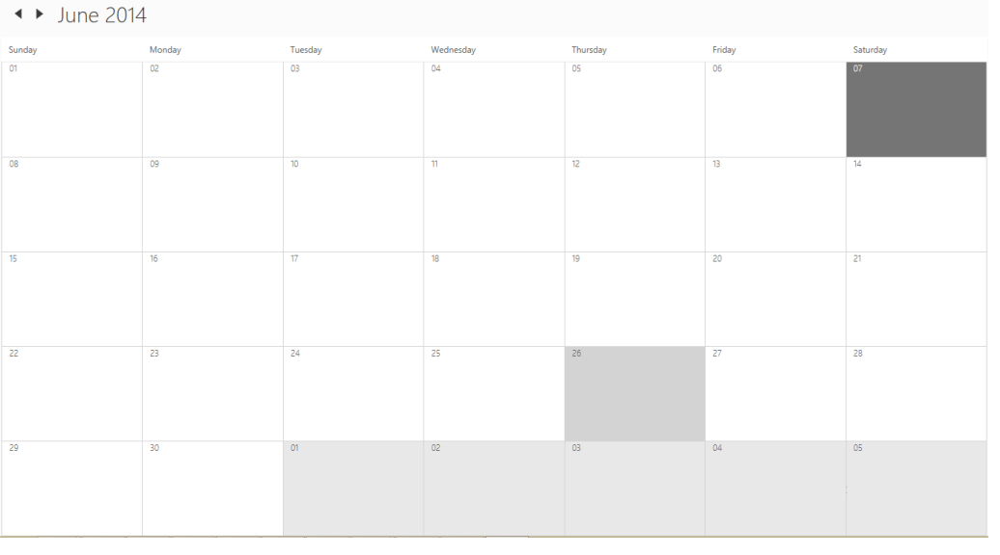

# Basic View

Schedule provides 4 different types of viewing the calendar, 

* Day
* Week 
* Month
* TimeLine

Using the property “ScheduleType” of SfSchedule, we can set the above view. Refer to the following code to set the View type of schedule.

Code Example:

[XAML]

<Window x:Class="SfScheduleWpf.MainWindow"

        xmlns="http://schemas.microsoft.com/winfx/2006/xaml/presentation"

        xmlns:x="http://schemas.microsoft.com/winfx/2006/xaml"

        xmlns:schedule="http://schemas.syncfusion.com/wpf"

        Title="MainWindow" Height="350" Width="525"

        WindowState="Maximized">

    &lt;Grid&gt;

        &lt;schedule:SfSchedule&gt;&lt;/schedule:SfSchedule&gt;

    &lt;/Grid&gt;

&lt;/Window&gt;

[C#]

SfSchedule schedule = new SfSchedule();

schedule.ScheduleType = ScheduleType.Month;

this.grid.Children.Add(schedule);

{  | markdownify }
{:.image }

_Month View Scheduling_

