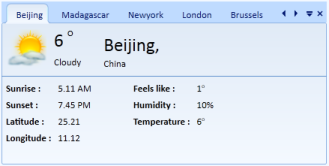
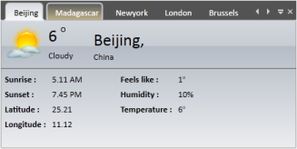
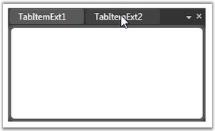

# Appearance

This section deals with the appearance of TabControlExt control and contains the following topic:

{  | markdownify }
{:.image }

## Setting Visual Styles

The appearance of the TabControlExt control is customized by using the VisualStyle property. This is an attached property which gets or sets the visual style for the control.

_Property table_

<table>
<tr>
<td>
Property</td><td>
Description</td></tr>
<tr>
<td>
VisualStyle</td><td>
Sets the visual style for the TabControlExt control. The options provided are as follows.* Blend* Office2003* Office2007Blue* Office2007Black* Office2007Silver* ShinyBlue* ShinyRed* SyncOrange* VS2010* Metro* Transparent </td></tr>
</table>

The following code example illustrates how to set the visual style for the TabControlExt.

[XAML]

&lt;!-- Adding TabControlExt --&gt;

&lt;syncfusion:TabControlExt Name="tabControlExt" syncfusion:SkinStorage.VisualStyle="Office2007Blue"&gt;

    &lt;!-- Adding TabItemExt --&gt;

    &lt;syncfusion:TabItemExt Name="tabItemExt1" Header="TabItemExt1"/&gt;

    &lt;!-- Adding TabItemExt --&gt;

    &lt;syncfusion:TabItemExt Name="tabItemExt2" Header="TabItemExt2"/&gt;

&lt;/syncfusion:TabControlExt&gt;

[C#]

// Setting the visual style

// Creating instance of the TabControlExt control

TabControlExt tabControlExt = new TabControlExt();

// Creating the instance of StackPanel.

StackPanel stackPanel = new StackPanel();

// Creating instance of the TabItemExt

TabItemExt tabItemExt1 = new TabItemExt();

// Setting header of the TabItemExt

tabItemExt1.Header = "TabItemExt1";

// Adding TabItemExt to TabControlExt.

tabControlExt.Items.Add(tabItemExt1);

// Creating instance of the TabItemExt2

TabItemExt tabItemExt2 = new TabItemExt();

// Setting header of the TabItemExt

tabItemExt2.Header = "TabItemExt2";

// Adding TabItemExt to TabControlExt

tabControlExt.Items.Add(tabItemExt2);

// Adding control to the StackPanel

stackPanel.Children.Add(tabControlExt); 

// Setting the visual style as Office2007Blue

SkinStorage.SetVisualStyle(tabControlExt, "Office2007Blue");

{  | markdownify }
{:.image }

{  | markdownify }
{:.image }

{  | markdownify }
{:.image }

{  | markdownify }
{:.image }

{  | markdownify }
{:.image }

{  | markdownify }
{:.image }

{  | markdownify }
{:.image }

{  | markdownify }
{:.image }

{  | markdownify }
{:.image }

{  | markdownify }
{:.image }

## Customization

The style of the TabControlExt control can be customized by the customization properties. The following table lists the details of the customization properties.

_Customization Properties_

<table>
<tr>
<th>
Property</th><th>
Description</th><th>
Type</th><th>
Data Type</th></tr>
<tr>
<th>
TabItemSelectedBackground</th><th>
Used to set the background color of the selected tab item.</th><th>
Dependency property</th><th>
Brush</th></tr>
<tr>
<th>
TabItemSelectedBorderBrush</th><th>
Used to set the border color of the selected tab item.</th><th>
Dependency property</th><th>
Brush</th></tr>
<tr>
<th>
TabItemSelectedForeground</th><th>
Used to set the foreground color of the selected tab item.</th><th>
Dependency property</th><th>
Brush</th></tr>
<tr>
<th>
TabItemHoverBackground</th><th>
Used to set the background color of the tab item in Hover state.</th><th>
Dependency property</th><th>
Brush</th></tr>
<tr>
<th>
TabItemHoverBorderBrush</th><th>
Used to set the border color of the tab item in Hover state.</th><th>
Dependency property</th><th>
Brush</th></tr>
<tr>
<th>
TabItemHoverForeground</th><th>
Used to set the foreground color of the tab item in Hover state.</th><th>
Dependency property</th><th>
Brush</th></tr>
</table>

The following code example shows how to use the customization properties in the TabControlExt control.

[XAML]

<sync:TabControlExt TabItemSelectedBackground="Gold" Height="100" Margin="100"

                            TabItemSelectedBorderBrush="BlueViolet" 

                            TabItemSelectedForeground="Black" 

                            TabItemHoverBackground="Goldenrod" 

                            TabItemHoverBorderBrush="BlueViolet" 

                            TabItemHoverForeground="Yellow">

                &lt;sync:TabItemExt Header="TabItem1"/&gt;

                &lt;sync:TabItemExt Header="TabItem2"/&gt;

                &lt;sync:TabItemExt Header="TabItem3"/&gt;              

&lt;/sync:TabControlExt&gt;

The following screenshot is the sample output for the above code example.

{  | markdownify }
{:.image }

