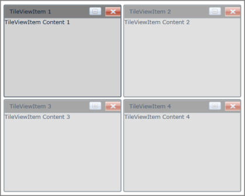

# CloseButton Support

The CloseButton feature in TileViewItem allows you to hide or delete the TileViewItem based on the CloseMode. If you click on the CloseButton and the CloseMode is set to Hide, then the TileViewItem will move to Hidden State, and when the CloseMode is set to Delete, then the TileViewItem will be removed from the TileViewControl. By default, the visibility of the CloseButton is set to Collapsed. You can also change the style of the CloseButton using CloseButtonStyle property. 

Use Case Scenarios

This feature enables you to close a particular TileViewItem.

Adding CloseButton to an Application 

The CloseButton feature can be added to an application by using either XAML or C# code.

The following code example illustrates how to add the CloseButton feature to an application through XAML.

[XAML]

<syncfusion:TileViewControl x:Name="TileView1" Width="500" Height="400" 

Background="White">

   <syncfusion:TileViewItem CloseMode="Hide" BorderThickness="2" 

          Header="TileViewItem 1" Content="TileViewItem Content 1" 

          CloseButtonVisibility="Visible" Background="LightGray" 

          HeaderBackground="Gray" Margin="2" CornerRadius="3"/>

   <syncfusion:TileViewItem CloseMode="Hide" BorderThickness="2" 

          Header="TileViewItem 2" Content="TileViewItem Content 2" 

          CloseButtonVisibility="Visible" Background="LightGray" 

          HeaderBackground="Gray" Margin="2" CornerRadius="3"/>

   <syncfusion:TileViewItem CloseMode="Hide" BorderThickness="2" 

          Header="TileViewItem 3" Content="TileViewItem Content 3" 

          CloseButtonVisibility="Visible" Background="LightGray" 

          HeaderBackground="Gray" Margin="2" CornerRadius="3"/>

   <syncfusion:TileViewItem CloseMode="Hide" BorderThickness="2" 

          Header="TileViewItem 4" Content="TileViewItem Content 4" 

          CloseButtonVisibility="Visible" Background="LightGray" 

          HeaderBackground="Gray" Margin="2" CornerRadius="3"/>         

&lt;/syncfusion:TileViewControl&gt;

The following code example illustrates how to add the CloseButton feature to an application through C#.

[C#]

      TileViewControl Tile = new TileViewControl();

      Tile.Width = 500;

      Tile.Height = 400;

      Tile.Background = new SolidColorBrush(Colors.White);

      for (int i = 1; i <= 4; i++)

      {

          TileViewItem item1 = new TileViewItem();

          item1.Name = "item" + i;

          item1.Header = "TileViewItem " + i;

          item1.Content = "TileViewItem Content " + i;

          item1.Background = new SolidColorBrush(Colors.LightGray);

          item1.BorderThickness = new Thickness(2d);

          item1.CornerRadius = new CornerRadius(2);

          item1.Margin = new Thickness(2d);

          item1.HeaderBackground = new SolidColorBrush(Colors.Gray);

          item1.CloseMode = CloseMode.Hide;

          item1.CloseButtonVisibility = System.Windows.Visibility.Visible;

          Tile.Items.Add(item1);

      }

      this.LayoutRoot.Children.Add(Tile);

{  | markdownify }
{:.image }

Properties

_Property Table_

<table>
<tr>
<td>
Property </td><td>
Description </td><td>
Type </td><td>
Data Type </td><td>
Reference links </td></tr>
<tr>
<td>
CloseButtonVisibility</td><td>
Specifies the Visibility of the CloseButton</td><td>
DependencyProperty</td><td>
Visibility.Collapsed</td><td>
</td></tr>
<tr>
<td>
CloseButtonStyle</td><td>
Gets or sets the Style for the CloseButton</td><td>
DependencyProperty</td><td>
DefaultStyle</td><td>
</td></tr>
<tr>
<td>
CloseButtonMargin</td><td>
Specifies the margin that can be used to set Margin for CloseButton</td><td>
DependencyProperty</td><td>
Thickness(0)</td><td>
</td></tr>
<tr>
<td>
CloseButtonBackground</td><td>
Specifies the Color that can be used to set Background CloseButton</td><td>
DependencyProperty</td><td>
-</td><td>
</td></tr>
</table>

Sample Link

To view samples: 

1. Select Start -> Programs -> Syncfusion -> Essential Studio XX.X.X.XX -> Dashboard.
2. Select Run Locally Installed Samples in WPF Button.
3. Now expand the DragAndDropManagerDemo tree-view item in the Sample Browser.
4. Choose any one of the samples listed under it to launch. 

