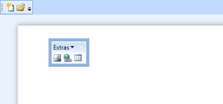

# ToolBarAdv state

ToolBarAdv can be set to docking, floating or hidden state as required.    

Following code illustrates how to set ToolBarAdv to floating state:

[XAML]

<shared:ToolBarManager x:Name="toolBarManager" 

>

            &lt;shared:ToolBarManager.Resources&gt;

                &lt;Style TargetType="Button"&gt;

                    &lt;Setter Property="Height" Value="20" /&gt;

                    &lt;Setter Property="Width" Value="20"/&gt;

                &lt;/Style&gt;

                &lt;Style TargetType="ToggleButton"&gt;

                    &lt;Setter Property="Height" Value="20"/&gt;

                    &lt;Setter Property="Width" Value="20"/&gt;

                &lt;/Style&gt;

            &lt;/shared:ToolBarManager.Resources&gt;

            &lt;shared:ToolBarManager.TopToolBarTray&gt;

                &lt;shared:ToolBarTrayAdv VerticalAlignment="Top"&gt;

                    &lt;shared:ToolBarAdv ToolBarName="Standard"&gt;

                        &lt;Button shared:ToolBarAdv.Label="New Document" shared:ToolBarAdv.Icon="Images/NewDocumentHS.png"&gt;

                            &lt;Image Source="Images/NewDocumentHS.png" Width="16" Height="16"/&gt;

                        &lt;/Button&gt;

                        &lt;Button  shared:ToolBarAdv.Label="Open Document" shared:ToolBarAdv.Icon="Images/openHS.png"&gt;

                            &lt;Image Source="Images/openHS.png"  Width="16" Height="16"/&gt;

                        &lt;/Button&gt;

                    &lt;shared:ToolBarAdv Band="1"   ToolBarName="Extras" shared:ToolBarManager.ToolBarState="Floating" FloatingBarLocation="500,300"&gt;

                        &lt;Button shared:ToolBarAdv.Label="Insert Picture"  shared:ToolBarAdv.Icon="Images/InsertPictureHS.png"&gt;

                            &lt;Image Source="Images/InsertPictureHS.png"  Width="16" Height="16"/&gt;

                        &lt;/Button&gt;

                        &lt;Button  shared:ToolBarAdv.Label="Insert Hyperlink"  shared:ToolBarAdv.Icon="Images/InsertHyperlinkHS.png"&gt;

                            &lt;Image Source="Images/InsertHyperlinkHS.png"  Width="16" Height="16"/&gt;

                        &lt;/Button&gt;

                        &lt;Button  shared:ToolBarAdv.Label="Insert Table"  shared:ToolBarAdv.Icon="Images/TableHS.png"&gt;

                            &lt;Image Source="Images/TableHS.png"  Width="16" Height="16"/&gt;

                        &lt;/Button&gt;

                   &lt;/shared:ToolBarAdv&gt;

                &lt;/shared:ToolBarTrayAdv&gt;

            &lt;/shared:ToolBarManager.TopToolBarTray&gt;

            &lt;Grid  &gt;

                &lt;Grid.RowDefinitions&gt;

                    &lt;RowDefinition Height="*"/&gt;

                    &lt;RowDefinition Height="Auto"/&gt;

                &lt;/Grid.RowDefinitions&gt;

                &lt;ScrollViewer &gt;

                    &lt;Grid Margin="20"&gt;

                        &lt;Border CornerRadius="2" Background="Black" Opacity="0.3"   Width="600" Height="700"&gt;

                            &lt;Border.Effect&gt;

                                &lt;BlurEffect Radius="15"/&gt;

                            &lt;/Border.Effect&gt;

                        &lt;/Border&gt;

                        &lt;RichTextBox  Width="600" Height="700" Padding="20"&gt;

                        &lt;/RichTextBox&gt;

                        &lt;/Grid&gt;

                &lt;/ScrollViewer&gt;

            &lt;/Grid&gt;

        &lt;/shared:ToolBarManager&gt;

[C#]

ToolBarAdv toolBar = new ToolBarAdv();

            toolBar.FloatingBarLocation = new Point(500, 300);

            ToolBarManager.SetToolBarState(toolBar, ToolBarState.Floating);

{  | markdownify }
{:.image }

ToolBarAdv can be floated only when it is hosted in ToolBarManager. 

## Specifying location for floating ToolBarAdv

You can change the location of the floating ToolBarAdv using the _FloatingBarLocation_ property. The following code illustrates this:

[XAML]

&lt;shared:ToolBarAdv FloatingBarLocation="50,50"&gt;&lt;/shared:ToolBarAdv&gt;

[C#]

ToolBarAdv toolBar = new ToolBarAdv();

            toolBar.FloatingBarLocation = new Point(50, 50);

