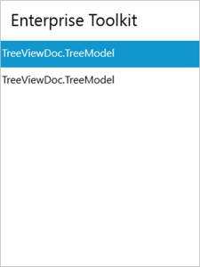

# Populating Items 

Items Source 

Tree Navigator items can be populated with the business object collection. Let us create a Tree Navigator which will show the list of Syncfusion Enterprise Toolkit products.  

Create a Model class with the necessary properties. 

[C#]

  public class TreeModel : NotificationObject

    {

        public TreeModel()

        {

            Models = new ObservableCollection<TreeModel>();

        }

        private string header;

        public string Header

        {

            get { return header; }

            set

            {

                header = value;

                RaisePropertyChanged("Header");

            }

        }

        private ObservableCollection<TreeModel> models;

        public ObservableCollection<TreeModel> Models

        {

            get { return models; }

            set { models = value; }

        }

    }

> _Note: NotificationObject is a class which implements INotifyPropertyChanged interface._

Create a View Model class with the hierarchical items as follows.  

[C#]

public class TreeViewModel 

    {

        private List<TreeModel> models;

        public List<TreeModel> Models

        {

            get { return models; }

            set { models = value; }

        }

        public TreeViewModel()

        {

            Models = new List<TreeModel>();

            TreeModel winrt = new TreeModel() {Header = "WinRT (XAML)"};

            TreeModel metroStudio = new TreeModel() {Header = "Metro Studio"};

            TreeModel winrt_chart = new TreeModel() {Header = "Chart"};

            TreeModel winrt_tools = new TreeModel() {Header = "Tools"};

            winrt.Models.Add(winrt_chart);

            winrt.Models.Add(winrt_tools);

            Models.Add(winrt);

            Models.Add(metroStudio);

        }

    }

 Bind the Models collection to the ItemsSource property of the Tree Navigator control as follows. 

[XAML]

<navigation:SfTreeNavigator ItemsSource="{Binding Models}"  

                            Header="Enterprise Toolkit"

                            Width="300" Height="400"

                            HorizontalAlignment="Center"

                            VerticalAlignment="Center" />

 This will populate the Tree Navigator as shown below. 

{  | markdownify }
{:.image }

Item Template 

ItemTemplate property of the Tree Navigator can be used to customize the display of business objects. 

[XAML]

<navigation:SfTreeNavigator ItemsSource="{Binding Models}"  

                                    Header="Enterprise Toolkit"

                                    Width="300" Height="400"

                                    HorizontalAlignment="Center"

                                    VerticalAlignment="Center"

                                    >

        &lt;navigation:SfTreeNavigator.ItemTemplate&gt;

            &lt;primitives:HierarchicalDataTemplate ItemsSource="{Binding Models}"&gt;

                &lt;DataTemplate&gt;

                    &lt;StackPanel Orientation="Horizontal"&gt;

                        <TextBlock Text="{Binding Header}" 

                                   Foreground="Green" FontWeight="Bold" 

VerticalAlignment="Center" Margin="18 0 0 0"/>

                    &lt;/StackPanel&gt;

                &lt;/DataTemplate&gt;

                &lt;/primitives:HierarchicalDataTemplate&gt;

        &lt;/navigation:SfTreeNavigator.ItemTemplate&gt;

 &lt;/navigation:SfTreeNavigator&gt;

This will populate the Tree Navigator as follows.

{  | markdownify }
{:.image }

> _Note: HierarchicalDataTemplate available in Syncfusion.SfShared.WPF dll under the Syncfusion.Windows.Primitives namespace_

