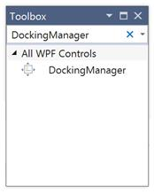

# Add Syncfusion Controls

## Through Drag and Drop

The following steps helps to add the required Essential WPF Control using Drag and Drop, for example: DockingManager.

 1.Create a WPF project in Visual Studio
 
 2.Find DockingManager control by typing the name of the DockingManager in the search box.

 3.Drag DockingManager and drop it to the designer.

## Through XAML

The following steps helps to add a required Essential WPF Control through XAML Code, for example: DockingManager.

 1.Create a WPF project in Visual Studio and refer the following assemblies.
 
  * Syncfusion.Tools.Wpf
  * Syncfusion.Shared.Wpf
  
 2.Include an xml namespace for the above assemblies to the Main window.



<Window

xmlns="http://schemas.microsoft.com/winfx/2006/xaml/presentation"

xmlns:x="http://schemas.microsoft.com/winfx/2006/xaml"

xmlns:syncfusion="http://schemas.syncfusion.com/wpf" />



 3.Now, Add the Docking Manager control with a required optimal name, using the included namespace.



<syncfusion:DockingManager x:Name="SyncDockingManager" />



## Through C# / VB

The following steps helps to add a required Essential WPF Control through C# or VB Code, for example: DockingManager.

 1.Create a WPF project in Visual Studio and refer the following assemblies.
 
  * Syncfusion.Tools.Wpf
  * Syncfusion.Shared.Wpf
  
 2.Create instance of Docking Manager.
 





Syncfusion.Windows.Tools.Controls.DockingManager dockingManager = new Syncfusion.Windows.Tools.Controls.DockingManager();





Dim dockingManager As New Syncfusion.Windows.Tools.Controls.DockingManager()


 


 3.Add the DockingManager instance as the content of the Window (or required element). 
 




Syncfusion.Windows.Tools.Controls.DockingManager dockingManager = new Syncfusion.Windows.Tools.Controls.DockingManager(); 

this.Content = dockingManager; 





Dim dockingManager As New Syncfusion.Windows.Tools.Controls.DockingManager()

Me.Content = dockingManager


 


