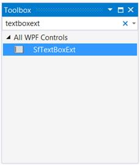
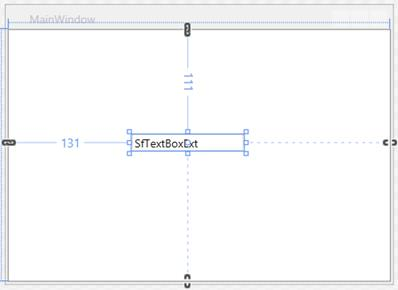
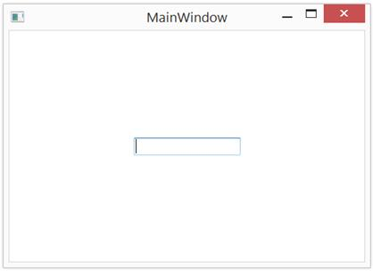

# Add Syncfusion Controls

The Syncfusion WPF controls can be added in a Visual Studio projects by using either of the following ways,

* Through Designer
* Through Code-Behind

## Through Designer

Syncfusion UI for WPF are added automatically to the Visual Studio Toolbox during installation. The following steps helps to add required Essential WPF control through drag and drop from Toolbox. For example: **SfTextBoxExt**

1.Create a WPF project in Visual Studio.

2.Find **SfTextBoxExt** by typing the name of the "SfTextBoxExt" in the search box.

 3.Drag **SfTextBoxExt** and drop it in the designer.

### Through XAML

The following steps helps to add a required Essential WPF Control through XAML Code, for example: **SfTextBoxExt**.

 1.Create a WPF project in Visual Studio and refer the following assemblies.

* Syncfusion.SfInput.WPF.dll
* Syncfusion.SfShared.WPF.dll

2.Include an xml namespace for the above assemblies to the Main window.





<Window

xmlns="http://schemas.microsoft.com/winfx/2006/xaml/presentation"

xmlns:x="http://schemas.microsoft.com/winfx/2006/xaml"

xmlns:syncfusion="http://schemas.syncfusion.com/wpf" />





 3.Now, Add the SfTextBoxExt control with a required optimal name, using the included namespace.





<syncfusion:SfTextBoxExt HorizontalAlignment="Center" Name="textBoxExt1" Margin="10" Height ="20" Width="120" Text="SfTextBoxExt" VerticalAlignment="Center"/>





## Through Code-Behind

Syncfusion UI for WPF can added at runtime using C# / VB. The following steps helps to add required Essential WPF control through code. For example: **SfTextBoxExt**.

1.Create a WPF project in Visual Studio and refer to the following assemblies.

* Syncfusion.SfInput.WPF.dll
* Syncfusion.SfShared.WPF.dll

2.Create an instance of **SfTextBoxExt** using it namespace





Syncfusion.Windows.Controls.Input.SfTextBoxExt textBoxExt1 = new Syncfusion.Windows.Controls.Input.SfTextBoxExt();





Dim textBoxExt1 As New Syncfusion.Windows.Controls.Input.SfTextBoxExt()


 


 3.Set Size and Alignment of the control with require value.
 




textBoxExt1.Height = 20;
textBoxExt1.Width = 120;
textBoxExt1.Margin = new Thickness(10, 10, 10, 10);
textBoxExt1.VerticalAlignment = VerticalAlignment.Center;
textBoxExt1.HorizontalAlignment = HorizontalAlignment.Center;





textBoxExt1.Height = 20
textBoxExt1.Width = 120
textBoxExt1.Margin = New Thickness(10, 10, 10, 10)
textBoxExt1.VerticalAlignment = VerticalAlignment.Center
textBoxExt1.HorizontalAlignment = HorizontalAlignment.Center


 


4.Add the created instance to the parent window (or the needed layout panels).





// Here this denotes parent Window

this.Content = textBoxExt1; 





' Here this denotes parent Window
Me.Content = textBoxExt1 'Here this denotes parent Window


 


