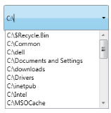
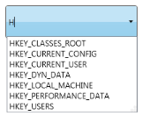
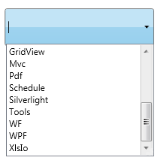

# FilePath, Registry & Custom Data Source Support

AutoComplete can be used with different kinds of Data Source like FilePath, Registry & CustomSource. The Data Source of the AutoComplete control can be set using the Source property.

When the value of the Source property is set as FilePath, the AutoComplete will displays the path in the local system as the source. This is illustrated in the following image. 

{{ '' | markdownify }}
{:.image }

When the value of the Source property is set as Registry, the AutoComplete loads the values from the Registry. It is used when the Registry keys are required as input. This is illustrated in the image given below.

{{ '' | markdownify }}
{:.image }

When the value of the Source property is set as Custom, the AutoComplete loads the values from the Business objects bounded to the AutoComplete control by using the CustomSource property. This is illustrated in the image given below.

{{ '' | markdownify }}
{:.image }

Adding Data Source Support to an Application

AutoComplete can be used with different kinds of Data Sources using the Source property. This support can be added to the application as mentioned in the following code example.

<table>
<tr>
<td>
[XAML]<syncfusion:AutoComplete x:Name="AutoComplete1" Source="FilePath"/><syncfusion:AutoComplete x:Name="AutoComplete2" Source ="Registry"/><syncfusion:AutoComplete x:Name="AutoComplete3" Source="Custom">     <syncfusion:AutoComplete.CustomSource>             <local:CustomerListCollection/>     </syncfusion:AutoComplete.CustomSource></syncfusion:AutoComplete></td></tr>
<tr>
<td>
[C#]AutoComplete autoComplete1 = new AutoComplete();this.autoComplete1.Source = SourceMode.FilePath;AutoComplete autoComplete2 = new AutoComplete();this.autoComplete2.SelectionMode = SourceMode.Registry;AutoComplete autoComplete3 = new AutoComplete();this.autoComplete3.SelectionMode = SourceMode.Custom;List<String> products = new List<String>();customSource.Add("Diagram");customSource.Add("Gauge");customSource.Add("Chart");customSource.Add("Schedule");customSource.Add("Grid");customSource.Add("DocIo");customSource.Add("XlsIo");customSource.Add("Pdf");customSource.Add("RichTextBox");customSource.Add("ReportBuilder");this.autoComplete3.CustomSource = products;</td></tr>
</table>

Tables for properties, methods, and events

Properties

  _Property Table for Data Source Support_

<table>
<tr>
<td>
Property </td><td>
Description </td><td>
Type </td><td>
Data Type </td><td>
Reference links </td></tr>
<tr>
<td>
Source</td><td>
Gets or sets the Source of the AutoComplete.</td><td>
DependencyProperty</td><td>
SourceMode(enum)</td><td>
</td></tr>
</table>

Events

  _Event Table for Data Source Support_

<table>
<tr>
<th>
Event </th><th>
Description </th><th>
Arguments </th><th>
Type </th><th>
Reference links </th></tr>
<tr>
<th>
SourceChanged</th><th>
 When the Source property value is changed this event will be triggered.It cannot be cancelled.</th><th>
DependencyObject,DependencyPropertyChangedEventArgs</th><th>
DependencyPropertyChangedCallBack </th><th>
</th></tr>
</table>

Sample Link

WPF Sample Browser-> Tools -> Editors -> AutoComplete Demo

