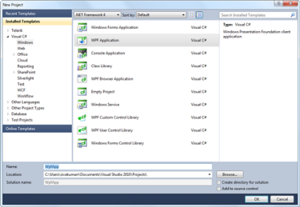
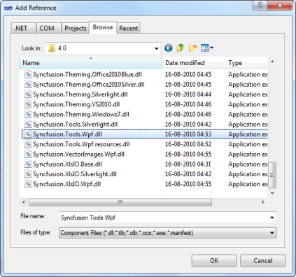
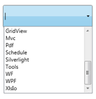
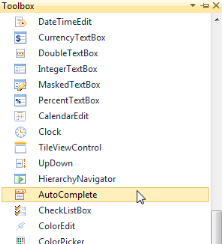
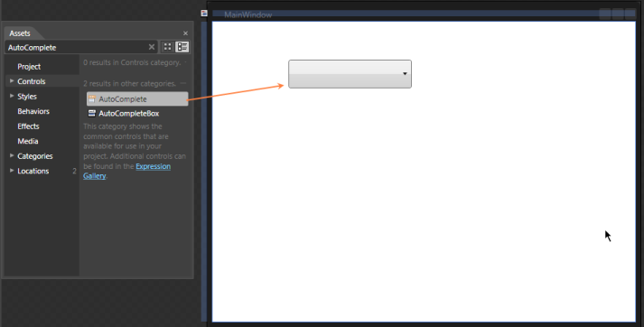
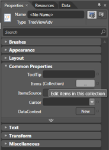

# Getting Started

## Structure of the AutoComplete Control

{{ '' | markdownify }}
{:.image }

## Add AutoComplete to an Application

Following are the step-by-step instructions to add an AutoComplete control in a WPF application. The AutoComplete control can be created by using either C#, XAML code. It can also be created using Blend.

### Creating AutoComplete using C#

1. Open Visual Studio, On the File menu click New -> Project. This opens the New Project Dialog box.

{{ '' | markdownify }}
{:.image }

2. In the Project Dialog window, select WPF application and, in the Name field type the name of the project. Click OK.

{{ '' | markdownify }}
{:.image }

3. Go to Solution Explorer. Right-click References folder and click Add Reference. Add the Syncfusion.Tools.WPF.dll assembly to the project References folder.

{{ '' | markdownify }}
{:.image }

[XAML]

xmlns:syncfusion="clr-namespace:

Syncfusion.Windows.Tools.Controls;assembly=Syncfusion.Tools.Wpf"

4. Add Syncfusion.Tools.WPF reference in XAML and C# code as follows.

[C#]

using Syncfusion.Windows.Tools.Controls;

5. Click and open the C# file. Add AutoComplete to the application.

[C#]

AutoComplete AutoComplete1 = new AutoComplete();

List<String> ProductSource = new List<String>();

customSource.Add("WPF");

customSource.Add("Chart");

customSource.Add("GridView");

customSource.Add("WF");

customSource.Add("Xlsio");

customSource.Add("Business Intelligence");

customSource.Add("Tools");

customSource.Add("Silverlight");

customSource.Add("Schedule");

customSource.Add("Mvc");

customSource.Add("Pdf");

this.AutoComplete1.CustomSource = ProductSource;

{{ '' | markdownify }}
{:.image }

### Create AutoComplete using XAML

Following are the steps to create the AutoComplete by using VisualStudio in XAML as follows.

1. Create a new WPF application in Visual Studio. In Visual Studio Toolbox, click SyncfusionWPF Toolbox tab and select AutoComplete.

{{ '' | markdownify }}
{:.image }

2. Drag-and-drop the AutoComplete to Design View, to add AutoComplete to the application.

{{ '' | markdownify }}
{:.image }

3. You can now customize the properties of AutoComplete in the Properties Window.

[XAML]

<local:ProductSource x:Key="Src"/>

<syncfusion:AutoComplete x:Name="AutoComplete1" Source="Custom” CustomSource="{StaticResource Src}"/>

{{ '' | markdownify }}
{:.image }

### Create AutoComplete using Expression Blend

The AutoComplete control provides full Blend support. Here are the step-by-step instructions to create a WPF application in Blend.

1. Open Blend, On the File Menu click New Project. This opens the New Project dialog box.

{{ '' | markdownify }}
{:.image }

2. In the Project type’s panel, select WPF application and then click OK.

{{ '' | markdownify }}
{:.image }

3. Add the following Reference with the sample project.
1. Syncfusion.Tools.WPF.dll
4. On the Window menu, select Assets. This opens the Assets Library dialog box. In the Search box, type AutoComplete. This displays the search results as shown below-.

{{ '' | markdownify }}
{:.image }

5. Drag the AutoComplete control to the Design View.

{{ '' | markdownify }}
{:.image }

6. You can now customize the properties of the AutoComplete in the Properties Window.

{{ '' | markdownify }}
{:.image }

<table>
<tr>
<td>
[XAML]<local:ProductSource x:Key="Src"/><syncfusion:AutoComplete x:Name="AutoComplete1" Source="Custom” CustomSource="{StaticResource Src}"/></td></tr>
<tr>
<td>
[C#]List<String> ProductSource = new List<String>();customSource.Add("Diagram");customSource.Add("Gauge");customSource.Add("GridView");customSource.Add("Chart");customSource.Add("Business Intelligence");customSource.Add("Schedule");customSource.Add("Grid");customSource.Add("DocIo");customSource.Add("XlsIo");customSource.Add("Pdf");</td></tr>
</table>

{{ '' | markdownify }}
{:.image }

