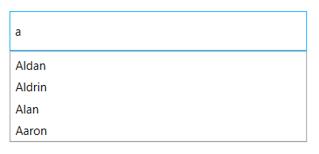
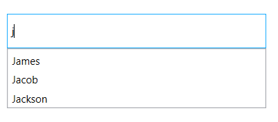
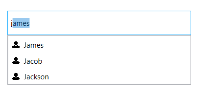
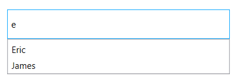
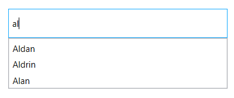
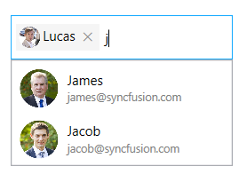

# Autocomplete and filtering in WPF Autocomplete (SfTextBoxExt)

The AutoComplete functionality provides several modes of suggestions while typing. The suggested text can be appended to the original text, or can be displayed in a drop-down list so that searched item can be chosen based on the filtering option set.

## AutoComplete source

The [SfTextBoxExt](https://help.syncfusion.com/cr/wpf/Syncfusion.Windows.Controls.Input.SfTextBoxExt.html) control can be populated with a predefined list of items bind to the [AutoCompleteSource](https://help.syncfusion.com/cr/wpf/Syncfusion.Windows.Controls.Input.SfTextBoxExt.html#Syncfusion_Windows_Controls_Input_SfTextBoxExt_AutoCompleteSource) property. The data can be either a list of strings or a custom data.




<editors:SfTextBoxExt HorizontalAlignment="Center" 
                      VerticalAlignment="Center" 
                      Width="300"
                      Height="40"
                      SearchItemPath="Name"
                      AutoCompleteMode="Suggest"
                      AutoCompleteSource="{Binding Employees}" />




For further details, refer to [Populating Autocomplete with Data](https://help.syncfusion.com/wpf/autocomplete/getting-started#populating-autocomplete-with-data).

## Custom data

The [SearchItemPath](https://help.syncfusion.com/cr/wpf/Syncfusion.Windows.Controls.Input.SfTextBoxExt.html#Syncfusion_Windows_Controls_Input_SfTextBoxExt_SearchItemPath) property specifies the property path, by which the filtering has to be done when a custom data is bound to the [AutoCompleteSource](https://help.syncfusion.com/cr/wpf/Syncfusion.Windows.Controls.Input.SfTextBoxExt.html#Syncfusion_Windows_Controls_Input_SfTextBoxExt_AutoCompleteSource) property. This property defines the value to be displayed in the drop-down suggestion box.




<editors:SfTextBoxExt HorizontalAlignment="Center" 
                      VerticalAlignment="Center" 
                      Width="300"
                      Height="40"
                      SearchItemPath="Name"
                      AutoCompleteMode="Suggest"
                      AutoCompleteSource="{Binding Employees}" />




textBoxExt.SearchItemPath = "Name";




## Customize using the ItemTemplate

By default the drop-down window lists the filtered items as a text based on the [SearchItemPath](https://help.syncfusion.com/cr/wpf/Syncfusion.Windows.Controls.Input.SfTextBoxExt.html#Syncfusion_Windows_Controls_Input_SfTextBoxExt_SearchItemPath) property set for the data. The [AutoCompleteItemTemplate](https://help.syncfusion.com/cr/wpf/Syncfusion.Windows.Controls.Input.SfTextBoxExt.html#Syncfusion_Windows_Controls_Input_SfTextBoxExt_AutoCompleteItemTemplate) property helps to decorate the filtered items with visual elements. The following code block explains how to add an image to the drop-down list items.




<editors:SfTextBoxExt HorizontalAlignment="Center" 
                      VerticalAlignment="Center" 
                      Width="400"
                      Height="40"
                      SearchItemPath="Name"
                      AutoCompleteMode="SuggestAppend"
                      AutoCompleteSource="{Binding Employees}" >
                      <editors:SfTextBoxExt.AutoCompleteItemTemplate>
                        <DataTemplate>
                            <StackPanel Orientation="Horizontal">
                                <Image Source="User.png" Margin="2" Stretch="Uniform" Width="12"/>
                                <TextBlock Text="{Binding Name}" Margin="5 2"/>
                            </StackPanel>
                        </DataTemplate>
                      </editors:SfTextBoxExt.AutoCompleteItemTemplate>
</editors:SfTextBoxExt>




## Filtering options

The phenomenon of string comparison for filtering suggestions can be changed using the [SuggestionMode](https://help.syncfusion.com/cr/wpf/Syncfusion.Windows.Controls.Input.SfTextBoxExt.html#Syncfusion_Windows_Controls_Input_SfTextBoxExt_SuggestionMode) property. The default filtering strategy is “StartsWith” and it is case-insensitive.

<table>
<tr>
<th>SuggestionMode</th>
<th>Description</th>
</tr>
<tr>
<td>None</td>
<td>
The control returns the entire collection without filtering.
</td>
</tr>
<tr>
<td>
StartsWith
</td>
<td>
Displays all matches that begins with the typed characters in the text field. This strategy is case-insensitive.
</td>
</tr>
<tr>
<td>
StartsWithCaseSensitive
</td>
<td>
Displays all matches that begins with the typed characters in the text field. This strategy is case-sensitive.
</td>
</tr>
<tr>
<td>
StartsWithOrdinal
</td>
<td>
The control returns all possible matches that begins with the typed text based on the OrdinalIgnoreCase.
</td>
</tr>
<tr>
<td>
StartsWithOrdinalCaseSensitive
</td>
<td>
The control returns all possible matches that begins with the typed text based on the Ordinal, which is case-sensitive.
</td>
</tr>
<tr>
<td>
Contains
</td>
<td>
Displays all matches that contains typed characters in the text field. This strategy is case-insensitive.
</td>
</tr>
<tr>
<td>
ContainsCaseSensitive
</td>
<td>
The control returns all possible matches that contains the typed text, which is culture and case-sensitive.
</td>
</tr>
<tr>
<td>
ContainsOrdinal
</td>
<td>
The control returns all possible matches that contains the typed text based on the OrdinalIgnoreCase.
</td>
</tr>
<tr>
<td>
ContainsOrdinalCaseSensitive
</td>
<td>
The control returns all possible matches that contains the typed text based on the Ordinal, which is case-sensitive.
</td>
</tr>
<tr>
<td>Equals</td>
<td>
Displays all words that completely matches the typed characters in the text field. This strategy is case-insensitive.
</td>
</tr>
<tr>
<td>
EqualsCaseSensitive
</td>
<td>
Displays all words that completely matches the typed characters in the text field. This strategy is case-sensitive.
</td>
</tr>
<tr>
<td>
EqualsOrdinal
</td>
<td>
The control returns all possible matches that equals the typed text based on the OrdinalIgnoreCase.
</td>
</tr>
<tr>
<td>
EqualsOrdinalCaseSensitive
</td>
<td>
The control returns all possible matches that equals the typed text based on the Ordinal, which is case-sensitive.
</td>
</tr>
<tr>
<td>
Custom
</td>
<td>
The control returns all possible matches based on the Filter property. Filter property is of type SuggestionPredicate. In the MyFilter method, filtration is done by checking whether the collection contains the typed text.
</td>
</tr>
<tr>
<td>
EndsWith
</td>
<td>
Displays all matches that ends with the typed characters in the text field. This strategy is case-insensitive.
</td>
</tr>
<tr>
<td>
EndsWithCaseSensitive
</td>
<td>
Displays all matches that ends with the typed characters in the text field. This strategy is case-sensitive.
</td>
</tr>
<tr>
<td>
EndsWithOrdinal
</td>
<td>
The control returns all possible matches ending with the typed text based on the OrdinalIgnoreCase.
</td>
</tr>
<tr>
<td>
EndsWithOrdinalCaseSensitive
</td>
<td>
The control returns all possible matches ending with the typed text based on the Ordinal, which is case-sensitive.
</td>
</tr>
</table>




<editors:SfTextBoxExt HorizontalAlignment="Center" 
                      VerticalAlignment="Center" 
                      Width="400"
                      Height="40"
                      SearchItemPath="Name"
                      SuggestionMode="Contains"
                      AutoCompleteMode="Suggest"
                      AutoCompleteSource="{Binding Employees}"/>




textBoxExt.SuggestionMode = SuggestionMode.Contains;




## Prefix characters constraint

Instead of displaying suggestion list on every character entry, matches can be filtered and displayed after a few character entries. This can be done using the [MinimumPrefixCharacter](https://help.syncfusion.com/cr/wpf/Syncfusion.Windows.Controls.Input.SfTextBoxExt.html#Syncfusion_Windows_Controls_Input_SfTextBoxExt_MinimumPrefixCharacters) property. By default the constraint is  set for each character entry.





<editors:SfTextBoxExt HorizontalAlignment="Center" 
                      VerticalAlignment="Center" 
                      Width="300"
                      Height="40"
                      SearchItemPath="Name"
                      AutoCompleteMode="Suggest"
                      MinimumPrefixCharacters="2"
                      AutoCompleteSource="{Binding Employees}" />
     



textBoxExt.MinimumPrefixCharacters = 2;





## Working with case sensitivity

[IgnoreCase](https://help.syncfusion.com/cr/wpf/Syncfusion.Windows.Controls.Input.SfTextBoxExt.html#Syncfusion_Windows_Controls_Input_SfTextBoxExt_IgnoreCase) option allows the control to filter the suggestions by ignoring the case. The default value is false.




<editors:SfTextBoxExt HorizontalAlignment="Center" 
                      VerticalAlignment="Center" 
                      Width="400"
                      Height="40"
                      SearchItemPath="Name"
                      IgnoreCase="True"
                      AutoCompleteMode="Suggest"
                      AutoCompleteSource="{Binding Employees}"/>




textBoxExt.IgnoreCase = true;




## Showing image in token and drop-down 

To display image in token use the [ImageMemberPath](https://help.syncfusion.com/cr/wpf/Syncfusion.Windows.Controls.Input.SfTextBoxExt.html#Syncfusion_Windows_Controls_Input_SfTextBoxExt_ImageMemberPath) property.

N> This feature is applicable only for MultiSelectMode with Token mode.

To display image for each drop-down item a custom template can be assigned to [AutoCompleteItemTemplate](https://help.syncfusion.com/cr/wpf/Syncfusion.Windows.Controls.Input.SfTextBoxExt.html#Syncfusion_Windows_Controls_Input_SfTextBoxExt_AutoCompleteItemTemplate) support. 




<editors:SfTextBoxExt HorizontalAlignment="Left"
                      AutoCompleteMode="Suggest"
                      SearchItemPath="Name"
                      ImageMemberPath="Image"
                      MultiSelectMode="Token" 
                      TokensWrapMode="None"
                      Height="40"
                      AutoCompleteSource="{Binding Employees}"
                      VerticalAlignment="Center"
                      Width="200">
            <editors:SfTextBoxExt.AutoCompleteItemTemplate>
                <DataTemplate>
                    <StackPanel Orientation="Horizontal" Height="40">
                        <Image Source="{Binding Image}" Margin="2" Height="35" Stretch="Uniform" Width="35"/>
                        <StackPanel  Margin="2"
                                            Orientation="Vertical">
                            <TextBlock Text="{Binding Name}" Margin="4,2,4,0" FontSize="12" Foreground="Black"/>
                            <TextBlock Text="{Binding Email}" Margin="4,1,2,2" FontSize="10" Foreground="Gray"/>
                        </StackPanel>
                    </StackPanel>
                </DataTemplate>
            </editors:SfTextBoxExt.AutoCompleteItemTemplate>
</editors:SfTextBoxExt>





N> View [sample](https://github.com/SyncfusionExamples/wpf-textboxext-examples/tree/master/Samples/ImageMemberPath) in GitHub

## Display a message when suggestions are empty 

When the entered item is not in the suggestion list, AutoComplete displays a text indicating that there is no search results found. Th text to be displayed for this can be customized using the [NoResultsFoundTemplate](https://help.syncfusion.com/cr/wpf/Syncfusion.Windows.Controls.Input.SfTextBoxExt.html#Syncfusion_Windows_Controls_Input_SfTextBoxExt_NoResultsFoundTemplate) property.



       
<editors:SfTextBoxExt HorizontalAlignment="Center" 
                      VerticalAlignment="Center" 
                      Height="40"
                      Width="400"
                      SearchItemPath="Name"
                      AutoCompleteMode="Suggest"
                      AutoCompleteSource="{Binding Employees}">
            <editors:SfTextBoxExt.NoResultsFoundTemplate>
                <DataTemplate>
                    <Label Content="No Results Found" HorizontalAlignment="Center" VerticalAlignment="Center"/>
                </DataTemplate>
            </editors:SfTextBoxExt.NoResultsFoundTemplate>
</editors:SfTextBoxExt>




N> View [sample](https://github.com/SyncfusionExamples/wpf-textboxext-examples/tree/master/Samples/AutoComplete-and-filtering) in GitHub
