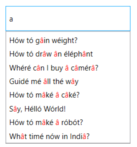

---
layout: post
title: Diacritic sensitivity of AutoComplete in Syncfusion SfTextBoxExt.
description: This section describes how to enable and disable support for Diacritic Sensitivity in AutoComplete Control.
platform: wpf
control: SfTextBoxExt
documentation: ug
---

# Diacritic sensitivity

The control does not stick with one type of keyboard, so it can be populated the items from a language with letters containing diacritics, and search for them with English characters from an en-US keyboard. Enable or disable the diacritic sensitivity using the [IgnoreDiacritic](https://help.syncfusion.com/cr/cref_files/wpf/Syncfusion.SfInput.Wpf~Syncfusion.Windows.Controls.Input.SfTextBoxExt~IgnoreDiacritic.html) property. The following code example demonstrates how to enable the diacritic sensitivity. The items in the suggestion list will be populated by entering any diacritic character of that alphabet.





        <editors:SfTextBoxExt HorizontalAlignment="Center" 
                              VerticalAlignment="Center" 
                              Height="40"
                              Width="200"
                              AutoCompleteMode="Suggest"
                              SuggestionMode="Contains"
                              IgnoreDiacritic="False"
                              HighlightedTextColor="Red"
                              TextHighlightMode="MultipleOccurrence"
                              SearchItemPath="Item"
                              AutoCompleteSource="{Binding DiacriticCollenction}"/>





N> View [sample](https://github.com/SyncfusionExamples/wpf-textboxext-examples/tree/master/Samples/Diacritic-sensitivity) in GitHub