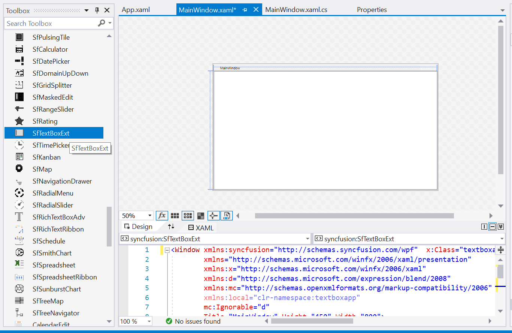

# Getting Started

## Assembly deployment

Refer to the [Control Dependencies](https://help.syncfusion.com/wpf/control-dependencies#sftextboxext) section to get the list of assemblies or NuGet package that needs to be added as a reference to use the control in any application.

Refer to the [How to install nuget packages](https://help.syncfusion.com/wpf/nuget-packages) documentation find more details about installing the NuGet package in a WPF application.

## Creating a simple application with SfTextBoxExt

You can create a WPF application with SfTextBoxExt control using the following steps:

## Create a project

Create a new WPF project in Visual Studio to display the SfTextBoxExt control with their functionalities.

## Add control through designer

The SfTextBoxExt control can be added to an application by dragging it from the toolbox to a designer view. The following required assembly references will be added automatically:

* Syncfusion.SfInput.WPF
* Syncfusion.SfShared.WPF

## Adding control manually in XAML

To add the control manually in XAML, follow the given steps:

1. Add the following required assembly references to the project:
    * Syncfusion.SfInput.WPF
    * Syncfusion.SfShared.WPF
2. Import Syncfusion WPF schema **http://schemas.syncfusion.com/wpf** in the XAML page.
3. Declare the SfTextBoxExt control in the XAML page.




<Window x:Class="AutoCompleteSample.MainWindow"
        xmlns="http://schemas.microsoft.com/winfx/2006/xaml/presentation"
        xmlns:x="http://schemas.microsoft.com/winfx/2006/xaml"
        xmlns:d="http://schemas.microsoft.com/expression/blend/2008"
        xmlns:mc="http://schemas.openxmlformats.org/markup-compatibility/2006"
        xmlns:local="clr-namespace:AutoCompleteSample"
        mc:Ignorable="d"
        xmlns:editors="clr-namespace:Syncfusion.Windows.Controls.Input;assembly=Syncfusion.SfInput.Wpf"
        Title="MainWindow" Height="450" Width="800">
    <Window.Content>
        <Grid>
            <editors:SfTextBoxExt HorizontalAlignment="Center" 
                                  VerticalAlignment="Center" 
                                  HorizontalContentAlignment="Center"
                                  Height="40"
                                  Width="200" 
                                  Text="Hello! World..."/>
        </Grid>
    </Window.Content>
</Window>




## Add control manually in C#

To add the control manually in C#, follow the given steps:

1. Add the following required assembly references to the project:
    * Syncfusion.SfInput.WPF
    * Syncfusion.SfShared.WPF
2. Import the SfTextBoxExt namespace using **Syncfusion.Windows.Controls.Input;**.
3. Create an SfTextBoxExt instance, and add it to the window.




using Syncfusion.Windows.Controls.Input;
using System.Windows;

namespace SfDatePickerSample
{
    /// 

    /// Interaction logic for MainWindow.xaml
    /// 

    public partial class MainWindow : Window
    {
        public MainWindow()
        {
            SfTextBoxExt textBoxExt = new SfTextBoxExt()
            {
                HorizontalContentAlignment = HorizontalAlignment.Center,
                HorizontalAlignment = HorizontalAlignment.Center,
                VerticalAlignment = VerticalAlignment.Center,
                Width = 200,
                Height = 40,
                Text = "Hello! World..."
            };

            this.Content = textBoxExt;
        } 
    }
}




## Binding to data

To bind the AutoComplete to data, set the [AutoCompleteSource](https://help.syncfusion.com/cr/wpf/Syncfusion.SfInput.Wpf~Syncfusion.Windows.Controls.Input.SfTextBoxExt~AutoCompleteSourceProperty.html) property to `IEnumerable` implementation.




<Window x:Class="AutoCompleteSample.MainWindow"
        xmlns="http://schemas.microsoft.com/winfx/2006/xaml/presentation"
        xmlns:x="http://schemas.microsoft.com/winfx/2006/xaml"
        xmlns:d="http://schemas.microsoft.com/expression/blend/2008"
        xmlns:mc="http://schemas.openxmlformats.org/markup-compatibility/2006"
        xmlns:local="clr-namespace:AutoCompleteSample"
        mc:Ignorable="d"
        xmlns:editors="clr-namespace:Syncfusion.Windows.Controls.Input;assembly=Syncfusion.SfInput.Wpf"
        Title="MainWindow" Height="450" Width="800">
    <Window.Content>
        <editors:SfTextBoxExt x:Name="textBoxExt" 
                              HorizontalAlignment="Center" 
                              VerticalAlignment="Center"
                              AutoCompleteMode="Suggest"
                              SuggestionMode="StartsWith"
                              ShowSuggestionsOnFocus="True"
                              Width="200">
            <editors:SfTextBoxExt.AutoCompleteSource>
                <x:Array Type="sys:String" 
             xmlns:sys="clr-namespace:System;assembly=mscorlib">
                    <sys:String>India</sys:String>
                    <sys:String>Uganda</sys:String>
                    <sys:String>Ukraine</sys:String>
                    <sys:String>Canada</sys:String>
                    <sys:String>United Arab Emirates</sys:String>
                </x:Array>
            </editors:SfTextBoxExt.AutoCompleteSource>
        </editors:SfTextBoxExt>
    </Window.Content>
</Window>




using Syncfusion.Windows.Controls.Input;
using System.Collections.Generic;
using System.Windows;

namespace AutoCompleteSample
{
    /// 

    /// Interaction logic for MainWindow.xaml
    /// 

    public partial class MainWindow : Window
    {
        public MainWindow()
        {
            InitializeComponent();
            SfTextBoxExt textBoxExt = new SfTextBoxExt()
            {
                HorizontalAlignment = HorizontalAlignment.Center,
                VerticalAlignment = VerticalAlignment.Center,
                Width = 200,
                AutoCompleteMode = AutoCompleteMode.Suggest,
                SuggestionMode = SuggestionMode.StartsWith,
                ShowSuggestionsOnFocus = true
            };

            List<string> list = new List<string>()
            {
                 "India",
                 "Uganda",
                 "Ukraine",
                 "Canada",
                 "United Arab Emirates"
            };

            textBoxExt.AutoCompleteSource = list;
            this.Content = textBoxExt;
        }
    }
}




## Selected Items

Index of the selected item can be retrieved by using the [SuggestionIndex](https://help.syncfusion.com/cr/wpf/Syncfusion.SfInput.Wpf~Syncfusion.Windows.Controls.Input.SfTextBoxExt~SuggestionIndexProperty.html) property. The selected item of the AutoComplete can be retrieved by using the [SelectedItem](https://help.syncfusion.com/cr/wpf/Syncfusion.SfInput.Wpf~Syncfusion.Windows.Controls.Input.SfTextBoxExt~SelectedItemProperty.html) property.

For further details, refer [Retrieving selected values](https://help.syncfusion.com/wpf/autocomplete/retrieving-selected-values).