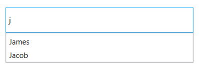

# Getting started with SfAutoComplete.

## Assembly deployment

Refer to this [Control Dependencies](https://help.syncfusion.com/wpf/control-dependencies#sftextboxext) section to get the list of assemblies or NuGet package that needs to be added as a reference to use the control in any application.

Refer to this [How to install nuget packages](https://help.syncfusion.com/wpf/nuget-packages) documentation to find more details about installing the NuGet package in a WPF application.

## Creating a simple application

Create a WPF application with SfTextBoxExt control using the following steps:

### Create a project

Create a new WPF project in Visual Studio to display the SfTextBoxExt control with their functionalities.

### Add a control using the designer

The SfTextBoxExt control can be added to an application by dragging it from the toolbox to a designer view. The following required assembly references will be added automatically:

* Syncfusion.SfInput.WPF
* Syncfusion.SfShared.WPF

### Adding control manually in XAML

To add the control manually in XAML, follow the given steps:

1. Add the following required assembly references to the project:
    * Syncfusion.SfInput.WPF
    * Syncfusion.SfShared.WPF
2. Import Syncfusion WPF schema **http://schemas.syncfusion.com/wpf** in the XAML page.
3. Declare the SfTextBoxExt control in the XAML page.




        <Grid>
            <editors:SfTextBoxExt HorizontalAlignment="Center" 
                                  VerticalAlignment="Center" 
                                  HorizontalContentAlignment="Center"
                                  Height="40"
                                  Width="200" 
                                  Text="Hello! World..."/>
        </Grid>
  



### Add a control manually in C#

To add the control manually in C#, follow the given steps:

1. Add the following required assembly references to the project:
    * Syncfusion.SfInput.WPF
    * Syncfusion.SfShared.WPF
2. Import the SfTextBoxExt namespace using **Syncfusion.Windows.Controls.Input;**.
3. Create an SfTextBoxExt instance, and add it to the window.




            SfTextBoxExt textBoxExt = new SfTextBoxExt()
            {
                HorizontalContentAlignment = HorizontalAlignment.Center,
                HorizontalAlignment = HorizontalAlignment.Center,
                VerticalAlignment = VerticalAlignment.Center,
                Width = 200,
                Height = 40,
                Text = "Hello! World..."
            };




## Populating AutoComplete with Data

To populate the AutoComplete with data, set the [AutoCompleteSource](https://help.syncfusion.com/cr/cref_files/wpf/Syncfusion.SfInput.Wpf~Syncfusion.Windows.Controls.Input.SfTextBoxExt~AutoCompleteSource.html) property to `IEnumerable` implementation.

For further details, refer to [AutoComplete with Data](https://help.syncfusion.com/wpf/autocomplete/auto-complete).

For illustration, let us create a textbox, which will populate a list of employees.

The Employee model will be as follows.



public class Employee
    {
        public string Name { get; set; }
        public string Email { get; set; }
    }
	


Create a collection attribute and populate the collection with items.



 public class EmployeeViewModel
    {
        private List<Employee> employees;
        public List<Employee> Employees
        {
            get { return employees; }

            set { employees = value; }
        }
        public EmployeeViewModel()
        {
            Employees = new List<Employee>();
            Employees.Add(new Employee() { Name = "Eric", Email = "Eric@syncfusion.com" });
            Employees.Add(new Employee() { Name = "James", Email = "James@syncfusion.com" });
            Employees.Add(new Employee() { Name = "Jacob", Email = "Jacob@syncfusion.com" });
            Employees.Add(new Employee() { Name = "Lucas", Email = "Lucas@syncfusion.com" });
            Employees.Add(new Employee() { Name = "Mark", Email = "Mark@syncfusion.com" });
            Employees.Add(new Employee() { Name = "Aldan", Email = "Aldan@syncfusion.com" });
            Employees.Add(new Employee() { Name = "Aldrin", Email = "Aldrin@syncfusion.com" });
            Employees.Add(new Employee() { Name = "Alan", Email = "Alan@syncfusion.com" });
            Employees.Add(new Employee() { Name = "Aaron", Email = "Aaron@syncfusion.com" });
        }
    }






        <editors:SfTextBoxExt HorizontalAlignment="Center" 
                              VerticalAlignment="Center" 
                              Width="300"
                              Height="40"
                              SearchItemPath="Name"
                              AutoCompleteMode="Suggest"
                              AutoCompleteSource="{Binding Employees}" />




## AutoComplete modes 

Suggestions can be shown in number of ways. TextBoxExt supports the following.

<table>
<tr>
<th>AutoCompleteMode</th>
<th>Description</th>
</tr>
<tr>
<td>Suggest</td>
<td>
Shows the suggestion in the drop-down list user.
</td>
</tr>
<tr>
<td>Append</td>
<td>
Appends the first suggestion to the text.
</td>
</tr>
<tr>
<td>SuggestAppend</td>
<td>
Shows the suggestion in the drop-down list and appends the first suggestion to the text.
</td>
</tr>
<tr>
<td>None</td>
<td>
In None mode, the search algorithm starts even when the item is not available in the data source.
</td>
</tr>
</table>

The default value of [AutoCompleteMode](https://help.syncfusion.com/cr/wpf/Syncfusion.SfInput.Wpf~Syncfusion.Windows.Controls.Input.SfTextBoxExt~AutoCompleteModeProperty.html) is None.




        <editors:SfTextBoxExt HorizontalAlignment="Center" 
                                 VerticalAlignment="Center" 
                                 Width="300"
                                 Height="40"
                                 SearchItemPath="Name"
                                 AutoCompleteMode="Suggest"
                                 SuggestionMode="StartsWith"
                                 AutoCompleteSource="{Binding Employees}" />




Filtered suggestions displayed in drop-down list
{:.caption}

## Selection 

Index of the selected items can be retrieved using the [SuggestionIndex](https://help.syncfusion.com/cr/cref_files/wpf/Syncfusion.SfInput.Wpf~Syncfusion.Windows.Controls.Input.SfTextBoxExt~SuggestionIndex.html) property. The selected items of the AutoComplete can be retrieved using the [SelectedItem](https://help.syncfusion.com/cr/cref_files/wpf/Syncfusion.SfInput.Wpf~Syncfusion.Windows.Controls.Input.SfTextBoxExt~SelectedItem.html) property for single selection. In Multi-selection, [SelectedItems](https://help.syncfusion.com/cr/cref_files/wpf/Syncfusion.SfInput.Wpf~Syncfusion.Windows.Controls.Input.SfTextBoxExt~SelectedItems.html) property contains the items that are selected in the control.

For further details, refer to the [Retrieving SelectedValue](https://help.syncfusion.com/wpf/autocomplete/single-and-multiple-selection#retrieving-selectedvalue) and [Setting and retrieving SelectedItem](https://help.syncfusion.com/wpf/autocomplete/single-and-multiple-selection#setting-and-retrieving-selecteditem).

N> View [sample](https://github.com/SyncfusionExamples/wpf-textboxext-examples/tree/master/Samples/Getting-Started) in GitHub