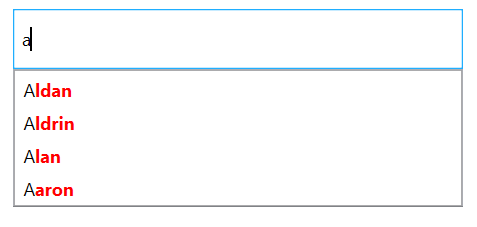

# Highlighting Matched Text in WPF Autocomplete (SfTextBoxExt)

Highlight matching and unmatching characters in a suggestion list to pick an item with more clarity using the [TextHighlightMode](https://help.syncfusion.com/cr/wpf/Syncfusion.Windows.Controls.Input.SfTextBoxExt.html#Syncfusion_Windows_Controls_Input_SfTextBoxExt_TextHighlightMode) property. The default value is None. The matching text can be highlighted in the following two ways:

* First occurrence
* Multiple occurrence
* Unmatched

The text highlight can be indicated by customizing the color of the characters using [HighlightedTextColor](https://help.syncfusion.com/cr/wpf/Syncfusion.Windows.Controls.Input.SfTextBoxExt.html#Syncfusion_Windows_Controls_Input_SfTextBoxExt_HighlightedTextColor) property and style of the characters using [HighlightedTextStyle](https://help.syncfusion.com/cr/wpf/Syncfusion.Windows.Controls.Input.SfTextBoxExt.html#Syncfusion_Windows_Controls_Input_SfTextBoxExt_HighlightedTextStyle) property.

## First occurrence

It highlights the first position of the matching characters in the suggestion list.





<editors:SfTextBoxExt HorizontalAlignment="Center" 
                      VerticalAlignment="Center" 
                      Width="300"
                      Height="40"
                      SearchItemPath="Name"
                      AutoCompleteMode="Suggest"
                      HighlightedTextColor="Red"
                      TextHighlightMode="FirstOccurrence"
                      AutoCompleteSource="{Binding Employees}" />




textBoxExt.TextHighlightMode = OccurrenceMode.FirstOccurrence;





## Multiple occurrence

It highlights the matching character that presents everywhere in the suggestion list for "Contains" case in SuggestionMode.





<editors:SfTextBoxExt HorizontalAlignment="Center" 
                      VerticalAlignment="Center" 
                      Width="300"
                      Height="40"
                      SearchItemPath="Name"
                      AutoCompleteMode="Suggest"
                      SuggestionMode="Contains"
                      HighlightedTextColor="Red"
                      TextHighlightMode="MultipleOccurrence"
                      AutoCompleteSource="{Binding Employees}" />




textBoxExt.TextHighlightMode = OccurrenceMode.MultipleOccurrence;





## Unmatched

It highlights unmatching characters in the suggestion list.





    <Window.Resources>
        
    </Window.Resources>

    <editors:SfTextBoxExt
            Width="300"
            Height="40"
            HorizontalAlignment="Center"
            VerticalAlignment="Center"
            AutoCompleteMode="Suggest"
            AutoCompleteSource="{Binding Employees}"
            HighlightedTextColor="Red"
            HighlightedTextStyle="{StaticResource highlightedTextStyle}"
            SearchItemPath="Name"
            SuggestionMode="StartsWith"
            TextHighlightMode="Unmatched" />




textBoxExt.TextHighlightMode = OccurrenceMode.Unmatched;





N> View [sample](https://github.com/SyncfusionExamples/wpf-textboxext-examples/tree/master/Samples/TextHighlightMode) in GitHub
