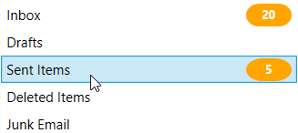
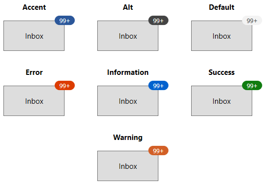

# Customization of WPF Badge (SfBadge)

This section explains the customization features available in the WPF [Badge]() control.

## Adding badge for a Button

If you want to assign `Badge` for any objects, create the `Badge` and assign the badge to the [SfBadge.Badge]() property. Before that you need to create a `SfBadge.Badge` object and add that object to the parent control.

Here, `Badge` control added for the `Button` control.




<Button Width="100"
        Height="50" 
        Content="Inbox">
    <syncfusion:SfBadge.Badge>
        <syncfusion:SfBadge Content="10"
                            x:Name="badge"/>
    </syncfusion:SfBadge.Badge>
</Button>




/Creating Badge control
SfBadge sfBadge = new SfBadge();
sfBadge.Name = "badge";
sfBadge.Content = 10;

//Create button control as container for badge
Button button = new Button();
button.Width = 100;
button.Height = 50;
button.Content = "Primary";

//Assigning Badge control to button           
SfBadge.SetBadge(button, sfBadge);




N> Download demo application from [GitHub]()

## Adding badge without BadgeContainer

You can directly add the `Badge` to any objects without using the `SfBadge.Badge` container.




public class MailItem
{
   public string ItemName { get; set; }
   public int? UnreadMessageount { get; set; }
}

public class ViewModel {
    public List<MailItem> MailItems { get; set; }
    public ViewModel(){
        MailItems = new List<MailItem>();
        MailItems.Add(new MailItem()
        {
            ItemName = "Inbox",
            UnreadMessageount = 20
        });
        MailItems.Add(new MailItem()
        {
            ItemName = "Drafts",
            UnreadMessageount = null
        });
        MailItems.Add(new MailItem()
        {
            ItemName = "Sent Items",
            UnreadMessageount = 5
        });
        MailItems.Add(new MailItem()
        {
            ItemName = "Deleted Items",
            UnreadMessageount = null
        });
        MailItems.Add(new MailItem()
        {
            ItemName = "Junk Email",
            UnreadMessageount = null
        });
    }
}







<Window.DataContext>
    <local:ViewModel/>
</Window.DataContext>
<Grid>
    <ListView BorderThickness="1"
              BorderBrush="LightGray"
              ItemsSource="{Binding MailItems}" 
              SelectedIndex="0"
              VerticalAlignment="Center" 
              HorizontalAlignment="Center">
        <ListView.ItemTemplate>
            <DataTemplate>
                <Grid>
                    <Grid.ColumnDefinitions>
                        <ColumnDefinition Width="150"/>
                        <ColumnDefinition Width="100"/>
                    </Grid.ColumnDefinitions>
                    <ContentPresenter Grid.Column="0" 
                                      Content="{Binding ItemName}" 
                                      VerticalAlignment="Center"/>
                    <syncfusion:SfBadge x:Name="badge4"
                                        Grid.Column="1" 
                                        Height="20" 
                                        Width="40" 
                                        Background="Orange"
                                        Content="{Binding UnreadMessageount}"
                                        Shape="Oval"/>
                </Grid>
            </DataTemplate>
        </ListView.ItemTemplate>
    </ListView>
</Grid>




N> Download demo application from [GitHub]()

## Setting Badge display content

If you want to set or change the display content of the `Badge`, use the `Content` property. The default value of `Content` property is `null`.




<Button Width="100"
        Height="50" 
        Content="Inbox">
    <syncfusion:SfBadge.Badge>
        <syncfusion:SfBadge Content="99+"
                            x:Name="badge"/>
    </syncfusion:SfBadge.Badge>
</Button>




badge.Content = "99+";




N> Download demo application from [GitHub]()

## Custom UI for Badge content

You can change the appearance of `Badge` content by using `ContentTemplate` property. The `DataContext` of `ContentTemplate` property is `Content`.




<Button Width="100"
        Height="50" 
        Content="Inbox">
    <syncfusion:SfBadge.Badge>
        <syncfusion:SfBadge Content="99+"
                            x:Name="badge">
            <syncfusion:SfBadge.ContentTemplate>
                <DataTemplate>
                    <Grid>
                        <TextBlock Text="{Binding}" 
                                   Foreground="Red"/>
                    </Grid>
                </DataTemplate>
            </syncfusion:SfBadge.ContentTemplate>
        </syncfusion:SfBadge>
    </syncfusion:SfBadge.Badge>
</Button>




N> Download demo application from [GitHub]()

## Predefined colors for displaying the badges

You can change background color of the `Badge` by using the [Fill]() property. Based on the value of `Fill` property, respective background color will be applied to the `Badge`. The default value of `Fill` property is `Accent`.

The `Badge` supports the following different essential states :

* Accent - DarkSlateBlue background will be applied

* Alt - DarkSlateGray background will be applied

* Default - WhiteSmoke background will be applied

* Error - OrangeRed background will be applied

* Information - RoyalBlue background will be applied

* Success - Green background will be applied

* Warning - Chocolate background will be applied




<Button Width="100"
        Height="50" 
        Content="Inbox">
    <syncfusion:SfBadge.Badge>
        <syncfusion:SfBadge Fill="Success"
                            Content="99+"
                            x:Name="badge"/>
    </syncfusion:SfBadge.Badge>
</Button>




badge.Fill = BadgeFill.Success;
badge.Content = "99+";




N> Download demo application from [GitHub]()

## Custom colors for displaying the badges

If you want to change the background color of the `Badge` other than the default `Fill` colors, use the `Background` property. You can also change foreground of the `Badge` by using the `Foreground` property. The default value of `Background` and `Foreground` properties is `null`. 




<Button Width="100"
        Height="50" 
        Content="Inbox">
    <syncfusion:SfBadge.Badge>
        <syncfusion:SfBadge Background="Black"
                            Foreground="Yellow"
                            Content="99+"
                            x:Name="badge"/>
    </syncfusion:SfBadge.Badge>
</Button>




badge.Background = Brushes.Black;
badge.Foreground = Brushes.Yellow;
badge.Content = "99+";




N> Download demo application from [GitHub]()

## Predefined shapes for displaying the Badge

You can change the default shape to either `Rectangle`, `Oval` or `Ellipse` by using [Shape]() property. If you want to display the `Badge` content without any default shapes , use the `Shape` property value as `None`. The default value of `Shape` property is `Ellipse`.




<Button Width="100"
        Height="50" 
        Content="Inbox">
    <syncfusion:SfBadge.Badge>
        <syncfusion:SfBadge Shape="Oval"
                            Content="99+"
                            x:Name="badge"/>
    </syncfusion:SfBadge.Badge>
</Button>




badge.Shape = BadgeShape.Oval;
badge.Content = "99+";




N> Download demo application from [GitHub]()

## Custom shape for displaying the Badge

If you want to change the shape of the `Badge` other than the default shapes, use the [CustomShape]() property. You can enable the custom shapes by setting the `Shape` property value as `Custom`.




<Button Width="100"
        Height="50" 
        Content="Inbox">
    <syncfusion:SfBadge.Badge>
        <syncfusion:SfBadge Shape="Custom"
                            CustomShape="M16,0C17.300003,0.49999999 18.399994,1.6000063 19.199997,3.3000189 19.300003,3.3000189 19.5,3.1999823 19.600006,3.1999823 19.800003,3.3999945 20,3.4999703 20.199997,3.8000194 21.5,2.9999701 22.800003,2.6000067 24,2.8000189 24.600006,3.6000069 25,4.6000072 25,5.8000194 25.5,5.8000194 25.899994,5.899995 26.300003,6.1000076 26.399994,6.3999954 26.5,6.6000076 26.600006,6.8999954 28.199997,6.8000198 29.600006,7.1999832 30.5,7.8999959 30.699997,9.1999837 30.199997,10.699984 29.100006,12.199985L29.399994,12.499972C29.399994,12.800021 29.300003,12.999972 29.199997,13.300021 30.600006,13.999972 31.600006,14.999973 32,15.999973 31.600006,16.899998 30.899994,17.699986 29.800003,18.399998 30,18.800022 30.100006,19.199986 30.199997,19.60001 30,19.800022 29.800003,19.999973 29.600006,20.199986 30.399994,21.499975 30.800003,22.800024 30.600006,23.999975 29.5,24.800024 27.899994,25.199988 26,24.999975 26,25.100012 25.899994,25.300024 25.899994,25.4 25.600006,25.499975 25.399994,25.600012 25.100006,25.600012 25.199997,26.999975 24.800003,28.300024 24.100006,29.199989 23.100006,29.400002 22,29.100014 20.800003,28.499975 20.5,28.900002 20.199997,29.199989 19.899994,29.400002 19.600006,29.400002 19.300003,29.300026 19,29.199989 18.300003,30.499977 17.199997,31.499977 16.100006,31.900002 14.800003,31.400002 13.699997,30.199989 12.899994,28.600012 12.800003,28.600012 12.600006,28.699988 12.5,28.699988 12.300003,28.499975 12.100006,28.4 11.899994,28.100012 10.5,28.999977 9.1999969,29.400002 8,29.199989 7.3999939,28.4 7,27.4 7,26.199988 6.5,26.199988 6.1000061,26.100012 5.6999969,25.9 5.6000061,25.600012 5.5,25.4 5.3999939,25.100012 3.8000031,25.199988 2.3999939,24.800024 1.5,24.100012 1.3000031,22.800024 1.8000031,21.300024 2.8999939,19.800022L2.6000061,19.499973C2.6000061,19.199986 2.6999969,18.999973 2.8000031,18.699986 1.3999939,17.999973 0.3999939,16.999973 0,15.999973 0.3999939,15.10001 1.1000061,14.300021 2.1999969,13.600009 2,13.199985 1.8999939,12.800021 1.8000031,12.399997 2,12.199985 2.1999969,11.999972 2.5,11.800021 1.6999969,10.499971 1.3000031,9.1999837 1.5,7.9999715 2.5,7.1999832 4.1000061,6.8000198 6,6.999971 6,6.8999954 6.1000061,6.6999832 6.1000061,6.6000076 6.3999939,6.499971 6.6999969,6.3999954 7,6.3999954 6.8999939,4.899995 7.3000031,3.6999825 8,2.8000189 9,2.6000067 10.100006,2.8999945 11.300003,3.4999705 11.600006,3.1000067 11.899994,2.8000189 12.199997,2.6000067 12.5,2.6000067 12.800003,2.6999823 13.100006,2.8000189 13.800003,1.3999941 14.800003,0.39999388 16,0z"
                            Content="10"
                            x:Name="badge"/>
    </syncfusion:SfBadge.Badge>
</Button>




N> Download demo application from [GitHub]()

## Animate when content changes

You can enable the `Scale` or `Opacity` based animation for displaying the `Badge` text by using [AnimationType]() property. You can only see the animation when you change the text of the `Badge`. The default value of `AnimationType` property is `None`.




<Button Width="100"
        Height="50" 
        Content="Inbox">
    <syncfusion:SfBadge.Badge>
        <syncfusion:SfBadge AnimationType="Scale"
                            x:Name="badge"/>
    </syncfusion:SfBadge.Badge>
</Button>

<StackPanel Orientation="Vertical">
    <TextBlock Text="Badge content" 
               TextAlignment="Center" />
    <syncfusion1:UpDown MinValue="1"
                        MaxValue="10"
                        Step="1" 
                        NumberDecimalDigits="0"
                        Value="1"
                        x:Name="badgeContent"
                        ValueChanged="BadgeContent_ValueChanged"/>




badge.AnimationType = BadgeAnimationType.Scale;
badgeContent.ValueChanged += BadgeContent_ValueChanged;







private void BadgeContent_ValueChanged(DependencyObject d, DependencyPropertyChangedEventArgs e)
{
    this.badge.Content = Convert.ToInt32(e.NewValue).ToString();
}




### Scaling based animation

### Opacity based animation

N> Download demo application from [GitHub]()

## Stroke customization

You can change stroke color and its thickness by using the [Stroke]() and [StrokeThickness]() properties. The default value of `Stroke` property is `null` and `StrokeThickness` property is `0`.




<Button Width="100"
        Height="50" 
        Content="Inbox">
    <syncfusion:SfBadge.Badge>
        <syncfusion:SfBadge Stroke="Red"
                            StrokeThickness="3"
                            Content="99+"
                            x:Name="badge"/>
    </syncfusion:SfBadge.Badge>
</Button>




badge.Stroke = Brushes.Red;
badge.StrokeThickness = 3;
badge.Content = "99+";




N> Download demo application from [GitHub]()

## Hide the Badge

You can hide the `Badge` by setting the `Visibility` property value as `Collapsed`. Badge will be hidden when its content is `null`. The default value of `Visibility` property is `Visible`.




<Button Width="100"
        Height="50" 
        Content="Inbox">
    <syncfusion:SfBadge.Badge>
        <syncfusion:SfBadge Visibility="Collapsed"
                            Content="99+"
                            x:Name="badge"/>
    </syncfusion:SfBadge.Badge>
</Button>




badge.Visibility = Visibility.Collapsed;
badge.Content = "99+";




## Display number formatting

You can format the numbers which are displayed in the `Badge` content by using the converters. For example, you can display the number as `99+` which is greater than or equal to `100`.




<Button Width="100"
        Height="50" 
        Content="Inbox">
    <syncfusion:SfBadge.Badge>
        <syncfusion:SfBadge x:Name="badge"
                            AnimationType="None"/>
    </syncfusion:SfBadge.Badge>
</Button>

<StackPanel Orientation="Vertical">
    <TextBlock Text="Badge content" 
               TextAlignment="Center" />
    <syncfusion1:UpDown MinValue="1"
                        MaxValue="10000000"
                        Step="1" 
                        NumberDecimalDigits="0"
                        Value="1"
                        x:Name="badgeContent"
                        ValueChanged="BadgeContent_ValueChanged"/> 




badge.AnimationType = BadgeAnimationType.None;
badgeContent.ValueChanged += BadgeContent_ValueChanged;







private void BadgeContent_ValueChanged(DependencyObject d, DependencyPropertyChangedEventArgs e)
{
    int content_Value =Convert.ToInt32(e.NewValue);
    if (content_Value <= 99)
    {
        this.badge.Content = content_Value.ToString();
    }
    else if (content_Value <= 999)
    {
        this.badge.Content = "99+";
    }
    else if (content_Value < 99999)
    {
        this.badge.Content = (content_Value / 1000).ToString("0.#") + "K";
    }
    else if (content_Value < 999999)
    {
        this.badge.Content = (content_Value / 1000).ToString("#,0K");
    }
    else if (content_Value < 9999999)
    {
        this.badge.Content = (content_Value / 1000000).ToString("0.#") + "M";
    }
    else
    {
        this.badge.Content = (content_Value / 1000000).ToString("#,0M");
    }
}




N> Download demo application from [GitHub]()

## Change Badge size

You can change the size of `Badge` by using the `Width` and `Height` properties. The default value of `Width` property is `40` and `Height` property is `30`.




<Button Width="100"
        Height="50" 
        Content="Inbox">
    <syncfusion:SfBadge.Badge>
        <syncfusion:SfBadge Width="50"
                            Height="50"
                            Content="99+"
                            x:Name="badge"/>
    </syncfusion:SfBadge.Badge>
</Button>




badge.Width = 50;
badge.Height = 50;
badge.Content = "99+";




N> Download demo application from [GitHub]()

## Text formatting

You can change the style, size and font family of the `Badge` display content by using the `FontFamily`, `FontStyle` and `FontSize` properties. The default value of `FontFamily` property is `Segoe UI`, `FontStyle` property is `Normal` and  `FontSize` property is `14`.




<Button Width="100"
        Height="50" 
        Content="Inbox">
    <syncfusion:SfBadge.Badge>
        <syncfusion:SfBadge FontFamily="Perpetua"
                            FontStyle="Oblique" 
                            FontSize="20"
                            Content="99+"
                            x:Name="badge"/>
    </syncfusion:SfBadge.Badge>
</Button>




badge.FontFamily = new FontFamily("Perpetua");
badge.FontSize = 20;
badge.Content = "99+";




N> Download demo application from [GitHub]()

## Change opacity of Badge

You can change opacity of the `Badge` by using the `Opacity` property. Value range of `Opacity` property is `0` to `1`. The default value of `Opacity` property is `1`.




<Button Width="100"
        Height="50" 
        Content="Inbox">
    <syncfusion:SfBadge.Badge>
        <syncfusion:SfBadge Opacity="0.6"
                            Content="99+"
                            x:Name="badge"/>
    </syncfusion:SfBadge.Badge>
</Button>




badge.Opacity = 0.6;
badge.Content = "99+";




N> Download demo application from [GitHub]()
