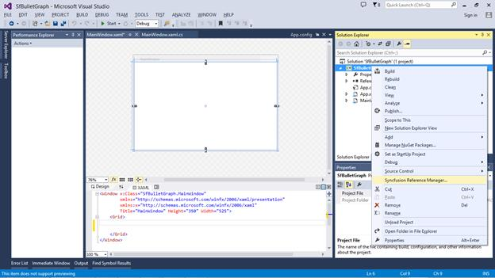
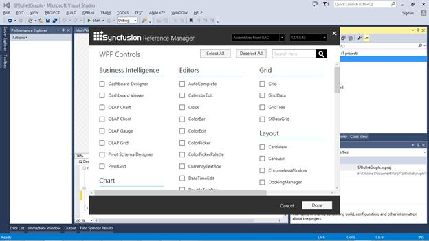
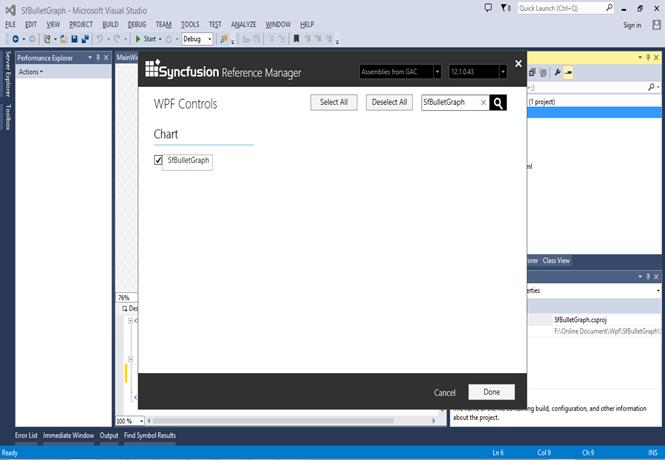
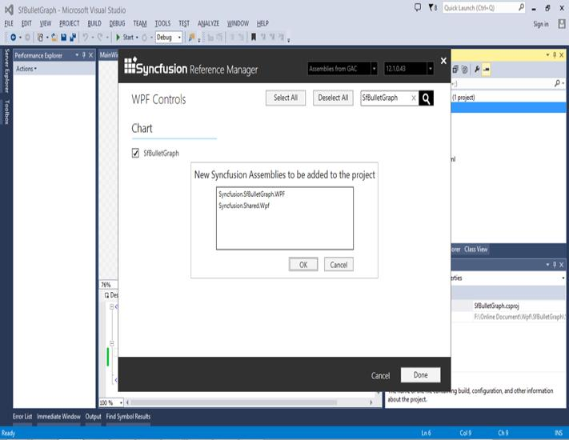
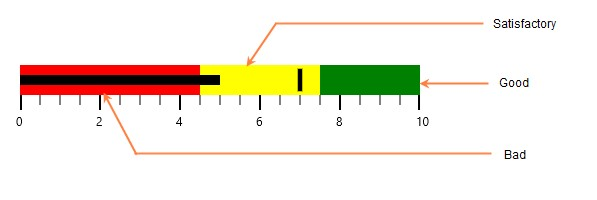

# Getting Started

This section explains you the steps required to configure the **SfBulletGraph** and also explains the steps to add basic elements of **SfBulletGraph** through various API’s available within it.

## Configuring SfBulletGraph using Syncfusion Reference Manager

Syncfusion Reference Manager is used to add   Syncfusion Tools.

Follow the below steps to add **SfBulletGraph** Control using Syncfusion Reference Manager.

Create a simple WPF application using Visual Studio.

Right Click on the Project and select Syncfusion Reference Manager.

The Syncfusion Reference Manager Wizard will be opened as shown in the figure below.

Search for **SfBulletGraph** using SearchBox and select SfBulletGraph Control. Click on done to add selected SfBulletGraph control.

The **SfBulletGraph** assemblies will be automatically added to the Project after Clicking **OK**.

Create a namespace reference to the SfBulletGraph control using Syncfusion’s global namespace reference **schemas.Syncfusion.com** or the SfBulletGraph control’s namespace reference using **Syncfusion.UI.Xaml.BulletGraph** available in the **Syncfusion.SfBulletGraph.WPF** assembly.



    xmlns:bulletgraph="http://schemas.syncfusion.com/wpf"
    (or)
    xmlns:bulletgraph ="clr-
    namespace:Syncfusion.UI.Xaml.BulletGraph;assembly=Syncfusion.SfBulletGraph. WPF"



Add the following code to create a simple SfBulletGraph control.




    <Window x:Class="SfBulletGraph.MainWindow"
    xmlns="http://schemas.microsoft.com/winfx/2006/xaml/presentation"
    xmlns:x="http://schemas.microsoft.com/winfx/2006/xaml"
    xmlns:syncfusion ="http://schemas.syncfusion.com/wpf"
    Title="MainWindow" Height="350" Width="525">
    <Grid x:Name="LayoutRoot">
    <syncfusion:SfBulletGraph/>
    </Grid>
    </Window>





    SfBulletGraph bulletgraph = new SfBulletGraph();
    this.Grid.Children.Add(bulletgraph);        
    



The SfBulletGraph control will be created as shown in the figure below.

>**Note:- The Syncfusion Reference Manager is available in versions 11.3.0.30 and later. It supports referencing assemblies from version 10.4.0.71 version to the current version and Syncfusion Reference Manager can be used only in Visual Studio 2010, 2012, 2013 and 2015.**

## Configuring SfBulletGraph

**SfBulletGraph** is available in the following assembly and namespace:

**Assembly**: Syncfusion.SfBulletGraph.Wpf

**Namespace**: Syncfusion.UI.Xaml.BulletGraph

Create a namespace reference to the SfBulletGraph control using Syncfusion’s global namespace reference **schemas.Syncfusion.com** or the SfBulletGraph control’s namespace reference using **Syncfusion.UI.Xaml.BulletGraph** available in the **Syncfusion.SfBulletGraph.WPF** assembly.



    xmlns:bulletgraph="http://schemas.syncfusion.com/wpf"
    (or)
    xmlns:bulletgraph ="clr-
    namespace:Syncfusion.UI.Xaml.BulletGraph;assembly=Syncfusion.SfBulletGraph. WPF"






    <syncfusion:SfBulletGraph/>





    SfBulletGraph bulletgraph = new SfBulletGraph();
    this.Grid.Children.Add(bulletgraph);




As you can see now in the above image, the SfBulletGraph displays its default elements. To customize its element, you have to add respective elements to SfBulletGraph, following section contains the steps to add the basic elements to SfBulletGraph.

## Adding Caption

You can assign a caption to **SfBulletGraph** by making use of “Caption” property and also you can position it either near or far using “**CaptionPosition**” property.




    <syncfusion:SfBulletGraph CaptionPosition="Far" Caption="Revenue YTD"
    </syncfusion:SfBulletGraph>





    SfBulletGraph bulletgraph = new SfBulletGraph();
    bulletgraph.Caption = Revenue YTD;
    bulletgraph.CaptionPosition  = BulletGraphCaptionPosition.Far;
    this.Grid.Children.Add(bulletgraph);
    



## Configuring Ticks and Labels 

You can configure Ticks and Labels of Quantitative Scale by making use of following API’s available in SfBulletGraph.

They are:

* Minimum
* Maximum
* Interval
* MinorTicksPerInterval
* MajorTickSize
* MinorTickSize
* MajorTickStroke
* LabelStroke
* MinorTickStroke




    <syncfusion:SfBulletGraph Minimum="0" Maximum="10" Interval="2"   
                                  QualitativeRangesSize="30" 
                                  QuantitativeScaleLength="300"    
                                  MinorTicksPerInterval="3"
                                  MajorTickSize="15" MinorTickSize="10"
                                  MajorTickStroke="Red" LabelStroke="Black" MinorTickStroke="Green">
        </syncfusion:SfBulletGraph>





    SfBulletGraph bulletgraph = new SfBulletGraph();
      bulletgraph.FlowDirection = BulletGraphFlowDirection.Forward;
      bulletgraph.Orientation = Orientation.Horizontal;
      bulletgraph.QualitativeRangesSize = 30;
      bulletgraph.QuantitativeScaleLength = 300;
      bulletgraph.Minimum = 0;
      bulletgraph.Maximum = 10;
      bulletgraph.Interval = 2;
      bulletgraph.MinorTicksPerInterval = 3;
      bulletgraph.MajorTickSize = 15;
      bulletgraph.MinorTickSize = 10;
      bulletgraph.MajorTickStroke = new SolidColorBrush(Colors.Red);
      bulletgraph.LabelStroke = new SolidColorBrush(Colors.Black);
      bulletgraph.MinorTickStroke = new SolidColorBrush(Colors.Green);
      this.Grid.Children.Add(bulletgraph);




## Adding Ranges 

You can add ranges to **SfBulletGraph** by creating ranges collection using **QualitativeRanges**. 




          <syncfusion:SfBulletGraph Orientation="Horizontal" Minimum="0" Maximum="10" Interval="2"  FlowDirection="Forward"
                                  QualitativeRangesSize="30" 
                                  QuantitativeScaleLength="300">
            <syncfusion:SfBulletGraph.QualitativeRanges>
                <syncfusion:QualitativeRange RangeEnd="4.5" 
                                             RangeStroke="Red"
                                             RangeOpacity="1">
                </syncfusion:QualitativeRange>
                <syncfusion:QualitativeRange RangeEnd="7.5" 
                                             RangeStroke="Yellow"
                                             RangeOpacity="1">
                </syncfusion:QualitativeRange>
                <syncfusion:QualitativeRange RangeEnd="10" 
                                             RangeStroke="Green"
                                             RangeOpacity="1">
                </syncfusion:QualitativeRange>
            </syncfusion:SfBulletGraph.QualitativeRanges>
        </syncfusion:SfBulletGraph>





           SfBulletGraph bulletgraph = new SfBulletGraph();
            bulletgraph.QualitativeRangesSize = 30;
            bulletgraph.QuantitativeScaleLength = 300;
            bulletgraph.FlowDirection = BulletGraphFlowDirection.Forward;
            bulletgraph.Orientation = Orientation.Horizontal;
            bulletgraph.Minimum = 0;
            bulletgraph.Maximum = 10;
            bulletgraph.Interval = 2;
            bulletgraph.QualitativeRanges.Add(new QualitativeRange()
            {
                RangeEnd = 4.5,
                RangeOpacity = 1,
                RangeStroke = new SolidColorBrush(Colors.Red)
            });
            bulletgraph.QualitativeRanges.Add(new QualitativeRange()
            {
                RangeEnd = 7.5,
                RangeOpacity = 1,
                RangeStroke = new SolidColorBrush(Colors.Yellow)
            });
            bulletgraph.QualitativeRanges.Add(new QualitativeRange()
            {
                RangeEnd = 10,
                RangeOpacity = 1,
                RangeStroke = new SolidColorBrush(Colors.Green)
            });
            this.Grid.Children.Add(bulletgraph);
            



SfBulletGraph ranges are displayed as follows.

## Theme

Bullet Graph supports various built-in themes. Refer to the below links to apply themes for the Bullet Graph,

  * [Apply theme using SfSkinManager](https://help.syncfusion.com/wpf/themes/skin-manager)
	
  * [Create a custom theme using ThemeStudio](https://help.syncfusion.com/wpf/themes/theme-studio#creating-custom-theme)
