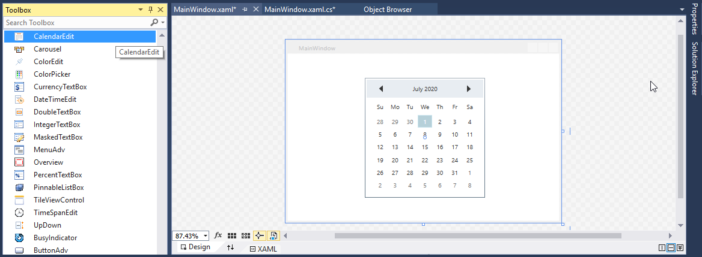
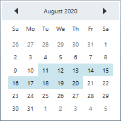
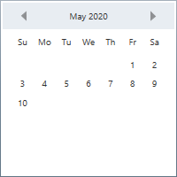
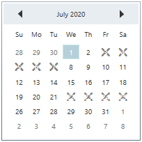
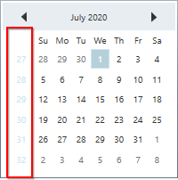
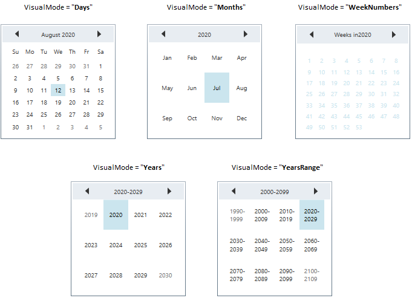
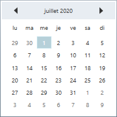

# Getting Started with WPF CalendarEdit

This section explains how to create a WPF [CalendarEdit](https://help.syncfusion.com/cr/wpf/Syncfusion.Windows.Shared.CalendarEdit.html) and explains about its structure.

## Structure of CalendarEdit

The various elements of `CalendarEdit` are illustrated in the following screenshot.

## Assembly deployment

Refer to the [Control Dependencies](https://help.syncfusion.com/wpf/control-dependencies#calendaredit) section to get the list of assemblies or NuGet package that needs to be added as a reference to use the control in any application.

Refer to this [documentation](https://help.syncfusion.com/wpf/visual-studio-integration/nuget-packages) to find more details about installing nuget packages in a WPF application.

## Adding WPF CalendarEdit via designer

1) The `CalendarEdit` can be added to an application by dragging it from the toolbox to a designer view. The following dependent assemblies will be added automatically:

* Syncfusion.Shared.WPF

2) Set the properties for `CalendarEdit` in design mode using the SmartTag feature.

## Adding WPF CalendarEdit via XAML

To add the `CalendarEdit` manually in XAML, follow these steps:

1) Create a new WPF project in Visual Studio.

2) Add the following required assembly references to the project:

* Syncfusion.Shared.WPF

3) Import Syncfusion WPF schema **http://schemas.syncfusion.com/wpf**, and declare the CalendarEdit in XAML page.





<Window x:Class="CalendarEdit_sample.MainWindow"
        xmlns="http://schemas.microsoft.com/winfx/2006/xaml/presentation"
        xmlns:x="http://schemas.microsoft.com/winfx/2006/xaml"
        xmlns:d="http://schemas.microsoft.com/expression/blend/2008"
        xmlns:mc="http://schemas.openxmlformats.org/markup-compatibility/2006"
        xmlns:local="clr-namespace:CalendarEdit_sample"
        xmlns:syncfusion="http://schemas.syncfusion.com/wpf"
        mc:Ignorable="d"
        Title="MainWindow" Height="450" Width="800">

    <Grid Name="grid">
        <syncfusion:CalendarEdit Name="calendarEdit"
                                 Height="200"
                                 Width="200"/>
    </Grid>
</Window>




## Adding WPF CalendarEdit via C#

To add the `CalendarEdit` manually in C#, follow these steps:

1) Create a new WPF application via Visual Studio.

2) Add the following required assembly references to the project:

* Syncfusion.Shared.WPF

3) Include the required namespace.




using Syncfusion.Windows.Shared;




4) Create an instance of `CalendarEdit`, and add it to the window.




// Creating an instance of the CalendarEdit
CalendarEdit calendarEdit = new CalendarEdit();

// Setting height and width to CalendarEdit
calendarEdit.Height = 200;
calendarEdit.Width = 200;




N> [View Sample in GitHub](https://github.com/SyncfusionExamples/syncfusin-wpf-calendar-examples/tree/master/Samples/Getting-Started)

## Select a date

You can select a date in the `CalendarEdit` control by mouse click on the specific date. You can get the selected date by using the `Date` property.




<!-- Selecting date -->
<syncfusion:CalendarEdit Name="calendarEdit" />




CalendarEdit calendarEdit = new CalendarEdit();




N> [View Sample in GitHub](https://github.com/SyncfusionExamples/syncfusin-wpf-calendar-examples/tree/master/Samples/Select-Date)

### Select a date programmatically

You can set selected date programmatically by setting the date value to the [Date](https://help.syncfusion.com/cr/wpf/Syncfusion.Windows.Shared.CalendarEdit.html#Syncfusion_Windows_Shared_CalendarEdit_Date) property.




<!-- Selecting date programmatically -->
<syncfusion:CalendarEdit Date="25/08/2020"
                         Name="calendarEdit"/>



//Selecting date programmatically
calendarEdit.Date = new DateTime(2020, 08, 25);




N> [View Sample in GitHub](https://github.com/SyncfusionExamples/syncfusin-wpf-calendar-examples/tree/master/Samples/Select-Date)

## Select multiple dates

You can select a multiple dates by drag and move the mouse from required start date to end date.
 You can get the selected dates from the [SelectedDates](https://help.syncfusion.com/cr/wpf/Syncfusion.Windows.Shared.CalendarEdit.html#Syncfusion_Windows_Shared_CalendarEdit_SelectedDates) property. You can restrict the multiple date selection by setting [AllowMultiplySelection](https://help.syncfusion.com/cr/wpf/Syncfusion.Windows.Shared.CalendarEdit.html#Syncfusion_Windows_Shared_CalendarEdit_AllowMultiplySelection) property as `false`. The default value of `AllowMultiplySelection` property is `true`.




<!-- Selecting multiple dates-->
<syncfusion:CalendarEdit Name="calendarEdit" 
                         AllowMultiplySelection="True"/>




//Selecting multiple dates
calendarEdit.AllowMultiplySelection = true;




N> [View Sample in GitHub](https://github.com/SyncfusionExamples/syncfusin-wpf-calendar-examples/tree/master/Samples/Select-Date)

### Select a multiple dates programmatically

You can select a multiple dates programmatically by setting the dates to the [SelectedDatesList](https://help.syncfusion.com/cr/wpf/Syncfusion.Windows.Shared.CalendarEdit.html#Syncfusion_Windows_Shared_CalendarEdit_SelectedDatesList) property.




<!-- Selecting date -->
<syncfusion:CalendarEdit Date="08/25/2020" 
                         AllowMultiplySelection="True"
                         Name="calendarEdit"/>



//Selecting multiple date programmatically
calendarEdit.AllowMultiplySelection = true;
calendarEdit.SelectedDatesList = new List<Date>();
calendarEdit.SelectedDatesList.Add(new Date(2020, 08, 01));
calendarEdit.SelectedDatesList.Add(new Date(2020, 08, 05));
calendarEdit.SelectedDatesList.Add(new Date(2020, 08, 10));
calendarEdit.SelectedDatesList.Add(new Date(2020, 08, 15));
calendarEdit.SelectedDatesList.Add(new Date(2020, 08, 20));
calendarEdit.SelectedDatesList.Add(new Date(2020, 08, 29));




## Restrict date selection

You can restrict the users from selecting a date within the particular range by specifying [MinDate](https://help.syncfusion.com/cr/wpf/Syncfusion.Windows.Shared.CalendarEdit.html#Syncfusion_Windows_Shared_CalendarEdit_MinDate) and [MaxDate](https://help.syncfusion.com/cr/wpf/Syncfusion.Windows.Shared.CalendarEdit.html#Syncfusion_Windows_Shared_CalendarEdit_MaxDate) in `CalendarEdit` control.




<!--Setting date range -->
<syncfusion:CalendarEdit MinDate="05/1/2020" 
                         MaxDate="05/10/2020"
                         Name="calendarEdit"/>




CalendarEdit calendarEdit = new CalendarEdit();
calendarEdit.MinDate = new DateTime(2020, 05, 01);
calendarEdit.MaxDate = new DateTime(2020, 05, 10);




N> [View Sample in GitHub](https://github.com/SyncfusionExamples/syncfusin-wpf-calendar-examples/tree/master/Samples/Restrict-Date)

## Block dates

If you want to block particular dates from the date selection, add that date ranges to the [BlackoutDates](https://help.syncfusion.com/cr/wpf/Syncfusion.Windows.Shared.CalendarEdit.html#Syncfusion_Windows_Shared_CalendarEdit_BlackoutDates) collection. You can add more block out date ranges to the `BlackoutDates` collection.




<syncfusion:CalendarEdit Name="calendarEdit">
    <syncfusion:CalendarEdit.BlackoutDates>
        <syncfusion:BlackoutDatesRange StartDate="07/03/2020"
                                       EndDate="07/07/2020" />
        <syncfusion:BlackoutDatesRange StartDate="07/22/2020" 
                                       EndDate="07/25/2020" />
    </syncfusion:CalendarEdit.BlackoutDates>
</syncfusion:CalendarEdit>




calendarEdit.BlackoutDates.Add(new BlackoutDatesRange() {
    StartDate = new DateTime(2020, 08, 03),
    EndDate = new DateTime(2020, 08, 07)});
calendarEdit.BlackoutDates.Add(new BlackoutDatesRange() {
    StartDate = new DateTime(2020, 08, 22), 
    EndDate = new DateTime(2020, 08, 25)});




N> [View Sample in GitHub](https://github.com/SyncfusionExamples/syncfusin-wpf-calendar-examples/tree/master/Samples/Blackoutdates)

## Special days

You can differentiate the special day from other days by setting that date value to the [SpecialDate.Date](https://help.syncfusion.com/cr/wpf/Syncfusion.Windows.Shared.SpecialDate.html#Syncfusion_Windows_Shared_SpecialDate_Date) property and adding `SpecialDate.Date` into the [SpecialDates](https://help.syncfusion.com/cr/wpf/Syncfusion.Windows.Shared.CalendarEdit.html#Syncfusion_Windows_Shared_CalendarEdit_SpecialDates) collection. You can use the [SpecialDate.CellTemplate](https://help.syncfusion.com/cr/wpf/Syncfusion.Windows.Shared.SpecialDate.html#Syncfusion_Windows_Shared_SpecialDate_CellTemplate) property to customize the `SpecialDate` day cell appearance.




//ViewModel.cs
public class ViewModel {
	private SpecialDatesCollection specialDates;
	public SpecialDatesCollection SpecialDates {
		get { return specialDates; }
		set { specialDates = value; }
	}
	public ViewModel() {
		SpecialDates = new SpecialDatesCollection();
	}
}







    <Window.Resources>
        <DataTemplate x:Key="WorldEnvironmentDay" >
            <Image Source="Resources\Icon_Environmental day.png" />
        </DataTemplate>
        <DataTemplate x:Key="EngineersDay" >
            <Image Source="Resources\Icon_Engineer day.png" />
        </DataTemplate>
        <DataTemplate x:Key="PollutionPreventionDay" >
            <Image Source="Resources\Icon_Pollution day.png" />
        </DataTemplate>
        <DataTemplate x:Key="NationalMathematicsDay" >
            <Image Source="Resources\Icon_Mathematics day.png" />
        </DataTemplate>
        <DataTemplate x:Key="Christmas" >
            <Image Source="Resources\Christmas.png" />
        </DataTemplate>

        <local:ViewModel x:Key="viewModel">
            <local:ViewModel.SpecialDates>
                <syncfusion:SpecialDate Date="06/05/2020" CellTemplate="{StaticResource WorldEnvironmentDay }"/>
                <syncfusion:SpecialDate Date="09/15/2020" CellTemplate="{StaticResource EngineersDay }"/>
                <syncfusion:SpecialDate Date="12/02/2020" CellTemplate="{StaticResource PollutionPreventionDay }"/>
                <syncfusion:SpecialDate Date="12/22/2020" CellTemplate="{StaticResource NationalMathematicsDay }"/>
                <syncfusion:SpecialDate Date="12/25/2020" CellTemplate="{StaticResource Christmas }"/>
            </local:ViewModel.SpecialDates>
        </local:ViewModel>
    </Window.Resources>
    
    <Grid>
        <syncfusion:CalendarEdit DataContext="{StaticResource viewModel}"                         
                                 SpecialDates="{Binding SpecialDates}"
                                 Name="calendarEdit" />
    </Grid>




N> [View Sample in GitHub](https://github.com/SyncfusionExamples/syncfusin-wpf-calendaredit-examples/tree/master/Samples/SpecialDays)

## Display week numbers

If you want to know the week number of the currently displayed dates, use the [ShowWeekNumbers](https://help.syncfusion.com/cr/wpf/Syncfusion.Windows.Shared.CalendarEdit.html#Syncfusion_Windows_Shared_CalendarEdit_ShowWeekNumbers) property as `true`. The default value of `ShowWeekNumbers` property is `false`.   




<!--Showing Week number-->
<syncfusion:CalendarEdit Name="calendarEdit" 
                         ShowWeekNumbers="True"/>




//Shows week numbers
calendarEdit.ShowWeekNumbers = true;




N> [View Sample in GitHub](https://github.com/SyncfusionExamples/syncfusin-wpf-calendar-examples/tree/master/Samples/Select-Date)

## Change default view (Month, Year, Decade)

By default, the days are displayed in the `CalendarEdit`.
You can change the default calendar view as week numbers, month, years or years range mode by setting the respective value to the [VisualMode](https://help.syncfusion.com/cr/wpf/Syncfusion.Windows.Shared.CalendarEdit.html#Syncfusion_Windows_Shared_CalendarEdit_VisualMode) property. The default value of `VisualMode` property is `Days`.




<syncfusion:CalendarEdit Name="calendarEdit" 
                         VisualMode="YearsRange"/>




calendarEdit.VisualMode = CalendarVisualMode.YearsRange;




N> [View Sample in GitHub](https://github.com/SyncfusionExamples/syncfusin-wpf-calendar-examples/tree/master/Samples/Select-Date)

## Setting Culture

You can change the culture for `CalendarEdit` control by setting the required culture to the `Culture` property.




<!--Setting french culture-->
<syncfusion:CalendarEdit Name="calendarEdit" 
                         Culture="fr-FR"/>




//Setting french culture
calendarEdit.Culture = new CultureInfo("fr-FR");




## Show full month and week name

You can display full month names and week day names by setting the [ShowAbbreviatedDayNames](https://help.syncfusion.com/cr/wpf/Syncfusion.Windows.Shared.CalendarEdit.html#Syncfusion_Windows_Shared_CalendarEdit_ShowAbbreviatedDayNames) and [ShowAbbreviatedDayNames](https://help.syncfusion.com/cr/wpf/Syncfusion.Windows.Shared.CalendarEdit.html#Syncfusion_Windows_Shared_CalendarEdit_ShowAbbreviatedDayNames) properties as `false`. The default value of `ShowAbbreviatedDayNames` and `ShowAbbreviatedDayNames` property is `true`.




<syncfusion:CalendarEdit ShowAbbreviatedDayNames="False"
                         ShowAbbreviatedMonthNames="False"
                         Name="calendarEdit"/>




CalendarEdit calendarEdit = new CalendarEdit();
calendarEdit.ShowAbbreviatedDayNames = false;
calendarEdit.ShowAbbreviatedMonthNames = false;




N> [View Sample in GitHub](https://github.com/SyncfusionExamples/syncfusin-wpf-calendar-examples/tree/master/Samples/Select-Date)

## Tooltip for particular days

You can set tooltip for particular days in the `CalendarEdit` control by using the [SetToolTip(Date,ToolTip)](https://help.syncfusion.com/cr/wpf/Syncfusion.Windows.Shared.CalendarEdit.html#Syncfusion_Windows_Shared_CalendarEdit_SetToolTip_Syncfusion_Windows_Shared_Date_System_Windows_Controls_ToolTip_) method. You can pass the specific date and tooltip to the `SetToolTip(Date,ToolTip)` method.




Date yesterday = new Date(DateTime.Now.Year, DateTime.Now.Month, DateTime.Now.Day-1);
Date today = new Date(DateTime.Now.Year, DateTime.Now.Month, DateTime.Now.Day);
CalendarEdit calendarEdit = new CalendarEdit();

//Setting tooltip for yesterday and today dates
calendarEdit.SetToolTip(yesterday, new ToolTip() { Content = "Yesterday" });
calendarEdit.SetToolTip(today, new ToolTip() { Content = "Today" });




## Selected date changed notification

The selected date changed in `CalendarEdit` can be examined using [DateChanged](https://help.syncfusion.com/cr/wpf/Syncfusion.Windows.Shared.CalendarEdit.html) event. The `DateChanged` event contains the old and newly selected date time values in the `OldValue` and `NewValue` properties.




 <syncfusion:CalendarEdit DateChanged="CalendarEdit_DateChanged" 
                          Name="calendarEdit"/>




CalendarEdit calendarEdit = new CalendarEdit();
calendarEdit.DateChanged += CalendarEdit_DateChanged;




You can handle the event as follows,




private void CalendarEdit_DateChanged(DependencyObject d, DependencyPropertyChangedEventArgs e) {
    //Get old and new selected date values
    var oldValue = e.OldValue;
    var newValue = e.NewValue;
}




