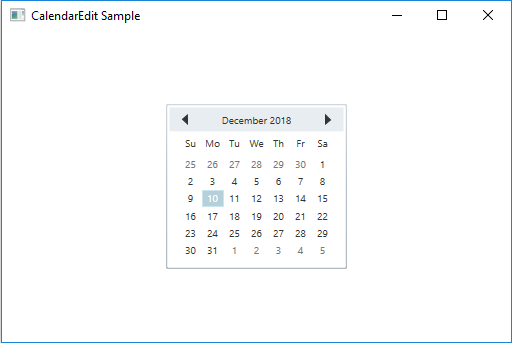

# Getting Started

## Assembly deployment

Refer to the [control dependencies](https://help.syncfusion.com/wpf/control-dependencies#calendaredit) section to get the list of assemblies or NuGet package that needs to be added as reference to use the control in any application.

You can find more details about installing the NuGet packages in a WPF application in the following link: 

[How to install nuget packages](https://help.syncfusion.com/wpf/nuget-packages)

## Creating a simple application with CalendarEdit

You can create a WPF application with CalendarEdit control using the following steps:

1.	[Create a project.](#creating-the-project)
2.	[Add control via designer.](#adding-control-via-designer)
3.	[Add control manually in XAML.](#adding-control-manually-in-xaml)
4.	[Add control manually in C#.](#adding-control-manually-in-c)
5.	[Select date.](#selecting-a-date)
6.	[Select multiple dates.](#selecting-multiple-dates)
7.	[Set the minimum and maximum dates.](#setting-the-minimum-and-maximum-dates)
8.	[Configure to show week number.](#configuring-to-show-week-number)

### Creating the project

Create a new WPF project in Visual Studio to display the CalendarEdit with functionalities.

## Adding control via designer

The CalendarEdit control can be added to an application by dragging it from the toolbox to a designer view. The required assembly references will be added automatically.

 
## Adding control manually in XAML

To add the control manually in XAML, follow the given steps:

1.	Add the following required assembly reference to the project: 
    * Syncfusion.Shared.WPF.
2.	Import Syncfusion WPF schema **http://schemas.syncfusion.com/wpf** in XAML page.
3.	Declare CalendarEdit control in XAML page.



<Window xmlns="http://schemas.microsoft.com/winfx/2006/xaml/presentation"
        xmlns:x="http://schemas.microsoft.com/winfx/2006/xaml"
        xmlns:syncfusion="http://schemas.syncfusion.com/wpf" 
        x:Class="CalendarEditSample.MainWindow"
        Title="CalendarEdit Sample" Height="350" Width="525">
    <Grid>
        <!-- CalendarEdit Control -->
        <syncfusion:CalendarEdit x:Name="calendarEdit"/>
    </Grid>
</Window>



## Adding control manually in C\#

To add control manually in C#, follow the given steps:

1.	Add the following required assembly reference to the project: 
    * Syncfusion.Shared.WPF 
2.	Import CalendarEdit namespace **using Syncfusion.Windows.Shared;**.
3.	Create a CalendarEdit instance, and add it to the window.



using Syncfusion.Windows.Shared;
namespace CalendarEditSample
{
    /// 
    /// Interaction logic for MainWindow.xaml
    /// 
    public partial class MainWindow : Window
    {
        public MainWindow()
        {
            InitializeComponent();
            //Creating an instance of CalendarEdit control
            CalendarEdit calendarEdit = new CalendarEdit();
            //Adding CalendarEdit as window content
            this.Content = calendarEdit;
        }
    }
}



## Selecting a date

You can select a date in the CalendarEdit control by enabling the [AllowSelection](https://help.syncfusion.com/cr/wpf/Syncfusion.Shared.Wpf~Syncfusion.Windows.Shared.CalendarEdit~AllowSelection.html) property. 



<!-- Selecting date -->
<syncfusion:CalendarEdit Name="calendarEdit" syncfusion:SkinStorage.VisualStyle="Metro" AllowSelection="True"/>


//Selecting date at run time
calendarEdit.AllowSelection = true;



## Selecting multiple dates

The CalendarEdit control allows you select multiple dates by setting the [AllowMultiplySelection](https://help.syncfusion.com/cr/wpf/Syncfusion.Shared.Wpf~Syncfusion.Windows.Shared.CalendarEdit~AllowMultiplySelection.html) property to true.



<!-- Selecting multiple dates-->
<syncfusion:CalendarEdit Name="calendarEdit" syncfusion:SkinStorage.VisualStyle="Metro" Width="250" Height="250" AllowMultiplySelection="True"/>


//Selecting multiple dates
calendarEdit.AllowMultiplySelection = true;



## Setting the minimum and maximum dates

You can set the minimum and maximum dates to the CalendarEdit control using the [MinDate](https://help.syncfusion.com/cr/wpf/Syncfusion.Shared.Wpf~Syncfusion.Windows.Shared.CalendarEdit~MinDate.html) and [MaxDate](https://help.syncfusion.com/cr/wpf/Syncfusion.Shared.Wpf~Syncfusion.Windows.Shared.CalendarEdit~MaxDate.html) properties.



<!--Setting minimum and maximum dates-->
<syncfusion:CalendarEdit Name="calendarEdit" syncfusion:SkinStorage.VisualStyle="Metro" Width="250" Height="250" MinDate="12/5/2018" MaxDate="12/28/2018"/>


//Setting minimum date value
calendarEdit.MinDate = new DateTime(2018, 12, 05);
//Setting maximum date value
calendarEdit.MaxDate = new DateTime(2018, 12, 28);



## Configuring to show week number

You can show the week numbers near the left margin by enabling the [ShowWeekNumbers](https://help.syncfusion.com/cr/wpf/Syncfusion.Shared.Wpf~Syncfusion.Windows.Shared.CalendarEdit~ShowWeekNumbers.html) property.



<!--Showing Week number-->
<syncfusion:CalendarEdit Name="calendarEdit" ShowWeekNumbers="True"/>


//Shows week numbers
calendarEdit.ShowWeekNumbers = true;



