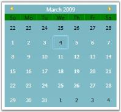

# Styles and Templates

This section deals with the following Styles and Templates supported by CalendarEdit control. 

## Day Cells Style

You can set the style of a day cell, using the DayCellsStyle property. 

To set this property, use the following code.



<Window x:Class="WpfApplication4.Window1"

  xmlns="http://schemas.microsoft.com/winfx/2006/xaml/presentation"

  xmlns:x="http://schemas.microsoft.com/winfx/2006/xaml"

  Title="Window1" Height="300" Width="300" xmlns:syncfusion="http://schemas.syncfusion.com/wpf">

      <Grid Margin="20">

      <Grid.Resources>

            <!-- day cell style -->

            

      </Grid.Resources>

      <!-- Adding calendar with day cell style -->

      <syncfusion:CalendarEdit Name="calendarEdit" DayCellsStyle="{StaticResource dayCell}"/>

    </Grid>

</Window>



## Day Name Cells Style

You can set the style of the day name cell, using the DayNameCellsStyle property. Use the following code example to set this property.



<Window x:Class="WpfApplication4.Window1"

  xmlns="http://schemas.microsoft.com/winfx/2006/xaml/presentation"

  xmlns:x="http://schemas.microsoft.com/winfx/2006/xaml"

  Title="Window1" Height="300" Width="300" xmlns:syncfusion="http://schemas.syncfusion.com/wpf">

    <Grid Margin="20">

      <Grid.Resources>

        <!-- setting style for DayNameCell -->

        

      </Grid.Resources>

      <!-- Adding calendar with day name cell style -->

      <syncfusion:CalendarEdit Name="calendarEdit" DayNameCellsStyle="{StaticResource dayCell}"/>

    </Grid>

</Window>



## Data Template for Day Cell

You can create a data template for the day cell, using the DayCellsDataTemplate property. This dependency property sets the day cell data template using the following code example.



<Window x:Class="WpfApplication4.Window1"

    xmlns="http://schemas.microsoft.com/winfx/2006/xaml/presentation"

    xmlns:x="http://schemas.microsoft.com/winfx/2006/xaml"

    Title="Window1" Height="300" Width="300" xmlns:syncfusion="http://schemas.syncfusion.com/wpf">

  <Grid Margin="20">

    <Grid.Resources>

      <!-- setting Data Template for DayCell -->

      <DataTemplate x:Key="dayCell" DataType="syncfusion:DayCell">

      <TextBlock

      TextBlock.FontFamily="Tahoma"

      TextBlock.FontStyle="Normal"

      TextBlock.FontSize="15"

      Text="{Binding Day}"/>

      </DataTemplate>

    </Grid.Resources>

    <!-- Adding calendar -->

    <syncfusion:CalendarEdit Name="calendarEdit" DayCellsDataTemplate="{StaticResource dayCell}"/>

  </Grid>

</Window>



## Data Template for Day Name Cell

You can create a data template for the day name cell, using the DayNameCellsDataTemplate property. This dependency property sets the day name cell data template using the following code example.



<Window x:Class="WpfApplication4.Window1"

  xmlns="http://schemas.microsoft.com/winfx/2006/xaml/presentation"

  xmlns:x="http://schemas.microsoft.com/winfx/2006/xaml"

  Title="Window1" Height="300" Width="300" xmlns:syncfusion="http://schemas.syncfusion.com/wpf">

    <Grid Margin="20">

      <Grid.Resources>

        <!-- setting Data Template for DayNameCell -->

        <DataTemplate x:Key="dayNameCells" DataType="syncfusion:DayNameCell">

        <TextBlock

        TextBlock.FontFamily="Tahoma"

        TextBlock.FontStyle="Normal"

        TextBlock.FontSize="15"

        Text="{Binding}"/>

        </DataTemplate>

      </Grid.Resources>

      <!-- Adding calendar -->

      <syncfusion:CalendarEdit Name="calendarEdit" DayNameCellsDataTemplate="{StaticResource dayNameCells}"/>

    </Grid>

</Window>



