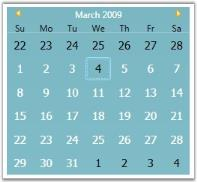
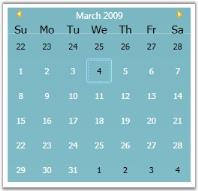
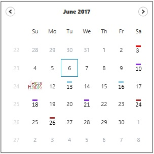

# Styles and Templates

This section deals with the following Styles and Templates supported by CalendarEdit control. 

## Day cells style

You can set the style of a day cell, using the DayCellsStyle property. 

To set this property, use the following code.




<Window x:Class="WpfApplication4.Window1"
xmlns="http://schemas.microsoft.com/winfx/2006/xaml/presentation"
xmlns:x="http://schemas.microsoft.com/winfx/2006/xaml"
Title="Window1" Height="300" Width="300" xmlns:syncfusion="http://schemas.syncfusion.com/wpf">
<Grid Margin="20">
<Grid.Resources>
<!-- day cell style -->

</Grid.Resources>
<!-- Adding calendar with day cell style -->
<syncfusion:CalendarEdit Name="calendarEdit" DayCellsStyle="{StaticResource dayCell}"/>
</Grid>
</Window>




## Day name cells style

You can set the style of the day name cell, using the DayNameCellsStyle property. Use the following code example to set this property.




<Window x:Class="WpfApplication4.Window1"
xmlns="http://schemas.microsoft.com/winfx/2006/xaml/presentation"
xmlns:x="http://schemas.microsoft.com/winfx/2006/xaml"
Title="Window1" Height="300" Width="300" xmlns:syncfusion="http://schemas.syncfusion.com/wpf">
<Grid Margin="20">
<Grid.Resources>
<!-- setting style for DayNameCell -->

</Grid.Resources>
<!-- Adding calendar with day name cell style -->
<syncfusion:CalendarEdit Name="calendarEdit" DayNameCellsStyle="{StaticResource dayCell}"/>
</Grid>
</Window>




## Data template for day cell

You can create a data template for the day cell, using the DayCellsDataTemplate property. This dependency property sets the day cell data template using the following code example.




<Window x:Class="WpfApplication4.Window1"
xmlns="http://schemas.microsoft.com/winfx/2006/xaml/presentation"
xmlns:x="http://schemas.microsoft.com/winfx/2006/xaml"
Title="Window1" Height="300" Width="300" xmlns:syncfusion="http://schemas.syncfusion.com/wpf">
<Grid Margin="20">
<Grid.Resources>
<!-- setting Data Template for DayCell -->
<DataTemplate x:Key="dayCell" DataType="syncfusion:DayCell">
<TextBlock
TextBlock.FontFamily="Tahoma"
TextBlock.FontStyle="Normal"
TextBlock.FontSize="15"
Text="{Binding Day}"/>
</DataTemplate>
</Grid.Resources>
<!-- Adding calendar -->
<syncfusion:CalendarEdit Name="calendarEdit" DayCellsDataTemplate="{StaticResource dayCell}"/>
</Grid>
</Window>




## Data template for day name cell

You can create a data template for the day name cell, using the DayNameCellsDataTemplate property. This dependency property sets the day name cell data template using the following code example.




<Window x:Class="WpfApplication4.Window1"
xmlns="http://schemas.microsoft.com/winfx/2006/xaml/presentation"
xmlns:x="http://schemas.microsoft.com/winfx/2006/xaml"
Title="Window1" Height="300" Width="300" xmlns:syncfusion="http://schemas.syncfusion.com/wpf">
<Grid Margin="20">
<Grid.Resources>
<!-- setting Data Template for DayNameCell -->
<DataTemplate x:Key="dayNameCells" DataType="syncfusion:DayNameCell">
<TextBlock
TextBlock.FontFamily="Tahoma"
TextBlock.FontStyle="Normal"
TextBlock.FontSize="15"
Text="{Binding}"/>
</DataTemplate>
</Grid.Resources>
<!-- Adding calendar -->
<syncfusion:CalendarEdit Name="calendarEdit" DayNameCellsDataTemplate="{StaticResource dayNameCells}"/>
</Grid>
</Window>




**Support to Customize the Particular day range in CalendarEdit control**

CalendarEdit control provides the support to customize the particular day range. The support includes some of the following useful method such as follows

<table>
<tr>
<th>
API Name</th>
<th>
Description</th></tr>
<tr>
<td>
SpecialDatesCollection</td><td>
This Class helps to hold the Special Dates collection.</td></tr>
<tr>
<td>
SpecialDate</td>
<td>
This class helps to hold Special Date, to be customized.     
</td></tr>
<tr>
<td>
Date   
</td><td>
This property holds to DateTime variable.</td></tr>
<tr>
<td>
CellTemplate   
</td><td>
This property holds the Template customization.    
</td></tr>
<tr>
<td>
SpecialDates   
</td><td>
This property helps to hold the Special Dates collection, which can be customized.     
</td></tr>
</table>

**Code Sample**





<syncfusion:CalendarEdit Grid.RowSpan="3" x:Name="calendar"
Grid.ColumnSpan="3" ShowWeekNumbers="True"
AllowMultiplySelection="True" Height="300" Width="300"
AllowSelection="True" SpecialDates="{Binding specialDays,Mode=TwoWay}"
SelectedDates="{Binding Dates,Mode=TwoWay}"
/>





**Code explains how to create the collection of Special Dates in code behind**





//Define the SpecialDatesCollection property
public SpecialDatesCollection specialDays
{
    get {return GetValue<SpecialDatesCollection>(SpecialDaysProperty);} 
    set (SetValue(SpecialDaysProperty, value); }
}

//code used to add the collection in SpecialDays
specialDays.Add(new SpecialDate() { Date = new DateTime(2017, 05, 03), CellTemplate = Application.Current.TryFindResource("Daycell1") as DataTemplate });
specialDays.Add(new SpecialDate() { Date = new DateTime(2017, 05, 13), CellTemplate = Application.Current.TryFindResource("Daycell12") as DataTemplate });
specialDays.Add(new SpecialDate() { Date = new DateTime(2017, 05, 18), CellTemplate = Application.Current.TryFindResource("Daycell13") as DataTemplate });
specialDays.Add(new SpecialDate() { Date = new DateTime(2017, 05, 24), CellTemplate = Application.Current.TryFindResource("Daycell14") as DataTemplate });
specialDays.Add(new SpecialDate() { Date = new DateTime(2017, 05, 26), CellTemplate = Application.Current.TryFindResource("Daycell12") as DataTemplate });
specialDays.Add(new SpecialDate() { Date = new DateTime(2017, 05, 16), CellTemplate = Application.Current.TryFindResource("Daycell11") as DataTemplate });
specialDays.Add(new SpecialDate() { Date = new DateTime(2017, 05, 10), CellTemplate = Application.Current.TryFindResource("Daycell13") as DataTemplate });





'Define the SpecialDatesCollection property
Public Property specialDays() As SpecialDatesCollection
Get 
Return GetValue<SpecialDatesCollection>(SpecialDaysProperty)
End Get
Set (ByVal Value As SpecialDatesCollection) 
End Set
End Property

'code used to add the collection in SpecialDays
Private Function SpecialDate() As specialDays.Add(Shadows
	 Date = New DateTime(2017, 05, 03), CellTemplate = Application.Current.TryFindResource("Daycell1") as DataTemplate
End Function
)
Private Function SpecialDate() As specialDays.Add(Shadows
	 Date = New DateTime(2017, 05, 13), CellTemplate = Application.Current.TryFindResource("Daycell12") as DataTemplate
End Function
)
Private Function SpecialDate() As specialDays.Add(Shadows
	 Date = New DateTime(2017, 05, 18), CellTemplate = Application.Current.TryFindResource("Daycell13") as DataTemplate
End Function
)
Private Function SpecialDate() As specialDays.Add(Shadows
	 Date = New DateTime(2017, 05, 24), CellTemplate = Application.Current.TryFindResource("Daycell14") as DataTemplate
End Function
)
Private Function SpecialDate() As specialDays.Add(Shadows
	 Date = New DateTime(2017, 05, 26), CellTemplate = Application.Current.TryFindResource("Daycell12") as DataTemplate
End Function
)
Private Function SpecialDate() As specialDays.Add(Shadows
	 Date = New DateTime(2017, 05, 16), CellTemplate = Application.Current.TryFindResource("Daycell11") as DataTemplate
End Function
)
Private Function SpecialDate() As specialDays.Add(Shadows
	 Date = New DateTime(2017, 05, 10), CellTemplate = Application.Current.TryFindResource("Daycell13") as DataTemplate
End Function
)





 <!--Code used to set the different DataTemplate to customize the particular day-->

<DataTemplate x:Key="Daycell" >
            <Image Source="holiday.jpeg" />
        </DataTemplate>
        <DataTemplate x:Key="Daycell1" >
            <!--<Border Background="Red" BorderThickness="3" BorderBrush="Yellow">-->
            <StackPanel>
                <Rectangle Fill="Red" Height="3" Width="10"/>
                <TextBlock
      TextBlock.FontFamily="Calibri"
      TextBlock.FontWeight="Normal"
      TextBlock.Foreground="Black"
      TextBlock.FontStyle="Normal"
      TextBlock.FontSize="12"
      Text="{Binding Day}"/>
            </StackPanel>
            <!--</Border>-->
        </DataTemplate>
        <DataTemplate x:Key="Daycell11" >
            <!--<Border Background="Red" BorderThickness="3" BorderBrush="Yellow">-->
            <StackPanel>
                <Rectangle Fill="Red" Height="3" Width="10"/>
                <TextBlock
      TextBlock.FontFamily="Calibri"
      TextBlock.FontWeight="Normal"
      TextBlock.Foreground="Black"
      TextBlock.FontStyle="Normal"
      TextBlock.FontSize="12"
      Text="{Binding Day}"/>
            </StackPanel>
            <!--</Border>-->
        </DataTemplate>
        <DataTemplate x:Key="Daycell12" >
            <!--<Border Background="Red" BorderThickness="3" BorderBrush="Yellow">-->
            <StackPanel>
                <Rectangle Fill="SkyBlue" Height="3" Width="10"/>
                <TextBlock
      TextBlock.FontFamily="Calibri"
      TextBlock.FontWeight="Normal"
      TextBlock.Foreground="Black"
      TextBlock.FontStyle="Normal"
      TextBlock.FontSize="12"
      Text="{Binding Day}"/>
            </StackPanel>
            <!--</Border>-->
        </DataTemplate>
        <DataTemplate x:Key="Daycell13" >
            <!--<Border Background="Red" BorderThickness="3" BorderBrush="Yellow">-->
            <StackPanel>
                <Rectangle Fill="BlueViolet" Height="3" Width="10"/>
                <TextBlock
      TextBlock.FontFamily="Calibri"
      TextBlock.FontWeight="Normal"
      TextBlock.Foreground="Black"
      TextBlock.FontStyle="Normal"
      TextBlock.FontSize="12"
      Text="{Binding Day}"/>
            </StackPanel>
            <!--</Border>-->
        </DataTemplate>
        <DataTemplate x:Key="Daycell14" >
            <!--<Border Background="Red" BorderThickness="3" BorderBrush="Yellow">-->
            <StackPanel>
                <Rectangle Fill="Brown" Height="3" Width="10"/>
                <TextBlock
      TextBlock.FontFamily="Calibri"
      TextBlock.FontWeight="Normal"
      TextBlock.Foreground="Black"
      TextBlock.FontStyle="Normal"
      TextBlock.FontSize="12"
      Text="{Binding Day}"/>
            </StackPanel>
            <!--</Border>-->
        </DataTemplate>





**Output:**

