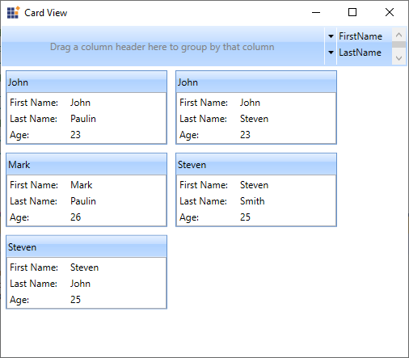
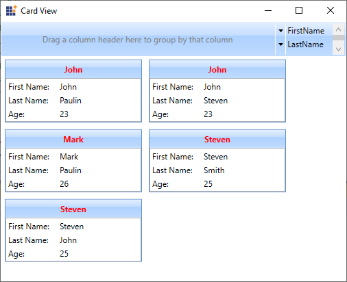
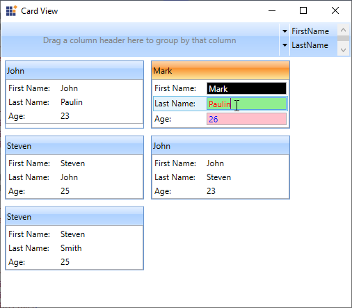
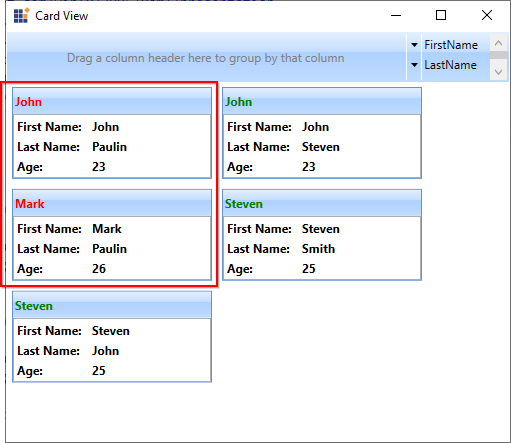
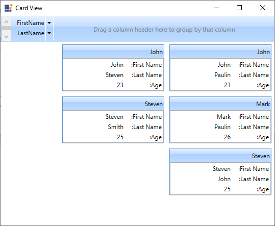

# Data Binding and Customization in WPF CardView

This section describes the data binding support and control customization supports available in the [CardView](https://help.syncfusion.com/cr/wpf/Syncfusion.Windows.Tools.Controls.CardView.html) control.

## Data binding to objects

The `CardView` control can bound to an external source to auto create [CardViewItem](https://help.syncfusion.com/cr/wpf/Syncfusion.Windows.Tools.Controls.CardViewItem.html) and display the data using `ItemsSource` property. When you are auto generating the `CardViewItem` using `ItemsSource`, you need to use [HeaderTemplate](https://help.syncfusion.com/cr/wpf/Syncfusion.Windows.Tools.Controls.CardView.html#Syncfusion_Windows_Tools_Controls_CardView_HeaderTemplate) or `ItemContainerStyle` to define header and use the `ItemTemplate` or  `ItemContainerStyle` to display the content of the `CardViewItem` item.

N> You can use the grouping, sorting, filtering and editing functionalities only by populating the card items through the `ItemsSource` property.




//Model.cs
public class CardViewModel
{
    public string FirstName { get; set; }
    public string LastName { get; set; }
    public int Age { get; set; }
}

//ViewModel.cs
public class ViewModel : NotificationObject
{
    private ObservableCollection<CardViewModel> cardViewItems;
    public ObservableCollection<CardViewModel> CardViewItems
    {
        get { return cardViewItems; }
        set { cardViewItems = value;
            this.RaisePropertyChanged(nameof(CardViewItems)); }
    }
    public ViewModel()
    {
        CardViewItems = new ObservableCollection<CardViewModel>();
        populateItems();
    }
    private void populateItems()
    {
        CardViewItems.Add(new CardViewModel() { FirstName = "John", LastName= "Paulin", Age = 23});
        CardViewItems.Add(new CardViewModel() { FirstName = "Mark", LastName = "Paulin",Age = 26 });
        CardViewItems.Add(new CardViewModel() { FirstName = "Steven", LastName = "John", Age = 25 });
        CardViewItems.Add(new CardViewModel() { FirstName = "John", LastName = "Steven", Age = 23 });
        CardViewItems.Add(new CardViewModel() { FirstName = "Steven", LastName = "Smith", Age = 25 });
    }
}







<syncfusion:CardView ItemsSource="{Binding CardViewItems}"
					 Name="cardView">
    <syncfusion:CardView.HeaderTemplate>
        <DataTemplate>
            <TextBlock Text="{Binding FirstName}"/>
        </DataTemplate>
    </syncfusion:CardView.HeaderTemplate>
    <syncfusion:CardView.ItemTemplate>
        <DataTemplate >
            <ListBox ScrollViewer.HorizontalScrollBarVisibility="Disabled">
                <ListBoxItem Padding="1">
                    <Grid>
                        <Grid.ColumnDefinitions>
                            <ColumnDefinition Width="75" />
                            <ColumnDefinition />
                        </Grid.ColumnDefinitions>
                        <TextBlock Text="First Name:" />
                        <TextBlock Grid.Column="1"
                                   Text="{Binding FirstName,
                                          UpdateSourceTrigger=PropertyChanged}" />
                    </Grid>
                </ListBoxItem>
                <ListBoxItem Padding="1">
                    <Grid>
                        <Grid.ColumnDefinitions>
                            <ColumnDefinition Width="75" />
                            <ColumnDefinition Width="*" />
                        </Grid.ColumnDefinitions>
                        <TextBlock Text="Last Name:" />
                        <TextBlock Grid.Column="1" 
                                   Text="{Binding LastName, 
                                          UpdateSourceTrigger=PropertyChanged}" />
                    </Grid>
                </ListBoxItem>
                <ListBoxItem Padding="1">
                    <Grid>
                        <Grid.ColumnDefinitions>
                            <ColumnDefinition Width="75" />
                            <ColumnDefinition Width="*" />
                        </Grid.ColumnDefinitions>
                        <TextBlock Text="Age:" />
                        <TextBlock Grid.Column="1"
                                   Text="{Binding Age,
                                          UpdateSourceTrigger=PropertyChanged}" />
                    </Grid>
                </ListBoxItem>
            </ListBox>
        </DataTemplate>
    </syncfusion:CardView.ItemTemplate>        
</syncfusion:CardView>




N> [View Sample in GitHub](https://github.com/SyncfusionExamples/syncfusion-wpf-card-view-examples/blob/master/Samples/Editing)

## Custom UI for CardViewItem header

You can change the appearance of card item's header by using the [HeaderTemplate](https://help.syncfusion.com/cr/wpf/Syncfusion.Windows.Tools.Controls.CardView.html#Syncfusion_Windows_Tools_Controls_CardView_HeaderTemplate) property. The `DataContext` of the `HeaderTemplate` property is `CardViewItem`.




<syncfusion:CardView ItemsSource="{Binding CardViewItems}"
                	 Name="cardView">
    <syncfusion:CardView.HeaderTemplate>
        <DataTemplate>
            <TextBlock
                Text="{Binding FirstName}"
                TextAlignment="Center"
                FontWeight="Bold"
                Foreground="Red"/>
        </DataTemplate>
    </syncfusion:CardView.HeaderTemplate>
</syncfusion:CardView>                     




N> [View Sample in GitHub](https://github.com/SyncfusionExamples/syncfusion-wpf-card-view-examples/blob/master/Samples/CustomUI)

## Custom UI for CardViewItem content

You can change the appearance of card item's content by using the `ItemTemplate` property. The `DataContext` of the `ItemTemplate` property is `CardViewItem`.




<syncfusion:CardView ItemsSource="{Binding CardViewItems}"
                	 Name="cardView">
    <syncfusion:CardView.ItemTemplate>
        <DataTemplate >
            <ListBox ScrollViewer.HorizontalScrollBarVisibility="Disabled">
                <ListBoxItem Padding="1">
                    <Grid>
                        <Grid.ColumnDefinitions>
                            <ColumnDefinition Width="75" />
                            <ColumnDefinition />
                        </Grid.ColumnDefinitions>
                        <TextBlock Text="First Name:" />
                        <TextBlock Grid.Column="1"
                                   Foreground="YellowGreen"
                                   Text="{Binding FirstName,
                                          UpdateSourceTrigger=PropertyChanged}" />
                    </Grid>
                </ListBoxItem>
                <ListBoxItem Padding="1">
                    <Grid>
                        <Grid.ColumnDefinitions>
                            <ColumnDefinition Width="75" />
                            <ColumnDefinition Width="*" />
                        </Grid.ColumnDefinitions>
                        <TextBlock Text="Last Name:" />
                        <TextBlock Grid.Column="1"
                                   Foreground="Red"
                                   Text="{Binding LastName, 
                                          UpdateSourceTrigger=PropertyChanged}" />
                    </Grid>
                </ListBoxItem>
                <ListBoxItem Padding="1">
                    <Grid>
                        <Grid.ColumnDefinitions>
                            <ColumnDefinition Width="75" />
                            <ColumnDefinition Width="*" />
                        </Grid.ColumnDefinitions>
                        <TextBlock Text="Age:" />
                        <TextBlock Grid.Column="1"
                                   Foreground="Blue"
                                   Text="{Binding Age,
                                          UpdateSourceTrigger=PropertyChanged}" />
                    </Grid>
                </ListBoxItem>
            </ListBox>
        </DataTemplate>
    </syncfusion:CardView.ItemTemplate>
</syncfusion:CardView>                     




N> [View Sample in GitHub](https://github.com/SyncfusionExamples/syncfusion-wpf-card-view-examples/blob/master/Samples/CustomUI)

## Custom UI for edit mode CardViewItem

You can change the appearance of card items in edit mode by using `EditItemTemplate` property. The `DataContext` of `EditItemTemplate` property is `CardViewItem`.




<syncfusion:CardView CanEdit="True"
                     ItemsSource="{Binding CardViewItems}" Name="cardView">
    <syncfusion:CardView.EditItemTemplate>
        <DataTemplate>
            <ListBox ScrollViewer.HorizontalScrollBarVisibility="Disabled">
                <ListBoxItem Padding="1" HorizontalContentAlignment="Stretch">
                    <Grid>
                        <Grid.ColumnDefinitions>
                            <ColumnDefinition Width="75" />
                            <ColumnDefinition />
                        </Grid.ColumnDefinitions>
                        <TextBlock Text="First Name:" />
                        <TextBox
                            Background="Black"
                            Foreground="White"
                            Grid.Column="1"
                            Text="{Binding FirstName, 
                                   UpdateSourceTrigger=PropertyChanged}" />
                    </Grid>
                </ListBoxItem>
                <ListBoxItem Padding="1" HorizontalContentAlignment="Stretch">
                    <Grid>
                        <Grid.ColumnDefinitions>
                            <ColumnDefinition Width="75" />
                            <ColumnDefinition Width="*" />
                        </Grid.ColumnDefinitions>
                        <TextBlock Text="Last Name:" />
                        <TextBox 
                            Background="LightGreen"
                            Foreground="Red"
                            Grid.Column="1" 
                            Text="{Binding LastName, 
                                   UpdateSourceTrigger=PropertyChanged}" />
                    </Grid>
                </ListBoxItem>
                <ListBoxItem Padding="1" HorizontalContentAlignment="Stretch">
                    <Grid>
                        <Grid.ColumnDefinitions>
                            <ColumnDefinition Width="75" />
                            <ColumnDefinition Width="*" />
                        </Grid.ColumnDefinitions>
                        <TextBlock Text="Age:" />
                        <TextBox 
                            Background="Pink"
                            Foreground="Blue"
                            Grid.Column="1" 
                            Text="{Binding Age, 
                                   UpdateSourceTrigger=PropertyChanged}" />
                    </Grid>
                </ListBoxItem>
            </ListBox>
        </DataTemplate>
    </syncfusion:CardView.EditItemTemplate>
</syncfusion:CardView>




cardView.CanEdit = true;




N> [View Sample in GitHub](https://github.com/SyncfusionExamples/syncfusion-wpf-card-view-examples/blob/master/Samples/CustomUI)

## Different UI styles for specific CardViewItem

You can change the UI style of specific card item based on the field values or any other logics by using the `ItemContainerStyleSelector` property.




public class CardViewItemContainerStyleSelector : StyleSelector
{
    public Style Style1 { get; set; }
    public Style Style2 { get; set; }
    public override Style SelectStyle(object item, DependencyObject container) {
        string LastName = (item as CardViewModel).LastName;
        if (LastName == "Paulin") {
            return Style1;
        }
        else {
            return Style2;
        }
    }
}







<Window.Resources>
    <local:ViewModel x:Key="viewModel"/>
    
    
    <local:CardViewItemContainerStyleSelector x:Key="cardViewItemContainerStyleSelector"
                                              Style1="{StaticResource style1}"
                                              Style2="{StaticResource style2}"/>
</Window.Resources>
<Grid Margin="1">
    <syncfusion:CardView ItemContainerStyleSelector="{StaticResource cardViewItemContainerStyleSelector}"
                         ItemsSource="{Binding CardViewItems}" 
                         DataContext="{StaticResource viewModel}"
                         Name="cardView">
        <syncfusion:CardView.ItemTemplate>
            <DataTemplate >
                <ListBox ScrollViewer.HorizontalScrollBarVisibility="Disabled">
                    <ListBoxItem Padding="1">
                        <Grid>
                            <Grid.ColumnDefinitions>
                                <ColumnDefinition Width="75" />
                                <ColumnDefinition />
                            </Grid.ColumnDefinitions>
                            <TextBlock Text="First Name:" />
                            <TextBlock Grid.Column="1"
                                       Text="{Binding FirstName,
                                              UpdateSourceTrigger=PropertyChanged}" />
                        </Grid>
                    </ListBoxItem>
                    <ListBoxItem Padding="1">
                        <Grid>
                            <Grid.ColumnDefinitions>
                                <ColumnDefinition Width="75" />
                                <ColumnDefinition Width="*" />
                            </Grid.ColumnDefinitions>
                            <TextBlock Text="Last Name:" />
                            <TextBlock Grid.Column="1" 
                                       Text="{Binding LastName, 
                                              UpdateSourceTrigger=PropertyChanged}" />
                        </Grid>
                    </ListBoxItem>
                    <ListBoxItem Padding="1">
                        <Grid>
                            <Grid.ColumnDefinitions>
                                <ColumnDefinition Width="75" />
                                <ColumnDefinition Width="*" />
                            </Grid.ColumnDefinitions>
                            <TextBlock Text="Age:" />
                            <TextBlock Grid.Column="1"
                                       Text="{Binding Age,
                                              UpdateSourceTrigger=PropertyChanged}" />
                        </Grid>
                    </ListBoxItem>
                </ListBox>
            </DataTemplate>
        </syncfusion:CardView.ItemTemplate>
    </syncfusion:CardView>
</Grid>




Here, the different style are applied to the card items based on the `LastName` field.

N> [View Sample in GitHub](https://github.com/SyncfusionExamples/syncfusion-wpf-card-view-examples/blob/master/Samples/Specific-CustomUI)

## Change flow direction

You can change the flow direction of the `CardView` control layout from right to left by setting the `FlowDirection` property value as `RightToLeft`. The default value of `FlowDirection` property is `LeftToRight`.




<syncfusion:CardView FlowDirection="RightToLeft"
                     ItemsSource="{Binding CardViewItems}"
                	 Name="cardView"/>




cardView.FlowDirection = FlowDirection.RightToLeft;




N> [View Sample in GitHub](https://github.com/SyncfusionExamples/syncfusion-wpf-card-view-examples/blob/master/Samples/Editing)

## Theme

You can customize the appearance of the `CardView` control by using the [SfSkinManager.SetVisualStyle](https://help.syncfusion.com/cr/wpf/Syncfusion.SfSkinmanager.SfSkinmanager.html#Syncfusion_SfSkinManager_SfSkinManager_SetVisualStyle_System_Windows_DependencyObject_Syncfusion_SfSkinManager_VisualStyles_) method. The following are the various built-in visual styles for `CardView` control.

* Blend
* Lime
* MaterialDark
* MaterialDarkBlue
* MaterialLight
* MaterialLightBlue
* Metro
* Office2010Black
* Office2010Blue
* Office2010Silver
* Office2013DarkGray
* Office2013LightGray
* Office2013White
* Office2016Colorful
* Office2016DarkGray
* Office2016White
* Office2019Black
* Office2019Colorful
* Office365
* Saffron
* VisualStudio2013
* VisualStudio2015




<Window
    xmlns:syncfusionskin ="clr-namespace:Syncfusion.SfSkinManager;assembly=Syncfusion.SfSkinManager.WPF">
    <Grid>
        <syncfusion:CardView ItemsSource="{Binding CardViewItems}"
                	         Name="cardView"/>          
     </Grid>
</Window>




//Namespace for the SfSkinManager.
using Syncfusion.SfSkinManager;

SfSkinManager.SetVisualStyle(cardView, VisualStyles.Blend);




Here, the `Blend` style is applied to the `CardView` control.

N> [View Sample in GitHub](https://github.com/SyncfusionExamples/syncfusion-wpf-card-view-examples/blob/master/Samples/Themes)
