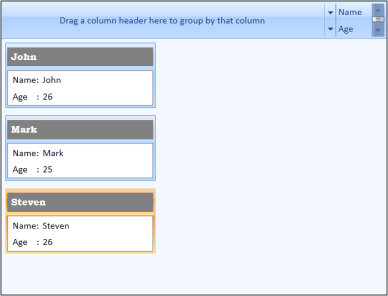

# Customizing Data Templates

Data templates can be customized for items and headers. This section explains how to customize the data templates.

## Item Template 

You can customize how a business object is displayed using ItemTemplate of CardViewItem. The following example shows the usage of ItemTemplate.



  <syncfusion:CardView ItemsSource="{Binding Contacts}" >

                <syncfusion:CardView.ItemTemplate>

                    <DataTemplate >

                        <ListBox ScrollViewer.HorizontalScrollBarVisibility="Disabled">

                            <ListBoxItem>

                                <StackPanel Orientation="Horizontal">

                                    <TextBlock Text="Name:"/>

                                    <TextBlock Text="{Binding Name}" Margin="5,0,0,0"/>

                                </StackPanel>

                            </ListBoxItem>

                            <ListBoxItem>

                                <StackPanel Orientation="Horizontal">

                                    <TextBlock Text="Age    :"/>

                                    <TextBlock Text="{Binding Age}" Margin="5,0,0,0"/>

                                </StackPanel>

                            </ListBoxItem>

                        </ListBox>

                    </DataTemplate>

                </syncfusion:CardView.ItemTemplate>

            </syncfusion:CardView>



Implementing the above code generates the following output.

## Header Template 

You can also customize header of the CardViewItem using a header template. This is illustrated in the following example.

1. Define a data template for the header as follows.

		  <DataTemplate x:Key="headerTemplate">

					<Grid>

						<Border Background="Gray">

						<TextBlock Text="{Binding Path=Name}" Margin="5" Foreground="White" VerticalAlignment="Center" FontWeight="Bold" FontFamily="Bookman Old Style" Grid.Column="1"/>

						</Border>

					</Grid>

		  </DataTemplate>

2. Set the HeaderTemplate for the CardViewItem to the above template.

			<syncfusion:CardView ItemsSource="{Binding Contacts}" 

											 ItemTemplate="{StaticResource contactTemplate}" 

											 HeaderTemplate="{StaticResource headerTemplate}"

											/>

   This generates the following CardView control.

   

   {:.prettyprint}

## EditItem Template

You can edit the values loaded in CardViewItem using EditItemTemplate. This is illustrated in the following example.

1. Define a data template for the content as follows.

		   <DataTemplate x:Key="contactEditTemplate">

					<ListBox ScrollViewer.HorizontalScrollBarVisibility="Disabled" SelectedIndex="0" ToolTip="{Binding Path=Validation.HasError, ElementName=txt}">

						<ListBoxItem HorizontalContentAlignment="Stretch" Padding="1">

							<Grid >

								<Grid.ColumnDefinitions>

									<ColumnDefinition Width="75"/>

									<ColumnDefinition />

								</Grid.ColumnDefinitions>

								<TextBlock Text="Name:"/>

								<TextBox Grid.Column="1"   x:Name="txt" HorizontalAlignment="Stretch" Text="{Binding Name, UpdateSourceTrigger=PropertyChanged, ValidatesOnDataErrors=True}" />

							</Grid>

						</ListBoxItem>

						<ListBoxItem HorizontalContentAlignment="Stretch" Padding="1">

							<Grid >

								<Grid.ColumnDefinitions>

									<ColumnDefinition Width="75"/>

									<ColumnDefinition Width="*"/>

								</Grid.ColumnDefinitions>

								<TextBlock Text="Age:"/>

								<TextBox  Grid.Column="1"  Text="{Binding Age, UpdateSourceTrigger=PropertyChanged, ValidatesOnDataErrors=True}" />

							</Grid>

						</ListBoxItem>

					</ListBox>

				</DataTemplate>

2. Set EditItemTemplate for the CardView to the above template.

			<syncfusion:CardView ItemsSource="{Binding Contacts}" CanEdit="True" 

											 ItemTemplate="{StaticResource contactTemplate}" 

											 EditItemTemplate="{StaticResource contactEditTemplate}"

											 HeaderTemplate="{StaticResource headerTemplate}"

											/>

   Implementing the above codes generate the following CardView control. 

   

   N> You can edit the values in the CardView control by double-clicking the CardViewItem.

   {:.prettyprint}

