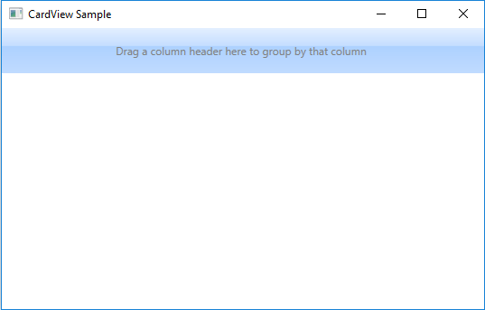
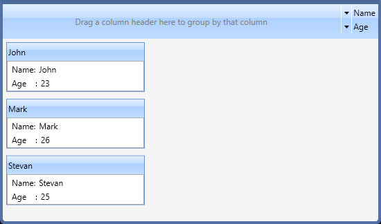

# Getting started

## Assembly deployment

Refer to the [control dependencies](https://help.syncfusion.com/wpf/control-dependencies#cardview) section to get the list of assemblies or NuGet package that needs to be added as reference to use the control in any application.

You can find more details about installing the NuGet package in a WPF application in the following link: 

[How to install nuget packages](https://help.syncfusion.com/wpf/nuget-packages)

## Creating a simple application with CardView

You can create a WPF application with CardView control using the following steps:

1.	[Create a project.](#creating-a-project)
2.	[Add control via designer.](#adding-control-via-designer)
3.	[Add control manually in XAML.](#adding-control-manually-in-xaml)
4.	[Add control manually in C#.](#adding-control-manually-in-c)
5.	[Add items using CardViewItem.](#adding-items-using-cardviewitem)
6.	[Bind to data.](#binding-to-data)
7.	[Group the cards.](#grouping)
8.	[Sort the cards.](#sorting)
9.	[Edit the fields.](#editing)

### Creating a project

Create a new WPF project in Visual Studio to display the CardView with functionalities.

## Adding control via designer

The CardView control can be added to an application by dragging it from the toolbox to a designer view. The required assembly references will be added automatically.

## Adding control manually in XAML

To add control manually in XAML, follow the given steps:

1.	Add the following required assembly reference to the project:
	* Syncfusion.Tools.WPF
	* Syncfusion.Shared.WPF 
2.	Import Syncfusion WPF schema **http://schemas.syncfusion.com/wpf** in XAML page.
3.	Declare the CardView control in XAML page.



<Window xmlns="http://schemas.microsoft.com/winfx/2006/xaml/presentation"
        xmlns:x="http://schemas.microsoft.com/winfx/2006/xaml"
        xmlns:syncfusion="http://schemas.syncfusion.com/wpf" 
        x:Class=" CardViewSample.MainWindow"
        Title="CardView Sample" Height="350" Width="525">
    <Grid>
		<!-- CardView Control -->
		<syncfusion: CardView x:Name="cardView"/>
    </Grid>
</Window>



## Adding control manually in C#

To add control manually in C#, follow the given steps:

1.	Add the following required assembly references to the project:
	* Syncfusion.Tools.WPF
	* Syncfusion.Shared.WPF
2.	Import the CardView namespace **using Syncfusion.Windows.Tools.Controls;**.
3.	Create a CardView instance, and add it to the window.



using Syncfusion.Windows.Tools.Controls; 
namespace CardViewSample
{
    /// 
    /// Interaction logic for MainWindow.xaml
    /// 
    public partial class MainWindow : Window
    {
        public MainWindow()
        {
            InitializeComponent();
            //Creating an instance of CardView control
            CardView cardView = new CardView ();
            //Adding CardView as window content
            this.Content = cardView;
        }
    }
}



## Adding Items using CardViewItem

You can add the items inside the CardView control using CardViewItem.



<syncfusion:CardView >
    <syncfusion:CardViewItem Header="Item1" >
		<TextBlock Text="Name:"/>
     </syncfusion:CardViewItem>
</syncfusion:CardView>


CardView cardView = new CardView();
CardViewItem cardViewItem1 = new CardViewItem();
cardViewItem1.Header = "Item1";
TextBlock tBlock = new TextBlock() { Text = "Name:" };
cardViewItem1.Content = tBlock;
cardView.Items.Add(cardViewItem1);
this.Content = cardView;



## Binding to data

You can bind to a business object collection using the ItemsSource and ItemTemplate properties of the CardView control. Refer to the [Data binding](https://help.syncfusion.com/wpf/cardview/data-binding-to-objects) section for more details.

* **Model.cs**



public class CardViewModel	
{
	public string Name
	{
		get;
		set;
	}
	public int Age
	{
		get;
		set;
	}
}



* **ViewModel.cs**



public class ViewModel
{
	private ObservableCollection<CardViewModel> cardViewItems;
	public ObservableCollection<CardViewModel> CardViewItems
	{
		get { return cardViewItems; }
		set { cardViewItems = value; this.RaisePropertyChanged("CardViewItems"); }
	}
	public ViewModel()
	{
		CardViewItems = new ObservableCollection<CardViewModel>();
		populateItems();
	}
	private void populateItems()
	{
		CardViewItems.Add(new CardViewModel() { Name = "John", Age = 23 });
		CardViewItems.Add(new CardViewModel() { Name = "Mark", Age = 26 });
		CardViewItems.Add(new CardViewModel() { Name = "Steven", Age = 25 });
	}
}



* **MainWindow.Xaml**



<Window.DataContext>
    <local:ViewModel/>
</Window.DataContext>

<syncfusion:CardView ItemsSource="{Binding CardViewItems}" >
	<syncfusion:CardView.ItemTemplate>
		<DataTemplate >
			<ListBox ScrollViewer.HorizontalScrollBarVisibility="Disabled">
				<ListBoxItem>
					<StackPanel Orientation="Horizontal">
						<TextBlock Text="Name:"/>
						<TextBlock Text="{Binding Name}" Margin="5,0,0,0"/>
					</StackPanel>
				</ListBoxItem>
				<ListBoxItem>
					<StackPanel Orientation="Horizontal">
						<TextBlock Text="Age:"/>
						<TextBlock Text="{Binding Age}" Margin="5,0,0,0"/>
					</StackPanel>
				</ListBoxItem>
			</ListBox>
		</DataTemplate>
	</syncfusion:CardView.ItemTemplate>
	<syncfusion:CardView.HeaderTemplate>
		<DataTemplate>
			<TextBlock Text="{Binding Name}"/>
		</DataTemplate>
	</syncfusion:CardView.HeaderTemplate>
</syncfusion:CardView>



## Grouping

You can group the cards inside the CardView control by enabling the [CanGroup](https://help.syncfusion.com/cr/wpf/Syncfusion.Tools.Wpf~Syncfusion.Windows.Tools.Controls.CardView~CanGroup.html) property.



<!--Gropuing cards -->
<syncfusion:CardView CanGroup="True "/>


//For grouping cards
cardview.CanGroup =true;



## Sorting

You can sort the cards inside the CardView control by enabling the [CanSort](https://help.syncfusion.com/cr/wpf/Syncfusion.Tools.Wpf~Syncfusion.Windows.Tools.Controls.CardView~CanSort.html) property.



<!--Sorting cards-->
<syncfusion:CardView CanSort="True "/>


//For sorting cards
cardview.CanSort =true;



## Editing

You can edit the fields available in the cards by enabling [CanEdit](https://help.syncfusion.com/cr/wpf/Syncfusion.Tools.Wpf~Syncfusion.Windows.Tools.Controls.CardView~CanEdit.html) property of CardView control.



<!--Editing cards field -->
<syncfusion:CardView CanEdit="True"/>


//For editing cards field
cardview.CanEdit = true;



