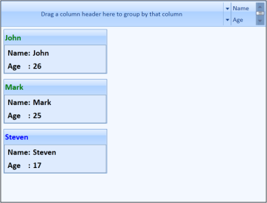

# Styling

Styling can be applied to the CardView control and its items. 

## Visual Styles

The CardView control has the following built-in styles:

1. Office2007Blue
2. Office2007Black
3. Office2007Silver
4. Office2010Blue
5. Office2010Black
6. Office2010Silver
7. Blend
8. Metro
9. Transparent

These visual styles can be applied to the CardView control through XAML. The following example illustrates how to apply Office2007Blue style to the CardView control.

 

<syncfusion:CardView         syncfusion:SkinStorage.VisualStyle="Office2010Blue"        />    



These styles can also be applied to the CardView control through C#. The following code example illustrates this.



SkinStorage.SetVisualStyle(cardViewInstance, "Office2010Blue");



## ItemContainerStyle

The ItemContainerStyle property of CardView is used to set the styles for CardViewItem. This style can be applied to all items available in the CardView control.

1. Create a style for CardViewItem.

			

2. Set the ItemContainerStyle of CardView.
   

			<syncfusion:CardView ItemsSource="{Binding Contacts}" CanEdit="True" 

											 ItemTemplate="{StaticResource contactTemplate}"

											 EditItemTemplate="{StaticResource contactEditTemplate}"

											 ItemContainerStyle="{StaticResource contactStyle}"

																			/>

   {:.prettyprint}

    This generates the following CardView control.

    

## ItemContainerStyleSelector

The ItemContainerStyleSelector property is used to choose the ItemContainerStyle at run-time base on some conditions. 

1. Create the styles in the Window’s resource as follows.

			

					

2. Create StyleSelector in the code.

						public class CardViewItemContainerStyleSelector : StyleSelector

						{

							public override Style SelectStyle(object item, DependencyObject container)

							{

								Window window = Application.Current.MainWindow;

								int age = (item as Contact).Age;

								if (age > 18)

								{

									return ((Style)window.Resources["ageStyle1"]);

								}

								else

								{

									return ((Style)window.Resources["ageStyle2"]);

								}

							}

						}

3. Define the style selector in the Window’s resource.

        <local:CardViewItemContainerStyleSelector x:Key="cardViewItemContainerStyleSelector"/>

4. Set the ItemContainerStyleSelector for the CardView control.

         <syncfusion:CardView ItemsSource="{Binding Contacts}" CanEdit="True" 

                                 ItemTemplate="{StaticResource contactTemplate}"

                                 EditItemTemplate="{StaticResource contactEditTemplate}"

                                 ItemContainerStyleSelector="{StaticResource cardViewItemContainerStyleSelector}"

                                                                />

   {:.prettyprint}

    This generates the following CardView control.

    

