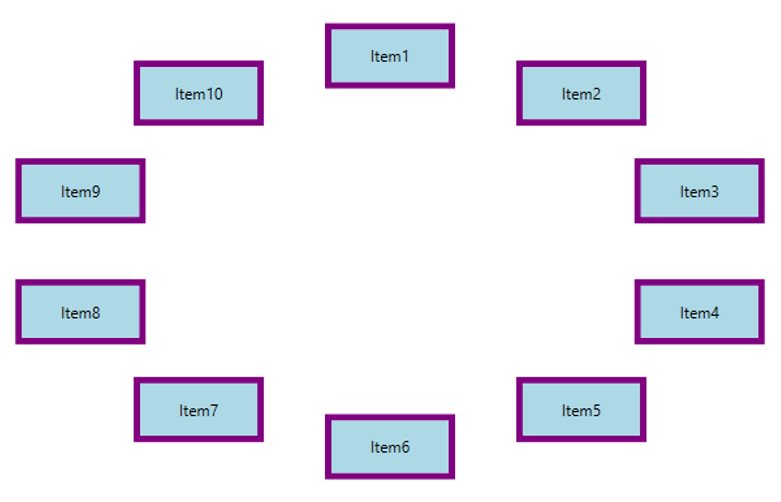

# Data Binding

Carousel is a fully data bound control, supports binding to different data sources such as IList Data Source, XML Data Source, Observable Collection Data Source.

## Using Data Binding in an Application

To bind a collection to Carousel, use the **ItemsSource** property.

The user can create Rich Interface Applications by defining DataTemplate to a Carousel control.

The following code tells about Data Binding and DataTemplate.


<syncfusion:Carousel x:Name="carousel" Height="400" Width="500">

<syncfusion:Carousel.OpacityFractions>

<syncfusion:PathFractionCollection>

<syncfusion:FractionValue Fraction="0" Value="1"/>

</syncfusion:PathFractionCollection>

</syncfusion:Carousel.OpacityFractions>

<syncfusion:Carousel.ItemTemplate>

<DataTemplate>

<Border Height="100" Width="100" Background="LightBlue">

<ContentControl Content="{Binding}" HorizontalAlignment="Center" VerticalAlignment="Center"/>

</Border>

</DataTemplate>

</syncfusion:Carousel.ItemTemplate>

</syncfusion:Carousel>





carousel.ItemsSource = new ObservableCollection<string>() { "Item1", "Item2", "Item3", "Item4", "Item5", "Item6", "Item7", "Item8", "Item9" };



