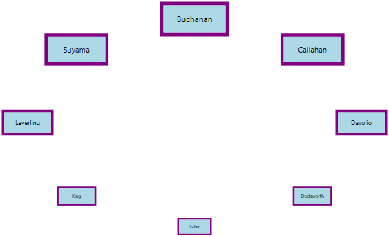
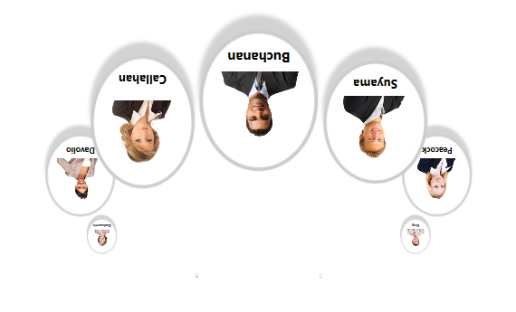

# Getting started

## Assembly deployment

Refer to the [control dependencies](https://help.syncfusion.com/wpf/control-dependencies#carousel) section to get the list of assemblies or NuGet package that needs to be added as reference to use the control in any application.

You can find more details about installing the NuGet package in a WPF application in the following link: 

[How to install nuget packages](https://help.syncfusion.com/wpf/nuget-packages)

## Creating a simple application with Carousel

You can create a WPF application with Carousel control using the following steps:

1.	[Create a project.](#creating-a-project)
2.	[Add control via designer.](#adding-control-via-designer)
3.	[Add control manually in XAML.](#adding-contro-manually-in-xaml)
4.	[Add control manually in C#.](#adding-control-manually-in-c)
5.	[Add items using CarouselItem.](#adding-items-using-carouselitem)
6.	[Bind to data.](#binding-to-data)
7.	[Set scaling to Carousel view.](#scale-view)
8.	[Rotate Carousel items.](#rotation-view)

## Creating a project

Create a new WPF project in Visual Studio to display the Carousel with functionalities.

## Adding control via designer

The Carousel control can be added to an application by dragging it from the toolbox to a designer view. The required assembly references will be added automatically.

## Adding control manually in XAML

To add control manually in XAML, follow the given steps:

1.	Add the following required assembly references to the project: 
    * Syncfusion.Shared.WPF.
2.	Import Syncfusion WPF schema **http://schemas.syncfusion.com/wpf** in XAML page.
3.	Declare the Carousel control in XAML page.



<Window xmlns="http://schemas.microsoft.com/winfx/2006/xaml/presentation"
        xmlns:x="http://schemas.microsoft.com/winfx/2006/xaml"
        xmlns:syncfusion="http://schemas.syncfusion.com/wpf" 
        x:Class="CarouselSample.MainWindow"
        Title="Carousel Sample" Height="350" Width="525">
    <Grid>
         <!--Adding Carousel control -->
        <syncfusion:Carousel x:Name="carousel" HorizontalAlignment="Center" Height="100" VerticalAlignment="Center" Width="100"/>
    </Grid>
</Window>



## Adding control manually in C#

To add control manually in C#, follow the given steps:

1.	Add the following required assembly references to the project: 
    * Syncfusion.Shared.WPF. 
2.	Import Carousel namespace **using Syncfusion.Windows.Shared;**.
3.	Create a Carousel instance, and add it to the window.



using Syncfusion.Windows.Shared
namespace CarouselSample
{
    /// 

    /// Interaction logic for MainWindow.xaml
    /// 

    public partial class MainWindow : Window
    {
        public MainWindow()
        {
			InitializeComponent();
			//Creating an instance of Carousel control
			Carousel carousel = new Carousel();
			//Adding Carousel as window content
			this.Content = carousel;
        }
    } 
}



## Adding items using CarouselItem

You can add the carousel items inside the control using the [CarouselItem](https://help.syncfusion.com/cr/wpf/Syncfusion.Shared.Wpf~Syncfusion.Windows.Shared.CarouselItem.html).



<syncfusion:Carousel x:Name="carousel" Height="400" Width="450">
	<syncfusion:CarouselItem>
		<syncfusion:CarouselItem.Content>
			<Viewbox Height="100" Width="100">
				<Image Source="Images/Buchanan.png"/>
 			</Viewbox>
		</syncfusion:CarouselItem.Content>
	</syncfusion:CarouselItem>
	<syncfusion:CarouselItem>
		<syncfusion:CarouselItem.Content>
			<Viewbox Height="100" Width="100">
				<Image Source="Images/Callahan.png"/>
			</Viewbox>
		</syncfusion:CarouselItem.Content>
	</syncfusion:CarouselItem>
	<syncfusion:CarouselItem>
		<syncfusion:CarouselItem.Content>
			<Viewbox Height="100" Width="100">
				<Image Source="Images/Davolio-1.png"/>
			</Viewbox>
		</syncfusion:CarouselItem.Content>
	</syncfusion:CarouselItem>
	<syncfusion:CarouselItem>
		<syncfusion:CarouselItem.Content>
			<Viewbox Height="100" Width="100">
				<Image Source="Images/Callahan.png"/>
			</Viewbox>
		</syncfusion:CarouselItem.Content>
	</syncfusion:CarouselItem>
	<syncfusion:CarouselItem>
		<syncfusion:CarouselItem.Content>
			<Viewbox Height="100" Width="100">
				<Image Source="Images/dodsworth.png"/>
			</Viewbox>
		</syncfusion:CarouselItem.Content>
	</syncfusion:CarouselItem>
	<syncfusion:CarouselItem>
		<syncfusion:CarouselItem.Content>
			<Viewbox Height="100" Width="100">
				<Image Source="Images/Fuller.png"/>
			</Viewbox>
		</syncfusion:CarouselItem.Content>
	</syncfusion:CarouselItem>
	<syncfusion:CarouselItem>
		<syncfusion:CarouselItem.Content>
			<Viewbox Height="100" Width="100">
				<Image Source="Images/King.png"/>
    		</Viewbox>
		</syncfusion:CarouselItem.Content>
	</syncfusion:CarouselItem>
	<syncfusion:CarouselItem>
		<syncfusion:CarouselItem.Content>
			<Viewbox Height="100" Width="100">
        		<Image Source="Images/Leverling.png"/>
			</Viewbox>
		</syncfusion:CarouselItem.Content>
</syncfusion:Carousel>


Carousel carousel = new Carousel() { Margin=40, RadiusX = 220, RadiusY = -100, ScaleFraction=0.60 };

Image image = new Image();
Image image1 = new Image();
Image image2 = new Image();
Image image3 = new Image();
Image image4 = new Image();
Image image5 = new Image();
Image image6 = new Image();
Image image7 = new Image();

BitmapImage bitimg1 = new BitmapImage(new Uri("/Sample;component/Images/1.png", UriKind.RelativeOrAbsolute));
BitmapImage bitimg2 = new BitmapImage(new Uri("/Sample;component/Images/2.png", UriKind.RelativeOrAbsolute));
BitmapImage bitimg3 = new BitmapImage(new Uri("/Sample;component/Images/3.png", UriKind.RelativeOrAbsolute));
BitmapImage bitimg4 = new BitmapImage(new Uri("/Sample;component/Images/4.png", UriKind.RelativeOrAbsolute));
BitmapImage bitimg5 = new BitmapImage(new Uri("/Sample;component/Images/5.png", UriKind.RelativeOrAbsolute));
BitmapImage bitimg6 = new BitmapImage(new Uri("/Sample;component/Images/6.png", UriKind.RelativeOrAbsolute));
BitmapImage bitimg7 = new BitmapImage(new Uri("/Sample;component/Images/7.png", UriKind.RelativeOrAbsolute));
BitmapImage bitimg8 = new BitmapImage(new Uri("/Sample;component/Images/8.png", UriKind.RelativeOrAbsolute));

image.Source = bitimg1 as ImageSource;
image1.Source = bitimg2 as ImageSource;
image2.Source = bitimg3 as ImageSource;
image3.Source = bitimg4 as ImageSource;
image4.Source = bitimg5 as ImageSource;
image5.Source = bitimg6 as ImageSource;
image6.Source = bitimg7 as ImageSource;
image7.Source = bitimg8 as ImageSource;

Viewbox viewbox1 = new Viewbox();
Viewbox viewbox2 = new Viewbox();
Viewbox viewbox3 = new Viewbox();
Viewbox viewbox4 = new Viewbox();
Viewbox viewbox5 = new Viewbox();
Viewbox viewbox6 = new Viewbox();
Viewbox viewbox7 = new Viewbox();
Viewbox viewbox8 = new Viewbox();

viewbox1.Child = image;
viewbox2.Child = image1;
viewbox3.Child = image2;
viewbox4.Child = image3;
viewbox5.Child = image4;
viewbox6.Child = image5;
viewbox7.Child = image6;
viewbox8.Child = image7;
            
carousel.Items.Add(new CarouselItem() { Content = viewbox1 });
carousel.Items.Add(new CarouselItem() { Content = viewbox2 });
carousel.Items.Add(new CarouselItem() { Content = viewbox3 });
carousel.Items.Add(new CarouselItem() { Content = viewbox4 });
carousel.Items.Add(new CarouselItem() { Content = viewbox5 });
carousel.Items.Add(new CarouselItem() { Content = viewbox6 });
carousel.Items.Add(new CarouselItem() { Content = viewbox7 });
carousel.Items.Add(new CarouselItem() { Content = viewbox8 });

{% endtabs %

## Binding to data

You can bind to a business object collection using the [ItemsSource](https://docs.microsoft.com/en-us/dotnet/api/system.windows.controls.itemscontrol.itemssourceproperty?view=netframework-4.7.2) and ItemTemplate properties of Carousel control. Refer to  the [Data binding](https://help.syncfusion.com/wpf/carousel/data-binding) section for more details.

* **Model.cs**



public class CarouselModel
{
	private string header;
	public string Header
	{
		get { return header; }
		set { header = value; }
	}
}



* **ViewModel.cs**



public class ViewModel
{
	private ObservableCollection<CarouselModel> collection;
	public ObservableCollection<CarouselModel> HeaderCollection
	{
		get { return collection; }
		set { collection = value; }
	}
	public ViewModel()
	{
		HeaderCollection = new ObservableCollection<CarouselModel>();
		HeaderCollection.Add(new CarouselModel() { Header = "Buchanan" });
		HeaderCollection.Add(new CarouselModel() { Header = "Callahan" });
		HeaderCollection.Add(new CarouselModel() { Header = "Davolio" });
		HeaderCollection.Add(new CarouselModel() { Header = "Dodsworth" });
		HeaderCollection.Add(new CarouselModel() { Header = "Fuller" });
		HeaderCollection.Add(new CarouselModel() { Header = "King" });
		HeaderCollection.Add(new CarouselModel() { Header = "Leverling" });
		HeaderCollection.Add(new CarouselModel() { Header = "Suyama" });
	}
}



* **MainWindow.Xaml**



<Window.DataContext>
    <local:ViewModel/>
</Window.DataContext>

<syncfusion:Carousel Name="Carousel" ItemsSource="{Binding HeaderCollection}" VerticalAlignment="Center" HorizontalAlignment="Center"> 
    <syncfusion:Carousel.ItemTemplate>
        <DataTemplate>
            <Border Height="50" Width="100" BorderBrush="Purple" BorderThickness="5" Background="LightBlue">
                <TextBlock Text="{Binding Header}"/>
            </Border>
        </DataTemplate>
    </syncfusion:Carousel.ItemTemplate>
</syncfusion:Carousel>



## Scale view

You can set scaling view to the carousel items by setting the [ScaleFraction](https://help.syncfusion.com/cr/wpf/Syncfusion.Shared.Wpf~Syncfusion.Windows.Shared.Carousel~ScaleFraction.html) property of the Carousel control.



<!--Setting scale view -->
<syncfusion:Carousel x:Name="carousel" ScalingEnabled="True" ScaleFraction="0.50"/>


//Setting scale view 
carousel. ScaleFraction =0.50;



## Rotation view

You can rotate the carousel items by setting the [RotationAngle](https://help.syncfusion.com/cr/wpf/Syncfusion.Shared.Wpf~Syncfusion.Windows.Shared.Carousel~RotationAngle.html) property of the Carousel control.



<!--Rotation view -->
<syncfusion:Carousel x:Name="carousel" VerticalAlignment="Center" HorizontalAlignment="Center" RotationAngle="180"/>


//Rotation view
carousel.RotationAngle=180;



