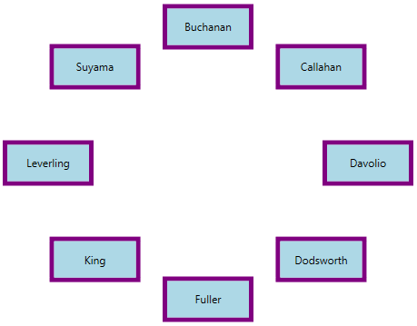
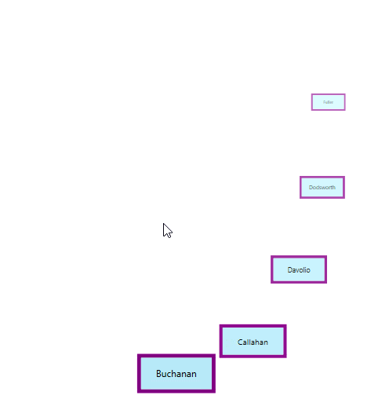
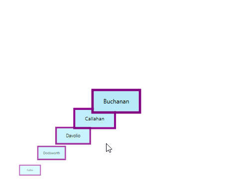
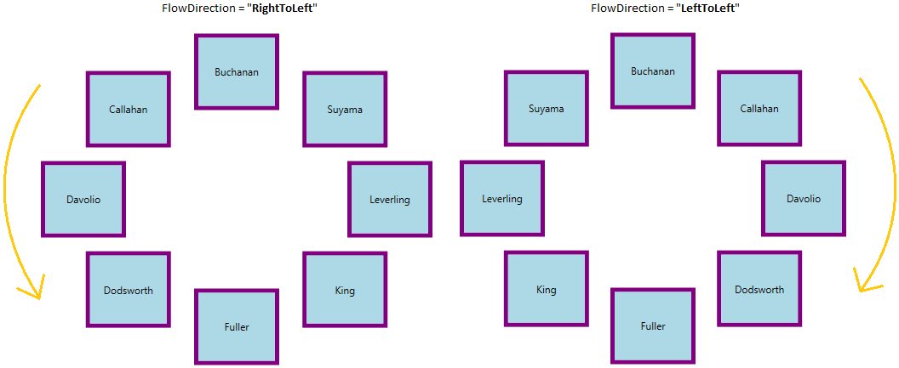
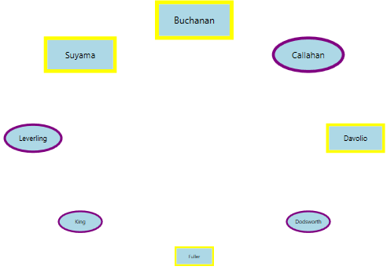

# Working with WPF Carousel

This section explains different UI customization and common features  available in [Carousel](https://help.syncfusion.com/cr/wpf/Syncfusion.Shared.Wpf~Syncfusion.Windows.Shared.Carousel.html) control.

## Populating items using CarouselItem

You can add the carousel items inside the control using the [CarouselItem](https://help.syncfusion.com/cr/wpf/Syncfusion.Shared.Wpf~Syncfusion.Windows.Shared.CarouselItem.html) property.




<syncfusion:Carousel x:Name="carousel" 
                     Height="700" Width="500">
    <syncfusion:CarouselItem>
        <syncfusion:CarouselItem.Content>
            <Viewbox Height="100" Width="100">
                <Image Source="Images/Buchanan.png"/>
            </Viewbox>
        </syncfusion:CarouselItem.Content>
    </syncfusion:CarouselItem>
    <syncfusion:CarouselItem>
        <syncfusion:CarouselItem.Content>
            <Viewbox Height="100" Width="100">
                <Image Source="Images/Callahan.png"/>
            </Viewbox>
        </syncfusion:CarouselItem.Content>
    </syncfusion:CarouselItem>
    <syncfusion:CarouselItem>
        <syncfusion:CarouselItem.Content>
            <Viewbox Height="100" Width="100">
                <Image Source="Images/Davolio-1.png"/>
            </Viewbox>
        </syncfusion:CarouselItem.Content>
    </syncfusion:CarouselItem>
    <syncfusion:CarouselItem>
        <syncfusion:CarouselItem.Content>
            <Viewbox Height="100" Width="100">
                <Image Source="Images/Callahan.png"/>
            </Viewbox>
        </syncfusion:CarouselItem.Content>
    </syncfusion:CarouselItem>
    <syncfusion:CarouselItem>
        <syncfusion:CarouselItem.Content>
            <Viewbox Height="100" Width="100">
                <Image Source="Images/dodsworth.png"/>
            </Viewbox>
        </syncfusion:CarouselItem.Content>
    </syncfusion:CarouselItem>
    <syncfusion:CarouselItem>
        <syncfusion:CarouselItem.Content>
            <Viewbox Height="100" Width="100">
                <Image Source="Images/Fuller.png"/>
            </Viewbox>
        </syncfusion:CarouselItem.Content>
    </syncfusion:CarouselItem>
    <syncfusion:CarouselItem>
        <syncfusion:CarouselItem.Content>
            <Viewbox Height="100" Width="100">
                <Image Source="Images/King.png"/>
            </Viewbox>
        </syncfusion:CarouselItem.Content>
    </syncfusion:CarouselItem>
    <syncfusion:CarouselItem>
        <syncfusion:CarouselItem.Content>
            <Viewbox Height="100" Width="100">
                <Image Source="Images/Leverling.png"/>
            </Viewbox>
        </syncfusion:CarouselItem.Content>
    </syncfusion:CarouselItem>
</syncfusion:Carousel>




Carousel carousel = new Carousel()
{ 
	Width=700, 
	Height = 500
};

Image image = new Image();
Image image1 = new Image();
Image image2 = new Image();
Image image3 = new Image();
Image image4 = new Image();
Image image5 = new Image();
Image image6 = new Image();
Image image7 = new Image();

BitmapImage bitimg1 = new BitmapImage(new Uri("/Sample;component/Images/1.png", UriKind.RelativeOrAbsolute));
BitmapImage bitimg2 = new BitmapImage(new Uri("/Sample;component/Images/2.png", UriKind.RelativeOrAbsolute));
BitmapImage bitimg3 = new BitmapImage(new Uri("/Sample;component/Images/3.png", UriKind.RelativeOrAbsolute));
BitmapImage bitimg4 = new BitmapImage(new Uri("/Sample;component/Images/4.png", UriKind.RelativeOrAbsolute));
BitmapImage bitimg5 = new BitmapImage(new Uri("/Sample;component/Images/5.png", UriKind.RelativeOrAbsolute));
BitmapImage bitimg6 = new BitmapImage(new Uri("/Sample;component/Images/6.png", UriKind.RelativeOrAbsolute));
BitmapImage bitimg7 = new BitmapImage(new Uri("/Sample;component/Images/7.png", UriKind.RelativeOrAbsolute));
BitmapImage bitimg8 = new BitmapImage(new Uri("/Sample;component/Images/8.png", UriKind.RelativeOrAbsolute));

image.Source = bitimg1 as ImageSource;
image1.Source = bitimg2 as ImageSource;
image2.Source = bitimg3 as ImageSource;
image3.Source = bitimg4 as ImageSource;
image4.Source = bitimg5 as ImageSource;
image5.Source = bitimg6 as ImageSource;
image6.Source = bitimg7 as ImageSource;
image7.Source = bitimg8 as ImageSource;
          
carousel.Items.Add(new CarouselItem() { Content = new Viewbox(){ Child = image }});
carousel.Items.Add(new CarouselItem() { Content = new Viewbox(){ Child = image1 }});
carousel.Items.Add(new CarouselItem() { Content = new Viewbox(){ Child = image2 }});
carousel.Items.Add(new CarouselItem() { Content = new Viewbox(){ Child = image3 }});
carousel.Items.Add(new CarouselItem() { Content = new Viewbox(){ Child = image4 }});
carousel.Items.Add(new CarouselItem() { Content = new Viewbox(){ Child = image5 }});
carousel.Items.Add(new CarouselItem() { Content = new Viewbox(){ Child = image6 }});
carousel.Items.Add(new CarouselItem() { Content = new Viewbox(){ Child = image7 }});




N> [View Sample in GitHub](https://github.com/SyncfusionExamples/syncfusion-wpf-carousel-examples/tree/master/Samples/CarouselItem-Selection)

## Populating items using collection binding

You can populate items to the `Carousel` control by setting the collection value to the `ItemsSource` property. 




//Model.cs
public class CarouselModel {
	public string Header { get; set; }
}

//ViewModel.cs
public class ViewModel {
	private ObservableCollection<CarouselModel> collection;
	public ObservableCollection<CarouselModel> HeaderCollection
	{
		get {
			return collection;
		}
		set {
			collection = value;
		}
	}
	public ViewModel() {
		HeaderCollection = new ObservableCollection<CarouselModel>();
		HeaderCollection.Add(new CarouselModel() { Header = "Buchanan" });
		HeaderCollection.Add(new CarouselModel() { Header = "Callahan" });
		HeaderCollection.Add(new CarouselModel() { Header = "Davolio" });
		HeaderCollection.Add(new CarouselModel() { Header = "Dodsworth" });
		HeaderCollection.Add(new CarouselModel() { Header = "Fuller" });
		HeaderCollection.Add(new CarouselModel() { Header = "King" });
		HeaderCollection.Add(new CarouselModel() { Header = "Leverling" });
		HeaderCollection.Add(new CarouselModel() { Header = "Suyama" });
	}
}







<Window.DataContext>
    <local:ViewModel/>
</Window.DataContext>

<Grid>
    <syncfusion:Carousel Name="Carousel"
                         ItemsSource="{Binding HeaderCollection}">
        <syncfusion:Carousel.ItemTemplate>
            <DataTemplate>
                <Border Height="50" 
                        Width="100" 
                        BorderBrush="Purple" 
                        BorderThickness="5"
                        Background="LightBlue">
                    <TextBlock HorizontalAlignment="Center" 
                               VerticalAlignment="Center" 
                               Text="{Binding Header}"/>
                </Border>
            </DataTemplate>
        </syncfusion:Carousel.ItemTemplate>
    </syncfusion:Carousel>
</Grid>




N> [View Sample in GitHub](https://github.com/SyncfusionExamples/syncfusion-wpf-carousel-examples/tree/master/Samples/Binding)

## Custom view path

By default, carousel items are arranged in a circular path. If you want to customize the view path of carousel item, use the [VisualMode](https://help.syncfusion.com/cr/wpf/Syncfusion.Shared.Wpf~Syncfusion.Windows.Shared.Carousel~VisualMode.html) property value as `CustomPath`. The default value of `VisualMode` property is `Standard`.




<syncfusion:Carousel VisualMode="CustomPath"
                     Name="carousel"/>




carousel.VisualMode = VisualMode.CustomPath;




N> [View Sample in GitHub](https://github.com/SyncfusionExamples/syncfusion-wpf-carousel-examples/tree/master/Samples/CustomPath)

### Change custom view path

You can change the custom view path of the carousel items by using the [Path](https://help.syncfusion.com/cr/wpf/Syncfusion.Shared.Wpf~Syncfusion.Windows.Shared.Carousel~Path.html) property. The default value of `Path` property is `null`.




<syncfusion:Carousel VisualMode="CustomPath"
                     Name="carousel">
    <syncfusion:Carousel.Path>
        <Path Data="M0,100 L100,20" 
              Stroke="Blue" 
              StrokeThickness="2" 
              HorizontalAlignment="Stretch"
              VerticalAlignment="Stretch"/>
    </syncfusion:Carousel.Path>
</syncfusion:Carousel>




carousel.VisualMode = VisualMode.CustomPath;




N> [View Sample in GitHub](https://github.com/SyncfusionExamples/syncfusion-wpf-carousel-examples/tree/master/Samples/Binding)

## Change display item count

You can change the number of carousel items displayed per page in the `Carousel` control by using the [ItemsPerPage](https://help.syncfusion.com/cr/wpf/Syncfusion.Shared.Wpf~Syncfusion.Windows.Shared.Carousel~ItemsPerPage.html) property. `ItemsPerPage` is  effective only on `VisualMode.CustomPath` view mode. The default value of `ItemsPerPage` property is `-1`.




<syncfusion:Carousel ItemsPerPage="3"
                     VisualMode="CustomPath"
                     Name="carousel"/>




carousel.ItemsPerPage = 3;
carousel.VisualMode = VisualMode.CustomPath;




N> [View Sample in GitHub](https://github.com/SyncfusionExamples/syncfusion-wpf-carousel-examples/tree/master/Samples/CustomPath)

## Select carousel item

You can select a carousel item by mouse click on the specific item. You can get the selected item and its value by using the [SelectedItem](https://help.syncfusion.com/cr/wpf/Syncfusion.Shared.Wpf~Syncfusion.Windows.Shared.Carousel~SelectedItem.html) and [SelectedValue](https://help.syncfusion.com/cr/wpf/Syncfusion.Shared.Wpf~Syncfusion.Windows.Shared.Carousel~SelectedValue.html) properties. You can also get the selected item index by using the [SelectedIndex](https://help.syncfusion.com/cr/wpf/Syncfusion.Shared.Wpf~Syncfusion.Windows.Shared.Carousel~SelectedIndex.html) property. You can only select a single item at a time.

### Select carousel item programmatically using property

You can select a particular carousel item programmatically by using the [CarouselItem.IsSelected](https://help.syncfusion.com/cr/wpf/Syncfusion.Shared.Wpf~Syncfusion.Windows.Shared.CarouselItem~IsSelected.html) property.




<Window.Resources>
    
</Window.Resources>
<Grid>
    <syncfusion:Carousel ItemContainerStyle="{StaticResource selecteditemStyle}" 
                         x:Name="carousel">
        <syncfusion:CarouselItem Content="Item1"/>
        <syncfusion:CarouselItem Content="Item2"/>
        <syncfusion:CarouselItem Content="Item3" IsSelected="True"/>
        <syncfusion:CarouselItem Content="Item4"/>
        <syncfusion:CarouselItem Content="Item5"/>
    </syncfusion:Carousel>
</Grid>




N> [View Sample in GitHub](https://github.com/SyncfusionExamples/syncfusion-wpf-carousel-examples/tree/master/Samples/CarouselItem-Selection)

### Select carousel item programmatically using command and methods

You can select a previous, next, first or last carousel items programmatically by using the commands and methods.

* [SelectFirstItemCommand](https://help.syncfusion.com/cr/wpf/Syncfusion.Shared.Wpf~Syncfusion.Windows.Shared.Carousel~SelectFirstItemCommand.html) or [SelectFirstItem()](https://help.syncfusion.com/cr/wpf/Syncfusion.Shared.Wpf~Syncfusion.Windows.Shared.Carousel~SelectFirstItem().html) - To select the first item.

* [SelectLastItemCommand](https://help.syncfusion.com/cr/wpf/Syncfusion.Shared.Wpf~Syncfusion.Windows.Shared.Carousel~SelectLastItemCommand.html) or [SelectLastItem()](https://help.syncfusion.com/cr/wpf/Syncfusion.Shared.Wpf~Syncfusion.Windows.Shared.Carousel~SelectLastItem().html) - To select the last item.

* [SelectPreviousItemCommand](https://help.syncfusion.com/cr/wpf/Syncfusion.Shared.Wpf~Syncfusion.Windows.Shared.Carousel~SelectPreviousItemCommand.html) or [SelectPreviousItem](https://help.syncfusion.com/cr/wpf/Syncfusion.Shared.Wpf~Syncfusion.Windows.Shared.Carousel~SelectPreviousItem().html) - To select the previous item from the currently selected item.

* [SelectNextItemCommand](https://help.syncfusion.com/cr/wpf/Syncfusion.Shared.Wpf~Syncfusion.Windows.Shared.Carousel~SelectNextItemCommand.html) or [SelectNextItem()](https://help.syncfusion.com/cr/wpf/Syncfusion.Shared.Wpf~Syncfusion.Windows.Shared.Carousel~SelectNextItem().html) - To select the next item from the currently selected item.

* [SelectPreviousPageCommand](https://help.syncfusion.com/cr/wpf/Syncfusion.Shared.Wpf~Syncfusion.Windows.Shared.Carousel~SelectPreviousPageCommand.html) or [SelectPreviousPage()](https://help.syncfusion.com/cr/wpf/Syncfusion.Shared.Wpf~Syncfusion.Windows.Shared.Carousel~SelectPreviousPage().html) - To select the previous page item.

* [SelectNextPageCommand](https://help.syncfusion.com/cr/wpf/Syncfusion.Shared.Wpf~Syncfusion.Windows.Shared.Carousel~SelectNextPageCommand.html) or [SelectNextPage()](https://help.syncfusion.com/cr/wpf/Syncfusion.Shared.Wpf~Syncfusion.Windows.Shared.Carousel~SelectNextPage().html) - To select the next page item.

N> [View Sample in GitHub](https://github.com/SyncfusionExamples/syncfusion-wpf-carousel-examples/tree/master/Samples/Carousel-Scrolling)

## Selected item changed notification

The selected item changed in `Carousel` can be examined using [SelectionChanged](https://help.syncfusion.com/cr/wpf/Syncfusion.Shared.Wpf~Syncfusion.Windows.Shared.Carousel~SelectionChanged_EV.html) event. The `SelectionChanged` event contains the old and newly selected item in the `OldValue` and `NewValue` properties.




 <syncfusion:Carousel SelectionChanged="Carousel_SelectionChanged" 
                      Name="carousel"/>




Carousel carousel = new Carousel();
carousel.SelectionChanged += Carousel_SelectionChanged;




You can handle the event as follows,




private void Carousel_SelectionChanged(DependencyObject d, DependencyPropertyChangedEventArgs e) {
    //Get old and new selected carousel item
    var oldValue = e.OldValue;
    var newValue = e.NewValue;
}




## Change radius of carousel item

You can change the radius of the `Carousel` control by setting the value to the [RadiusX](https://help.syncfusion.com/cr/wpf/Syncfusion.Shared.Wpf~Syncfusion.Windows.Shared.Carousel~RadiusX.html) and [RadiusY](https://help.syncfusion.com/cr/wpf/Syncfusion.Shared.Wpf~Syncfusion.Windows.Shared.Carousel~RadiusY.html) properties. Based on the radius points, items are arranged. This will effective only on `VisualMode.Standard` view mode. The default value of `RadiusX` property is `250` and `RadiusY` property is `150`. 




<syncfusion:Carousel RadiusX="100" 
                     RadiusY="100" 
                     VisualMode="Standard"
                     Name="carousel"/>




carousel.RadiusX = 100;
carousel.RadiusY = 100;
carousel.VisualMode = VisualMode.Standard;




N> [View Sample in GitHub](https://github.com/SyncfusionExamples/syncfusion-wpf-carousel-examples/tree/master/Samples/StandardPath)

## Setting the background

You can change the background color of `Carousel` by using the `Background` property. The default value of `Background` property is `White`.




<syncfusion:Carousel Background="Red"
                     Name="carousel"/>




carousel.Background = Brushes.Red;




N> [View Sample in GitHub](https://github.com/SyncfusionExamples/syncfusion-wpf-carousel-examples/tree/master/Samples/StandardPath)

## Change flow direction

You can change the flow direction of the `Carousel` layout from right to left by setting the `FlowDirection` property value as `RightToLeft`. The default value of `FlowDirection` property is `LeftToRight`.




<syncfusion:Carousel FlowDirection="RightToLeft"
                     Name="carousel"/>




Carousel carousel = new Carousel();
carousel.FlowDirection = FlowDirection.RightToLeft;




N> [View Sample in GitHub](https://github.com/SyncfusionExamples/syncfusion-wpf-carousel-examples/tree/master/Samples/StandardPath)

## Virtualization support

You can enable the UI virtualization support in `Carousel`, which allows the users to load large sets of data without affecting loading or scrolling performance by setting the [EnableVirtualization](https://help.syncfusion.com/cr/wpf/Syncfusion.Shared.Wpf~Syncfusion.Windows.Shared.Carousel~EnableVirtualization.html) property value as `true`. This feature allows users to reduce the loading time of `Carousel` items regardless of items count. The default value of `EnableVirtualization` property is `false`. 




<syncfusion:Carousel EnableVirtualization="True"
                     Name="carousel"/>




Carousel carousel = new Carousel();
carousel.EnableVirtualization = true;




## Custom UI for carousel item using template

You can customize the appearance of each carousel item by using the `ItemTemplate` property. If you want to change the appearance of particular carousel item appearance, use `ItemTemplateSelector` property. The `DataContext` of the `ItemTemplate` property is `CarouselItem`.




//Model.cs
public class CarouselModel {
	public string Header { get; set; }
}

//ViewModel.cs
public class ViewModel {
	private ObservableCollection<CarouselModel> collection;
	public ObservableCollection<CarouselModel> HeaderCollection	{
		get {
			return collection;
		}
		set {
			collection = value;
		}
	}
	public ViewModel() {
		HeaderCollection = new ObservableCollection<CarouselModel>();
		HeaderCollection.Add(new CarouselModel() { Header = "Buchanan" });
		HeaderCollection.Add(new CarouselModel() { Header = "Callahan" });
		HeaderCollection.Add(new CarouselModel() { Header = "Davolio" });
		HeaderCollection.Add(new CarouselModel() { Header = "Dodsworth" });
		HeaderCollection.Add(new CarouselModel() { Header = "Fuller" });
		HeaderCollection.Add(new CarouselModel() { Header = "King" });
		HeaderCollection.Add(new CarouselModel() { Header = "Leverling" });
		HeaderCollection.Add(new CarouselModel() { Header = "Suyama" });
	}
}







<Window.DataContext>
    <local:ViewModel/>
</Window.DataContext>

<Grid>
    <syncfusion:Carousel ItemsSource="{Binding HeaderCollection}"
                         ScaleFraction="0.5"
                         Name="carousel" >
        <syncfusion:Carousel.ItemTemplate>
            <DataTemplate>
                <Grid>
                    <Ellipse Width="200" Height="100" 
                             Stroke="Green" 
                             StrokeThickness="4"
                             Fill="Yellow"/>
                    <TextBlock HorizontalAlignment="Center" 
                               VerticalAlignment="Center" 
                               Text="{Binding Header}"/>
                </Grid>
            </DataTemplate>
        </syncfusion:Carousel.ItemTemplate>
    </syncfusion:Carousel>
</Grid>




N> [View Sample in GitHub](https://github.com/SyncfusionExamples/syncfusion-wpf-carousel-examples/tree/master/Samples/ItemTemplate)

## Custom UI for carousel item using style

You can change the each carousel item appearance by using the `ItemContainerStyle` which is applied to the container element that generated for each carousel item. The default value of `ItemContainerStyle` is `null`. The `DataContext` of the `ItemContainerStyle` property is `CarouselItem`.




//Model.cs
public class CarouselModel {
	public string Header { get; set; }
	public ImageSource ImageSource { get; set; }

}

//ViewModel.cs
public class ViewModel {
	private ObservableCollection<CarouselModel> persons;
	public ObservableCollection<CarouselModel> Persons
	{
		get {
			return persons;
		}
		set {
			persons = value;
		}
	}
	public ViewModel() {
		Persons = new ObservableCollection<CarouselModel>();
		Persons.Add(new CarouselModel() {
			Header = "Buchanan",
			ImageSource = new BitmapImage
			(new Uri(@"/Images/Buchanan.png", UriKind.RelativeOrAbsolute))
		});
		Persons.Add(new CarouselModel() {
			Header = "Callahan",
			ImageSource = new BitmapImage
			(new Uri(@"/Images/Callahan.png", UriKind.RelativeOrAbsolute))
		});
		Persons.Add(new CarouselModel() {
			Header = "Davolio",
			ImageSource = new BitmapImage
			(new Uri(@"/Images/Davolio-1.png", UriKind.RelativeOrAbsolute))
		});
		Persons.Add(new CarouselModel() {
			Header = "Dodsworth",
			ImageSource = new BitmapImage
			(new Uri(@"/Images/dodsworth.png", UriKind.RelativeOrAbsolute))
		});
		Persons.Add(new CarouselModel() {
			Header = "Fuller",
			ImageSource = new BitmapImage
			(new Uri(@"/Images/Fuller.png", UriKind.RelativeOrAbsolute))
		});
		Persons.Add(new CarouselModel() {
			Header = "King",
			ImageSource = new BitmapImage
			(new Uri(@"/Images/King.png", UriKind.RelativeOrAbsolute))
		});
		Persons.Add(new CarouselModel() {
			Header = "Leverling",
			ImageSource = new BitmapImage
			(new Uri(@"/Images/Leverling.png", UriKind.RelativeOrAbsolute))
		});
		Persons.Add(new CarouselModel() {
			Header = "Suyama",
			ImageSource = new BitmapImage
			(new Uri(@"/Images/Suyama.png", UriKind.RelativeOrAbsolute))
		});
	}
}







<Window.DataContext>
    <local:ViewModel/>
</Window.DataContext>
<Grid>
    <syncfusion:Carousel ScaleFraction="0.5" 
                         VisualMode="Standard"
                         Name="carousel" 
                         ItemsSource="{Binding Persons}">
        <syncfusion:Carousel.ItemContainerStyle>
            
        </syncfusion:Carousel.ItemContainerStyle>
    </syncfusion:Carousel>
</Grid>




N> [View Sample in GitHub](https://github.com/SyncfusionExamples/syncfusion-wpf-carousel-examples/tree/master/Samples/ItemContainerStyle)

## Custom UI for specific carousel item using style selector

You can select a various custom appearance for the carousel items by using the `ItemContainerStyleSelector` property. The `DataContext` of the `ItemContainerStyleSelector` property is `CarouselItem`.




//Model.cs
public class CarouselModel {
    public string Name { get; set; }
    public int Age { get; set; }
}   

//ViewModel.cs
public class ViewModel {
    private ObservableCollection<CarouselModel> persons;
    public ObservableCollection<CarouselModel> Persons {
        get {
            return persons;
        }
        set {
            persons = value;
        }
    }
    public ViewModel() {
        Persons = new ObservableCollection<CarouselModel>();
        Persons.Add(new CarouselModel() { Name = "Buchanan", Age = 40 });
        Persons.Add(new CarouselModel() { Name = "Callahan", Age = 53 });
        Persons.Add(new CarouselModel() { Name = "Davolio", Age = 42 });
        Persons.Add(new CarouselModel() { Name = "Dodsworth", Age = 60 });
        Persons.Add(new CarouselModel() { Name = "Fuller", Age = 46 });
        Persons.Add(new CarouselModel() { Name = "King", Age = 65 });
        Persons.Add(new CarouselModel() { Name = "Leverling", Age = 57 });
        Persons.Add(new CarouselModel() { Name = "Suyama", Age = 30 });
    }
}

// A class that choose style for for the items
public class PersonStyleSelector : StyleSelector {
    public Style ElderStyle { get; set; }
    public Style YoungerStyle { get; set; }
    public override Style SelectStyle(object item, DependencyObject container) {
        if ((item as CarouselModel).Age > 50)
            return ElderStyle;
        else
            return YoungerStyle;
    }
}







<Window.Resources>
    

    
    <local:PersonStyleSelector x:Key="personStyleSelector"
                               ElderStyle="{StaticResource elderStyle}" 
                               YoungerStyle="{StaticResource youngerStyle}"/>
</Window.Resources>

<Grid>
    <syncfusion:Carousel ItemContainerStyleSelector="{StaticResource personStyleSelector}"
                         ItemsSource="{Binding Persons}"
                         DisplayMemberPath="Name" 
                         ScaleFraction="0.5"
                         VisualMode="Standard"
                         Name="carousel" >
        <syncfusion:Carousel.DataContext>
            <local:ViewModel></local:ViewModel>
        </syncfusion:Carousel.DataContext>          
    </syncfusion:Carousel>
</Grid>




N> [View Sample in GitHub](https://github.com/SyncfusionExamples/syncfusion-wpf-carousel-examples/tree/master/Samples/ItemContainerStyleSelector)
