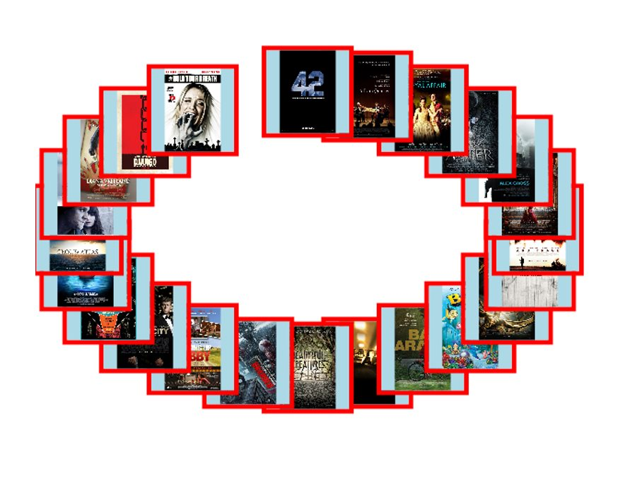

# Path Support

Carousel panel arrange its children on a path. User can specify any path and it can be created easily using expression blend.

## Adding Path support to an Application

### VisualMode

In our carousel control, we can set the path using the two different modes of VisualMode property.To use the standard path, the VisualMode property need to set as Standard.And to set the custom path, use VisualMode as **CustomPath** along with **Path** Property of Carousel control. By default, the VisualMode value is Standard for carousel control. The same has been explained in the below code example.

#### VisualMode Standard





<syncfusion:Carousel x:Name="carousel"
VisualMode="Standard"
VerticalAlignment="Center"
HorizontalAlignment="Center"
ItemsPerPage="5"
RadiusX="250" Height="257" Width="558" SelectedIndex="4">
<syncfusion:Carousel.ItemTemplate>
<DataTemplate>
<Border Height="100" Width="100" Background="LightBlue">
<ContentControl Content="{Binding}" HorizontalAlignment="Center" VerticalAlignment="Center"/>
</Border>
</DataTemplate>
</syncfusion:Carousel.ItemTemplate>
</syncfusion:Carousel>









carousel.ItemsSource = new ObservableCollection<string>() { "Item1", "Item2", "Item3", "Item4", "Item5", "Item6", "Item7", "Item8", "Item9" };





carousel.ItemsSource = New ObservableCollection(Of String)() From { _
	"Item1", _
	"Item2", _
	"Item3", _
	"Item4", _
	"Item5", _
	"Item6", _
	"Item7", _
	"Item8", _
	"Item9" _
}





#### VisualMode as CustomPath





<syncfusion:Carousel x:Name="carousel"   

VisualMode="CustomPath"

VerticalAlignment="Top"

ItemsPerPage="5"

RadiusX="250" Height="257" Width="558" SelectedIndex="4">

<syncfusion:Carousel.Path>

<Path Data="M0,300 L600,300" Stroke="Blue" StrokeThickness="2" HorizontalAlignment="Stretch" VerticalAlignment="Stretch"/>

</syncfusion:Carousel.Path>

<syncfusion:Carousel.ItemTemplate>

<DataTemplate>

<Border Height="100" Width="100" Background="LightBlue">

<ContentControl Content="{Binding}" HorizontalAlignment="Center" VerticalAlignment="Center"/>

</Border>

</DataTemplate>

</syncfusion:Carousel.ItemTemplate>

</syncfusion:Carousel>









carousel.ItemsSource = new ObservableCollection<string>() { "Item1", "Item2", "Item3", "Item4", "Item5", "Item6", "Item7", "Item8", "Item9" };





carousel.ItemsSource = New ObservableCollection(Of String)() From { _
	"Item1", _
	"Item2", _
	"Item3", _
	"Item4", _
	"Item5", _
	"Item6", _
	"Item7", _
	"Item8", _
	"Item9" _
}





## Properties

<table>
<tr>
<td>
Property  </td><td>
Description  </td><td>
Type  </td><td>
Data Type  </td></tr>
<tr>
<td>
Path  </td><td>
Sets the CustomPath for the Carousel control  </td><td>
DependencyProperty  </td><td>
CustomEditorCollection  </td></tr>
</table>

# Radius Support

**RadiusX** and **RadiusY** properties in the Carousel can be used to define the X and Y axis radius to render the control.

## Adding Radius support to an Application





<syncfusion:Carousel x:Name="carousel" RadiusX="200" RadiusY="200">
            
            <syncfusion:Carousel.ItemTemplate>

                <DataTemplate>

                    <Border Height="100" Width="100" Background="LightBlue">

                        <ContentControl Content="{Binding}" HorizontalAlignment="Center" VerticalAlignment="Center"/>

                    </Border>

                </DataTemplate>

            </syncfusion:Carousel.ItemTemplate>

        </syncfusion:Carousel>









Carousel carousel = new Carousel();
carousel.RadiusX = 200;
carousel.RadiusY = 200;
carousel.ItemsSource = new ObservableCollection<string>() { "Item1", "Item2", "Item3", "Item4", "Item5", "Item6", "Item7", "Item8", "Item9" };
grid1.Children.Add(carousel);





Dim carousel As New Carousel()
carousel.RadiusX = 200
carousel.RadiusY = 200
carousel.ItemsSource = New ObservableCollection(Of String) (New String() {"Item1", "Item2", "Item3", "Item4", "Item5", "Item6", "Item7", "Item8", "Item9"})
grid1.Children.Add(carousel)





