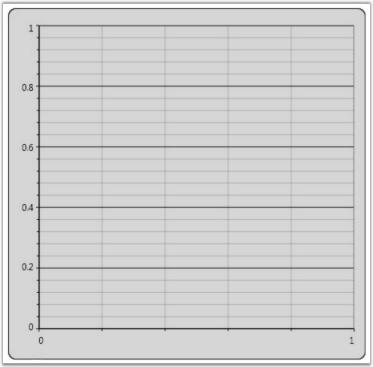
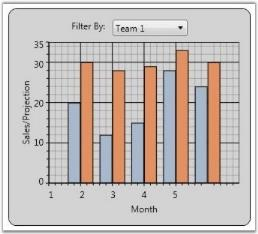
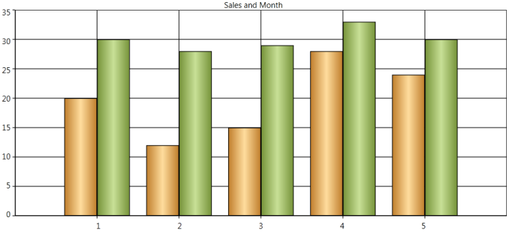
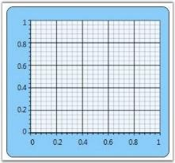
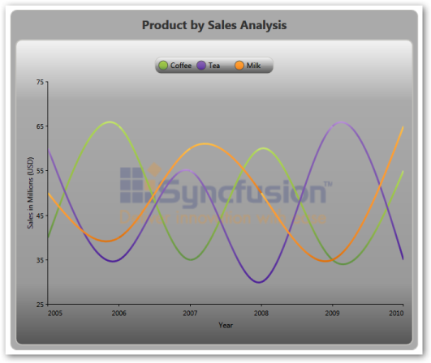
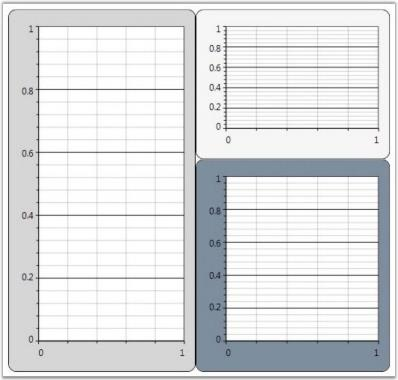
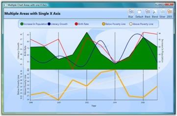
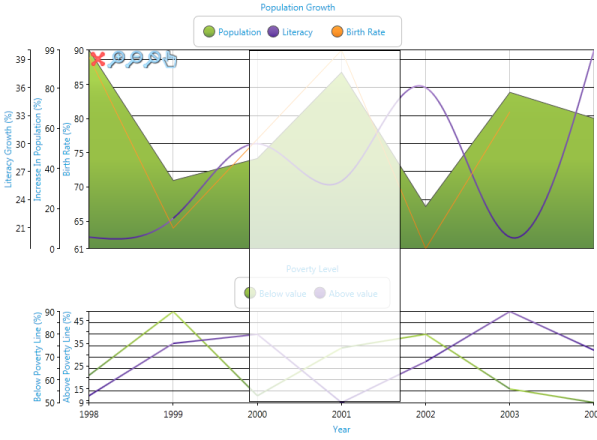

# Chart Area

## Adding Chart Area

Once you add the Chart control, the first thing to do is to add a Chart Area and and Chart Series. The following code example illustrates how to do this.


<sfchart:Chart>

<sfchart:ChartArea>

<sfchart:ChartSeries/>

</sfchart:ChartArea>

</sfchart:Chart>




ChartArea area = new ChartArea();

Chart1.Areas.Add(area);

ChartSeries series = new ChartSeries();

area.Series.Add(series);



See Also

Multiple Areas, Chart Area Layout Customization

## Multiple Areas

Essential Chart provides support to add multiple Chart Areas to a Chart to visualize related data side by side. The following code example illustrates this.


<sfchart:Chart>

<sfchart:ChartArea Background="LightGray" GridBackground="White">

<sfchart:ChartSeries/>

</sfchart:ChartArea>

<sfchart:ChartArea Background="WhiteSmoke" GridBackground="White" >

<sfchart:ChartSeries/>

</sfchart:ChartArea>

</sfchart:Chart>





ChartArea area = new ChartArea();

area.Background = Brushes.LightGray;

area.GridBackground = Brushes.White;

Chart1.Areas.Add(area);

ChartArea area1 = new ChartArea();

area1.Background = Brushes.WhiteSmoke;

area1.GridBackground = Brushes.White;

Chart1.Areas.Add(area1);



See Also

Adding Chart Area, Chart Area Layout Customization

## Chart Area Header

Chart enables you to add headers to the Chart Area object. Any element can be added as a Chart Area header by using the Header property of the ChartArea class.


<sfchart:Chart>

<sfchart:ChartArea Background="LightGray" GridBackground="White">

               <sfchart:ChartArea.Header>

                    <StackPanel Orientation="Horizontal">

                        <TextBlock Text="Filter By:"></TextBlock>

                        <ComboBox Width="100" Margin="10, 0, 0, 0">

                            <ComboBoxItem>Team 1</ComboBoxItem>

                            <ComboBoxItem>Team 2</ComboBoxItem>

                            <ComboBoxItem>Team 3</ComboBoxItem>

                        </ComboBox>

                    </StackPanel>

                </sfchart:ChartArea.Header>

       <!--Chart Series initialization code is hidden for brevity.-->

<sfchart:ChartSeries/>

</sfchart:ChartArea>

</sfchart:Chart>



See Also

Adding Chart Area

## Chart Header

Essential Chart for WPF enables users to set the title for a chart.

_Property Table_

<table>
<tr>
<th>
Name of Property</th><th>
Description </th><th>
Type of Property</th><th>
Value It Accepts</th><th>
Property Syntax</th><th>
Sub Properties</th></tr>
<tr>
<td>
Header</td><td>
Sets the title of the chart.</td><td>
Dependency  Property</td><td>
Object/ “Chart Header”</td><td>
 &lt;syncfusion:Chart Name="chart1" Header="Chart Header"&gt;</td><td>
Sub Property Name : HeaderAlignment Type: HorizontalAlignment / HorizontalAlignment.Left</td></tr>
</table>

### Setting the Title for a Chart

Set the title for a chart by using the following code.


<sfchart:Chart Name="Chart1" Header="Sales and Month">

</sfchart:Chart>




chart1.Header = " Sales and Month "



### Customizing Chart Title

Users can customize the chart header using a text block, text box, rectangle, or border control.

Customize the chart header by using the following code.


<sfchart:Chart Name="Chart1" >

   <sfchart:Chart.Header>

     <TextBlock Text="Sales and Month" FontSize="16" Foreground="Blue" FontStyle="Italic" FontWeight="Bold" Margin="-5"  />

   </sfchart:Chart.Header>

</sfchart:Chart>



## Chart Area Context Menu

WPF Chart has a built-in context menu which can be enabled by setting the ChartArea.IsContextMenuEnabled property to _true_. This context menu lets you change the Chart Type of a series and Color Palettes, and enable Zooming.

### Default Context Menu

The following code example illustrates how to display the built-in context menu of Chart Area.


<syncfusion:Chart >

<syncfusion:ChartArea IsContextMenuEnabled="True" />                   

</syncfusion:Chart>




area.IsContextMenuEnabled = true;



### Custom Context Menu

You can also customize the context menu items to display any desired text. The following code example illustrates this.


ContextMenu contextMenu = new ContextMenu();

contextMenu.Items.Add("Rotate Series");

contextMenu.Items.Add("Zoom Series");

Chart1.Areas[0].ContextMenu = contextMenu;



## Background

You can customize the background of the Chart Area to suit the application by specifying custom brushes for the Background property. The following code example illustrates this.


<sfchart:Chart>

<sfchart:ChartArea Background="LightSkyBlue">

<sfchart:ChartSeries/>

</sfchart:ChartArea>

</sfchart:Chart>




ChartArea area = new ChartArea();

area.Background = Brushes.LightSkyBlue;

Chart1.Areas.Add(area);



### Grid Background

The GridBackground property of the Chart Area is used to change the color of the inner area of the Chart Area object. The following code example illustrates how to set this property.


<sfchart:Chart>

<sfchart:ChartArea Background="LightSkyBlue" GridBackground="AliceBlue">

<sfchart:ChartSeries/>

</sfchart:ChartArea>

</sfchart:Chart>




ChartArea area = new ChartArea();

area.Background = Brushes.LightSkyBlue;

area.GridBackground = Brushes.AliceBlue;

Chart1.Areas.Add(area);



Essential Chart alternatively provides options to apply two backgrounds to a single Chart Area. The following properties of the ChartArea class are used for this purpose.

_Property Table_

<table>
<tr>
<th>
Property</th><th>
Description</th></tr>
<tr>
<td>
AlternatingBackground</td><td>
specifies the alternating background</td></tr>
<tr>
<td>
AlternatingFillMode</td><td>
enum property that specifies whether Even or Odd interval should be filled with the alternating background color</td></tr>
<tr>
<td>
AlternatingFillDirection</td><td>
orientation property that specifies whether the alternating background should be applied horizontally or vertically</td></tr>
</table>

The following code example illustrates how to set the preceding properties.


<sfchart:Chart>

<sfchart:ChartArea Background="LightSkyBlue" GridBackground="AliceBlue" AlternatingGridBackground="LightPink" AlternatingFillMode="Even" AlternatingFillDirection="Horizontal">

<sfchart:ChartSeries/>

</sfchart:ChartArea>

</sfchart:Chart>




ChartArea area = new ChartArea();

area.Background = Brushes.LightSkyBlue;

area.GridBackground = Brushes.AliceBlue;

area.AlternatingGridBackground = Brushes.LightPink;

area.AlternatingFillMode = AlternatingFillMode.Even;

area.AlternatingFillDirection = Orientation.Horizontal;

Chart1.Areas.Add(area);



See Also

Adding Chart Area

## Chart Watermark Support

Essential Chart supports watermarks which can be used to show text or images behind the chart area.

* Watermarks can be rotated by specifying the rotation angle for the text or image watermark.
* The opacity of a watermark can be set as a percentage.
* Watermarks can be aligned horizontally or vertically with respect to the chart area.

### Use Case Scenarios 

* Watermarking is used in copyright protection systems. They are intended to prevent or detect illegal copying of charts by unauthorized users. 
* Also, chart watermarks provide indisputable proof of the image origin or its author.
* Owner identification like a username can be added to the chart so it is easy to find the owner.
* A unique and secure digital signature can be added to each chart. This can be used to verify the origin and generation details of a chart.

### Properties

_Properties_

<table>
<tr>
<th>
Property</th><th>
Description</th><th>
Type</th><th>
Data Type</th></tr>
<tr>
<td>
 Watermark</td><td>
Sets the text or image watermark behind chart area.</td><td>
 Dependency</td><td>
Brush </td></tr>
</table>

### Sample Link

To access the chart watermark demo:

1. Open the Syncfusion Dashboard.
2. Select User Interface.
3. Click the WPF drop-down list and select Explore Samples.
4. Browse to the path Chart.WPF\Samples\3.5\WindowsSamples\Chart Area\Chart Watermark Demo

### Adding Watermark to an Application 

#### Image Watermark 


     <syncfusion:ChartArea.Watermark>        <VisualBrush Stretch="None" Opacity="0.5" AlignmentX="Center"                                                     AlignmentY="Top">            <VisualBrush.Visual>                <Image Name="img" Source="/WatermarkDemo;component/SyncLogo1.png">                    <Image.LayoutTransform>                        <RotateTransform Angle="-45"/>                    </Image.LayoutTransform>                </Image>            </VisualBrush.Visual>        </VisualBrush>    </syncfusion:ChartArea.Watermark>


            Image image = new Image()            {                Source = new BitmapImage(new Uri(@"D:\WatermarkDemo\SyncLogo1.png")),                LayoutTransform = new RotateTransform() { Angle = -45 }            };                       this.chartArea.Watermark = new VisualBrush()            {                Visual = image,                Stretch = Stretch.None,                AlignmentX = AlignmentX.Center,                AlignmentY = AlignmentY.Top,                Opacity = 0.5                           };



#### Text Watermark 


    <syncfusion:ChartArea.Watermark>        <VisualBrush Stretch="None" Opacity="0.8" AlignmentX="Right"                                                     AlignmentY="Bottom">            <VisualBrush.Visual>                <TextBlock Name="txt" Text="Syncfusion" FontSize="64" Foreground="Red"                                      FontFamily="Microsoft Sans Serif">                    <TextBlock.LayoutTransform>                        <RotateTransform Angle="325"/>                    </TextBlock.LayoutTransform>                </TextBlock>            </VisualBrush.Visual>        </VisualBrush>    </syncfusion:ChartArea.Watermark>


            TextBlock text = new TextBlock()            {                Text = "Syncfusion",                FontSize = 64,                Foreground = Brushes.Red,                FontFamily = new FontFamily("Microsoft Sans Serif"),                LayoutTransform = new RotateTransform() { Angle = 325 }            };            this.chartArea.Watermark = new VisualBrush()            {                Visual = text,                Stretch = Stretch.None,                AlignmentX = AlignmentX.Right,                AlignmentY = AlignmentY.Bottom,                Opacity = 0.5                           };


## Chart Area Layout Customization

Upon adding multiple Chart Areas to Chart, you may want to customize the layout in which these multiple Chart Areas are rendered. You can do so by specifying a custom container for these Chart Areas through the AreasPanel property of the Chart control. Any container such as Grid, Stack Panel, Dock Panel, Canvas or Wrap Panel can be used.

### Built-in Chart Grid

ChartGrid is the container that is used by Chart, by default, to host the Chart Areas. The following screenshot illustrates the default settings of ChartGrid in which all the Chart Areas are arranged one after the other.

However, the default settings of the ChartGrid can be customized to display the Chart Areas side by side. The following code example illustrates how this can be done by using the Orientation and AutoRowsCount properties.


<sfchart:Chart>

   <sfchart:Chart.AreasPanel>

      <ItemsPanelTemplate>

         <sfchart:ChartGrid Orientation="Horizontal" AutoRowsCount="2"></sfchart:ChartGrid>

      </ItemsPanelTemplate>

   </sfchart:Chart.AreasPanel>

</sfchart:Chart>



The ChartGrid also provides options to control the aspect ratio (number of rows / number of columns) of the layout grid. Take a look at the ChartGrid class reference for more information.

### Other Panels

Also you can plug-in any kind of Panel as the container for the Chart Area. The following code example illustrates how to use a DockPanel as the Areas Panel of the Chart.


<sfchart:Chart>

<sfchart:Chart.AreasPanel>

<ItemsPanelTemplate>

<DockPanel/>

</ItemsPanelTemplate>

</sfchart:Chart.AreasPanel>

<sfchart:ChartArea Background="LightGray" GridBackground="White" DockPanel.Dock="Top" Height="200">

<sfchart:ChartSeries/>

</sfchart:ChartArea>

<sfchart:ChartArea Background="WhiteSmoke" GridBackground="White" DockPanel.Dock="Top" Height="200">

<sfchart:ChartSeries/>

</sfchart:ChartArea>

<sfchart:ChartArea Background="LightSlateGray" GridBackground="White" >

<sfchart:ChartSeries/>

</sfchart:ChartArea>

</sfchart:Chart>




ChartArea area = new ChartArea();

area.Background = Brushes.LightGray;

area.GridBackground = Brushes.White;

Chart1.Areas.Add(area);

ChartArea area1 = new ChartArea();

area1.Background = Brushes.WhiteSmoke;

area1.GridBackground = Brushes.White;

Chart1.Areas.Add(area1);

ChartArea area2 = new ChartArea();

area2.Background = Brushes.LightSlateGray;

area2.GridBackground = Brushes.White;

Chart1.Areas.Add(area2);



A sample which demonstrates how to use different containers as the Areas Panel is available in the following sample installation path.

.._My Documents\Syncfusion\EssentialStudio\Version Number\WPF\Chart.WPF\Samples\3.5\WindowsSamples\Chart Area\Custom Panel Demo_

See Also

Adding Chart Area

## Synchronization of Chart Axis

Essential Chart WPF lets you align multiple chart areas by using a single primary axis. You can synchronize the chart axis by using the following code example.


<sfChart:SyncChartAreas>

    <sfChart:SyncChartAreas.PrimaryAxis>

        <sfChart:ChartAxis Name="year" LabelFontSize="8" ValueType="Double" RangePadding="None"

        RangeCalculationMode="ConsistentAcrossChartTypes" sfChart:ChartArea.ShowGridLines="True" Header="Year">

        </sfChart:ChartAxis>

    </sfChart:SyncChartAreas.PrimaryAxis>

    <sfChart:SyncChartAreas.Areas>

        <sfChart:ChartArea Background="Transparent">

            <sfChart:ChartArea.SecondaryAxis>

                <sfChart:ChartAxis Name="Literacy" IntersectAction="Hide" LabelFontSize="8" ValueType="Double" Header="Literacy Growth"                   RangePadding="None" sfChart:ChartArea.ShowGridLines="False" />

            </sfChart:ChartArea.SecondaryAxis>

            <sfChart:ChartSeries Name="series22" Label="Increase In Population" BindingPathX="Year" BindingPathsY="IncreaseInPopulation"              Type="Area" StrokeThickness="2" Interior="Green" >

                <sfChart:ChartSeries.YAxis>

                    <sfChart:ChartAxis sfChart:ChartArea.ShowGridLines="False" Header="Increase In Population" OpposedPosition="True"                         Orientation="Vertical" LabelFontSize="8" ValueType="Double" RangePadding="None" />

                </sfChart:ChartSeries.YAxis>

            </sfChart:ChartSeries>

            <sfChart:ChartSeries Name="series21" Label="Literacy Growth" BindingPathX="Year" BindingPathsY="LiteracyGrowth" Type="Spline"             StrokeThickness="2" Interior="DarkBlue"/>

        </sfChart:ChartArea>

    </sfChart:SyncChartAreas.Areas>

</sfChart:SyncChartAreas>




SyncChartAreas syncAreas = new SyncChartAreas();

ChartAxis primaryAxis = new ChartAxis();

syncAreas.PrimaryAxis = primaryAxis;

ChartArea area1 = new ChartArea();

syncAreas.Areas.Add(area1);

ChartArea area2 = new ChartArea();

syncAreas.Areas.Add(area2);

Run the code. The following output is displayed.

### Additional Zooming Functionality for SyncChartAreas

Essential chart now supports the concepts of Zoomin, Zoomout and panning in the SyncChartArea.

### Adding Additional Zooming Functionality

Add Additional Zooming Functionality, by using the following code.

[Xaml]

<sfChart:SyncChartAreas IsContextMenuEnabled="True"> 



syncArea.IsContextMenuEnabled = true;

When the code runs, the following output displays.

## IDictionary  

IDictionary supports for binding the Dictionary list to the chart series BindingPathX and BindingPathsY Values.

### Sample Data Source

IDictionary is useful to bind this kind of data source.

> Note: In this sample data, 0, 1, 2, 3 …6 are the Keys and the CompanyExpenses are the Values.



SortedList Expenditure = new SortedList();

            expenditure.Add(0, new CompanyExpense() { x = "Production", y = 20d });

            expenditure.Add(1, new CompanyExpense() { x = "Facilities", y = 23d });

            expenditure.Add(2, new CompanyExpense() { x = "Insurance", y = 12d });

            expenditure.Add(3, new CompanyExpense() { x = "Licenses", y = 3d });

            expenditure.Add(4, new CompanyExpense() { x = "Labor", y = 28d });

            expenditure.Add(5, new CompanyExpense() { x = "Legal", y = 2d });

            expenditure.Add(6, new CompanyExpense() { x = "Taxes", y = 10d });


### Binding Data Source

Bind the data source, by using the following code. 

> Note: Set BindingPath to Key to bind the key of the dictionary to BindingPathX or BindingPathsY.


[Xaml]

<syncfusion:ChartSeries BindingPathX="Key" BindingPathsY="y" 

DataSource={StaticResource expenditure}>



Series.BindingPathX=”Key”;

Series.BindingPathsY =”y”;


## Lazy Loading Support for Chart WPF 

Lazy Loading Support reduces the loading time of chart area. This belongs to Chart area class.

### Adding Lazy Loading Support

Set EnableLazyLoading property as true to add this feature.

Add Lazy Loading Support, by using the following code.

[Xaml] 

<syncfusion:ChartArea EnableLazyLoading="True" IsContextMenuEnabled="True">




Area1.EnableLAzyLoading = true;


## Revamping 3D charts in Chart WPF Feature 

Charts are implemented in 3D with customization to improve the look and feel of the chart.

Display 3D Chart, by using the following code:

[Xaml]

//To display the chart type in 3d mode

<syncfusion:ChartArea.Chart3DSettings>

                        <syncfusion:Chart3D BackWallThickness="0" 

ShowBackWall="False" LeftWallBackground="Transparent" LeftWallThickness="0" 

BottomWallBackground="Transparent" BottomWallThickness="0"/>

                    </syncfusion:ChartArea.Chart3DSettings>



 

//To set the background

Chart1.Areas[0].Chart3DSettings.BackWallBackground = Brushes.AliceBlue;

// To set the back wall thickness

                Chart1.Areas[0].Chart3DSettings.BackWallThickness = 0.5;

//To set the back ground for the Bottom wall

                Chart1.Areas[0].Chart3DSettings.BottomWallBackground = Brushes.Black;

// To set the thickness for bottom wall

                Chart1.Areas[0].Chart3DSettings.BottomWallThickness = 0.5;

// To set the Camera projection

                Chart1.Areas[0].Chart3DSettings.CameraProjection = 

CameraProjection.Orthographic;

                Light light=new AmbientLight(Color.FromArgb(200, 200, 200, 200));

//To set the chart light

                Chart1.Areas[0].Chart3DSettings.ChartLight = light;

// To set the back ground for left wall

                Chart1.Areas[0].Chart3DSettings.LeftWallBackground = Brushes.Yellow;

// To set the Thickness for Left wall

                Chart1.Areas[0].Chart3DSettings.LeftWallThickness = 0.5;

// TO set the background for right wall

                Chart1.Areas[0].Chart3DSettings.RightWallBackground = Brushes.Green;

// To set the thickness for Rightwall

                Chart1.Areas[0].Chart3DSettings.RightWallThickness = 0.5;

                Chart1.Areas[0].Chart3DSettings.RotateOnMouseDown = true;

                Chart1.Areas[0].Chart3DSettings.ShowBackWall = true;

                Chart1.Areas[0].Chart3DSettings.ShowBottomWall = true;

                Chart1.Areas[0].Chart3DSettings.ShowPrimaryAxis = true;

                Chart1.Areas[0].Chart3DSettings.ShowRightWall = true;

                Chart1.Areas[0].Chart3DSettings.ShowSecondaryAxis = true;

                Chart1.Areas[0].Chart3DSettings.ShowTopWall = true;

                Chart1.Areas[0].Chart3DSettings.TopWallBackground = Brushes.IndianRed;

                Chart1.Areas[0].Chart3DSettings.TopWallThickness = 0.5;

                Chart1.Areas[0].Chart3DSettings.ViewDefaultRotate = 1.5;

                Chart1.Areas[0].Chart3DSettings.ViewDefaultTilt = 2.5;

                Chart1.Areas[0].Chart3DSettings.ViewDefaultTurn = 10; Screen 

When the code runs, the following output displays.

## Interactive Cursors

The Interactive cursor hints the X value and Y value of a specific data point, as indicated by horizontal and vertical intersecting lines. These lines can be dragged to specific data. 

### Property Details

The following table contains the property details of the table.

_Property Table_

<table>
<tr>
<th>
Name of Property</th><th>
Description</th><th>
Type of Property</th><th>
Value It Accepts</th></tr>
<tr>
<td>
IsInversedLabel</td><td>
To inverse the label</td><td>
Dependency Property</td><td>
Bool</td></tr>
<tr>
<td>
EnableVerticalMove</td><td>
To set the vertical movement</td><td>
Dependency Property</td><td>
Bool</td></tr>
<tr>
<td>
EnableHorizontalMove</td><td>
To set the horizontal movement</td><td>
Dependency Property</td><td>
Bool</td></tr>
<tr>
<td>
OffsetX</td><td>
To set the Offset X</td><td>
Dependency Property</td><td>
Double</td></tr>
<tr>
<td>
OffsetY</td><td>
To set the Offset Y</td><td>
Dependency Property</td><td>
Double</td></tr>
<tr>
<td>
HorizontalLabelTemplate</td><td>
To set the Template for Horizontal label</td><td>
Dependency Property</td><td>
DataTemplate</td></tr>
<tr>
<td>
VerticalLabelTemplate</td><td>
To set the Template for vertical label</td><td>
Dependency Property</td><td>
DataTemplate</td></tr>
<tr>
<td>
IsBindWithSegment</td><td>
To set or unset the IsBindWithSegment</td><td>
Dependency Property</td><td>
Bool</td></tr>
<tr>
<td>
CursorVisibility</td><td>
To set the visibility for the cursor</td><td>
Dependency Property</td><td>
Bool</td></tr>
<tr>
<td>
CursorStrokeThickness</td><td>
To set the stroke thickness for Cursor</td><td>
Dependency Property</td><td>
Double</td></tr>
<tr>
<td>
HorizontalCursorStroke</td><td>
To set the stroke for the horizontal cursor</td><td>
Dependency Property</td><td>
Brushes</td></tr>
<tr>
<td>
VerticalCursorStroke</td><td>
To set the stroke for the vertical cursor</td><td>
Dependency Property</td><td>
Brushes</td></tr>
<tr>
<td>
BindWithMoseMoveOnSegment</td><td>
To set or unset the bindwith mousemove on segments</td><td>
Dependency Property</td><td>
Bool</td></tr>
</table>

### Adding Interactive Cursors

Add Interactive Cursors, by using the following code.


//sets the interactive cursor

    <Chart:InteractiveCursor 

        IsInversedLabel="True" OffsetX="100" OffsetY="100" 

        CursorStrokeThickness="3" VerticalLabelVisibility="Visible" 

        HorizontalLabelVisibility ="Visible" Cursor="Hand"

        IsBindWithSegment="true" HorizontalCursorStroke="Magenta" 

        VerticalCursorStroke="Magenta">

//sets the vertical template for the Vertical Label

        <Chart:InteractiveCursor.VerticalLabelTemplate>

            <DataTemplate>

                <Grid>

                    <Label Foreground="GreenYellow" Content="{Binding}"/>

                </Grid>

            </DataTemplate>

        </Chart:InteractiveCursor.VerticalLabelTemplate>

//sets the Horizontal template for the horizontal Label

        <Chart:InteractiveCursor.HorizontalLabelTemplate>

            <DataTemplate>

                <Grid>

                    <Label Foreground="GreenYellow" Content="{Binding}"/>

                </Grid>

            </DataTemplate>

        </Chart:InteractiveCursor.HorizontalLabelTemplate>

    </Chart:InteractiveCursor>

</Chart:SyncChartAreas.InteractiveCursors>




// sets the cursor visibility

this.chart1.Areas[0].InteractiveCursors[0].CursorVisibility = Visibility. Visible;

// sets the label visibility

this.chart1.Areas[0].InteractiveCursors[0].LabelVisibility = Visibility. Visible;

// sets the cursor

this.chart1.Areas[0].InteractiveCursors[0].Cursor = Cursors. Hand;

//Sets the stroke for the Horizontal cursor

this.chart1.Areas[0].InteractiveCursors[0].HorizontalCursorStroke = Brushes. Magenta;

//Sets the stroke for vertical cursor

this.chart1.Areas[0].InteractiveCursors[0].VerticalCursorStroke = Brushes. Magenta;

// sets the is bind with segment

this.chart1.Areas[0].InteractiveCursors[0].IsBindWithSegment = true;

// Sets the BindWithMouseMoveSegment

this.chart1.Areas[0].InteractiveCursors[0].BindWithMoseMoveOnSegment = true;

// sets the label as inversed

this.chart1.Areas[0].InteractiveCursors[0].IsInversedLabel = true;

// To set the OffsetX

this.chart1.Areas[0].InteractiveCursors[0].OffsetX = 100;

//To set the OffsetY

this.chart1.Areas[0].InteractiveCursors[0].OffsetY = 100;

//To set the stroke thickness for the cursor

this.chart1.Areas[0].InteractiveCursors[0].CursorStrokethickness = 3;


## Splitter for SyncChartArea should be implemented

Essential Chart WPF is now enhanced with Splitter forSyncChartArea. This is usefulto differentiate the implementation of more than one Chart Area.

### Property Details

The following table contains the property details.

_Property Table_

<table>
<tr>
<th>
Name of Property</th><th>
Description</th><th>
Type of Property</th><th>
Value It Accepts</th></tr>
<tr>
<td>
SplitterVisibility</td><td>
Sets the visibility for the splitter.</td><td>
Dependency Property</td><td>
Enum of the type SplitterVisibility</td></tr>
<tr>
<td>
SplitterWidth</td><td>
Sets the width for the Splitter.</td><td>
Dependency Property</td><td>
Double</td></tr>
<tr>
<td>
SplitterStroke</td><td>
Sets the stroke for the splitter.</td><td>
Dependency Property</td><td>
Brush</td></tr>
<tr>
<td>
SplitterColor</td><td>
Sets the color for the splitter.</td><td>
Dependency Property</td><td>
Brush</td></tr>
</table>

### Adding Splitter for SyncChartArea

Add Splitter for SyncChartArea, by using the following code.

 

<sfChart:SyncChartAreas Name="syncChart" SplitterVisiblity="ShowAlways" 

SplitterStroke="Red" SplitterColor="Blue"  SplitterWidth="2" />




 

this.SyncChart.SplitterVisibility = SplitterVisibility.ShowAlways;

            this.SyncChart.SplitterStroke = Brushes.Red;

            this.SyncChart.SplitterColor = Brushes.Blue;

            this.SyncChart.SplitterWidth = 2;


## Bind Array kind of Objects in Chart WPF

Essential chart now supports binding of array kind of values in BindingPathX and BindingPathsY.

This feature is useful when we use an array or list as data source.

 

    <syncfusion:ChartSeries Name="series1" BindingPathsY="Y" BindingPathX="X[0]"  Type="FastStackingColumn" Stroke="Black" DataSource="{Binding}"/>

We can bind the data values with the index “X[0]“ .

### Sample Data Source


public class TestClass

    {

        public double Y { get; set; }

        public double[] X { get; set; }

    }

public class TestClassCollection : ObservableCollection<TestClass>

    {

        public TestClassCollection()

        {

            this.Add(new TestClass { Y = 1, X = new double[] {12, 3.9 } });

            this.Add(new TestClass { Y = 2, X = new double[] { 3, 3.9 } });

        }

    }

In the above code: 

TestClassCollection is collection of TestClass which has an array object and a double object.

When we bind this kind of data source to the chart series, we can specify the BindingpathX and BindingPathsY values using this feature.

 

item.DataContext = new TestClassCollection1 

item.BindingPathX = "X[0]";

item.BindingPathsY = new string[] { "Y" };


## SmallChange and LargeChange Properties for Chart Area Scrolling Bar

Formerly, the chart area’s scrolling bar value change could not be customized by users. This feature enables the user to specify the large and small change values similar to the Slider control.

### Properties

_Property Table_

<table>
<tr>
<th>
Property </th><th>
Description </th><th>
Type </th><th>
Data Type </th></tr>
<tr>
<td>
VerticalBarSmallChange</td><td>
A double property used to specify the small value change of the vertical scrollbar. </td><td>
Attached</td><td>
double </td></tr>
<tr>
<td>
VerticalBarLargeChange</td><td>
A double property used to specify the large value change of the vertical scrollbar.</td><td>
Attached</td><td>
double</td></tr>
<tr>
<td>
HorizontalBarSmallChange</td><td>
A double property used to specify the small value change of the horizontal scrollbar.</td><td>
Attached</td><td>
double</td></tr>
<tr>
<td>
HorizontalBarLargeChange</td><td>
A double property used to specify the large value change of the horizontal scrollbar.</td><td>
Attached</td><td>
double</td></tr>
</table>

## Adding SmallChange and LargeChange Properties for Chart Area Scrolling Bar to an Application 


<syncfusion:ChartArea Name="area" syncfusion:ChartZoomingScrollBar.VerticalBarSmallChange="{Binding ElementName=ver_sma,Path=Value,Mode=TwoWay}" syncfusion:ChartZoomingScrollBar.VerticalBarLargeChange="{Binding ElementName=ver_lar,Path=Value,Mode=TwoWay}" syncfusion:ChartZoomingScrollBar.HorizontalBarLargeChange="{Binding ElementName=hor_lar,Path=Value,Mode=TwoWay}" syncfusion:ChartZoomingScrollBar.HorizontalBarSmallChange="{Binding

                         ElementName=hor_sma,Path=Value,Mode=TwoWay}"   >

<syncfusion:ChartSeries Type="Area" StrokeThickness="1.0" InactiveSeriesOpacityOnZoom="0.25"  x:Name="ser1" DataSource="{Binding ZoomingModel}" BindingPathX="Id" BindingPathsY="YValue" IsIndexed="False" Label="Anomaly" />

 </syncfusion:ChartArea>




ChartZoomingScrollBar.SetHorizontalBarLargeChange(area, 0.5);

ChartZoomingScrollBar.SetHorizontalBarSmallChange(area, 0.1);

ChartZoomingScrollBar.SetVerticalBarLargeChange(area, 0.4);

ChartZoomingScrollBar.SetVerticalBarSmallChange(area, 0.1);


## Additional Zooming Functionality for SyncChartAreas

Essential Chart now supports the concepts of Zoomin, Zoomout, and panning in the SyncChartArea

### Adding Additional Zooming Functionality

Add additional zooming functionality by using the following code.


<sfChart:SyncChartAreas IsContextMenuEnabled="True"> 




 

syncArea.IsContextMenuEnabled = true;


### Rectangular Selection Zooming in SyncChartAreas

SyncChartArea also has support for sector zooming as in ordinary chart areas.

* SyncChart can be zoomed in using sector zooming instead of the Zoom In icon from the Zooming toolkit.

### Sample Link

Essential Chart WPF > User Interaction > Zooming and Scrolling Demo


<sfChart:SyncChartAreas   Name="syncChart" EnableMouseDragZooming="True">

</sfChart:SyncChartAreas>




syncChart.EnableMouseDragZooming = true;
