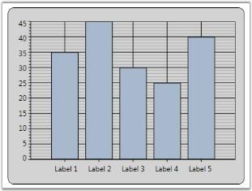
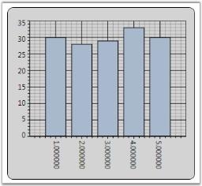
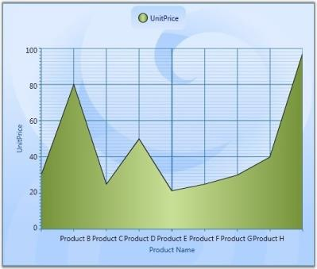

# Chart Labels

## Chart Font Settings

Font settings of each and every part of Chart such as Chart, ChartArea, ChartLegend and ChartAreaLegend can be customized with the following given properties.

* FontFamily
* FontSize
* FontStretch
* FontStyle
* FontWeight
* Foreground

> Note: Font settings set to the Chart will be applied to all the units of chart. However, properties set separately for those units such as ChartArea, ChartAxis, ChartLegend will override, these settings.

See Also

Chart Axis Label, Chart Axis Label Rotate, Intersecting Labels

## Chart Axis Label

ChartAxis Labels can be customized by using the following given properties.

_ChartAxis Property_

<table>
<tr>
<th>
ChartAxis Property</th><th>
Description</th></tr>
<tr>
<td>
LabelBackground</td><td>
gets or sets the Background of the ChartAxis Label</td></tr>
<tr>
<td>
LabelForeground</td><td>
gets or sets the Foreground of the ChartAxis Label</td></tr>
<tr>
<td>
LabelBorderBrush</td><td>
gets or sets the Border brush of the ChartAxis Label</td></tr>
<tr>
<td>
LabelBorderThickness</td><td>
gets or sets the Border thickness of the ChartAxis Label</td></tr>
<tr>
<td>
LabelCornerRadius</td><td>
gets or sets the Corner Radius of the ChartAxis Label</td></tr>
<tr>
<td>
LabelFontFamily</td><td>
gets or sets the FontFamily of the ChartAxis Label</td></tr>
<tr>
<td>
LabelFontSize</td><td>
gets or sets the FontSize of the ChartAxis Label</td></tr>
<tr>
<td>
LabelFontWeight</td><td>
gets or sets the FontWeight of the ChartAxis Label</td></tr>
<tr>
<td>
LabelFormat</td><td>
gets or sets the Format of the ChartAxis Label such as 0.00 or 0 precent</td></tr>
<tr>
<td>
LabelDateTimeFormat</td><td>
gets or sets the DateTime Format of the ChartAxis LabelApplicable when Axis.ValueType is DateTime</td></tr>
</table>
The following code example could be used to customize the Chart Axis Labels.


<sfchart:ChartArea.PrimaryAxis>

<sfchart:ChartAxis  LabelForeground="Blue" LabelBackground="Orange" LabelBorderBrush="Black" LabelBorderThickness="1" LabelCornerRadius="2" LabelFontFamily="Calibri" LabelFontSize="10" LabelFontWeight="Bold" LabelFormat="0%"/>

</sfchart:ChartArea.PrimaryAxis>




//Sets the Label settings of PrimaryAxis

 Area.PrimaryAxis.LabelForeground = Brushes.Blue;

 Area.PrimaryAxis.LabelBackground = Brushes.Orange;

 Area.PrimaryAxis.LabelBorderBrush = Brushes.Black;

 Area.PrimaryAxis.LabelBorderThickness = new Thickness(1);

 Area.PrimaryAxis.LabelCornerRadius = new CornerRadius(2);

 Area.PrimaryAxis.LabelFontFamily = new FontFamily("Calibri");

 Area.PrimaryAxis.LabelFontSize = 10;            

 Area.PrimaryAxis.LabelFontWeight = FontWeights.Bold;

 Area.PrimaryAxis.LabelFormat = "0%";           

Following given figure illustrates Chart with customized Primary Axis labels.

See Also

Chart Font Settings, Axis Label Rotate, Intersecting Labels

## Customizing Label Text

Apart from the default Labels displayed, you can also add Custom Labels to be displayed in the Chart. This section discusses the following topics.

Properties Used to Customize Label Text

The following properties are used to determine the data source for the text of the Labels.

_ChartAxis Property_

<table>
<tr>
<th>
ChartAxis Property</th><th>
Description</th></tr>
<tr>
<td>
LabelsMode</td><td>
{{ '_Auto_' | markdownify }}: content is determined automatically{{ '_Custom_' | markdownify }}: custom values are used for labels content representation{{ '_DataSource_' | markdownify }}: external datasource is used for labels content{{ '_Default_' | markdownify }}: content for labels is either determined automatically, taken from external dataSource or being set with custom values{{ '_None_' | markdownify }}: labels values are taken from point's X-coordinate</td></tr>
<tr>
<td>
LabelsSource</td><td>
gets or sets the Labels Source</td></tr>
<tr>
<td>
PositionPath</td><td>
gets or sets the position path</td></tr>
<tr>
<td>
ContentPath</td><td>
gets or sets the content path</td></tr>
</table>
By assigning the LabelsMode property to ChartAxis.CustomLabels, you can add Custom Labels to the ChartAxis.


<syncfusion:Chart Name="Chart1" >

          <syncfusion:ChartArea Name="area" >

                    <syncfusion:ChartArea.PrimaryAxis>

                        <syncfusion:ChartAxis LabelsMode="Custom" RangeCalculationMode="AdjustAcrossChartTypes">

                            <syncfusion:ChartAxis.CustomLabels>

                                <syncfusion:ChartAxisLabel Content="III place" Position="0" />

                                <syncfusion:ChartAxisLabel Content="I place" Position="1" />

                                <syncfusion:ChartAxisLabel Content="II place" Position="4" />

                            </syncfusion:ChartAxis.CustomLabels>

                        </syncfusion:ChartAxis>

                    </syncfusion:ChartArea.PrimaryAxis>                  

          </syncfusion:ChartArea>

</syncfusion:Chart>         




// Indicates that the axis labels need to be taken from a custom source.

area.PrimaryAxis.LabelsMode = ChartAxisLabelsMode.Custom;

ChartAxisLabel customLabel1 = new ChartAxisLabel();

customLabel1.Content = "III place";

customLabel1.Position = 0;

ChartAxisLabel customLabel2 = new ChartAxisLabel();

customLabel2.Content = "I place";

customLabel2.Position = 1;

ChartAxisLabel customLabel3 = new ChartAxisLabel();

customLabel3.Content = "II place";

customLabel3.Position = 4;

// Adding custom label to labels collection.

area.PrimaryAxis.CustomLabels.Add(customLabel1);

area.PrimaryAxis.CustomLabels.Add(customLabel2);

area.PrimaryAxis.CustomLabels.Add(customLabel3);           

The following screenshot illustrates Chart PrimaryAxis with Custom Labels.


### Labels from Data Source

The following code example illustrates how Custom Labels can be used in the ChartAxis.


// Indicates that the axis labels need to be taken from a data source.

area.PrimaryAxis.LabelsMode = ChartAxisLabelsMode.DataSource;   

// Creates DataSource with desired labels.

List<object> labels = new List<object>();

for (double i = 1; i < 6; i++)

{

labels.Add(new { Position = i, Content = "Label " + i.ToString() });

}

// Associates DataSource with the Chart Labels.

area.PrimaryAxis.LabelsSource = labels;       

// Set the position path where the labels should be placed.

area.PrimaryAxis.PositionPath = "Position";

// Set the content path from which labels are to be taken.

area.PrimaryAxis.ContentPath = "Content";

The following screenshot illustrates Chart PrimaryAxis with Labels from Data Source.

## Chart Axis Label Rotate

ChartAxis labels could be rotated with custom angles. Axis.LabelRotateAngle property is used to define the angle in which the Axis Labels need to be rotated.

The following code example could be used to customize the labels to be rotated with 90'.


<sfchart:ChartArea.PrimaryAxis>

<sfchart:ChartAxis LabelRotateAngle="90" LabelFormat="0.000000" />

</sfchart:ChartArea.PrimaryAxis>





//Sets the Label to be rotated with 90' angle

 Area.PrimaryAxis.LabelRotateAngle = 90;           

The following figure illustrates Chart with Primary Axis labels rotated with 90' angle

> Note: LabelRotateAngle property will not have effect when the Axis.IntersectAction property is set as Rotate.

See Also

Chart Font Settings, Chart Axis Label, Intersecting Labels

## Intersecting Labels

Sometimes the chart dimensions could cause the labels to intersect. The chart will, by default, render those texts one over the other. But, it also has some built-in capabilities to work around this overlap and lets you dictate the technique to follow. Refer to the properties as follows.

_ChartAxis Property_

<table>
<tr>
<th>
ChartAxis Property</th><th>
Description</th></tr>
<tr>
<td>
IntersectAction</td><td>
{{ '_Hide_' | markdownify }} – labels are hidden to avoid intersection{{ '_MultipleRows_' | markdownify }} – labels are wrapped into multiple rows to avoid intersection{{ '_None_' | markdownify }} – no special actionLabels may intersect{{ '_Rotate_' | markdownify }} – labels are rotated to avoid intersection{{ '_Wrap_' | markdownify }} – labels are wrapped to avoid intersection</td></tr>
<tr>
<td>
HidePartialLabel</td><td>
{{ '_True_' | markdownify }} – hides the labels that appear partiallyUsually the labels in the edges will be affected.{{ '_False_' | markdownify }} - labels are drawn as suchNo action will be taken.</td></tr>
<tr>
<td>
EdgeLabelsDrawingMode</td><td>
{{ '_Center_' | markdownify }} – draws the edge labels at the center of the GridLines{{ '_Shift_' | markdownify }} – value indicating that edge label should be shifted to either left or right so that it comes within the Chart Area</td></tr>
</table>


Chart1.Areas[0].PrimaryAxis.IntersectAction = ChartLabelIntersectAction.MultipleRows;

Chart1.Areas[0].PrimaryAxis.HidePartialLabel = true;

Chart1.Areas[0].PrimaryAxis.EdgeLabelsDrawingMode = EdgeLabelsDrawingMode.Shift;




<syncfusion:ChartArea.PrimaryAxis>

<syncfusion:ChartAxis Header="Product Name"  IntersectAction="MultipleRows" HidePartialLabel="True" EdgeLabelsDrawingMode="Shift"  />

</syncfusion:ChartArea.PrimaryAxis>

The following screenshot illustrates various techniques for avoiding the Label intersection.

See Also

Axis Label Rotate, Chart Font Settings, Chart Axis Label, 

## Legend Panel Customization 

Essential Chart enables you to arrange the legend items in any panel. You can arrange them in common panels like Grid, StackPanel, Canvas and WrapPanel. You can also create custom panel and arrange them. 

### Property

_Property Table_

<table>
<tr>
<th>
Property</th><th>
Description</th><th>
Type </th><th>
Data Type</th><th>
Reference links</th></tr>
<tr>
<td>
LegendItemsPanel</td><td>
Sets a template panel for arranging legend items.  </td><td>
Dependency Property</td><td>
ItemsPanelTemplate </td><td>
{{ '[ItemsPanelTemplate Class](http://msdn.microsoft.com/en-us/library/system.windows.controls.itemspaneltemplate.aspx)' | markdownify }}</td></tr>
</table>

### Customizing legend Panel

You can customize the legend panel using the _LegendItemsPanel_ property of ChartLegend. Following code illustrates this:


<syncfusion:ChartLegend IconVisibility="Visible" BorderThickness="0" LegendPanel="Custom">                                    <syncfusion:ChartLegend.LegendItemsPanel>                                        <ItemsPanelTemplate>                                            <StackPanel Orientation="Vertical"/>                                        </ItemsPanelTemplate>                                    </syncfusion:ChartLegend.LegendItemsPanel>                                </syncfusion:ChartLegend>



### Sample Link

To view sample:

1. Open the Syncfusion Dashboard.
2. Select User Interface.
3. Click the WPF drop-down list and select Explore Samples.
4. Navigate to WPF\Chart.WPF\Samples\3.5\WindowsSamples\Chart Customization\Custom Legend Items Panel Demo\