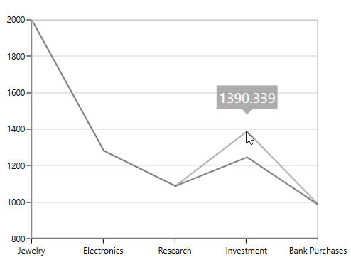
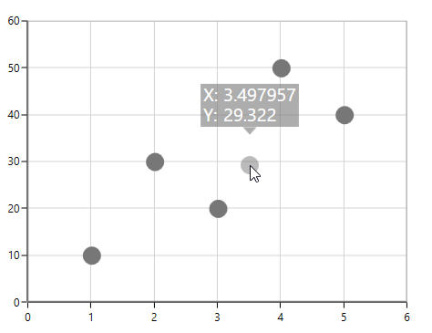
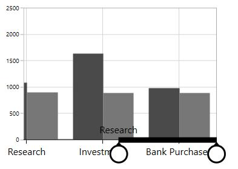
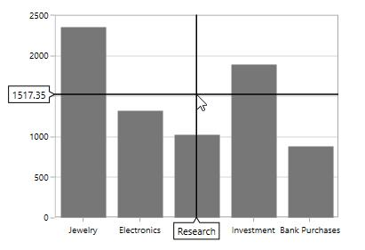
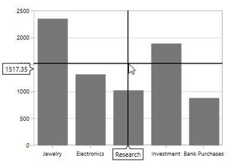
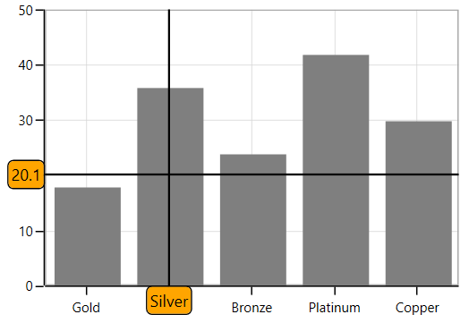

# Interactive features

SfChart provides interactive features such as tracking data points and resizing the scrollbar.

The following interactive features are supported in SfChart:

* Visual Data Editing
* Resizing Scrollbar
* CrossHair

## Visual data editing

SfChart has a feature that allows you to edit an entire series or a single data point at run time by dragging the single point or the series as a whole.

### Segment dragging

Segment Dragging defines the dragging a particular point or segment based on the series type. The segment dragging can be enabled using the [`EnableSegmentDragging`](https://help.syncfusion.com/cr/cref_files/wpf/Syncfusion.SfChart.WPF~Syncfusion.UI.Xaml.Charts.XySegmentDraggingBase~EnableSegmentDragging.html#) property to true.

**Line Series**





<syncfusion:LineSeries Label="2010" EnableSegmentDragging="True"

XBindingPath="Demand"   Interior="#777777"

ItemsSource="{Binding Demands}"                                   

YBindingPath="Year2010">

</syncfusion:LineSeries>





LineSeries series = new LineSeries()
{

    ItemsSource = new ViewModel().Demands,

    XBindingPath = "Demand",

    YBindingPath = "Year2010",

    EnableSegmentDragging = true,

    Interior = new SolidColorBrush(Color.FromRgb(0x77, 0x77, 0x77)),

    Label = "2010"

};

chart.Series.Add(series)





**Column Series**





<syncfusion:ColumnSeries Label="2010" EnableDragTooltip="True" EnableSegmentDragging="True"

XBindingPath="Demand"   Interior="#777777"

ItemsSource="{Binding Demands}"                                   

YBindingPath="Year2010">

</syncfusion:ColumnSeries>





ColumnSeries series = new ColumnSeries()
{

    ItemsSource = new ViewModel().Demands,

    XBindingPath = "Demand",

    YBindingPath = "Year2010",

    EnableSegmentDragging = true,

    EnableDragTooltip = true,

    Interior = new SolidColorBrush(Color.FromRgb(0x77, 0x77, 0x77)),

    Label = "2010"

};

chart.Series.Add(series)





**Scatter Series**

This series supports dragging in both the x and y co-ordinates. The dragging co-ordinates can be set by using the enum property [`DragDirection`](https://help.syncfusion.com/cr/cref_files/wpf/Syncfusion.SfChart.WPF~Syncfusion.UI.Xaml.Charts.ScatterSeries~DragDirection.html).





<syncfusion:ScatterSeries ItemsSource="{Binding Data}" XBindingPath="Index" 

                          YBindingPath="Value"  Interior="#777777"

                          EnableSegmentDragging="True" DragDirection="XY" >

 </syncfusion:ScatterSeries>





ScatterSeries series = new ScatterSeries()
            
{
                
ItemsSource = new ViewModel().Data,
                
XBindingPath = "Index",
                
YBindingPath = "Value",
                
Interior = new SolidColorBrush(Color.FromRgb(0x77, 0x77, 0x77)),
                
EnableSegmentDragging = true,

DragDirection = DragType.XY
            
};

chart.Series.Add(series)





N> By default, the DragDirection of the scatter series is XY.

### Series dragging

SfChart provides support to drag the LineSeries and SplineSeries. This allows the series to move to a new position by dragging. To enable the series dragging, you have to set [`EnableSeriesDragging`](https://help.syncfusion.com/cr/cref_files/wpf/Syncfusion.SfChart.WPF~Syncfusion.UI.Xaml.Charts.XySeriesDraggingBase~EnableSeriesDragging.html#) property to true.

The following code snippet explains the series dragging feature in LineSeries.





<syncfusion:LineSeries Label="2010" EnableDragTooltip="True" EnableSeriesDragging="True"

XBindingPath="Demand"   Interior="#777777" ItemsSource="{Binding Demands}"

YBindingPath="Year2010"/>





LineSeries series = new LineSeries()
{

    ItemsSource = new ViewModel().Demands,

    XBindingPath = "Demand",

    YBindingPath = "Year2010",

    EnableSeriesDragging = true,

    EnableDragTooltip = true ,

    Interior = new SolidColorBrush(Color.FromRgb(0x77, 0x77, 0x77)),

    Label = "2010"

};

chart.Series.Add(series);





N>In line and Spline Series, if segment and series dragging is enabled, the series dragging is having higher priority over segment dragging.

### ToolTip for dragging

While the series or segment is dragged by default you can view the tooltip showing the new y value. To disable the tooltip while dragging you have to set the [`EnableDragToolTip`](https://help.syncfusion.com/cr/cref_files/wpf/Syncfusion.SfChart.WPF~Syncfusion.UI.Xaml.Charts.XySegmentDraggingBase~EnableDragTooltip.html) as false.





<syncfusion:LineSeries Label="2010"  EnableSegmentDragging="True" EnableDragTooltip="False"

XBindingPath="Demand"   Interior="#777777"

Focusable="False"

ItemsSource="{Binding Demands}"                                   

</syncfusion:LineSeries>





LineSeries series = new LineSeries()
{

    ItemsSource = new ViewModel().Demands,

    XBindingPath = "Demand",

    YBindingPath = "Year2010",

    EnableSeriesDragging = true,

    EnableDragTooltip = true ,

    Focusable = false,

    Interior = new SolidColorBrush(Color.FromRgb(0x77, 0x77, 0x77)),

    Label = "2010"

};

chart.Series.Add(series);





**Drag Tooltip Template**

[`DragTooltipTemplate`](https://help.syncfusion.com/cr/cref_files/wpf/Syncfusion.SfChart.WPF~Syncfusion.UI.Xaml.Charts.XySegmentDraggingBase~DragTooltipTemplate.html#)  property allows you to customize the default appearance of the tooltip while dragging.





<syncfusion:SfChart x:Name="chart">

    <syncfusion:SfChart.Resources>

        <DataTemplate x:Key="tooltipTemplate">

            <Border CornerRadius="4" BorderBrush="Black"
                            
                    BorderThickness="1" Background="CadetBlue" 
                    
                    Margin="0,0,0,15">

                <TextBlock  FontSize="12" Text="{Binding NewValue}" 
                                    
                            Width="35" Foreground="White" Margin="2">
                
                </TextBlock>

            </Border>

        </DataTemplate>

    </syncfusion:SfChart.Resources>

    <syncfusion:LineSeries Label="2010" EnableSegmentDragging="True" 
                                   
                           Interior="#777777"
                                   
                           Focusable="False" 

                           XBindingPath="Demand" 
                                   
                           ItemsSource="{Binding Demands}"          
                                   
                           YBindingPath="Year2010"
                                   
                           DragTooltipTemplate="{StaticResource tooltipTemplate }">

    </syncfusion:LineSeries>
            
</syncfusion:SfChart>





ColumnSeries series = new ColumnSeries()
{

    ItemsSource = new ViewModel().Demands,

    XBindingPath = "Demand",

    YBindingPath = "Year2010",

    Focusable = false,

    EnableSegmentDragging = true,

    DragTooltipTemplate = chart.Resources["tooltipTemplate"] as DataTemplate,

    Interior = new SolidColorBrush(Color.FromRgb(0x77, 0x77, 0x77))

};

chart.Series.Add(series);





**Drag Tooltip Style**

The dragging tooltip can be customized by using the [`DragTooltipStyle`](https://help.syncfusion.com/cr/cref_files/wpf/Syncfusion.SfChart.WPF~Syncfusion.UI.Xaml.Charts.XySegmentDraggingBase~DragTooltipStyle.html) property of the series.

The following are the API’s in `ChartDragTooltipStyle`.

[`FontFamily`](https://help.syncfusion.com/cr/cref_files/wpf/Syncfusion.SfChart.WPF~Syncfusion.UI.Xaml.Charts.ChartDragTooltipStyle~FontFamily.html) – Gets or sets the font family for dragging tooltip text.

[`FontSize`](https://help.syncfusion.com/cr/cref_files/wpf/Syncfusion.SfChart.WPF~Syncfusion.UI.Xaml.Charts.ChartDragTooltipStyle~FontSize.html) – Gets or sets the font size for dragging tooltip text.

[`FontStyle`](https://help.syncfusion.com/cr/cref_files/wpf/Syncfusion.SfChart.WPF~Syncfusion.UI.Xaml.Charts.ChartDragTooltipStyle~FontStyle.html) – Gets or sets the font style for dragging tooltip text.

[`Foreground`](https://help.syncfusion.com/cr/cref_files/wpf/Syncfusion.SfChart.WPF~Syncfusion.UI.Xaml.Charts.ChartDragTooltipStyle~Foreground.html) – Gets or sets the brush for dragging tooltip text.

[`Background`](https://help.syncfusion.com/cr/cref_files/wpf/Syncfusion.SfChart.WPF~Syncfusion.UI.Xaml.Charts.ChartDragTooltipStyle~Background.html) – Gets or sets the background brush for dragging tooltip.





<syncfusion:LineSeries.DragTooltipStyle>
                    
<syncfusion:ChartDragTooltipStyle FontFamily="Calibri" FontSize="14" 
                                                     
                                  FontStyle="Italic" Background="DarkGray" 
                                                      
                                  Foreground="Black" />

</syncfusion:LineSeries.DragTooltipStyle>





series.DragTooltipStyle = new ChartDragTooltipStyle()
            
{
                
    FontFamily = new FontFamily("Calibri"),
                
    FontSize = 14,
                
    FontStyle = FontStyles.Italic,
                
    Background = new SolidColorBrush(Colors.DarkGray),
                
    Foreground = new SolidColorBrush(Colors.Black)
            
};





**Rounding** **Off** **the** **Dragged** **Value**

To round off the dragged values, you have to set the [`SnapToPoint`](https://help.syncfusion.com/cr/cref_files/wpf/Syncfusion.SfChart.WPF~Syncfusion.UI.Xaml.Charts.XySegmentDraggingBase~SnapToPoint.html#) and [`RoundToDecimal`](https://help.syncfusion.com/cr/cref_files/wpf/Syncfusion.SfChart.WPF~Syncfusion.UI.Xaml.Charts.XySegmentDraggingBase~RoundToDecimal.html#) properties. The following code snippet explains rounding the dragged y value to 2 decimal digits.





<syncfusion:SplineSeries   EnableSegmentDragging="True"

SnapToPoint="Round" RoundToDecimal="2" YBindingPath = "Year2010"

UpdateSource="True" XBindingPath="Demand"   Interior="#777777"

ItemsSource="{Binding Demands}"                                   

</syncfusion:SplineSeries>





SplineSeries series = new SplineSeries()
{

    ItemsSource = new ViewModel().Demands,

    XBindingPath = "Demand",

    YBindingPath = "Year2010",

    EnableSegmentDragging = true,

    UpdateSource = true ,

    RoundToDecimal = 2,

    SnapToPoint = SnapToPoint.Round,

    Interior = new SolidColorBrush(Color.FromRgb(0x77, 0x77, 0x77))

};

chart.Series.Add(series);





### Updating the Dragged Values to the Source

When dragging the series or segment at run time, to update the underlying data based on the values you have to set the [`UpdateSource`](https://help.syncfusion.com/cr/cref_files/wpf/Syncfusion.SfChart.WPF~Syncfusion.UI.Xaml.Charts.XySegmentDraggingBase~UpdateSource.html#) property to true as in the following code snippet.





<syncfusion:SplineSeries   EnableSegmentDragging="True" UpdateSource="True"

XBindingPath="Demand"   Interior="#777777"

ItemsSource="{Binding Demands}"                                   

YBindingPath="Year2010">

</syncfusion:SplineSeries>





SplineSeries series = new SplineSeries()
{

    ItemsSource = new ViewModel().Demands,

    XBindingPath = "Demand",

    YBindingPath = "Year2010",

    EnableSegmentDragging = true,

    UpdateSource = true ,

    Interior = new SolidColorBrush(Color.FromRgb(0x77, 0x77, 0x77))

};

chart.Series.Add(series);





### Drag Cancel using KeyModifiers

While you are dragging you can set the KeyModifiers to cancel the drag by setting [`DragCancelKeyModifier`](https://help.syncfusion.com/cr/cref_files/wpf/Syncfusion.SfChart.WPF~Syncfusion.UI.Xaml.Charts.XySegmentDraggingBase~DragCancelKeyModifiers.html#) property as in the below code snippet.





<syncfusion:SplineSeries  

EnableSegmentDragging="True" 

DragCancelKeyModifiers="Alt"  

UpdateSource="True"

XBindingPath="Demand"                                   

ItemsSource="{Binding Demands}"                                   

YBindingPath="Year2010">

</syncfusion:SplineSeries>





SplineSeries series = new SplineSeries()
{

    ItemsSource = new ViewModel().Demands,

    XBindingPath = "Demand",

    YBindingPath = "Year2010",

    EnableSegmentDragging = true,

    DragCancelKeyModifiers = ModifierKeys.Alt,

    UpdateSource = true ,

    Interior = new SolidColorBrush(Color.FromRgb(0x77, 0x77, 0x77))

};

chart.Series.Add(series);





### Events

Series with visual data editing has support for following events:

* [`DragStart`](https://help.syncfusion.com/cr/cref_files/wpf/Syncfusion.SfChart.WPF~Syncfusion.UI.Xaml.Charts.XySegmentDraggingBase~DragStart_EV.html#)- Occurs when segment/series drag started. 
* [`DragDelta`](https://help.syncfusion.com/cr/cref_files/wpf/Syncfusion.SfChart.WPF~Syncfusion.UI.Xaml.Charts.XySegmentDraggingBase~DragDelta_EV.html#)- Occurs when segment/series dragging.
* [`DragEnd`](https://help.syncfusion.com/cr/cref_files/wpf/Syncfusion.SfChart.WPF~Syncfusion.UI.Xaml.Charts.XySegmentDraggingBase~DragEnd_EV.html#)- Occurs when segment/series drag end. 
* [`PreviewDragEnd`](https://help.syncfusion.com/cr/cref_files/wpf/Syncfusion.SfChart.WPF~Syncfusion.UI.Xaml.Charts.XySegmentDraggingBase~PreviewDragEnd_EV.html#)- Occurs before drag end triggered. 
* [`SegmentEnter`](https://help.syncfusion.com/cr/cref_files/wpf/Syncfusion.SfChart.WPF~Syncfusion.UI.Xaml.Charts.XySegmentDraggingBase~SegmentEnter_EV.html#)- Occurs when mouse enters in segment. 

## Resizable Scrollbar

The resizable scrollbar is a type of scrollbar that can be resized within the track area by adjusting the scrolling thumbs. In the SfChart, a resizable scrollbar is used for zooming and panning across different chart segments.

### Adding ScrollBar to the Axis

[`EnableScrollBar`](https://help.syncfusion.com/cr/cref_files/wpf/Syncfusion.SfChart.WPF~Syncfusion.UI.Xaml.Charts.ChartAxisBase2D~EnableScrollBar.html#) property allows you to add the scrollbar for the particular axis. The following code snippet illustrates the scrollbar in the primary axis.





<syncfusion:SfChart.PrimaryAxis>

<syncfusion:CategoryAxis EnableScrollBar="True" />

</syncfusion:SfChart.PrimaryAxis>





chart.PrimaryAxis = new CategoryAxis()
{

    EnableScrollBar = true

};





**Deferred** **Scrolling**

SfChart provides support to suspend the value updates for every thumb values. This can be done using [`DeferredScrolling`](https://help.syncfusion.com/cr/cref_files/wpf/Syncfusion.SfChart.WPF~Syncfusion.UI.Xaml.Charts.ChartAxisBase2D~DeferredScrolling.html#) property in chart axis.The following code snippet demonstrates the deferred scrolling.





<syncfusion:SfChart.PrimaryAxis>

<syncfusion:CategoryAxis EnableScrollBar="True" DeferredScrolling="True"/>

</syncfusion:SfChart.PrimaryAxis>





chart.PrimaryAxis = new CategoryAxis()
{

    EnableScrollBar = true,

    DeferredScrolling = true,

};





**Resizing** **the** **scrollbar**

SfChart allows you to resize the scrollbar using [`EnableScrollBarResizing`](https://help.syncfusion.com/cr/cref_files/wpf/Syncfusion.SfChart.WPF~Syncfusion.UI.Xaml.Charts.ChartAxisBase2D~EnableScrollBarResizing.html#) property to true. By default the EnableScrollBarResizing property is true. The following code example and image demonstrates scrollbar without resizing option.





<syncfusion:SfChart.PrimaryAxis>

<syncfusion:CategoryAxis EnableScrollBar="True" EnableScrollBarResizing="False"/>

</syncfusion:SfChart.PrimaryAxis>





chart.PrimaryAxis = new CategoryAxis()
{

    EnableScrollBar = true,

    EnableScrollBarResizing = false,

};





### Scrollbar for Touch Mode

Scrollbar provides a touch mode style by enabling [`EnableTouchMode`](https://help.syncfusion.com/cr/cref_files/wpf/Syncfusion.SfChart.WPF~Syncfusion.UI.Xaml.Charts.ChartAxisBase2D~EnableTouchMode.html#) property to true as in the below code snippet.





<syncfusion:SfChart.PrimaryAxis>

<syncfusion:CategoryAxis EnableScrollBar="True" EnableTouchMode="True"/>

</syncfusion:SfChart.PrimaryAxis>





chart.PrimaryAxis = new CategoryAxis()
{

    EnableScrollBar = true,

    EnableTouchMode = true

};





**Thumb** **Label**

In touch mode while resizing or dragging the scrollbar to view thumb labels the [`ThumbLabelVisibility`](https://help.syncfusion.com/cr/cref_files/wpf/Syncfusion.SfChart.WPF~Syncfusion.UI.Xaml.Charts.ChartAxis~ThumbLabelVisibility.html#) is set to true.

The following code example demonstrates the thumb labels in scrollbar.





<syncfusion:SfChart.PrimaryAxis>

<syncfusion:CategoryAxis EnableScrollBar="True" ThumbLabelVisibility="Visible" EnableTouchMode="True"/>

</syncfusion:SfChart.PrimaryAxis>





chart.PrimaryAxis = new CategoryAxis()
{

    EnableScrollBar = true,

    EnableTouchMode = true,

    ThumbLabelVisibility = Visibility.Visible

};





**ThumbLabelTemplate**

[`ThumbLabelTemplate`](https://help.syncfusion.com/cr/cref_files/wpf/Syncfusion.SfChart.WPF~Syncfusion.UI.Xaml.Charts.ChartAxis~ThumbLabelTemplate.html#) property provides the custom template for the scroll bar thumb





<syncfusion:SfChart x:Name="chart">

    <syncfusion:SfChart.Resources>

        <DataTemplate x:Key="labelTemplate">

            <Grid>

                <Border BorderBrush="Black" Background="Pink" 
                                
                        BorderThickness="2">

                    <TextBlock Text="{Binding}" FontSize="15"/>

                </Border>

            </Grid>

        </DataTemplate>

    </syncfusion:SfChart.Resources>

    <syncfusion:SfChart.PrimaryAxis>

        <syncfusion:CategoryAxis EnableTouchMode="True" EnableScrollBar="True"
                                         
                                 ThumbLabelVisibility="Visible"
                                         
                                 ThumbLabelTemplate="{StaticResource labelTemplate}"/>

    </syncfusion:SfChart.PrimaryAxis>

</syncfusion:SfChart>





chart.PrimaryAxis = new CategoryAxis()
{

    EnableTouchMode = true,

    EnableScrollBar = true,

    ThumbLabelVisibility = Visibility.Visible,

    ThumbLabelTemplate = chart.Resources["labelTemplate"] as DataTemplate

};





## CrossHair

ChartCrossHairBehavior is used to view the values at mouse point or touch contact point. By moving these lines horizontally, you can get the X values and by moving these lines vertically, you can get the Y values.

### Adding CrossHairBehavior to SfChart

You can create an instance [`ChartCrossHairBehavior`](https://help.syncfusion.com/cr/cref_files/wpf/Syncfusion.SfChart.WPF~Syncfusion.UI.Xaml.Charts.ChartCrossHairBehavior.html#) and add it to the Behaviors collection.





<syncfusion:SfChart.Behaviors>

<syncfusion:ChartCrossHairBehavior />

</syncfusion:SfChart.Behaviors>





ChartCrossHairBehavior behavior = new ChartCrossHairBehavior();

chart.Behaviors.Add(behavior);





To view the axis labels then set the [`ShowTrackBallInfo`](https://help.syncfusion.com/cr/cref_files/wpf/Syncfusion.SfChart.WPF~Syncfusion.UI.Xaml.Charts.ChartAxis~ShowTrackBallInfo.html#) property to true as in the below code snippet.





<syncfusion:SfChart.PrimaryAxis>

<syncfusion:CategoryAxis  ShowTrackBallInfo="True"/>

</syncfusion:SfChart.PrimaryAxis>

<syncfusion:SfChart.SecondaryAxis>

<syncfusion:NumericalAxis  ShowTrackBallInfo="True"/>

</syncfusion:SfChart.SecondaryAxis>





ChartCrossHairBehavior behavior = new ChartCrossHairBehavior();

chart.Behaviors.Add(behavior);

chart.PrimaryAxis = new CategoryAxis()
{

    ShowTrackBallInfo = true

};

chart.SecondaryAxis = new NumericalAxis()
{

    ShowTrackBallInfo = true

};





Cross hair is composed of the following parts:

1. Vertical and horizontal line

2. Axis Labels

### Vertical and Horizontal Line

If you add [`ChartCrossHairBehavior`](https://help.syncfusion.com/cr/cref_files/wpf/Syncfusion.SfChart.WPF~Syncfusion.UI.Xaml.Charts.ChartCrossHairBehavior.html#) to chart you can see horizontal and vertical lines.The horizontal and vertical lines can be customized using [`HorizontalLineStyle`](https://help.syncfusion.com/cr/cref_files/wpf/Syncfusion.SfChart.WPF~Syncfusion.UI.Xaml.Charts.ChartCrossHairBehavior~HorizontalLineStyle.html#) and [`VerticalLineStyle`](https://help.syncfusion.com/cr/cref_files/wpf/Syncfusion.SfChart.WPF~Syncfusion.UI.Xaml.Charts.ChartCrossHairBehavior~VerticalLineStyle.html#) properties.

**HorizontalLineStyle**

The following code snippet demonstrates the line style for horizontal line in cross hair.





<syncfusion:SfChart x:Name="chart">

    <syncfusion:SfChart.Resources>

        
                
    </syncfusion:SfChart.Resources>

    <syncfusion:SfChart.Behaviors>

        <syncfusion:ChartCrossHairBehavior HorizontalLineStyle="{StaticResource lineStyle}"/>

    </syncfusion:SfChart.Behaviors>

</syncfusion:SfChart>





ChartCrossHairBehavior crosshair = new ChartCrossHairBehavior()
{

    HorizontalLineStyle = chart.Resources["lineStyle"] as Style

};

chart.Behaviors.Add(crosshair);





**VerticalLineStyle**





<syncfusion:SfChart x:Name="chart">

    <syncfusion:SfChart.Resources>

        
                
    </syncfusion:SfChart.Resources>

     <syncfusion:SfChart.Behaviors>

                <syncfusion:ChartCrossHairBehavior VerticalLineStyle="{StaticResource lineStyle}"/>

    </syncfusion:SfChart.Behaviors>

</syncfusion:SfChart>





ChartCrossHairBehavior crosshair = new ChartCrossHairBehavior()
{

    VerticalLineStyle = chart.Resources["lineStyle"] as Style

};

chart.Behaviors.Add(crosshair);





### Horizontal axis label

The vertical line in contact with the x axes shows axis label. The horizontal axis label can be aligned using [`HorizontalAxisLabelAlignment`](https://help.syncfusion.com/cr/cref_files/wpf/Syncfusion.SfChart.WPF~Syncfusion.UI.Xaml.Charts.ChartCrossHairBehavior~HorizontalAxisLabelAlignment.html#) property.

Axis Label can be aligned by Near, Far, Center, Auto and None Options.

* [`Auto`](https://help.syncfusion.com/cr/cref_files/wpf/Syncfusion.SfChart.WPF~Syncfusion.UI.Xaml.Charts.ChartAlignment.html) – Axis label is aligned in Near/Far positions based on the movement of vertical line.

* [`Far`](https://help.syncfusion.com/cr/cref_files/wpf/Syncfusion.SfChart.WPF~Syncfusion.UI.Xaml.Charts.ChartAlignment.html) - Axis label is positioned far from the position of vertical line in cross hair.

* [`Near`](https://help.syncfusion.com/cr/cref_files/wpf/Syncfusion.SfChart.WPF~Syncfusion.UI.Xaml.Charts.ChartAlignment.html) - Axis label is near to the position of trackball.

* [`Center`](https://help.syncfusion.com/cr/cref_files/wpf/Syncfusion.SfChart.WPF~Syncfusion.UI.Xaml.Charts.ChartAlignment.html) - Axis label is aligned to the center of the vertical line. By default the axis label will positioned in center.

The following image demonstrates the horizontal axis label positioned center to the vertical line.

**Far**





<syncfusion:SfChart.Behaviors>

<syncfusion:ChartCrossHairBehavior HorizontalAxisLabelAlignment="Far ">

</syncfusion:ChartCrossHairBehavior>

</syncfusion:SfChart.Behaviors>





ChartCrossHairBehavior behavior = new ChartCrossHairBehavior()
{

    HorizontalAxisLabelAlignment = ChartAlignment.Far

};

chart.Behaviors.Add(behavior);





**Near**





<syncfusion:SfChart.Behaviors>

<syncfusion:ChartCrossHairBehavior HorizontalAxisLabelAlignment="Near ">

</syncfusion:ChartCrossHairBehavior>

</syncfusion:SfChart.Behaviors>





ChartCrossHairBehavior behavior = new ChartCrossHairBehavior()
{

    HorizontalAxisLabelAlignment = ChartAlignment.Near

};

chart.Behaviors.Add(behavior);





### Vertical axis label

Vertical axis label is displayed when the horizontal line in contact with x axis.The label can be aligned using [`VerticalAxisLabelAlignment`](https://help.syncfusion.com/cr/cref_files/wpf/Syncfusion.SfChart.WPF~Syncfusion.UI.Xaml.Charts.ChartCrossHairBehavior~VerticalAxisLabelAlignment.html#) property.

Axis Label can be aligned by Near, Far, Center, Auto, and None Options.

The following image demonstrates the horizontal axis label positioned center to the vertical line.

**Near**





<syncfusion:SfChart.Behaviors>

<syncfusion:ChartCrossHairBehavior VerticalAxisLabelAlignment="Near">

</syncfusion:ChartCrossHairBehavior>

</syncfusion:SfChart.Behaviors>





ChartCrossHairBehavior behavior = new ChartCrossHairBehavior()
{

    VerticalAxisLabelAlignment = ChartAlignment.Near

};

chart.Behaviors.Add(behavior);





**Far**





<syncfusion:SfChart.Behaviors>

<syncfusion:ChartCrossHairBehavior VerticalAxisLabelAlignment="Far"  >

</syncfusion:ChartCrossHairBehavior>

</syncfusion:SfChart.Behaviors>





ChartCrossHairBehavior behavior = new ChartCrossHairBehavior()
{

    VerticalAxisLabelAlignment = ChartAlignment.Far

};

chart.Behaviors.Add(behavior);





**Customization of Crosshair axis labels**

The default appearance of the crosshair axis labels can be customized by using the [`CrosshairLabelTemplate`](https://help.syncfusion.com/cr/cref_files/wpf/Syncfusion.SfChart.WPF~Syncfusion.UI.Xaml.Charts.ChartAxis~CrosshairLabelTemplateProperty.html) property of chart axis. It can be set as shown in the following code example.





<chart:SfChart.PrimaryAxis>
    
    <chart:CategoryAxis ShowTrackBallInfo="True">
        
        <chart:CategoryAxis.CrosshairLabelTemplate>
                
            <DataTemplate>
                            
                 <Border Background="Orange" 
                                   
                         CornerRadius="4" 
                                    
                          BorderThickness="1" BorderBrush="Black">

                 <TextBlock Margin="2" Text="{Binding ValueX}"/>
                            
                </Border>
                
            </DataTemplate>
             
        </chart:CategoryAxis.CrosshairLabelTemplate>
                
    </chart:CategoryAxis>

</chart:SfChart.PrimaryAxis>

<chart:SfChart.SecondaryAxis>
                
       <chart:NumericalAxis ShowTrackBallInfo="True">
                    
            <chart:NumericalAxis.CrosshairLabelTemplate>
                        
                <DataTemplate>
                            
                    <Border Background="Orange" 
                                   
                            CornerRadius="4" 
                            
                             BorderThickness="1" 
                             
                             BorderBrush="Black">

                    <TextBlock  Margin="2" Text="{Binding ValueY}"/>
                   
                    </Border>
                        
                </DataTemplate>
            
            </chart:NumericalAxis.CrosshairLabelTemplate>
       
       </chart:NumericalAxis>

</chart:SfChart.SecondaryAxis>

<chart:SfChart.Behaviors>
       
    <chart:ChartCrossHairBehavior />
    
</chart:SfChart.Behaviors>





