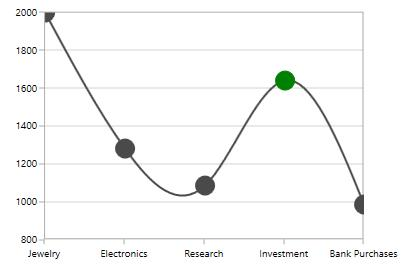
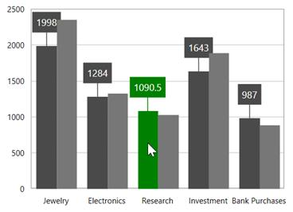
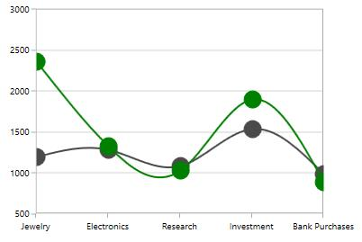
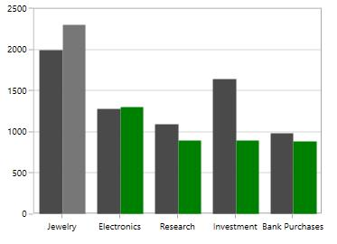

# Selection in WPF Charts (SfChart)

SfChart supports selection that allows you to select a segment in a series or series itself by using [`ChartSelectionBehavior`](https://help.syncfusion.com/cr/wpf/Syncfusion.UI.Xaml.Charts.ChartSelectionBehavior.html#). 

### Adding Selection Behavior to SfChart

You can create an instance [`ChartSelectionBehavior`](https://help.syncfusion.com/cr/wpf/Syncfusion.UI.Xaml.Charts.ChartSelectionBehavior.html#) and add it to the Behaviors collection.





<syncfusion:SfChart.Behaviors>

<syncfusion:ChartSelectionBehavior >

</syncfusion:ChartSelectionBehavior>

</syncfusion:SfChart.Behaviors>





ChartSelectionBehavior selection = new ChartSelectionBehavior();

chart.Behaviors.Add(selection);





## SegmentSelection

Segment Selection allows you to highlight a segment in a chart series. To enable a segment selection in a chart series, you have to set the [`EnableSegmentSelection`](https://help.syncfusion.com/cr/wpf/Syncfusion.UI.Xaml.Charts.ChartSelectionBehavior.html#Syncfusion_UI_Xaml_Charts_ChartSelectionBehavior_EnableSegmentSelection) property to True.For highlighting a segment the  brush color can be set using [`SegmentSelectionBrush`](https://help.syncfusion.com/cr/wpf/Syncfusion.UI.Xaml.Charts.ColumnSeries.html#Syncfusion_UI_Xaml_Charts_ColumnSeries_SegmentSelectionBrush) property.

**ColumnSeries**





<syncfusion:SfChart.Behaviors>

<syncfusion:ChartSelectionBehavior   EnableSegmentSelection="True" >

</syncfusion:ChartSelectionBehavior>

</syncfusion:SfChart.Behaviors>

<syncfusion:ColumnSeries Label="2011" SegmentSelectionBrush="Green" Interior="#777777"

ItemsSource="{Binding Demands}" XBindingPath="Demand" YBindingPath="Year2011"/>





ChartSelectionBehavior selection = new ChartSelectionBehavior()
{

    EnableSegmentSelection = true

};

chart.Behaviors.Add(selection);

ColumnSeries series = new ColumnSeries()
{

    ItemsSource = new ViewModel().Demands,

    XBindingPath = "Demand",

    YBindingPath = "Year2010",

    Label ="2011",

    SegmentSelectionBrush = new SolidColorBrush(Colors.Green),

    Interior = new SolidColorBrush(Color.FromRgb(0x77, 0x77, 0x77))

};

chart.Series.Add(series);





**SplineSeries**

In Linear type series the segment selection can be viewed by changing the adornments symbol interior.

The following code example demonstrates the spline series segment selection by changing the adornments interior.





<syncfusion:SplineSeries SegmentSelectionBrush="Red"

ItemsSource="{Binding Demands}" Interior="#4A4A4A"

XBindingPath="Demand"

YBindingPath="Year2010">

<syncfusion:SplineSeries.AdornmentsInfo>

<syncfusion:ChartAdornmentInfo ShowMarker="True" Symbol="Ellipse" HighlightOnSelection="True"></syncfusion:ChartAdornmentInfo>

</syncfusion:SplineSeries.AdornmentsInfo>

</syncfusion:SplineSeries>





ChartSelectionBehavior selection = new ChartSelectionBehavior()
{

    EnableSegmentSelection = true

};

chart.Behaviors.Add(selection);

SplineSeries series = new SplineSeries()
{

    ItemsSource = new ViewModel().Demands,

    XBindingPath = "Demand",

    YBindingPath = "Year2010",

    SegmentSelectionBrush = new SolidColorBrush(Colors.Red),

    Interior = new SolidColorBrush(Color.FromRgb(0x4A, 0x4A, 0x4A))

};

ChartAdornmentInfo adornmentInfo = new ChartAdornmentInfo()
{

    ShowMarker = true,

    HighlightOnSelection = true,

    Symbol = ChartSymbol.Ellipse

};

series.AdornmentsInfo = adornmentInfo;

chart.Series.Add(series);





## Series Selection

Series selection is used in case of multiple series when you want to highlight a particular series.Series Selection can be enabled by setting [`EnableSeriesSelection`](https://help.syncfusion.com/cr/wpf/Syncfusion.UI.Xaml.Charts.ChartSelectionBehavior.html#Syncfusion_UI_Xaml_Charts_ChartSelectionBehavior_EnableSeriesSelection)  property to True. The [`SeriesSelectionBrush`](https://help.syncfusion.com/cr/wpf/Syncfusion.UI.Xaml.Charts.ChartSeriesBase.html#Syncfusion_UI_Xaml_Charts_ChartSeriesBase_SeriesSelectionBrush) property is used to set the brush color to highlight the series.

The following code example demonstrates highlighting a series.





<syncfusion:SfChart.Behaviors>

<syncfusion:ChartSelectionBehavior EnableSegmentSelection="False" EnableSeriesSelection="True"/>

</syncfusion:SfChart.Behaviors>   

<syncfusion:ScatterSeries Label="2010"  SeriesSelectionBrush="Green"

ItemsSource="{Binding Demands}" Interior="#4A4A4A"

XBindingPath="Demand"

YBindingPath="Year2010">

</syncfusion:ScatterSeries>

<syncfusion:ScatterSeries Label="2011" SeriesSelectionBrush="Green" Interior="#777777"

ItemsSource="{Binding Demands}" XBindingPath="Demand" 

YBindingPath="Year2011"/>    





ChartSelectionBehavior selection = new ChartSelectionBehavior()
{

    EnableSegmentSelection = true,

    EnableSeriesSelection = true

};

chart.Behaviors.Add(selection);

ScatterSeries series1 = new ScatterSeries()
{

    ItemsSource = new ViewModel().Demands,

    XBindingPath = "Demand",

    YBindingPath = "Year2010",

    Label = "2010",

    SegmentSelectionBrush = new SolidColorBrush(Colors.Green),

    Interior = new SolidColorBrush(Color.FromRgb(0x4A, 0x4A, 0x4A))

};

ScatterSeries series2 = new ScatterSeries()
{

    ItemsSource = new ViewModel().Demands,

    XBindingPath = "Demand",

    YBindingPath = "Year2011",

    Label = "2011",

    SegmentSelectionBrush = new SolidColorBrush(Colors.Green),

    Interior = new SolidColorBrush(Color.FromRgb(0x77, 0x77, 0x77))

};

chart.Series.Add(series1);

chart.Series.Add(series2);





N>By default the segment selection is true, so for selecting series you have to set the EnableSegmentSelection property to false.

## Adornment Selection:

SfChart provides selection for adornments by defining [`HighlightOnSelection`](https://help.syncfusion.com/cr/wpf/Syncfusion.UI.Xaml.Charts.ChartAdornmentInfoBase.html#Syncfusion_UI_Xaml_Charts_ChartAdornmentInfoBase_HighlightOnSelection) property which allows you to select the segment or series with the corresponding adornments.

**HighlightOnSelection**

**Segment** **Selection**

The following code example demonstrates the segment selection with adornments 





<syncfusion:ColumnSeries Interior="#4A4A4A"

ItemsSource="{Binding Demands}" XBindingPath="Demand"

SegmentSelectionBrush="Green"

YBindingPath="Year2010">

<syncfusion:ColumnSeries.AdornmentsInfo>

<syncfusion:ChartAdornmentInfo UseSeriesPalette="True" ShowConnectorLine="True"

ConnectorHeight="30" ShowLabel="True" HighlightOnSelection="True">

</syncfusion:ChartAdornmentInfo>

</syncfusion:ColumnSeries.AdornmentsInfo>





ChartSelectionBehavior selection = new ChartSelectionBehavior()
{

    EnableSegmentSelection = true

};

chart.Behaviors.Add(selection);

ColumnSeries series = new ColumnSeries()
{

    ItemsSource = new ViewModel().Demands,

    XBindingPath = "Demand",

    YBindingPath = "Year2010",

    SegmentSelectionBrush = new SolidColorBrush(Colors.Green),

    Interior = new SolidColorBrush(Color.FromRgb(0x4A, 0x4A, 0x4A))

};

ChartAdornmentInfo adornmentInfo = new ChartAdornmentInfo()
{

    ShowLabel = true,

    ShowConnectorLine = true,

    HighlightOnSelection = true,

    UseSeriesPalette = true,

    ConnectorHeight = 30

};

series.AdornmentsInfo = adornmentInfo;

chart.Series.Add(series);





**Series** **Selection**

The following code example demonstrates the series selection with adornments. 





<syncfusion:SfChart.Behaviors>

<syncfusion:ChartSelectionBehavior EnableSegmentSelection="False" 

EnableSeriesSelection="True"/>

</syncfusion:SfChart.Behaviors>

<syncfusion:SplineSeries ItemsSource="{Binding Demands}" SeriesSelectionBrush="Green"

XBindingPath="Demand" 

YBindingPath="Year2010">

<syncfusion:SplineSeries.AdornmentsInfo>

<syncfusion:ChartAdornmentInfo Symbol="Ellipse"

ShowMarker="True"

HighlightOnSelection="True">                                            

</syncfusion:ChartAdornmentInfo>

</syncfusion:SplineSeries.AdornmentsInfo>

</syncfusion:SplineSeries>

<syncfusion:SplineSeries Label="2010" Interior="#4A4A4A" 

ItemsSource="{Binding Demands}" SeriesSelectionBrush="Green"

XBindingPath="Demand"

YBindingPath="Year2011">

<syncfusion:SplineSeries.AdornmentsInfo>

<syncfusion:ChartAdornmentInfo Symbol="Ellipse"

ShowMarker="True"

HighlightOnSelection="True">

</syncfusion:ChartAdornmentInfo>

</syncfusion:SplineSeries.AdornmentsInfo>

</syncfusion:SplineSeries>





ChartSelectionBehavior selection = new ChartSelectionBehavior()
{

    EnableSegmentSelection = false,

    EnableSeriesSelection = true

};

chart.Behaviors.Add(selection);

SplineSeries series1 = new SplineSeries()
{

    ItemsSource = new ViewModel().Demands,

    XBindingPath = "Demand",

    YBindingPath = "Year2010",

    SeriesSelectionBrush = new SolidColorBrush(Colors.Green)

};

ChartAdornmentInfo adornmentInfo = new ChartAdornmentInfo()
{

    ShowMarker = true,

    Symbol = ChartSymbol.Ellipse

};

series1.AdornmentsInfo = adornmentInfo;

SplineSeries series2 = new SplineSeries()
{

    ItemsSource = new ViewModel().Demands,

    XBindingPath = "Demand",

    YBindingPath = "Year2011",

    SeriesSelectionBrush = new SolidColorBrush(Colors.Green),

    Interior = new SolidColorBrush(Color.FromRgb(0x4A,0x4A,0x4A))

};

ChartAdornmentInfo adornmentInfo1 = new ChartAdornmentInfo()
{

    ShowMarker = true,

    Symbol = ChartSymbol.Ellipse,

    HighlightOnSelection = true

};

series2.AdornmentsInfo = adornmentInfo1;

chart.Series.Add(series1);

chart.Series.Add(series2);





## Selection Mode

SfChart provides support to select using mouse move or mouse click. By default the selection will take place in mouse click. The selection mode can be defined using [`SelectionMode`](https://help.syncfusion.com/cr/wpf/Syncfusion.UI.Xaml.Charts.ChartSelectionBehavior.html#Syncfusion_UI_Xaml_Charts_ChartSelectionBehavior_SelectionMode) property for segment and series selection.

The following code snippet demonstrates the selection mode using [`MouseMove`](https://help.syncfusion.com/cr/wpf/Syncfusion.UI.Xaml.Charts.SelectionMode.html).





<syncfusion:SfChart.Behaviors>

<syncfusion:ChartSelectionBehavior SelectionMode="MouseMove" EnableSeriesSelection="True">

</syncfusion:ChartSelectionBehavior>

</syncfusion:SfChart.Behaviors>





ChartSelectionBehavior selection = new ChartSelectionBehavior()
{

    SelectionMode = Syncfusion.UI.Xaml.Charts.SelectionMode.MouseMove,

    EnableSeriesSelection = true

};

chart.Behaviors.Add(selection);





## Customizing the Selection

SfChart allows you to select single or multiple segment /series using [`SelectionStyle`](https://help.syncfusion.com/cr/wpf/Syncfusion.UI.Xaml.Charts.ChartSelectionBehavior.html#Syncfusion_UI_Xaml_Charts_ChartSelectionBehavior_SelectionStyle) property. By default the SelectionStyle is [`Single`](https://help.syncfusion.com/cr/wpf/Syncfusion.UI.Xaml.Charts.SelectionStyle.html).

The following code snippet demonstrates multiple segment selection.





<syncfusion:SfChart.Behaviors>

<syncfusion:ChartSelectionBehavior SelectionStyle="Multiple" EnableSegmentSelection="True">

</syncfusion:ChartSelectionBehavior>

</syncfusion:SfChart.Behaviors>





ChartSelectionBehavior selection = new ChartSelectionBehavior()
{

    SelectionStyle = SelectionStyle.Multiple,

    EnableSegmentSelection = true

};

chart.Behaviors.Add(selection);





### Changing Cursor while Selection

[`SelectionCursor`](https://help.syncfusion.com/cr/wpf/Syncfusion.UI.Xaml.Charts.ChartSelectionBehavior.html#Syncfusion_UI_Xaml_Charts_ChartSelectionBehavior_SelectionCursor) property allows you to define the cursor when mouse is hovered over the segment with segment or series selection enabled.

The following code snippet demonstrates hand cursor in segment selection.





<syncfusion:SfChart.Behaviors>

<syncfusion:ChartSelectionBehavior SelectionCursor="Hand"  EnableSegmentSelection="True">

</syncfusion:ChartSelectionBehavior>

</syncfusion:SfChart.Behaviors>





ChartSelectionBehavior selection = new ChartSelectionBehavior()
{

    SelectionCursor = Cursors.Hand,

    EnableSegmentSelection = true

};

chart.Behaviors.Add(selection);





## Events

The following events are available in SfChart for ChartSelectionBehavior,

### SelectionChanging

The [`SelectionChanging`](https://help.syncfusion.com/cr/wpf/Syncfusion.UI.Xaml.Charts.ChartBase.html) event occurs before the data point is being selected. This is a cancelable event. This argument contains the following information.

* [`SelectedSeries`](https://help.syncfusion.com/cr/wpf/Syncfusion.UI.Xaml.Charts.ChartSelectionChangingEventArgs.html#Syncfusion_UI_Xaml_Charts_ChartSelectionChangingEventArgs_SelectedSeries) - Gets the series of the selected data point.
* [`SelectedSegments`](https://help.syncfusion.com/cr/wpf/Syncfusion.UI.Xaml.Charts.ChartSelectionChangingEventArgs.html#Syncfusion_UI_Xaml_Charts_ChartSelectionChangingEventArgs_SelectedSegments) - Gets or sets the segments collection of the selected series.
* [`SelectedSegment`](https://help.syncfusion.com/cr/wpf/Syncfusion.UI.Xaml.Charts.ChartSelectionChangingEventArgs.html#Syncfusion_UI_Xaml_Charts_ChartSelectionChangingEventArgs_SelectedSegment) - Gets the segment of the selected data point.
* [`SelectedIndex`](https://help.syncfusion.com/cr/wpf/Syncfusion.UI.Xaml.Charts.ChartSelectionChangingEventArgs.html#Syncfusion_UI_Xaml_Charts_ChartSelectionChangingEventArgs_SelectedIndex) - Gets the selected data point index.
* [`PreviousSelectedIndex`](https://help.syncfusion.com/cr/wpf/Syncfusion.UI.Xaml.Charts.ChartSelectionChangingEventArgs.html#Syncfusion_UI_Xaml_Charts_ChartSelectionChangingEventArgs_PreviousSelectedIndex) - Gets the previous selected data point index.
* [`IsSelected`](https://help.syncfusion.com/cr/wpf/Syncfusion.UI.Xaml.Charts.ChartSelectionChangingEventArgs.html#Syncfusion_UI_Xaml_Charts_ChartSelectionChangingEventArgs_IsSelected) - Gets a value that indicates whether the segment or series is selected.
* [`IsDataPointSelection`](https://help.syncfusion.com/cr/wpf/Syncfusion.UI.Xaml.Charts.ChartSelectionChangingEventArgs.html#Syncfusion_UI_Xaml_Charts_ChartSelectionChangingEventArgs_IsDataPointSelection) - Gets a value that indicates whether the selection is segment selection or series selection.
* [`Cancel`](https://help.syncfusion.com/cr/wpf/Syncfusion.UI.Xaml.Charts.ChartSelectionChangingEventArgs.html#Syncfusion_UI_Xaml_Charts_ChartSelectionChangingEventArgs_Cancel) - Gets or Sets a value that indicates whether the selection should be canceled.

### SelectionChanged

The [`SelectionChanged`](https://help.syncfusion.com/cr/wpf/Syncfusion.UI.Xaml.Charts.ChartBase.html) event occurs after a data point has been selected. This argument contains the following information.

* [`SelectedSeries`](https://help.syncfusion.com/cr/wpf/Syncfusion.UI.Xaml.Charts.ChartSelectionChangedEventArgs.html#Syncfusion_UI_Xaml_Charts_ChartSelectionChangedEventArgs_SelectedSeries) - Gets the series of the selected data point.
* [`SelectedSegments`](https://help.syncfusion.com/cr/wpf/Syncfusion.UI.Xaml.Charts.ChartSelectionChangedEventArgs.html#Syncfusion_UI_Xaml_Charts_ChartSelectionChangedEventArgs_SelectedSegments) - Gets the segments collection of the selected series.
* [`SelectedSegment`](https://help.syncfusion.com/cr/wpf/Syncfusion.UI.Xaml.Charts.ChartSelectionChangedEventArgs.html#Syncfusion_UI_Xaml_Charts_ChartSelectionChangedEventArgs_SelectedSegment) - Gets the segment of the selected data point.
* [`SelectedIndex`](https://help.syncfusion.com/cr/wpf/Syncfusion.UI.Xaml.Charts.ChartSelectionChangedEventArgs.html#Syncfusion_UI_Xaml_Charts_ChartSelectionChangedEventArgs_SelectedIndex) - Gets the selected data point index.
* [`PreviousSelectedSeries`](https://help.syncfusion.com/cr/wpf/Syncfusion.UI.Xaml.Charts.ChartSelectionChangedEventArgs.html#Syncfusion_UI_Xaml_Charts_ChartSelectionChangedEventArgs_PreviousSelectedSeries) - Gets the previous selected series.
* [`PreviousSelectedSegments`](https://help.syncfusion.com/cr/wpf/Syncfusion.UI.Xaml.Charts.ChartSelectionChangedEventArgs.html#Syncfusion_UI_Xaml_Charts_ChartSelectionChangedEventArgs_PreviousSelectedSegments) - Gets the segments collection of previous selected series.
* [`PreviousSelectedSegment`](https://help.syncfusion.com/cr/wpf/Syncfusion.UI.Xaml.Charts.ChartSelectionChangedEventArgs.html#Syncfusion_UI_Xaml_Charts_ChartSelectionChangedEventArgs_PreviousSelectedSegment) - Gets the segment of previous selected data point.
* [`PreviousSelectedIndex`](https://help.syncfusion.com/cr/wpf/Syncfusion.UI.Xaml.Charts.ChartSelectionChangedEventArgs.html#Syncfusion_UI_Xaml_Charts_ChartSelectionChangedEventArgs_PreviousSelectedIndex) - Gets the previous selected data point index.
* [`OldPointInfo`](https://help.syncfusion.com/cr/wpf/Syncfusion.UI.Xaml.Charts.ChartSelectionChangedEventArgs.html#Syncfusion_UI_Xaml_Charts_ChartSelectionChangedEventArgs_OldPointInfo) - Gets the previous selected segment item value.
* [`NewPointInfo`](https://help.syncfusion.com/cr/wpf/Syncfusion.UI.Xaml.Charts.ChartSelectionChangedEventArgs.html#Syncfusion_UI_Xaml_Charts_ChartSelectionChangedEventArgs_NewPointInfo) - Gets the selected segment item value.
* [`IsSelected`](https://help.syncfusion.com/cr/wpf/Syncfusion.UI.Xaml.Charts.ChartSelectionChangedEventArgs.html#Syncfusion_UI_Xaml_Charts_ChartSelectionChangedEventArgs_IsSelected) - Gets a value that indicates whether the segment or series is being selected.
* [`IsDataPointSelection`](https://help.syncfusion.com/cr/wpf/Syncfusion.UI.Xaml.Charts.ChartSelectionChangedEventArgs.html#Syncfusion_UI_Xaml_Charts_ChartSelectionChangedEventArgs_IsDataPointSelection) - Gets a value that indicates whether the selection is segment selection or series selection.
* [`SelectedSeriesCollection`](https://help.syncfusion.com/cr/wpf/Syncfusion.UI.Xaml.Charts.ChartSelectionChangedEventArgs.html#Syncfusion_UI_Xaml_Charts_ChartSelectionChangedEventArgs_SelectedSeriesCollection) - Gets the series collection that has been selected through rectangle selection or mouse interaction.

## See also

[`How to change the series selection when clicking the legend items in WPF Chart`](https://www.syncfusion.com/kb/10461/how-to-change-the-series-selection-when-clicking-the-legend-items-in-wpf-chart)

[`How to deselect the chart segment by using code behind`](https://www.syncfusion.com/kb/5473/how-to-deselect-the-chart-segment-by-using-code-behind)

[`How to achieve series drilldown behavior in Chart`](https://www.syncfusion.com/kb/2692/how-to-achieve-series-drilldown-behaviour-in-sfchart)
