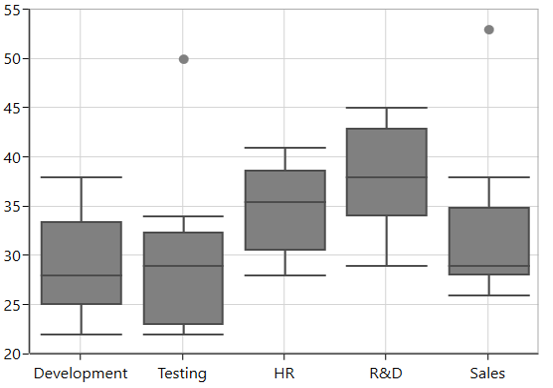
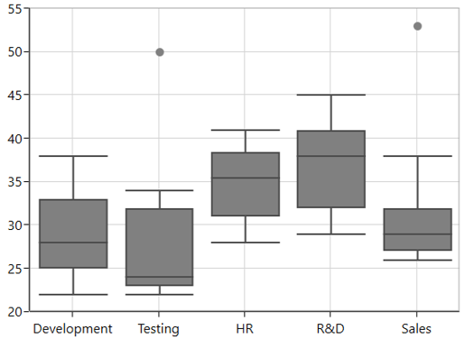
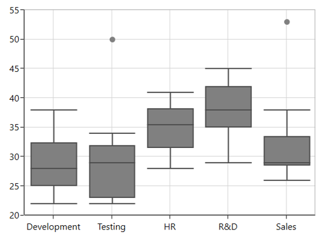
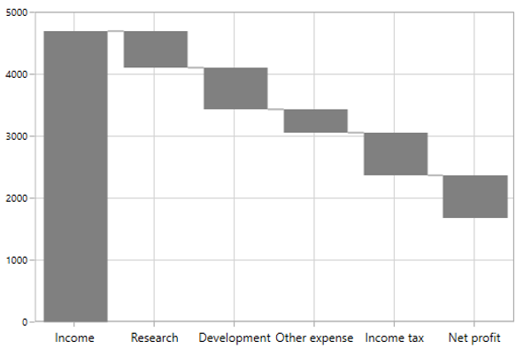
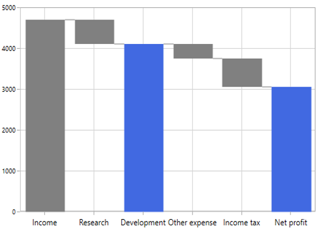
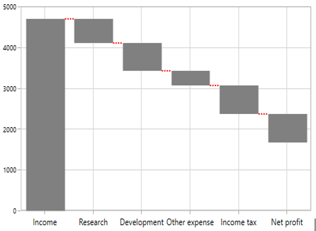

# Other

## Box and Whisker 

[`BoxAndWhiskerSeries`](https://help.syncfusion.com/cr/cref_files/wpf/Syncfusion.SfChart.WPF~Syncfusion.UI.Xaml.Charts.BoxAndWhiskerSeries.html) plots a combination of rectangle and lines to show the distribution of the dataset. The following code illustrates how to define the series in chart.





<chart:BoxAndWhiskerSeries ItemsSource="{Binding BoxWhiskerData}"  
                          
                            XBindingPath="Department" 
                          
                            YBindingPath="Age">

</chart:BoxAndWhiskerSeries>





BoxAndWhiskerSeries boxAndWhisker = new BoxAndWhiskerSeries();

boxAndWhisker.ItemsSource = new BoxWhiskerViewModel().BoxWhiskerData;

boxAndWhisker.XBindingPath = "Department";

boxAndWhisker.YBindingPath = "Age";

boxWhiskerChart.Series.Add(boxAndWhisker);





N>By default, the `BoxPlotMode` property value is Exclusive.

**Customize the series Box mode**

The series box plotting mode can be changed by using [`BoxPlotMode`](https://help.syncfusion.com/cr/cref_files/wpf/Syncfusion.SfChart.WPF~Syncfusion.UI.Xaml.Charts.BoxAndWhiskerSeries~BoxPlotModeProperty.html) property of [`BoxAndWhiskerSeries`](https://help.syncfusion.com/cr/cref_files/wpf/Syncfusion.SfChart.WPF~Syncfusion.UI.Xaml.Charts.BoxAndWhiskerSeries.html). The plotting mode of series can be calculated as follows:

* [`Exclusive`](https://help.syncfusion.com/cr/cref_files/wpf/Syncfusion.SfChart.WPF~Syncfusion.UI.Xaml.Charts.BoxPlotMode.html) – The quartile values are calculated by using the formula (N+1) * P (N count, P percentile) and its index value starts from 1 in the list.
* [`Inclusive`](https://help.syncfusion.com/cr/cref_files/wpf/Syncfusion.SfChart.WPF~Syncfusion.UI.Xaml.Charts.BoxPlotMode.html) – The quartile values are calculated by using the formula (N−1) * P (N count, P percentile) and its index value starts from 0 in the list.
* [`Normal`](https://help.syncfusion.com/cr/cref_files/wpf/Syncfusion.SfChart.WPF~Syncfusion.UI.Xaml.Charts.BoxPlotMode.html) – The quartile values are calculated by splitting the list and getting the median values.

**Normal**

The following code illustrates how to define the [`BoxPlotMode`](https://help.syncfusion.com/cr/cref_files/wpf/Syncfusion.SfChart.WPF~Syncfusion.UI.Xaml.Charts.BoxAndWhiskerSeries~BoxPlotModeProperty.html) value as Normal.





<chart:BoxAndWhiskerSeries  BoxPlotMode="Normal">

</chart:BoxAndWhiskerSeries>





BoxAndWhiskerSeries boxAndWhisker = new BoxAndWhiskerSeries();

boxAndWhisker.BoxPlotMode = BoxPlotMode.Normal;





**Inclusive**

The following code illustrates how to define the [`BoxPlotMode`](https://help.syncfusion.com/cr/cref_files/wpf/Syncfusion.SfChart.WPF~Syncfusion.UI.Xaml.Charts.BoxAndWhiskerSeries~BoxPlotModeProperty.html) value as Inclusive.





<chart:BoxAndWhiskerSeries  BoxPlotMode="Inclusive">

</chart:BoxAndWhiskerSeries>





BoxAndWhiskerSeries boxAndWhisker = new BoxAndWhiskerSeries();

boxAndWhisker.BoxPlotMode = BoxPlotMode.Inclusive;





**ShowMedian**

The Median values of given dataset is viewed by enabling the [`ShowMedian`](https://help.syncfusion.com/cr/cref_files/wpf/Syncfusion.SfChart.WPF~Syncfusion.UI.Xaml.Charts.BoxAndWhiskerSeries~ShowMedianProperty.html) property of [`BoxAndWhiskerSeries`](https://help.syncfusion.com/cr/cref_files/wpf/Syncfusion.SfChart.WPF~Syncfusion.UI.Xaml.Charts.BoxAndWhiskerSeries.html). The following code illustrates how to enable the [`ShowMedian`](https://help.syncfusion.com/cr/cref_files/wpf/Syncfusion.SfChart.WPF~Syncfusion.UI.Xaml.Charts.BoxAndWhiskerSeries~ShowMedianProperty.html) property.





<chart:BoxAndWhiskerSeries ShowMedian="True">

</chart:BoxAndWhiskerSeries>





BoxAndWhiskerSeries boxAndWhisker = new BoxAndWhiskerSeries();

boxAndWhisker.ShowMedian = true;





**Outlier Template**

The default appearance of the outlier symbol can be customized by using the [`OutlierTemplate`](https://help.syncfusion.com/cr/cref_files/wpf/Syncfusion.SfChart.WPF~Syncfusion.UI.Xaml.Charts.BoxAndWhiskerSeries~OutlierTemplateProperty.html) property of [`BoxAndWhiskerSeries`](https://help.syncfusion.com/cr/cref_files/wpf/Syncfusion.SfChart.WPF~Syncfusion.UI.Xaml.Charts.BoxAndWhiskerSeries.html). The following code illustrates how to customize the outlier symbol.





<chart:BoxAndWhiskerSeries.OutlierTemplate>

    <DataTemplate>

        <Canvas>

                 <Path Stretch="Fill" Height="10" Width="10"  Fill="{Binding Interior}" 
                              
                         Canvas.Left="{Binding RectX}" Canvas.Top="{Binding RectY}"
      
                            Data="F1 M 145.193,54.8249L 169.315,54.8249L 169.315,
            
                                    78.9463L 145.193,78.9463L 145.193,103.074L 121.071,
            
                                    103.074L 121.071,78.9463L 96.946,78.9463L 96.946,
           
                                    54.8249L 121.071,54.8249L 121.071,
            
                                    30.6983L 145.193,30.6983L 145.193,54.8249 Z"/>

          </Canvas>

    </DataTemplate>

</chart:BoxAndWhiskerSeries.OutlierTemplate>





## Waterfall Series

[`WaterfallSeries`](https://help.syncfusion.com/cr/cref_files/wpf/Syncfusion.SfChart.WPF~Syncfusion.UI.Xaml.Charts.WaterfallSeries_members.html) clarifies the cumulative effect of set of provided positive and negative values. The series is represented by a rectangle and a connector between the rectangles. 

The following code illustrates how to use the series in chart.





<chart:WaterfallSeries ItemsSource="{Binding RevenueDetails}"  
                      
                       XBindingPath="Category" 
                      
                       YBindingPath="Value">

</chart:WaterfallSeries>





WaterfallSeries waterfallSeries = new WaterfallSeries();

waterfallSeries.ItemsSource = new ViewModel().RevenueDetails;

waterfallSeries.XBindingPath = "Category";

waterfallSeries.YBindingPath = "Value";

chart.Series.Add(waterfallSeries);





**SummarySegmentPath and SummarySegmentBrush**

[`SummaryBindingPath`](https://help.syncfusion.com/cr/cref_files/wpf/Syncfusion.SfChart.WPF~Syncfusion.UI.Xaml.Charts.WaterfallSeries~SummaryBindingPathProperty.html) gets or sets the string value that indicates the sum of previous segments in series. 

The summary segment can be differentiated by applying the [`SummarySegmentBrush`](https://help.syncfusion.com/cr/cref_files/wpf/Syncfusion.SfChart.WPF~Syncfusion.UI.Xaml.Charts.WaterfallSeries~SummarySegmentBrushProperty.html) in series.





<chart:WaterfallSeries ItemsSource="{Binding RevenueDetails}"  
                                  
                                   XBindingPath="Category"
                                  
                                   YBindingPath="Value" Interior="Gray"
                                  
                                   SummaryBindingPath="IsSummary"
                                  
                                   SummarySegmentBrush="RoyalBlue">

</chart:WaterfallSeries>





WaterfallSeries waterfallSeries = new WaterfallSeries();

waterfallSeries.ItemsSource = new ViewModel().RevenueDetails;

waterfallSeries.XBindingPath = "Category";

waterfallSeries.YBindingPath = "Value";

waterfallSeries.SummaryBindingPath = "IsSummary";

waterfallSeries.SummarySegmentBrush = new SolidColorBrush(Colors.RoyalBlue);

chart.Series.Add(waterfallSeries);





**NegativeSegmentBrush**

The appearance of the negative segment can be changed by using the [`NegativeSegmentBrush`](https://help.syncfusion.com/cr/cref_files/wpf/Syncfusion.SfChart.WPF~Syncfusion.UI.Xaml.Charts.WaterfallSeries~NegativeSegmentBrushProperty.html) property of series.

The following code illustrates how to change the appearance of the negative segment.





<chart:WaterfallSeries NegativeSegmentBrush="Red">

</chart:WaterfallSeries>





WaterfallSeries waterfallSeries = new WaterfallSeries();

waterfallSeries.NegativeSegmentBrush = new SolidColorBrush(Colors.Red);





**AllowAutoSum**

The summary segment calculation can be changed by using the [`AllowAutoSum`](https://help.syncfusion.com/cr/cref_files/wpf/Syncfusion.SfChart.WPF~Syncfusion.UI.Xaml.Charts.WaterfallSeries~AllowAutoSum.html) property. By default, the property is true. When disabling this property, it renders the segment by using the y value of provided ItemsSource collection.

The following code example illustrates how the AllowAutoSum property value can be set.





<chart:WaterfallSeries AllowAutoSum="False"
                       
                       SummaryBindingPath="IsSummary"
                       
                       SummarySegmentBrush="RoyalBlue">
 
 </chart:WaterfallSeries>





WaterfallSeries waterfallSeries = new WaterfallSeries();

waterfallSeries.AllowAutoSum = true;

waterfallSeries.SummaryBindingPath = "IsSummary";

waterfallSeries.SummarySegmentBrush = new SolidColorBrush(Colors.RoyalBlue);

chart.Series.Add(waterfallSeries);





### ConnectorLine

The connector line of series can be enabled or disabled by using its [`ShowConnector`](https://help.syncfusion.com/cr/cref_files/wpf/Syncfusion.SfChart.WPF~Syncfusion.UI.Xaml.Charts.WaterfallSeries~ShowConnectorProperty.html) line property. By default, the property value  is true.





<chart:WaterfallSeries ShowConnector="False">

</chart:WaterfallSeries>





WaterfallSeries waterfallSeries = new WaterfallSeries();

waterfallSeries.ShowConnector = false;





**Connector line customization**

The connector line can be customized by applying [`ConnectorLineStyle`](https://help.syncfusion.com/cr/cref_files/wpf/Syncfusion.SfChart.WPF~Syncfusion.UI.Xaml.Charts.WaterfallSeries~ConnectorLineStyleProperty.html) property of the series. The following code example illustrates how to apply style for connector line.





<chart:WaterfallSeries.ConnectorLineStyle>

</chart:WaterfallSeries.ConnectorLineStyle>





Style style = new Style(typeof(Line));

style.Setters.Add(new Setter(Line.StrokeProperty, new SolidColorBrush(Colors.Red)));

style.Setters.Add(new Setter(Line.StrokeDashArrayProperty, new DoubleCollection() { 1 }));

style.Setters.Add(new Setter(Line.StrokeThicknessProperty, 2));

WaterfallSeries series = new WaterfallSeries();

series.ConnectorLineStyle = style;





