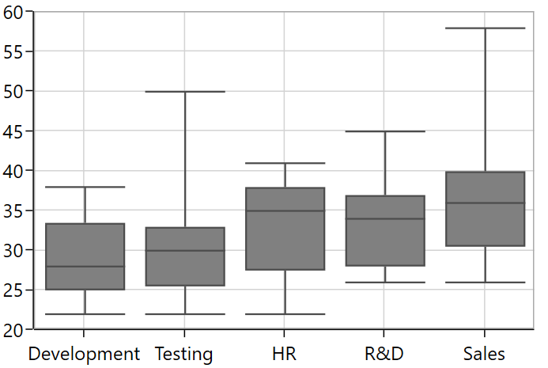
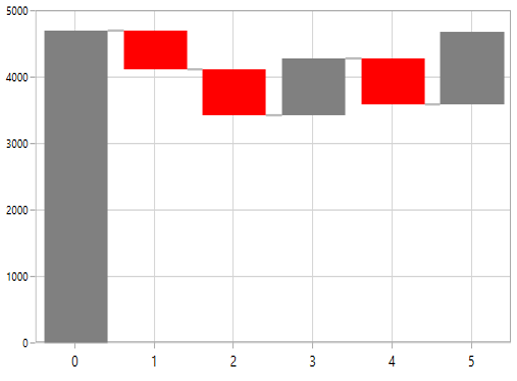
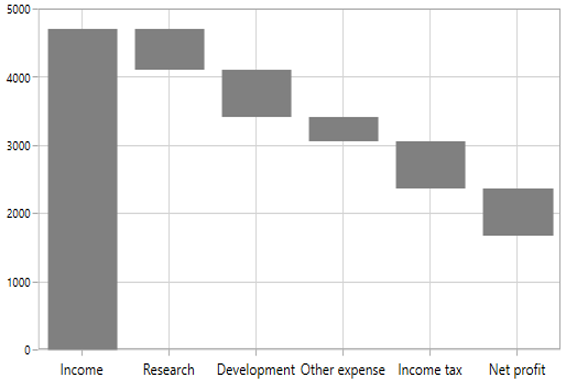

# Other Types in WPF Charts (SfChart)

## Box and Whisker Chart

[`BoxAndWhiskerSeries`](https://help.syncfusion.com/cr/wpf/Syncfusion.UI.Xaml.Charts.BoxAndWhiskerSeries.html) plots a combination of rectangle and lines to show the distribution of the dataset. The following code illustrates how to define the series in chart.





<chart:BoxAndWhiskerSeries ItemsSource="{Binding BoxWhiskerData}"  
                          
                            XBindingPath="Department" 
                          
                            YBindingPath="Age">

</chart:BoxAndWhiskerSeries>





BoxAndWhiskerSeries boxAndWhisker = new BoxAndWhiskerSeries();

boxAndWhisker.ItemsSource = new BoxWhiskerViewModel().BoxWhiskerData;

boxAndWhisker.XBindingPath = "Department";

boxAndWhisker.YBindingPath = "Age";

boxWhiskerChart.Series.Add(boxAndWhisker);





N>By default, the `BoxPlotMode` property value is Exclusive.

N> You can refer to our [WPF Box and Whisker Chart](https://www.syncfusion.com/wpf-controls/charts/wpf-box-and-whisker-chart) feature tour page for its groundbreaking feature representations. You can also explore our [WPF Box and Whisker Chart example](https://github.com/syncfusion/wpf-demos/blob/master/chart/Views/Other%20Charts/BoxAndWhiskerChart.xaml) to know how to render and configure the box and whisker chart.

**Customize the series Box mode**

The series box plotting mode can be changed by using [`BoxPlotMode`](https://help.syncfusion.com/cr/wpf/Syncfusion.UI.Xaml.Charts.BoxAndWhiskerSeries.html#Syncfusion_UI_Xaml_Charts_BoxAndWhiskerSeries_BoxPlotModeProperty) property of [`BoxAndWhiskerSeries`](https://help.syncfusion.com/cr/wpf/Syncfusion.UI.Xaml.Charts.BoxAndWhiskerSeries.html). The plotting mode of series can be calculated as follows:

* [`Exclusive`](https://help.syncfusion.com/cr/wpf/Syncfusion.UI.Xaml.Charts.BoxPlotMode.html) – The quartile values are calculated by using the formula (N+1) * P (N count, P percentile) and its index value starts from 1 in the list.
* [`Inclusive`](https://help.syncfusion.com/cr/wpf/Syncfusion.UI.Xaml.Charts.BoxPlotMode.html) – The quartile values are calculated by using the formula (N−1) * P (N count, P percentile) and its index value starts from 0 in the list.
* [`Normal`](https://help.syncfusion.com/cr/wpf/Syncfusion.UI.Xaml.Charts.BoxPlotMode.html) – The quartile values are calculated by splitting the list and getting the median values.

**Normal**

The following code illustrates how to define the [`BoxPlotMode`](https://help.syncfusion.com/cr/wpf/Syncfusion.UI.Xaml.Charts.BoxAndWhiskerSeries.html#Syncfusion_UI_Xaml_Charts_BoxAndWhiskerSeries_BoxPlotModeProperty) value as Normal.





<chart:BoxAndWhiskerSeries  BoxPlotMode="Normal">

</chart:BoxAndWhiskerSeries>





BoxAndWhiskerSeries boxAndWhisker = new BoxAndWhiskerSeries();

boxAndWhisker.BoxPlotMode = BoxPlotMode.Normal;





**Inclusive**

The following code illustrates how to define the [`BoxPlotMode`](https://help.syncfusion.com/cr/wpf/Syncfusion.UI.Xaml.Charts.BoxAndWhiskerSeries.html#Syncfusion_UI_Xaml_Charts_BoxAndWhiskerSeries_BoxPlotModeProperty) value as Inclusive.





<chart:BoxAndWhiskerSeries  BoxPlotMode="Inclusive">

</chart:BoxAndWhiskerSeries>





BoxAndWhiskerSeries boxAndWhisker = new BoxAndWhiskerSeries();

boxAndWhisker.BoxPlotMode = BoxPlotMode.Inclusive;





**ShowMedian**

The Median values of given dataset is viewed by enabling the [`ShowMedian`](https://help.syncfusion.com/cr/wpf/Syncfusion.UI.Xaml.Charts.BoxAndWhiskerSeries.html#Syncfusion_UI_Xaml_Charts_BoxAndWhiskerSeries_ShowMedianProperty) property of [`BoxAndWhiskerSeries`](https://help.syncfusion.com/cr/wpf/Syncfusion.UI.Xaml.Charts.BoxAndWhiskerSeries.html). The following code illustrates how to enable the [`ShowMedian`](https://help.syncfusion.com/cr/wpf/Syncfusion.UI.Xaml.Charts.BoxAndWhiskerSeries.html#Syncfusion_UI_Xaml_Charts_BoxAndWhiskerSeries_ShowMedianProperty) property.





<chart:BoxAndWhiskerSeries ShowMedian="True">

</chart:BoxAndWhiskerSeries>





BoxAndWhiskerSeries boxAndWhisker = new BoxAndWhiskerSeries();

boxAndWhisker.ShowMedian = true;





N>
* The middle number of data points is the median for the odd number of data points.
* The average of the middle two numbers is a median for the even number of data points.

### Outlier

The outlier is used to display the outlier point that lies either below the lower whisker or above the upper whisker line and it is an observation that is numerically distant from the rest of the data.

**ShowOutlier**

The outlier value in the box plot can be viewed by enabling the [`ShowOutlier`](https://help.syncfusion.com/cr/wpf/Syncfusion.UI.Xaml.Charts.BoxAndWhiskerSeries.html#Syncfusion_UI_Xaml_Charts_BoxAndWhiskerSeries_ShowOutlier) property of [`BoxAndWhiskerSeries`](https://help.syncfusion.com/cr/wpf/Syncfusion.UI.Xaml.Charts.BoxAndWhiskerSeries.html). By default, [ShowOutlier](https://help.syncfusion.com/cr/wpf/Syncfusion.UI.Xaml.Charts.BoxAndWhiskerSeries.html#Syncfusion_UI_Xaml_Charts_BoxAndWhiskerSeries_ShowOutlier) value is true. The following code demonstrates how to disable the [`ShowOutlier`](https://help.syncfusion.com/cr/wpf/Syncfusion.UI.Xaml.Charts.BoxAndWhiskerSeries.html#Syncfusion_UI_Xaml_Charts_BoxAndWhiskerSeries_ShowOutlier) property.





<chart:BoxAndWhiskerSeries ShowOutlier="False">

</chart:BoxAndWhiskerSeries>





BoxAndWhiskerSeries boxAndWhisker = new BoxAndWhiskerSeries();

boxAndWhisker.ShowOutlier = false;





**Outlier Template**

The default appearance of the outlier symbol can be customized by using the [`OutlierTemplate`](https://help.syncfusion.com/cr/wpf/Syncfusion.UI.Xaml.Charts.BoxAndWhiskerSeries.html#Syncfusion_UI_Xaml_Charts_BoxAndWhiskerSeries_OutlierTemplateProperty) property of [`BoxAndWhiskerSeries`](https://help.syncfusion.com/cr/wpf/Syncfusion.UI.Xaml.Charts.BoxAndWhiskerSeries.html). The following code illustrates how to customize the outlier symbol.





<chart:BoxAndWhiskerSeries.OutlierTemplate>

    <DataTemplate>

        <Canvas>

                 <Path Stretch="Fill" Height="10" Width="10"  Fill="{Binding Interior}" 
                              
                         Canvas.Left="{Binding RectX}" Canvas.Top="{Binding RectY}"
      
                            Data="F1 M 145.193,54.8249L 169.315,54.8249L 169.315,
            
                                    78.9463L 145.193,78.9463L 145.193,103.074L 121.071,
            
                                    103.074L 121.071,78.9463L 96.946,78.9463L 96.946,
           
                                    54.8249L 121.071,54.8249L 121.071,
            
                                    30.6983L 145.193,30.6983L 145.193,54.8249 Z"/>

          </Canvas>

    </DataTemplate>

</chart:BoxAndWhiskerSeries.OutlierTemplate>





## Waterfall Chart

[`WaterfallSeries`](https://help.syncfusion.com/cr/wpf/Syncfusion.UI.Xaml.Charts.WaterfallSeries.html) clarifies the cumulative effect of set of provided positive and negative values. The series is represented by a rectangle and a connector between the rectangles. 

The following code illustrates how to use the series in chart.





<chart:WaterfallSeries ItemsSource="{Binding RevenueDetails}"  
                      
                       XBindingPath="Category" 
                      
                       YBindingPath="Value">

</chart:WaterfallSeries>





WaterfallSeries waterfallSeries = new WaterfallSeries();

waterfallSeries.ItemsSource = new ViewModel().RevenueDetails;

waterfallSeries.XBindingPath = "Category";

waterfallSeries.YBindingPath = "Value";

chart.Series.Add(waterfallSeries);





**SummarySegmentPath and SummarySegmentBrush**

[`SummaryBindingPath`](https://help.syncfusion.com/cr/wpf/Syncfusion.UI.Xaml.Charts.WaterfallSeries.html#Syncfusion_UI_Xaml_Charts_WaterfallSeries_SummaryBindingPathProperty) gets or sets the string value that indicates the sum of previous segments in series. 

The summary segment can be differentiated by applying the [`SummarySegmentBrush`](https://help.syncfusion.com/cr/wpf/Syncfusion.UI.Xaml.Charts.WaterfallSeries.html#Syncfusion_UI_Xaml_Charts_WaterfallSeries_SummarySegmentBrushProperty) in series.





<chart:WaterfallSeries ItemsSource="{Binding RevenueDetails}"  
                                  
                                   XBindingPath="Category"
                                  
                                   YBindingPath="Value" Interior="Gray"
                                  
                                   SummaryBindingPath="IsSummary"
                                  
                                   SummarySegmentBrush="RoyalBlue">

</chart:WaterfallSeries>





WaterfallSeries waterfallSeries = new WaterfallSeries();

waterfallSeries.ItemsSource = new ViewModel().RevenueDetails;

waterfallSeries.XBindingPath = "Category";

waterfallSeries.YBindingPath = "Value";

waterfallSeries.SummaryBindingPath = "IsSummary";

waterfallSeries.SummarySegmentBrush = new SolidColorBrush(Colors.RoyalBlue);

chart.Series.Add(waterfallSeries);





**NegativeSegmentBrush**

The appearance of the negative segment can be changed by using the [`NegativeSegmentBrush`](https://help.syncfusion.com/cr/wpf/Syncfusion.UI.Xaml.Charts.WaterfallSeries.html#Syncfusion_UI_Xaml_Charts_WaterfallSeries_NegativeSegmentBrushProperty) property of series.

The following code illustrates how to change the appearance of the negative segment.





<chart:WaterfallSeries NegativeSegmentBrush="Red">

</chart:WaterfallSeries>





WaterfallSeries waterfallSeries = new WaterfallSeries();

waterfallSeries.NegativeSegmentBrush = new SolidColorBrush(Colors.Red);





**AllowAutoSum**

The summary segment calculation can be changed by using the [`AllowAutoSum`](https://help.syncfusion.com/cr/wpf/Syncfusion.UI.Xaml.Charts.WaterfallSeries.html#Syncfusion_UI_Xaml_Charts_WaterfallSeries_AllowAutoSum) property. By default, the property is true. When disabling this property, it renders the segment by using the y value of provided ItemsSource collection.

The following code example illustrates how the AllowAutoSum property value can be set.





<chart:WaterfallSeries AllowAutoSum="False"
                       
                       SummaryBindingPath="IsSummary"
                       
                       SummarySegmentBrush="RoyalBlue">
 
 </chart:WaterfallSeries>





WaterfallSeries waterfallSeries = new WaterfallSeries();

waterfallSeries.AllowAutoSum = true;

waterfallSeries.SummaryBindingPath = "IsSummary";

waterfallSeries.SummarySegmentBrush = new SolidColorBrush(Colors.RoyalBlue);

chart.Series.Add(waterfallSeries);





### ConnectorLine

The connector line of series can be enabled or disabled by using its [`ShowConnector`](https://help.syncfusion.com/cr/wpf/Syncfusion.UI.Xaml.Charts.WaterfallSeries.html#Syncfusion_UI_Xaml_Charts_WaterfallSeries_ShowConnectorProperty) line property. By default, the property value  is true.





<chart:WaterfallSeries ShowConnector="False">

</chart:WaterfallSeries>





WaterfallSeries waterfallSeries = new WaterfallSeries();

waterfallSeries.ShowConnector = false;





**Connector line customization**

The connector line can be customized by applying [`ConnectorLineStyle`](https://help.syncfusion.com/cr/wpf/Syncfusion.UI.Xaml.Charts.WaterfallSeries.html#Syncfusion_UI_Xaml_Charts_WaterfallSeries_ConnectorLineStyleProperty) property of the series. The following code example illustrates how to apply style for connector line.





<chart:WaterfallSeries.ConnectorLineStyle>

</chart:WaterfallSeries.ConnectorLineStyle>





Style style = new Style(typeof(Line));

style.Setters.Add(new Setter(Line.StrokeProperty, new SolidColorBrush(Colors.Red)));

style.Setters.Add(new Setter(Line.StrokeDashArrayProperty, new DoubleCollection() { 1 }));

style.Setters.Add(new Setter(Line.StrokeThicknessProperty, 2));

WaterfallSeries series = new WaterfallSeries();

series.ConnectorLineStyle = style;





