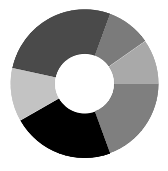
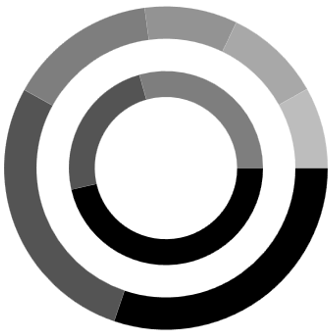
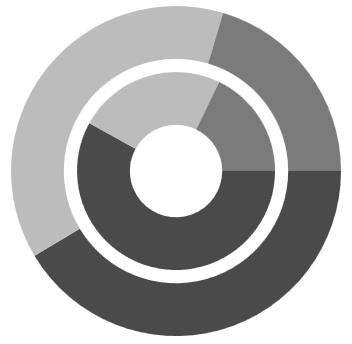
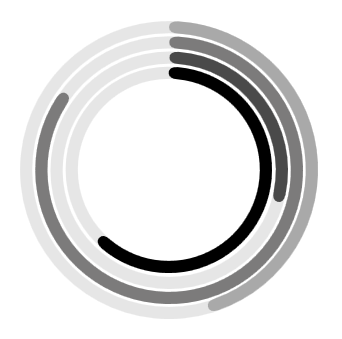
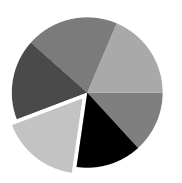

# Pie and Doughnut Charts

## Pie

[`PieSeries`](https://help.syncfusion.com/cr/cref_files/wpf/Syncfusion.SfChart.WPF~Syncfusion.UI.Xaml.Charts.PieSeries.html#) is divided into sectors, illustrating numerical proportion. The following code example illustrates the PieSeries.





<chart:PieSeries  XBindingPath="Category" 

                 ItemsSource="{Binding Tax}" 

                  YBindingPath="Percentage"/>





PieSeries series = new PieSeries()
{

    ItemsSource = new ViewModel().Tax,

    XBindingPath = "Category",

    YBindingPath = "Percentage"

};

chart.Series.Add(series);





The rendering size of the PieSeries can be controlled using [`PieCoefficient`](https://help.syncfusion.com/cr/cref_files/wpf/Syncfusion.SfChart.WPF~Syncfusion.UI.Xaml.Charts.PieSeries~PieCoefficient.html#) property as in below code example.





<chart:PieSeries PieCoefficient="0.9" 

XBindingPath="Category" 

ItemsSource="{Binding Tax}" 

YBindingPath="Percentage"/>





PieSeries series = new PieSeries()
{

    ItemsSource = new ViewModel().Tax,

    XBindingPath = "Category",

    YBindingPath = "Percentage",

    PieCoefficient = 0.9

};

chart.Series.Add(series);





### Group small data points into “others”
The small segments in the pie chart can be grouped into the “others” category using the [`GroupTo`](https://help.syncfusion.com/cr/cref_files/wpf/Syncfusion.SfChart.WPF~Syncfusion.UI.Xaml.Charts.CircularSeriesBase~GroupTo.html) and [`GroupMode`](https://help.syncfusion.com/cr/cref_files/wpf/Syncfusion.SfChart.WPF~Syncfusion.UI.Xaml.Charts.CircularSeriesBase~GroupMode.html) properties of PieSeries.

 The [`GroupMode`](https://help.syncfusion.com/cr/cref_files/wpf/Syncfusion.SfChart.WPF~Syncfusion.UI.Xaml.Charts.CircularSeriesBase~GroupMode.html) property is used to specify the grouping type based on slice [`Angle`](https://help.syncfusion.com/cr/cref_files/wpf/Syncfusion.SfChart.WPF~Syncfusion.UI.Xaml.Charts.PieGroupMode.html), actual data point [`Value`](https://help.syncfusion.com/cr/cref_files/wpf/Syncfusion.SfChart.WPF~Syncfusion.UI.Xaml.Charts.PieGroupMode.html), or [`Percentage`](https://help.syncfusion.com/cr/cref_files/wpf/Syncfusion.SfChart.WPF~Syncfusion.UI.Xaml.Charts.PieGroupMode.html), and the [`GroupTo`](https://help.syncfusion.com/cr/cref_files/wpf/Syncfusion.SfChart.WPF~Syncfusion.UI.Xaml.Charts.CircularSeriesBase~GroupTo.html) property is used to set the limit to group data points into a single slice. The grouped segment is labeled as “Others” in legend and toggled as other segment. The default value of the [`GroupTo`](https://help.syncfusion.com/cr/cref_files/wpf/Syncfusion.SfChart.WPF~Syncfusion.UI.Xaml.Charts.CircularSeriesBase~GroupTo.html) property is [`double.NAN`], and the default value of the [`GroupMode`](https://help.syncfusion.com/cr/cref_files/wpf/Syncfusion.SfChart.WPF~Syncfusion.UI.Xaml.Charts.CircularSeriesBase~GroupMode.html) property is Value.

**Pie series without grouping**

**Pie series with grouping (Mode - Value)**





            <chart:PieSeries ItemsSource="{Binding Data}" XBindingPath="Country" YBindingPath="Count"
				   GroupMode="Value" GroupTo="1000" >

                <chart:PieSeries.AdornmentsInfo>
                    <chart:ChartAdornmentInfo ShowConnectorLine="True" 
                                              ConnectorHeight="80" 
                                              ShowLabel="True" 
                                              LabelTemplate="{StaticResource DataLabelTemplate}"  
                                              SegmentLabelContent="LabelContentPath">
                    </chart:ChartAdornmentInfo>
                </chart:PieSeries.AdornmentsInfo>
            </chart:PieSeries>





            pieSeries.GroupMode = PieGroupMode.Value;
            pieSeries.GroupTo = 1000;

            ChartAdornmentInfo adornmentInfo = new ChartAdornmentInfo()
            {
                ShowConnectorLine = true,
                ShowLabel = true,
                ConnectorHeight = 80,
                LabelTemplate = this.RootGrid.Resources["DataLabelTemplate"] as DataTemplate,
                SegmentLabelContent = LabelContent.LabelContentPath,
            };

            pieSeries.AdornmentsInfo = adornmentInfo;





**Pie series with grouping (Mode - Angle)**





<chart:PieSeries ItemsSource="{Binding Data}" XBindingPath="Country" YBindingPath="Count" 
                 GroupMode="Angle" GroupTo="30">
                 
    <chart:PieSeries.AdornmentsInfo>
        <chart:ChartAdornmentInfo ShowConnectorLine="True" 
                                  ConnectorHeight="80" 
                                  ShowLabel="True" 
                                  LabelTemplate="{StaticResource DataLabelTemplate}"  
                                  SegmentLabelContent="LabelContentPath">
        </chart:ChartAdornmentInfo>
    </chart:PieSeries.AdornmentsInfo>
</chart:PieSeries>





pieSeries.GroupMode = PieGroupMode.Angle;
pieSeries.GroupTo = 30;

ChartAdornmentInfo adornmentInfo = new ChartAdornmentInfo()
    {
        ShowConnectorLine = true,
        ShowLabel = true,
        ConnectorHeight = 80,
        LabelTemplate = this.RootGrid.Resources["DataLabelTemplate"] as DataTemplate,
        SegmentLabelContent = LabelContent.LabelContentPath,
    };

pieSeries.AdornmentsInfo = adornmentInfo;





**Pie series with grouping (Mode - Percentage)**





<chart:PieSeries ItemsSource="{Binding Data}" XBindingPath="Country" YBindingPath="Count"                
                 GroupMode="Percentage" GroupTo="10" >

    <chart:PieSeries.AdornmentsInfo>
        <chart:ChartAdornmentInfo ShowConnectorLine="True" 
                                  ConnectorHeight="80" 
                                  ShowLabel="True" 
                                  LabelTemplate="{StaticResource DataLabelTemplate}"  
                                  SegmentLabelContent="LabelContentPath">
        </chart:ChartAdornmentInfo>
    </chart:PieSeries.AdornmentsInfo>
</chart:PieSeries>





pieSeries.GroupMode = PieGroupMode.Percentage;
pieSeries.GroupTo = 10;

ChartAdornmentInfo adornmentInfo = new ChartAdornmentInfo()
    {
        ShowConnectorLine = true,
        ShowLabel = true,
        ConnectorHeight = 80,
        LabelTemplate = this.RootGrid.Resources["DataLabelTemplate"] as DataTemplate,
        SegmentLabelContent = LabelContent.LabelContentPath,
    };

pieSeries.AdornmentsInfo = adornmentInfo;





## Doughnut

[`DoughnutSeries`](https://help.syncfusion.com/cr/cref_files/wpf/Syncfusion.SfChart.WPF~Syncfusion.UI.Xaml.Charts.DoughnutSeries.html#) is similar to PieSeries. It is used to show the relationship between parts of data and whole data. 

The DoughnutSeries can be added to chart as in below code example:





<chart:DoughnutSeries XBindingPath="Category"

                      ItemsSource="{Binding Tax}" 

                      YBindingPath="Percentage"/>





DoughnutSeries series = new DoughnutSeries()
{

    ItemsSource = new ViewModel().Tax,

    XBindingPath = "Category",

    YBindingPath = "Percentage"
};

chart.Series.Add(series);





The Doughnut also having coefficient property, [`DoughnutCoefficient`](https://help.syncfusion.com/cr/cref_files/wpf/Syncfusion.SfChart.WPF~Syncfusion.UI.Xaml.Charts.DoughnutSeries~DoughnutCoefficient.html#) which defines the inner circle. Also it has [`DoughnutSize`](https://help.syncfusion.com/cr/cref_files/wpf/Syncfusion.SfChart.WPF~Syncfusion.UI.Xaml.Charts.DoughnutSeries~DoughnutSize.html#), used to define the size for this series like [`PieCoefficient`](https://help.syncfusion.com/cr/cref_files/wpf/Syncfusion.SfChart.WPF~Syncfusion.UI.Xaml.Charts.PieSeries~PieCoefficient.html#) in PieSeries.





<chart:DoughnutSeries DoughnutCoefficient="0.7"                    

XBindingPath="Category" ItemsSource="{Binding Tax}" 

YBindingPath="Percentage" />





DoughnutSeries series = new DoughnutSeries()
{

    ItemsSource = new ViewModel().Tax,

    XBindingPath = "Category",

    YBindingPath = "Percentage",

    DoughnutCoefficient = 0.9
};

chart.Series.Add(series);





**Size**

The size of doughnut series can be customized by using its [`DoughnutSize`](https://help.syncfusion.com/cr/cref_files/wpf/Syncfusion.SfChart.WPF~Syncfusion.UI.Xaml.Charts.DoughnutSeries~DoughnutSizeProperty.html) property. The following code illustrates how to use the property in series.





<syncfusion:SfChart>

<syncfusion:DoughnutSeries DoughnutSize="0.8"/>
       
<syncfusion:DoughnutSeries DoughnutSize="0.8"/ >

</syncfusion:SfChart>





DoughnutSeries doughnut = new DoughnutSeries();

doughnut.DoughnutSize = 0.8;

chart.Series.Add(doughnut);

DoughnutSeries doughnut1 = new DoughnutSeries();

doughnut1.DoughnutSize = 0.8;

chart.Series.Add(doughnut1);





**HoleSize**

[`DoughnutHoleSize`](https://help.syncfusion.com/cr/cref_files/wpf/Syncfusion.SfChart.WPF~Syncfusion.UI.Xaml.Charts.DoughnutSeries~DoughnutHoleSizeProperty.html) is an attachable property. It gets or sets the double value, which is used to customize the doughnut hole size. Its value ranges from 0 to 1, and it can be set as shown in the following code example.





<Chart:SfChart Chart:DoughnutSeries.DoughnutHoleSize="0.2">
    
</chart:SfChart>





SfChart chart = new SfChart();

DoughnutSeries.SetDoughnutHoleSize(chart, 0.2);





## Semi Pie and Doughnut

By using custom [`StartAngle`](https://help.syncfusion.com/cr/cref_files/wpf/Syncfusion.SfChart.WPF~Syncfusion.UI.Xaml.Charts.CircularSeriesBase~StartAngle.html#) and [`EndAngle`](https://help.syncfusion.com/cr/cref_files/wpf/Syncfusion.SfChart.WPF~Syncfusion.UI.Xaml.Charts.CircularSeriesBase~EndAngle.html#) properties, you can draw pie series in different shapes such as semicircular or quarter circular series.





<syncfusion:PieSeries x:Name="PieSeries" StartAngle="180" EndAngle="360"    

XBindingPath="Utilization" 

YBindingPath="ResponseTime"

ItemsSource="{Binding}"/>





PieSeries series = new PieSeries()
{

    ItemsSource = new ViewModel().Value,

    XBindingPath = "Utilization",

    YBindingPath = "ResponseTime",

    StartAngle = 180,

    EndAngle = 360

};

chart.Series.Add(series);









<syncfusion:DoughnutSeries StartAngle="180" EndAngle="360" 

XBindingPath="Utilization"

YBindingPath="ResponseTime" 

ItemsSource="{Binding}"/>





DoughnutSeries series = new DoughnutSeries()
{

    ItemsSource = new ViewModel().Value,

    XBindingPath = "Utilization",

    YBindingPath = "ResponseTime",

    StartAngle = 180,

    EndAngle = 360

};

chart.Series.Add(series);





## Stacked doughnut

Doughnut segments can be separated as individual circles using the [`IsStackedDoughnut`](https://help.syncfusion.com/cr/cref_files/wpf/Syncfusion.SfChart.WPF~Syncfusion.UI.Xaml.Charts.DoughnutSeries~IsStackedDoughnut.html) property. The following properties are used to customize the stacked doughnut chart:

•	[`CapStyle`](https://help.syncfusion.com/cr/cref_files/wpf/Syncfusion.SfChart.WPF~Syncfusion.UI.Xaml.Charts.DoughnutSeries~CapStyle.html) - Specifies the shapes of the start and end points of a circular segment. The supported values are [`BothFlat`](https://help.syncfusion.com/cr/cref_files/wpf/Syncfusion.SfChart.WPF~Syncfusion.UI.Xaml.Charts.DoughnutCapStyle.html), [`BothCurve`](https://help.syncfusion.com/cr/cref_files/wpf/Syncfusion.SfChart.WPF~Syncfusion.UI.Xaml.Charts.DoughnutCapStyle.html), [`StartCurve`](https://help.syncfusion.com/cr/cref_files/wpf/Syncfusion.SfChart.WPF~Syncfusion.UI.Xaml.Charts.DoughnutCapStyle.html), and [`EndCurve`](https://help.syncfusion.com/cr/cref_files/wpf/Syncfusion.SfChart.WPF~Syncfusion.UI.Xaml.Charts.DoughnutCapStyle.html). The default value of the this property is BothFlat.
•	[`SegmentSpacing`](https://help.syncfusion.com/cr/cref_files/wpf/Syncfusion.SfChart.WPF~Syncfusion.UI.Xaml.Charts.DoughnutSeries~SegmentSpacing.html) - Changes the spacing between two individual segments. The default value of spacing is 0, and the value ranges from 0 to 1. Here, 1 represents 100%, and 0 represents 0% of the available space.
•	[`MaximumValue`](https://help.syncfusion.com/cr/cref_files/wpf/Syncfusion.SfChart.WPF~Syncfusion.UI.Xaml.Charts.DoughnutSeries~SegmentSpacing.html) - Represents the entire span of an individual circle. The default value of the this property is double.NaN.
•	[`TrackColor`](https://help.syncfusion.com/cr/cref_files/wpf/Syncfusion.SfChart.WPF~Syncfusion.UI.Xaml.Charts.DoughnutSeries~TrackColor.html) - Changes the color of the track area.
•	[`TrackBorderColor`](https://help.syncfusion.com/cr/cref_files/wpf/Syncfusion.SfChart.WPF~Syncfusion.UI.Xaml.Charts.DoughnutSeries~TrackBorderColor.html) - Changes the color of the track border.
•	[`TrackBorderWidth`](https://help.syncfusion.com/cr/cref_files/wpf/Syncfusion.SfChart.WPF~Syncfusion.UI.Xaml.Charts.DoughnutSeries~TrackBorderWidth.html) - Changes the width of the track border.





<chart:SfChart>
    …
    <chart:DoughnutSeries XBindingPath="Category" YBindingPath="Expenditure" ItemsSource="{Binding ExpenditureData}"
                          IsStackedDoughnut="True" CapStyle="BothCurve" SegmentSpacing="0.2"
                          MaximumValue="100">
    </chart:DoughnutSeries>

</chart:SfChart>





SfChart chart = new SfChart();

DoughnutSeries doughnutSeries = new DoughnutSeries()
{
    XBindingPath = "Category",
    YBindingPath = "Expenditure",
    ItemsSource = new ViewModel().ExpenditureData,
    IsStackedDoughnut = true,
    CapStyle = DoughnutCapStyle.BothCurve,
    SegmentSpacing = 0.2,
    MaximumValue = 100
};

chart.Series.Add(doughnutSeries);





### Add content to the center of doughnut chart
You can add any content to the center of the doughnut chart using the [`CenterView`](https://help.syncfusion.com/cr/cref_files/wpf/Syncfusion.SfChart.WPF~Syncfusion.UI.Xaml.Charts.DoughnutSeries~CenterView.html) property of [`DoughnutSeries`](https://help.syncfusion.com/cr/cref_files/wpf/Syncfusion.SfChart.WPF~Syncfusion.UI.Xaml.Charts.DoughnutSeries.html). The binding context of the [`CenterView`](https://help.syncfusion.com/cr/cref_files/wpf/Syncfusion.SfChart.WPF~Syncfusion.UI.Xaml.Charts.DoughnutSeries~CenterView.html) will be the respective [`DoughnutSeries`](https://help.syncfusion.com/cr/cref_files/wpf/Syncfusion.SfChart.WPF~Syncfusion.UI.Xaml.Charts.DoughnutSeries.html).





<chart:SfChart>
    …
    <chart:DoughnutSeries XBindingPath="Category" YBindingPath="Expenditure" ItemsSource="{Binding ExpenditureData}"
                          IsStackedDoughnut="True" CapStyle="BothCurve" SegmentSpacing="0.2"
                          MaximumValue="100">

        <chart:DoughnutSeries.CenterView>
            <ContentControl HorizontalAlignment="Center" VerticalAlignment="Center" >
                <Image Source="/Image/Person.png" Width="164" Height="164"/>
            </ContentControl>
        </chart:DoughnutSeries.CenterView>
								  
    </chart:DoughnutSeries>

</chart:SfChart>





ContentControl centerView = new ContentControl()
{
    Content = new Image()
    {
        HorizontalAlignment = HorizontalAlignment.Center,
        VerticalAlignment = VerticalAlignment.Center,
        Source = new BitmapImage(new Uri("Image/Person.png", UriKind.Relative)),
        Width = 164,
        Height = 164
    }
};

doughnutSeries.CenterView = centerView;



	

## Explode Segments

The following properties are used to explode the individual segments in Pie and Doughnut.

* [`ExplodeAll`](https://help.syncfusion.com/cr/cref_files/wpf/Syncfusion.SfChart.WPF~Syncfusion.UI.Xaml.Charts.AccumulationSeriesBase~ExplodeAll.html)  - Used to explode all the segments of these series.
* [`ExplodeIndex`](https://help.syncfusion.com/cr/cref_files/wpf/Syncfusion.SfChart.WPF~Syncfusion.UI.Xaml.Charts.AccumulationSeriesBase~ExplodeIndex.html) - Used to explode any specific segment.
* [`ExplodeRadius`](https://help.syncfusion.com/cr/cref_files/wpf/Syncfusion.SfChart.WPF~Syncfusion.UI.Xaml.Charts.CircularSeriesBase~ExplodeRadius.html) - Used to define the explode distance.
* [`ExplodeOnMouseClick`](https://help.syncfusion.com/cr/cref_files/wpf/Syncfusion.SfChart.WPF~Syncfusion.UI.Xaml.Charts.AccumulationSeriesBase~ExplodeOnMouseClick.html) -Used to explode the segment when segment is clicked.

**Explode** **Index**





<syncfusion:PieSeries x:Name="PieSeries" ItemsSource="{Binding}"          

ExplodeIndex="2"

ExplodeRadius="10"

XBindingPath="Utilization" 

YBindingPath="ResponseTime" />





PieSeries series = new PieSeries()
{

    ItemsSource = new ViewModel().Data,

    XBindingPath = "Utilization",

    YBindingPath = "ResponseTime",

    ExplodeIndex = 2,

    ExplodeRadius = 10

};

chart.Series.Add(series);





N> We have defined ExplodeRadius as 30, by default its value is zero. So you need to define explode, when you set ExplodeIndex or ExplodeAll.

**Explode** **All**





<chart:PieSeries  ExplodeAll="True"

ExplodeRadius="15"

XBindingPath="Category" 

ItemsSource="{Binding Tax}" 

YBindingPath="Percentage">





PieSeries series = new PieSeries()
{

    ItemsSource = new ViewModel().Tax,

    XBindingPath = "Category",

    YBindingPath = "Percentage",

    ExplodeAll = true,

    ExplodeRadius = 15

};

chart.Series.Add(series);





