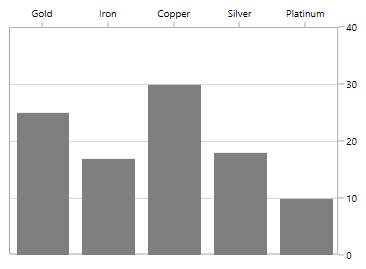
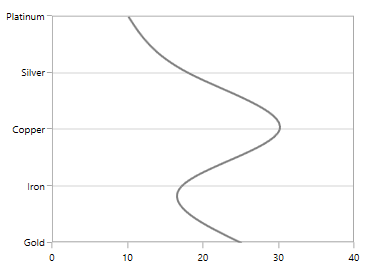
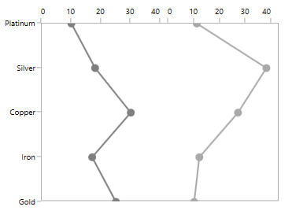

# Vertical Charts in WPF Charts (SfChart)

SfChart provides support for vertical charts. You can plot vertical chart for any chart using [`IsTransposed`](https://help.syncfusion.com/cr/wpf/Syncfusion.UI.Xaml.Charts.CartesianSeries.html#Syncfusion_UI_Xaml_Charts_CartesianSeries_IsTransposed) and [`OpposedPosition`](https://help.syncfusion.com/cr/wpf/Syncfusion.UI.Xaml.Charts.ChartAxis.html#Syncfusion_UI_Xaml_Charts_ChartAxis_OpposedPosition) properties.

## OpposedPosition

Allows to position the axis in the opposite direction to the default position. The following code example illustrates placing the primary and secondary axes in opposite direction.





<chart:SfChart.PrimaryAxis>

<chart:CategoryAxis   OpposedPosition="True" >

</chart:CategoryAxis>

</chart:SfChart.PrimaryAxis>

<chart:SfChart.SecondaryAxis>

<chart:NumericalAxis Minimum="0" Maximum="40" Interval="10"                                   

OpposedPosition="True"/>

</chart:SfChart.SecondaryAxis>





chart.PrimaryAxis = new CategoryAxis()
{

     OpposedPosition = true

};

chart.SecondaryAxis = new NumericalAxis()
{
     Minimum = 0,

     Maximum = 40,

     Interval = 10,

     OpposedPosition = true

};





## IsTransposed

This property used to switch the plotting of the series to vertical.





<chart:LineSeries  IsTransposed="True"

ItemsSource="{Binding SneakersDetail}"  XBindingPath="Brand" 

YBindingPath="ItemsCount" >





LineSeries series = new LineSeries()
{

     IsTransposed = true,

     ItemsSource = new ViewModel().SneakersDetail,

     XBindingPath = "Brand",

     YBindingPath = "ItemsCount"

};





The following example demonstrates the vertical charts.





<chart:SfChart>

<chart:SfChart.ColumnDefinitions>

<chart:ChartColumnDefinition />

<chart:ChartColumnDefinition/>

</chart:SfChart.ColumnDefinitions>

<chart:SfChart.PrimaryAxis>

<chart:CategoryAxis  ShowGridLines="False“ >

</chart:CategoryAxis>

</chart:SfChart.PrimaryAxis>

<chart:SfChart.SecondaryAxis>

<chart:NumericalAxis/>

</chart:SfChart.SecondaryAxis>          

<chart:LineSeries   IsTransposed="True"  

ItemsSource="{Binding SneakersDetail}"  XBindingPath="Brand" 

YBindingPath="ItemsCount" >

<chart:LineSeries.AdornmentsInfo>

<chart:ChartAdornmentInfo  ShowMarker="True" Symbol="Ellipse" 

SymbolHeight="10" SymbolInterior="#7f7f7f" SymbolWidth="10">                        

</chart:ChartAdornmentInfo>                        

</chart:LineSeries.AdornmentsInfo>

</chart:LineSeries>

<chart:LineSeries  Interior="DarkGray" IsTransposed="True"

ItemsSource="{Binding SneakersDetail}"  XBindingPath="Brand" 

YBindingPath="postion" >

<chart:LineSeries.AdornmentsInfo>

<chart:ChartAdornmentInfo ShowLabel="False" ShowMarker="True" Symbol="Ellipse" SymbolHeight="10" 

SymbolInterior="DarkGray" SymbolWidth="10"></chart:ChartAdornmentInfo>

</chart:LineSeries.AdornmentsInfo>

<chart:LineSeries.YAxis>

<chart:NumericalAxis />

</chart:LineSeries.YAxis>

</chart:LineSeries>

</chart:SfChart>





SfChart chart = new SfChart();

chart.ColumnDefinitions.Add(new ChartColumnDefinition());

chart.ColumnDefinitions.Add(new ChartColumnDefinition());

chart.PrimaryAxis = new CategoryAxis()
{

    ShowGridLines = true

};

NumericalAxis axis = new NumericalAxis();

chart.SecondaryAxis = axis;

ChartBase.SetColumn(axis, 1);

LineSeries series1 = new LineSeries()
{

    IsTransposed = true,

    ItemsSource = new ViewModel().SneakersDetail,

    XBindingPath = "Brand",

    YBindingPath = "ItemsCount"

};

ChartAdornmentInfo adornmentInfo1 = new ChartAdornmentInfo()
{

    ShowMarker = true,

    Symbol = ChartSymbol.Ellipse,

    SymbolHeight = 10,

    SymbolWidth = 10,

    SymbolInterior = new SolidColorBrush(Color.FromRgb(0x7f, 0x7f, 0x7f)),

};

LineSeries series2 = new LineSeries()
{

    IsTransposed = true,

    Interior = new SolidColorBrush(Colors.DarkGray),

    ItemsSource = new ViewModel().SneakersDetail,

    XBindingPath = "Brand",

    YBindingPath = "position",

    YAxis = new NumericalAxis()

};

ChartAdornmentInfo adornmentInfo2 = new ChartAdornmentInfo()
{

    ShowLabel = false,

    ShowMarker = true,

    Symbol = ChartSymbol.Ellipse,

    SymbolHeight = 10,

    SymbolWidth = 10,

    SymbolInterior = new SolidColorBrush(Colors.DarkGray),

};

series1.AdornmentsInfo = adornmentInfo1;

series2.AdornmentsInfo = adornmentInfo2;

ChartBase.SetColumn(series1, 0);

ChartBase.SetColumn(series2, 1);

chart.Series.Add(series1);

chart.Series.Add(series2);





