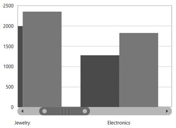
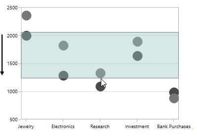
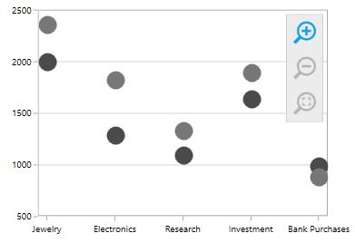
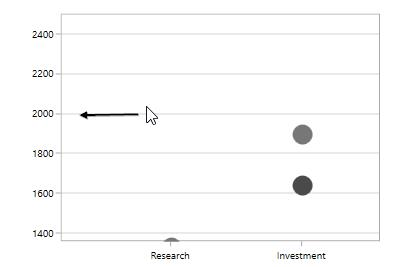

# Zooming and Panning

SfChart allows you to zoom the chart area with the help of the zoom feature. This behavior is mostly used to view the data point in the specific area, when there are a number of data points inside the chart.

Zooming and panning provides you to take a close-up look of the data point plotted in the series

## Enable Zooming and Panning

You can create an instance ChartZoomPanBehavior and add it to the Behaviors collection.





<syncfusion:SfChart.Behaviors>

<syncfusion:ChartZoomPanBehavior >                                             

</syncfusion:ChartZoomPanBehavior>

</syncfusion:SfChart.Behaviors>





ChartZoomPanBehavior zooming = new ChartZoomPanBehavior();

chart.Behaviors.Add(zooming);





## Zooming the ChartArea

**Zooming** **by** **setting** **ZoomFactor** **and** **ZoomPosition**

[`ZoomFactor`](https://help.syncfusion.com/cr/cref_files/wpf/Syncfusion.SfChart.WPF~Syncfusion.UI.Xaml.Charts.ChartAxisBase2D~ZoomFactor.html#) defines the percentage of visible range from the total range of axis values. [`ZoomPosition`](https://help.syncfusion.com/cr/cref_files/wpf/Syncfusion.SfChart.WPF~Syncfusion.UI.Xaml.Charts.ChartAxisBase2D~ZoomPosition.html#) defines the ranges of values that need to be displayed as a result of [`ZoomFactor`](https://help.syncfusion.com/cr/cref_files/wpf/Syncfusion.SfChart.WPF~Syncfusion.UI.Xaml.Charts.ChartAxisBase2D~ZoomFactor.html#). 

The following code example demonstrates the zooming the chart axis by setting zoom position and zoom factor.





<syncfusion:SfChart.PrimaryAxis>

<syncfusion:CategoryAxis 

ShowGridLines="False"

ZoomFactor="0.3" ZoomPosition="0.1" />

</syncfusion:SfChart.PrimaryAxis>





chart.PrimaryAxis = new CategoryAxis()
{

    ShowGridLines = false,

    ZoomFactor = 0.1,

    ZoomPosition = 0.3

};





**Mouse** **Wheel** **Zooming**

Zooming can be performed by mouse wheel action by setting [`EnableMouseWheelZooming`](https://help.syncfusion.com/cr/cref_files/wpf/Syncfusion.SfChart.WPF~Syncfusion.UI.Xaml.Charts.ChartZoomPanBehavior~EnableMouseWheelZooming.html#) property to true.





<syncfusion:SfChart.Behaviors>

<syncfusion:ChartZoomPanBehavior EnableMouseWheelZooming="True" >                                              

</syncfusion:ChartZoomPanBehavior>

</syncfusion:SfChart.Behaviors>





ChartZoomPanBehavior zooming = new ChartZoomPanBehavior()
{

    EnableMouseWheelZooming = true

};

chart.Behaviors.Add(zooming);





**Pinch** **Zooming**

If you want to zoom using fingers by touch, then you have to set [`EnablePinchZooming`](https://help.syncfusion.com/cr/cref_files/wpf/Syncfusion.SfChart.WPF~Syncfusion.UI.Xaml.Charts.ChartZoomPanBehavior~EnablePinchZooming.html#) property to true as shown in the below code snippet.





<syncfusion:SfChart.Behaviors>

<syncfusion:ChartZoomPanBehavior EnablePinchZooming="True" >                                              

</syncfusion:ChartZoomPanBehavior>

</syncfusion:SfChart.Behaviors>





ChartZoomPanBehavior zooming = new ChartZoomPanBehavior()
{

    EnablePinchZooming = true

};

chart.Behaviors.Add(zooming);





**Zooming** **Relative** **to** **Cursor**

To enable the zooming relative to cursor position you can set [`ZoomRelativeToCursor`](https://help.syncfusion.com/cr/cref_files/wpf/Syncfusion.SfChart.WPF~Syncfusion.UI.Xaml.Charts.ChartZoomPanBehavior~ZoomRelativeToCursor.html#) property to true. This support is applicable only for mouse wheel zooming.





<syncfusion:SfChart.Behaviors>

<syncfusion:ChartZoomPanBehavior ZoomRelativeToCursor="True" >                                              

</syncfusion:ChartZoomPanBehavior>

</syncfusion:SfChart.Behaviors>





ChartZoomPanBehavior zooming = new ChartZoomPanBehavior()
{

    ZoomRelativeToCursor = true

};

chart.Behaviors.Add(zooming);





**SelectionZooming**

SelectionZooming helps us to zoom a particular area by selecting the region using  rectangle.To enable the selection ,you have to set [`EnableSelectionZooming`](https://help.syncfusion.com/cr/cref_files/wpf/Syncfusion.SfChart.WPF~Syncfusion.UI.Xaml.Charts.ChartZoomPanBehavior~EnableSelectionZooming.html#) property to true.

The following code snippet demonstrated selection zooming.





<syncfusion:SfChart.Behaviors>

<syncfusion:ChartZoomPanBehavior EnableSelectionZooming="True" >                                              

</syncfusion:ChartZoomPanBehavior>

</syncfusion:SfChart.Behaviors>





ChartZoomPanBehavior zooming = new ChartZoomPanBehavior()
{

    EnableSelectionZooming = true

};

chart.Behaviors.Add(zooming);





**Customization** **of** **Selection** **Rectangle**

Selection Rectangle can be customized by setting the following properties 

* [`Fill`](https://help.syncfusion.com/cr/cref_files/wpf/Syncfusion.SfChart.WPF~Syncfusion.UI.Xaml.Charts.ChartZoomPanBehavior~Fill.html#)-Represents the brush filled in selection rectangle. 
* [`Stroke`](https://help.syncfusion.com/cr/cref_files/wpf/Syncfusion.SfChart.WPF~Syncfusion.UI.Xaml.Charts.ChartZoomPanBehavior~Stroke.html#)- Represents the outer line color of selection rectangle.
* [`StrokeThickness`](https://help.syncfusion.com/cr/cref_files/wpf/Syncfusion.SfChart.WPF~Syncfusion.UI.Xaml.Charts.ChartZoomPanBehavior~StrokeThickness.html#)- Represents the selection rectangle outer line thickness. 

The following code example demonstrates the customization of selection rectangle





<syncfusion:SfChart.Behaviors>

<syncfusion:ChartZoomPanBehavior EnableSelectionZooming="True" 

Fill="LightBlue" Stroke="Blue" StrokeThickness="2" >                                              

</syncfusion:ChartZoomPanBehavior>

</syncfusion:SfChart.Behaviors>





ChartZoomPanBehavior zooming = new ChartZoomPanBehavior()
{

    EnableSelectionZooming = true,

    Fill = new SolidColorBrush(Colors.LightBlue),

    Stroke = new SolidColorBrush(Colors.Blue),

    StrokeThickness = 2

};

chart.Behaviors.Add(zooming);





**Zooming** **Mode**

The zooming can be done both horizontally and vertically. The zooming direction is defined using [`ZoomMode`](https://help.syncfusion.com/cr/cref_files/wpf/Syncfusion.SfChart.WPF~Syncfusion.UI.Xaml.Charts.ChartZoomPanBehavior~ZoomMode.html#) property.

Zooming along [`X`](https://help.syncfusion.com/cr/cref_files/wpf/Syncfusion.SfChart.WPF~Syncfusion.UI.Xaml.Charts.ZoomMode.html) axis





<syncfusion:SfChart.Behaviors>

<syncfusion:ChartZoomPanBehavior EnableSelectionZooming="True" ZoomMode="X">                                              

</syncfusion:ChartZoomPanBehavior>

</syncfusion:SfChart.Behaviors>





ChartZoomPanBehavior zooming = new ChartZoomPanBehavior()
{

    EnableSelectionZooming = true,

    ZoomMode = ZoomMode.X

};

chart.Behaviors.Add(zooming);





Zooming along Y axis





<syncfusion:SfChart.Behaviors>

<syncfusion:ChartZoomPanBehavior EnableSelectionZooming="True" ZoomMode="Y">                                              

</syncfusion:ChartZoomPanBehavior>

</syncfusion:SfChart.Behaviors>





ChartZoomPanBehavior zooming = new ChartZoomPanBehavior()
{

    EnableSelectionZooming = true,

    ZoomMode = ZoomMode.Y

};

chart.Behaviors.Add(zooming);





**Maximum** **Zoom** **Level**

You can also limit the zooming by setting [`MaximumZoomLevel`](https://help.syncfusion.com/cr/cref_files/wpf/Syncfusion.SfChart.WPF~Syncfusion.UI.Xaml.Charts.ChartZoomPanBehavior~MaximumZoomLevel.html#) property as shown in the following code snippet.





<syncfusion:SfChart.Behaviors>

<syncfusion:ChartZoomPanBehavior EnableSelectionZooming="True" MaximumZoomLevel="100">                                              

</syncfusion:ChartZoomPanBehavior>

</syncfusion:SfChart.Behaviors>





ChartZoomPanBehavior zooming = new ChartZoomPanBehavior()
{

    EnableSelectionZooming = true,

    MaximumZoomLevel = 100

};

chart.Behaviors.Add(zooming);





## Zooming Toolbar

Zooming Toolbar encompassed with buttons for performing actions like Zoom In/Out, Reset, Pan, etc. You can add the zooming toolbar to the chart area by setting [`EnableZoomingToolBar`](https://help.syncfusion.com/cr/cref_files/wpf/Syncfusion.SfChart.WPF~Syncfusion.UI.Xaml.Charts.ChartZoomPanBehavior~EnableZoomingToolBar.html#) property to True.





<syncfusion:SfChart.Behaviors>

<syncfusion:ChartZoomPanBehavior EnableZoomingToolBar="True">                                              

</syncfusion:ChartZoomPanBehavior>

</syncfusion:SfChart.Behaviors>





ChartZoomPanBehavior zooming = new ChartZoomPanBehavior()
{

    EnableZoomingToolBar = true

};

chart.Behaviors.Add(zooming);





The following image depicts the default view of the zooming toolbar.

**Positioning** **the** **zooming** **toolbar**

Zooming Toolbar can be positioned using the [`HorizontalPosition`](https://help.syncfusion.com/cr/cref_files/wpf/Syncfusion.SfChart.WPF~Syncfusion.UI.Xaml.Charts.ChartZoomPanBehavior~HorizontalPosition.html#) and [`VerticalPosition`](https://help.syncfusion.com/cr/cref_files/wpf/Syncfusion.SfChart.WPF~Syncfusion.UI.Xaml.Charts.ChartZoomPanBehavior~VerticalPosition.html#) properties.The following code demonstrates the positioning of the toolbar.





<syncfusion:SfChart.Behaviors>

<syncfusion:ChartZoomPanBehavior EnableZoomingToolBar="True" HorizontalPosition="Left" VerticalPosition="Bottom">                                              

</syncfusion:ChartZoomPanBehavior>

</syncfusion:SfChart.Behaviors>





ChartZoomPanBehavior zooming = new ChartZoomPanBehavior()
{

    EnableZoomingToolBar = true,

    HorizontalPosition = HorizontalAlignment.Left,

    VerticalPosition = VerticalAlignment.Bottom

};

chart.Behaviors.Add(zooming);





**Customization** **of** **Zooming** **Toolbar**

Zooming Toolbar can be customized using the following APIs:

* [`ToolBarBackground`](https://help.syncfusion.com/cr/cref_files/wpf/Syncfusion.SfChart.WPF~Syncfusion.UI.Xaml.Charts.ChartZoomPanBehavior~ToolBarBackground.html#)- Represents the zooming toolkit background.
* [`ToolBarItems`](https://help.syncfusion.com/cr/cref_files/wpf/Syncfusion.SfChart.WPF~Syncfusion.UI.Xaml.Charts.ChartZoomPanBehavior~ToolBarItems.html#)- Collection value that contains zooming toolkit items. 
* [`ToolBarItemMargin`](https://help.syncfusion.com/cr/cref_files/wpf/Syncfusion.SfChart.WPF~Syncfusion.UI.Xaml.Charts.ChartZoomPanBehavior~ToolBarItemMargin.html#)-Represents the margin for the toolbar item.
* [`ToolBarItemWidth`](https://help.syncfusion.com/cr/cref_files/wpf/Syncfusion.SfChart.WPF~Syncfusion.UI.Xaml.Charts.ChartZoomPanBehavior~ToolBarItemWidth.html#) -Represents the width of the toolbar item
* [`ToolBarItemHeight`](https://help.syncfusion.com/cr/cref_files/wpf/Syncfusion.SfChart.WPF~Syncfusion.UI.Xaml.Charts.ChartZoomPanBehavior~ToolBarItemHeight.html#)-Represents the height of the toolbar item





<syncfusion:SfChart.Behaviors>

<syncfusion:ChartZoomPanBehavior EnableZoomingToolBar="True" ToolBarItemHeight="15" 

ToolBarItemWidth="15" ToolBarBackground="Black" 

ToolBarItems="All" ToolBarItemMargin="10">                                              

</syncfusion:ChartZoomPanBehavior>

</syncfusion:SfChart.Behaviors>





ChartZoomPanBehavior zooming = new ChartZoomPanBehavior()
{

    EnableZoomingToolBar = true,

    ToolBarBackground = new SolidColorBrush(Colors.Black),

    ToolBarItemHeight = 15,

    ToolBarItemWidth = 15,

    ToolBarItemMargin = new Thickness(10),

    ToolBarItems = ZoomToolBarItems.All

};

chart.Behaviors.Add(zooming);





**Orientation** **of** **Zooming** **Toolbar**

Zooming toolbar orientation is horizontal by default.You can change the orientation to vertical by setting 

[`ToolBarOrientation`](https://help.syncfusion.com/cr/cref_files/wpf/Syncfusion.SfChart.WPF~Syncfusion.UI.Xaml.Charts.ChartZoomPanBehavior~ToolBarOrientation.html#) property to Vertical.





<syncfusion:SfChart.Behaviors>

<syncfusion:ChartZoomPanBehavior EnableZoomingToolBar="True" 

ToolBarOrientation="Vertical">                                              

</syncfusion:ChartZoomPanBehavior>

</syncfusion:SfChart.Behaviors>





ChartZoomPanBehavior zooming = new ChartZoomPanBehavior()
{

    EnableZoomingToolBar = true,

    ToolBarOrientation = Orientation.Vertical

};

chart.Behaviors.Add(zooming);





## Panning the ChartArea

Panning feature allows moving the visible area of the chart when it is zoomed in. To enable panning, you have to set [`EnablePanning`](https://help.syncfusion.com/cr/cref_files/wpf/Syncfusion.SfChart.WPF~Syncfusion.UI.Xaml.Charts.ChartZoomPanBehavior~EnablePanning.html#) property to true.




<syncfusion:SfChart.Behaviors>

<syncfusion:ChartZoomPanBehavior EnableMouseWheelZooming="True" EnablePanning="True">                                              

</syncfusion:ChartZoomPanBehavior>

</syncfusion:SfChart.Behaviors>





ChartZoomPanBehavior zooming = new ChartZoomPanBehavior()
{

    EnableMouseWheelZooming = true,

    EnablePanning = true
     
};

chart.Behaviors.Add(zooming);





The following image demonstrates the cursor panning in the left direction.

## Resetting the Zooming/Panning

SfChart provides support to reset to the default view when you double tap the chart area by setting [`ResetOnDoubleTap`](https://help.syncfusion.com/cr/cref_files/wpf/Syncfusion.SfChart.WPF~Syncfusion.UI.Xaml.Charts.ChartZoomPanBehavior~ResetOnDoubleTap.html#) property to true.





<syncfusion:SfChart.Behaviors>

<syncfusion:ChartZoomPanBehavior  ResetOnDoubleTap="True">                                              

</syncfusion:ChartZoomPanBehavior>

</syncfusion:SfChart.Behaviors>





ChartZoomPanBehavior zooming = new ChartZoomPanBehavior()
{

    ResetOnDoubleTap = true
     
};

chart.Behaviors.Add(zooming);





## Events

The following events are available in SfChart for ChartZoomPanBehavior:

### ZoomChanging

The [`ZoomChanging`](http://help.syncfusion.com/cr/cref_files/wpf/Syncfusion.SfChart.WPF~Syncfusion.UI.Xaml.Charts.SfChart~ZoomChanging_EV.html) event occurs when users start zooming the chart. This is a cancelable event. This argument contains the following information.

* [`Axis`](https://help.syncfusion.com/cr/cref_files/wpf/Syncfusion.SfChart.WPF~Syncfusion.UI.Xaml.Charts.ZoomEventArgs~Axis.html) - Gets an instance of the axis whose range is changed through zooming. This event is triggered for each axis in the chart.
* [`Cancel`](https://help.syncfusion.com/cr/cref_files/wpf/Syncfusion.SfChart.WPF~Syncfusion.UI.Xaml.Charts.ZoomChangingEventArgs~Cancel.html) - Gets or Sets a value that indicates whether the zooming should be canceled.
* [`CurrentFactor`](https://help.syncfusion.com/cr/cref_files/wpf/Syncfusion.SfChart.WPF~Syncfusion.UI.Xaml.Charts.ZoomEventArgs~CurrentFactor.html) - Gets the current zoom factor of the axis.
* [`CurrentPosition`](https://help.syncfusion.com/cr/cref_files/wpf/Syncfusion.SfChart.WPF~Syncfusion.UI.Xaml.Charts.ZoomEventArgs~CurrentPosition.html) - Gets the current zoom position of the axis.
* [`OldRange`](https://help.syncfusion.com/cr/cref_files/wpf/Syncfusion.SfChart.WPF~Syncfusion.UI.Xaml.Charts.ZoomEventArgs~OldRange.html) - Gets the old visible range of the axis.
* [`PreviousFactor`](https://help.syncfusion.com/cr/cref_files/wpf/Syncfusion.SfChart.WPF~Syncfusion.UI.Xaml.Charts.ZoomEventArgs~PreviousFactor.html) - Gets the previous zoom factor of the axis.
* [`PreviousPosition`](https://help.syncfusion.com/cr/cref_files/wpf/Syncfusion.SfChart.WPF~Syncfusion.UI.Xaml.Charts.ZoomEventArgs~PreviousPosition.html) - Gets the previous zoom position of the axis.

### ZoomChanged

The [`ZoomChanged`](http://help.syncfusion.com/cr/cref_files/wpf/Syncfusion.SfChart.WPF~Syncfusion.UI.Xaml.Charts.SfChart~ZoomChanged_EV.html) event occurs after the zooming has been completed. This argument contains the following information.

* [`Axis`](https://help.syncfusion.com/cr/cref_files/wpf/Syncfusion.SfChart.WPF~Syncfusion.UI.Xaml.Charts.ZoomEventArgs~Axis.html) - Gets an instance of the axis whose range is changed through zooming. This event is triggered for each axis in the chart.
* [`CurrentFactor`](https://help.syncfusion.com/cr/cref_files/wpf/Syncfusion.SfChart.WPF~Syncfusion.UI.Xaml.Charts.ZoomEventArgs~CurrentFactor.html) - Gets the current zoom factor of the axis.
* [`CurrentPosition`](https://help.syncfusion.com/cr/cref_files/wpf/Syncfusion.SfChart.WPF~Syncfusion.UI.Xaml.Charts.ZoomEventArgs~CurrentPosition.html) - Gets the current zoom position of the axis.
* [`OldRange`](https://help.syncfusion.com/cr/cref_files/wpf/Syncfusion.SfChart.WPF~Syncfusion.UI.Xaml.Charts.ZoomEventArgs~OldRange.html) - Gets the old visible range of the axis.
* [`NewRange`](https://help.syncfusion.com/cr/cref_files/wpf/Syncfusion.SfChart.WPF~Syncfusion.UI.Xaml.Charts.ZoomChangedEventArgs~NewRange.html) - Gets the new visible range of the axis.
* [`PreviousFactor`](https://help.syncfusion.com/cr/cref_files/wpf/Syncfusion.SfChart.WPF~Syncfusion.UI.Xaml.Charts.ZoomEventArgs~PreviousFactor.html) - Gets the previous zoom factor of the axis.
* [`PreviousPosition`](https://help.syncfusion.com/cr/cref_files/wpf/Syncfusion.SfChart.WPF~Syncfusion.UI.Xaml.Charts.ZoomEventArgs~PreviousPosition.html) - Gets the previous zoom position of the axis.

### SelectionZoomingStart

The [`SelectionZoomingStart`](http://help.syncfusion.com/cr/cref_files/wpf/Syncfusion.SfChart.WPF~Syncfusion.UI.Xaml.Charts.SfChart~SelectionZoomingStart_EV.html) event occurs when users start selection zooming. This argument contains the following information.

* [`ZoomRect`](https://help.syncfusion.com/cr/cref_files/wpf/Syncfusion.SfChart.WPF~Syncfusion.UI.Xaml.Charts.SelectionZoomingEventArgs~ZoomRect.html) - Gets the initial bounds of the selected region.

### SelectionZoomingEnd

The [`SelectionZoomingEnd`](http://help.syncfusion.com/cr/cref_files/wpf/Syncfusion.SfChart.WPF~Syncfusion.UI.Xaml.Charts.SfChart~SelectionZoomingEnd_EV.html) event occurs after selection zooming ends. This argument contains the following information.

* [`ZoomRect`](https://help.syncfusion.com/cr/cref_files/wpf/Syncfusion.SfChart.WPF~Syncfusion.UI.Xaml.Charts.SelectionZoomingEventArgs~ZoomRect.html) - Gets the final bounds of the selected region.

### SelectionZoomingDelta

The [`SelectionZoomingDelta`](http://help.syncfusion.com/cr/cref_files/wpf/Syncfusion.SfChart.WPF~Syncfusion.UI.Xaml.Charts.SfChart~SelectionZoomingDelta_EV.html) event occurs when selecting a region to be zoomed. This is a cancelable event. This argument contains the following information.

* [`ZoomRect`](https://help.syncfusion.com/cr/cref_files/wpf/Syncfusion.SfChart.WPF~Syncfusion.UI.Xaml.Charts.SelectionZoomingEventArgs~ZoomRect.html) - Gets the final bounds of the selected region.
* [`Cancel`](http://help.syncfusion.com/cr/cref_files/wpf/Syncfusion.SfChart.WPF~Syncfusion.UI.Xaml.Charts.SelectionZoomingDeltaEventArgs~Cancel.html) - Gets or Sets a value that indicates whether the selection zooming should be canceled.

### PanChanging

The [`PanChanging`](http://help.syncfusion.com/cr/cref_files/wpf/Syncfusion.SfChart.WPF~Syncfusion.UI.Xaml.Charts.SfChart~PanChanging_EV.html) event occurs when users start panning the chart. This is a cancelable event. This argument contains the following information:

* [`Axis`](http://help.syncfusion.com/cr/cref_files/wpf/Syncfusion.SfChart.WPF~Syncfusion.UI.Xaml.Charts.PanningEventArgs~Axis.html) - Gets an instance of the axis whose range is changed while panning. This event is triggered for each axis in the chart.
* [`Cancel`](http://help.syncfusion.com/cr/cref_files/wpf/Syncfusion.SfChart.WPF~Syncfusion.UI.Xaml.Charts.PanChangingEventArgs~Cancel.html) - Gets or Sets a value that indicates whether the panning should be canceled.
* [`NewZoomPosition`](http://help.syncfusion.com/cr/cref_files/wpf/Syncfusion.SfChart.WPF~Syncfusion.UI.Xaml.Charts.PanningEventArgs~NewZoomPosition.html) - Gets a new zoom position of the axis.
* [`OldZoomPosition`](http://help.syncfusion.com/cr/cref_files/wpf/Syncfusion.SfChart.WPF~Syncfusion.UI.Xaml.Charts.PanChangingEventArgs~OldZoomPosition.html) - Gets the old zoom position of the axis.

### PanChanged

The [`PanChanged`](http://help.syncfusion.com/cr/cref_files/wpf/Syncfusion.SfChart.WPF~Syncfusion.UI.Xaml.Charts.SfChart~PanChanged_EV.html) event occurs when panning is completed. This argument contains the following information.

* [`Axis`](http://help.syncfusion.com/cr/cref_files/wpf/Syncfusion.SfChart.WPF~Syncfusion.UI.Xaml.Charts.PanningEventArgs~Axis.html) - Gets an instance of the axis whose range is changed while panning. This event is triggered for each axis in the chart.
* [`NewZoomPosition`](http://help.syncfusion.com/cr/cref_files/wpf/Syncfusion.SfChart.WPF~Syncfusion.UI.Xaml.Charts.PanningEventArgs~NewZoomPosition.html) - Gets a new zoom position of the axis.
 
### ResetZooming

The [`ResetZooming`](http://help.syncfusion.com/cr/cref_files/wpf/Syncfusion.SfChart.WPF~Syncfusion.UI.Xaml.Charts.SfChart~ResetZooming_EV.html) event occurs when resetting the chart on double tap. This is a cancelable event. This argument contains the following information.

* [`Axis`](http://help.syncfusion.com/cr/cref_files/wpf/Syncfusion.SfChart.WPF~Syncfusion.UI.Xaml.Charts.ResetZoomEventArgs~Axis.html) - Gets an instance of the axis whose range is changed when panning. This event is triggered for each axis in the chart.
* [`Cancel`](http://help.syncfusion.com/cr/cref_files/wpf/Syncfusion.SfChart.WPF~Syncfusion.UI.Xaml.Charts.ResetZoomEventArgs~Cancel.html) - Gets or Sets a value that indicates whether the panning should be canceled.
* [`PreviousZoomRange`](http://help.syncfusion.com/cr/cref_files/wpf/Syncfusion.SfChart.WPF~Syncfusion.UI.Xaml.Charts.ResetZoomEventArgs~PreviousZoomRange.html) - Gets the previous visible range of the axis.
