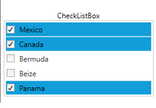

# Data Binding

The control can be populated using ItemsSource property, DisplayMemberPath property used to display the items and IsSelected property used to handle the selection in the CheckListBox. The below code snippet will be used to bind the ItemsSource to the CheckListBox.




<syncfusion:CheckListBox x:Name="checkListBox" IsCheckOnFirstClick="True" DisplayMemberPath="Name" ItemsSource="{Binding CheckListItems}">
    <syncfusion:CheckListBox.ItemContainerStyle>
      
    </syncfusion:CheckListBox.ItemContainerStyle>
</syncfusion:CheckListBox>





public class ViewModel : INotifyPropertyChanged
{
    public event PropertyChangedEventHandler PropertyChanged;
    private ObservableCollection<Model> _checkListItems;
    public ObservableCollection<Model> CheckListItems
    {
        get
        {
            return _checkListItems;
        }
        set
        {
            _checkListItems = value;
            RaisePropertyChanged("CheckListItems");
        }
    }
    public ViewModel()
    {
        CheckListItems = new ObservableCollection<Model>();
        CheckListItems.Add(new Model() { Name = "Mexico", Description = "Mexico", IsChecked = true });
        CheckListItems.Add(new Model() { Name = "Canada", Description = "Canada ", IsChecked = true });
        CheckListItems.Add(new Model() { Name = "Bermuda",Description = "Bermuda", IsChecked = false});   
        CheckListItems.Add(new Model() { Name = "Beize", Description = "Beize", IsChecked = false});               
        CheckListItems.Add(new Model() { Name = "Panama", Description = "Panama", IsChecked = true });  
    }
    public void RaisePropertyChanged(string PropertyName)
    {
        if (PropertyChanged != null)
        {
            PropertyChanged(this, new PropertyChangedEventArgs(PropertyName));
        }
    }
}
public class Model
{
    public string Name { get; set; }
    public string Description { get; set; }
    public bool IsChecked { get; set; }
}




