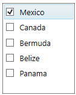

# Getting Started

## Assembly deployment

Refer to the [control dependencies](https://help.syncfusion.com/wpf/control-dependencies#checklistbox) section to get the list of assemblies or NuGet package that needs to be added as reference to use the control in any application.

You can find more details about installing the NuGet package in a WPF application in the following link: 

[How to install nuget packages](https://help.syncfusion.com/wpf/nuget-packages)

## Creating simple application with CheckListBox

You can create a WPF application with CheckListBox control using the following steps:

1.	[Create a project.](#creating-a-project)
2.	[Add control via designer.](#adding-control-via-designer)
3.	[Add control manually in XAML.](#adding-control-manually-in-xaml)
4.	[Add control manually in C#.](#adding-control-manually-in-c)
5.	[Add items using CheckListBoxItem.](#adding-items-using-checklistboxitem)
6.	[Bind to data.](#binding-to-data)

## Creating a project

Create a new WPF project in Visual Studio to display the CheckListBox with functionalities.

## Adding control via designer

The CheckListBox control can be added to an application by dragging it from the toolbox to a designer view. The required assembly references will be added automatically.

 
## Adding control manually in XAML

To add control manually in XAML, follow the given steps:

1.	Add the following required assembly references to the project:
    * Syncfusion.Tools.WPF
    * Syncfusion.Shared.WPF 
2.	Import Syncfusion WPF schema **http://schemas.syncfusion.com/wpf** in XAML page.
3.	Declare the CheckListBox control in XAML page.



<Window xmlns="http://schemas.microsoft.com/winfx/2006/xaml/presentation"
        xmlns:x="http://schemas.microsoft.com/winfx/2006/xaml"
        xmlns:syncfusion="http://schemas.syncfusion.com/wpf" 
        x:Class="CheckListBoxSample.MainWindow"
        Title="CheckListBox Sample" Height="350" Width="525">
    <Grid>
        <!--Adding CheckListBox control -->
        <syncfusion:CheckListBox x:Name="checkListBox" Width="100" Height="100" VerticalAlignment="Center" HorizontalAlignment="Center"/>
    </Grid>
</Window>



## Adding control manually in C#

To add control manually in C#, follow the given steps:

1.	Add the following required assembly references to the project:
    * Syncfusion.Tools.WPF
    * Syncfusion.Shared.WPF 
2.	Import the CheckListBox namespace **using Syncfusion.Windows.Tools.Controls;**.
3.	Create a CheckListBox instance, and add it to the window.



using Syncfusion.Windows.Tools.Controls;
namespace CheckListBoxSample
{
    /// 

    /// Interaction logic for MainWindow.xaml
    /// 

    public partial class MainWindow : Window
    {
        public MainWindow()
        {
			InitializeComponent();
			//Creating an instance of CheckListBox control
			CheckListBox checkListBox = new CheckListBox();
			//Adding CheckListBox as window content
			this.Content = checkListBox;
        }
    } 
}



## Adding items using CheckListBoxItem

You can add the items inside the CheckListBox control using [CheckListBoxItem](https://help.syncfusion.com/cr/wpf/Syncfusion.Tools.Wpf~Syncfusion.Windows.Tools.Controls.CheckListBoxItem.html).



<!-- Adding CheckListBox -->
<syncfusion:CheckListBox Name="checkListBox">
<!-- Adding CheckListBox items -->
<syncfusion:CheckListBoxItem Content="Mexico"/> 
<syncfusion:CheckListBoxItem Content="Canada" /> 
<syncfusion:CheckListBoxItem Content="Bermuda" />
<syncfusion:CheckListBoxItem Content="Belize" />
<syncfusion:CheckListBoxItem Content="Panama" />
</syncfusion:CheckListBox>


// Creating an instance of CheckListBox
CheckListBox checkListBox = new CheckListBox();

// Creating an instance of CheckListBoxItem
CheckListBoxItem checkListBoxItem1 = new CheckListBoxItem();
CheckListBoxItem checkListBoxItem2 = new CheckListBoxItem();

// Adding content to CheckListBoxItem
checkListBoxItem1.Content = "Mexico";
checkListBoxItem1.Content = "Bermuda";

// Adding CheckListBoxItem to CheckListBox
checkListBox.Items.Add(checkListBoxItem1); 
checkListBox.Items.Add(checkListBoxItem2); 



## Binding to data

You can populate the CheckListBox control using the [ItemsSource](https://docs.microsoft.com/en-us/dotnet/api/system.windows.controls.itemscontrol.itemssourceproperty?view=netframework-4.7.2) property. The [DisplayMemberPath](https://docs.microsoft.com/en-us/uwp/api/windows.ui.xaml.controls.itemscontrol.displaymemberpath) property is used to the name or path of the property displayed for each the data item in the control.

* **Model.cs**



public class CountryListModel
{
	public string Name { get; set; }
	public string Description { get; set; }
}



* **ViewModel.cs**



public class ViewModel
{
	private ObservableCollection<CountryListModel> checkList;
	public ObservableCollection<CountryListModel> CheckListItems
	{
		get
		{
			return checkList;
		}
		set
		{
			checkList = value;
			RaisePropertyChanged("CheckListItems");
		}
	}
	public ViewModel()
	{
		CheckListItems = new ObservableCollection<CountryListModel>();
		populateItem();
	}
	private void populateItem()
	{
		CheckListItems.Add(new CountryListModel() { Name = "Mexico", Description = "Mexico" });
		CheckListItems.Add(new CountryListModel() { Name = "Canada", Description = "Canada " });
		CheckListItems.Add(new CountryListModel() { Name = "Bermuda", Description = "Bermuda" });
		CheckListItems.Add(new CountryListModel() { Name = "Beize", Description = "Beize" });
		CheckListItems.Add(new CountryListModel() { Name = "Panama", Description = "Panama" });
	}
}



* **MainWindow.Xaml**



<Window.DataContext>
    <local:ViewModel/>
</Window.DataContext>

<!--Adding CheckListBox control -->
<syncfusion:CheckListBox x:Name="checkListBox" IsCheckOnFirstClick="True" Width="120" Height="150" DisplayMemberPath="Name" ItemsSource="{Binding CheckListItems}" />


 

