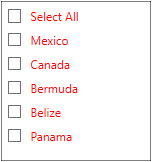
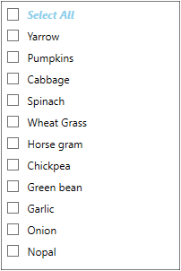
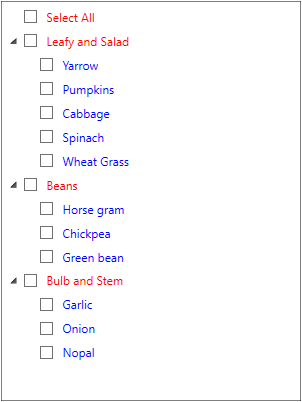

# Appearance in WPF CheckListBox

This section explains different UI customization, styling, theming options available in [CheckListBox](https://www.syncfusion.com/wpf-ui-controls/CheckedListBox) control.

## Setting the Foreground

We can change the foreground color of `CheckListBox` items by setting the `Foreground` property. The default color value of `Foreground` property is `Black`.




<syncfusion:CheckListBox Foreground="Red"             
                         Name="checkListBox">
    <syncfusion:CheckListBoxItem Content="Mexico"/>
    <syncfusion:CheckListBoxItem Content="Canada" />
    <syncfusion:CheckListBoxItem Content="Bermuda" />
    <syncfusion:CheckListBoxItem Content="Belize" />
    <syncfusion:CheckListBoxItem Content="Panama" />
</syncfusion:CheckListBox>




CheckListBox checkListBox = new CheckListBox();
checkListBox.Items.Add( new CheckListBoxItem() { Content = "Mexico" });
checkListBox.Items.Add( new CheckListBoxItem() { Content = "Canada" });
checkListBox.Items.Add( new CheckListBoxItem() { Content = "Bermuda" });
checkListBox.Items.Add( new CheckListBoxItem() { Content = "Belize" });
checkListBox.Items.Add( new CheckListBoxItem() { Content = "Panama" });

//Setting the foreground brush
checkListBox.Foreground=Brushes.Red; 




### Setting the Background 

 We can change the background color of `CheckListBox` items by setting the `Background` property. If we want to differentiate mouse hovered item or currently selected item with other items, we can do this by using [MouseOverBackground](https://help.syncfusion.com/cr/wpf/Syncfusion.Tools.Wpf~Syncfusion.Windows.Tools.Controls.CheckListBox~MouseOverBackground.html) and [SelectedItemBackground](https://help.syncfusion.com/cr/wpf/Syncfusion.Tools.Wpf~Syncfusion.Windows.Tools.Controls.CheckListBox~SelectedItemBackground.html) properties.




<syncfusion:CheckListBox Background="SkyBlue"
                         MouseOverBackground="DeepPink"
                         SelectedItemBackground="Yellow"       
                         Name="checkListBox">
    <syncfusion:CheckListBoxItem Content="Mexico"/>
    <syncfusion:CheckListBoxItem Content="Canada" />
    <syncfusion:CheckListBoxItem Content="Bermuda" />
    <syncfusion:CheckListBoxItem Content="Belize" />
    <syncfusion:CheckListBoxItem Content="Panama" />
</syncfusion:CheckListBox>




CheckListBox checkListBox = new CheckListBox();
checkListBox.Items.Add( new CheckListBoxItem() { Content = "Mexico" });
checkListBox.Items.Add( new CheckListBoxItem() { Content = "Canada" });
checkListBox.Items.Add( new CheckListBoxItem() { Content = "Bermuda" });
checkListBox.Items.Add( new CheckListBoxItem() { Content = "Belize" });
checkListBox.Items.Add( new CheckListBoxItem() { Content = "Panama" });

//Setting various background.
checkListBox.Background = Brushes.SkyBlue;
checkListBox.MouseOverBackground = Brushes.DeepPink;
checkListBox.SelectedItemBackground = Brushes.Yellow;




## Change flow direction

We can change the flow direction of the `CheckListBox` layout from right to left by setting the `FlowDirection` property value as `RightToLeft`. The Default value of `FlowDirection` property is `LeftToRight`.




<syncfusion:CheckListBox FlowDirection="RightToLeft"    
                         Name="checkListBox">
    <syncfusion:CheckListBoxItem Content="Mexico"/>
    <syncfusion:CheckListBoxItem Content="Canada" />
    <syncfusion:CheckListBoxItem Content="Bermuda" />
    <syncfusion:CheckListBoxItem Content="Belize" />
    <syncfusion:CheckListBoxItem Content="Panama" />
</syncfusion:CheckListBox>




CheckListBox checkListBox = new CheckListBox();
checkListBox.Items.Add( new CheckListBoxItem() { Content = "Mexico" });
checkListBox.Items.Add( new CheckListBoxItem() { Content = "Canada" });
checkListBox.Items.Add( new CheckListBoxItem() { Content = "Bermuda" });
checkListBox.Items.Add( new CheckListBoxItem() { Content = "Belize" });
checkListBox.Items.Add( new CheckListBoxItem() { Content = "Panama" });

//Setting flow direction as RTL
checkListBox.FlowDirection = FlowDirection.RightToLeft;




Click [here](https://github.com/SyncfusionExamples/wpf-checked-listbox-examples/tree/master/Samples/Apperance) to download the sample that showcases the styling and RTL supports.

## Item Template

We change the `DataTemplate` of the each `CheckListBox` items by using the `ItemTemplate` property.




//Model.cs
class Vegetable {
    public string Category { get; set; }
    public int Price { get; set; }
    public string Name { get; set; }
}

//ViewModel.cs
class ViewModel {
    public ObservableCollection<Vegetable> Vegetables { get; set; }
    public ViewModel() {
        Vegetables = new ObservableCollection<Vegetable>();
        Vegetables.Add(new Vegetable { Price=10, Name="Yarrow", Category="Leafy and Salad" });
        Vegetables.Add(new Vegetable { Price=20, Name="Pumpkins", Category="Leafy and Salad" });
        Vegetables.Add(new Vegetable { Price=30, Name="Cabbage", Category="Leafy and Salad" });
        Vegetables.Add(new Vegetable { Price=10, Name="Spinach", Category="Leafy and Salad" });
        Vegetables.Add(new Vegetable { Price=20, Name="Wheat Grass", Category="Leafy and Salad" });
        Vegetables.Add(new Vegetable { Price=30, Name="Horse gram", Category="Beans" });
        Vegetables.Add(new Vegetable { Price=10, Name="Chickpea", Category="Beans" });
        Vegetables.Add(new Vegetable { Price=20, Name="Green bean", Category="Beans" });
        Vegetables.Add(new Vegetable { Price=30, Name="Garlic", Category="Bulb and Stem" });
        Vegetables.Add(new Vegetable { Price=10, Name="Onion", Category="Bulb and Stem" });
        Vegetables.Add(new Vegetable { Price=20, Name="Nopal", Category="Bulb and Stem" });
    }
}







<syncfusion:CheckListBox x:Name="ListBox" 
                         ItemsSource="{Binding Vegetables}">
    <syncfusion:CheckListBox.DataContext>
        <local:ViewModel></local:ViewModel>
    </syncfusion:CheckListBox.DataContext>

    <!--DataTemplate for the CheckListBox items-->
    <syncfusion:CheckListBox.ItemTemplate>
        <DataTemplate>
            <StackPanel Orientation="Horizontal">
                <TextBlock FontWeight="Bold"
                           Foreground="SkyBlue"
                           Text="{Binding Name}" />
            </StackPanel>
        </DataTemplate>
    </syncfusion:CheckListBox.ItemTemplate>
</syncfusion:CheckListBox>




## Group Template

We change the `DataTemplate` of the group header items by using the `GroupTemplate` property.




//Model.cs
class Vegetable {
    public string Category { get; set; }
    public int Price { get; set; }
    public string Name { get; set; }
}

//ViewModel.cs
class ViewModel {
    public ObservableCollection<Vegetable> Vegetables { get; set; }
    public ICommand LoadedCommand { get; set; }
    public void OnLoaded(object param) {
        CollectionView view = (CollectionView)CollectionViewSource.GetDefaultView(Vegetables);

        //Adding group description
        view.GroupDescriptions.Add(new PropertyGroupDescription("Category"));
    }
    public ViewModel() {
        Vegetables = new ObservableCollection<Vegetable>();
        Vegetables.Add(new Vegetable { Price=10, Name="Yarrow", Category="Leafy and Salad" });
        Vegetables.Add(new Vegetable { Price=20, Name="Pumpkins", Category="Leafy and Salad" });
        Vegetables.Add(new Vegetable { Price=30, Name="Cabbage", Category="Leafy and Salad" });
        Vegetables.Add(new Vegetable { Price=10, Name="Spinach", Category="Leafy and Salad" });
        Vegetables.Add(new Vegetable { Price=20, Name="Wheat Grass", Category="Leafy and Salad" });
        Vegetables.Add(new Vegetable { Price=30, Name="Horse gram", Category="Beans" });
        Vegetables.Add(new Vegetable { Price=10, Name="Chickpea", Category="Beans" });
        Vegetables.Add(new Vegetable { Price=20, Name="Green bean", Category="Beans" });
        Vegetables.Add(new Vegetable { Price=30, Name="Garlic", Category="Bulb and Stem" });
        Vegetables.Add(new Vegetable { Price=10, Name="Onion", Category="Bulb and Stem" });
        Vegetables.Add(new Vegetable { Price=20, Name="Nopal", Category="Bulb and Stem" });

        //Initialize the checklistbox LoadedCommand
        LoadedCommand = new DelegateCommand<object>(OnLoaded);
    }
}







<syncfusion:CheckListBox x:Name="ListBox" 
                         ItemsSource="{Binding Vegetables}"
                         DisplayMemberPath="Name">
    <syncfusion:CheckListBox.DataContext>
        <local:ViewModel></local:ViewModel>
    </syncfusion:CheckListBox.DataContext>
    <i:Interaction.Triggers>
        <i:EventTrigger EventName="Loaded">
            <i:InvokeCommandAction Command="{Binding LoadedCommand}" />
        </i:EventTrigger>
    </i:Interaction.Triggers> 

    <!--DataTemplate for the GroupHeader items-->
    <syncfusion:CheckListBox.GroupTemplate>
        <DataTemplate>
            <TextBlock Text="{Binding Name}"
                       Foreground="Green" 
                       FontWeight="Bold">
            </TextBlock>
        </DataTemplate>
    </syncfusion:CheckListBox.GroupTemplate>
</syncfusion:CheckListBox>




## SelectAll Template

We change the `DataTemplate` of the `SelectAll` item by using the `SelectAllTemplate` property.




//Model.cs
class Vegetable {
    public string Category { get; set; }
    public int Price { get; set; }
    public string Name { get; set; }
}

//ViewModel.cs
class ViewModel {
    public ObservableCollection<Vegetable> Vegetables { get; set; }
    public ViewModel() {
        Vegetables = new ObservableCollection<Vegetable>();
        Vegetables.Add(new Vegetable { Price=10, Name="Yarrow", Category="Leafy and Salad" });
        Vegetables.Add(new Vegetable { Price=20, Name="Pumpkins", Category="Leafy and Salad" });
        Vegetables.Add(new Vegetable { Price=30, Name="Cabbage", Category="Leafy and Salad" });
        Vegetables.Add(new Vegetable { Price=10, Name="Spinach", Category="Leafy and Salad" });
        Vegetables.Add(new Vegetable { Price=20, Name="Wheat Grass", Category="Leafy and Salad" });
        Vegetables.Add(new Vegetable { Price=30, Name="Horse gram", Category="Beans" });
        Vegetables.Add(new Vegetable { Price=10, Name="Chickpea", Category="Beans" });
        Vegetables.Add(new Vegetable { Price=20, Name="Green bean", Category="Beans" });
        Vegetables.Add(new Vegetable { Price=30, Name="Garlic", Category="Bulb and Stem" });
        Vegetables.Add(new Vegetable { Price=10, Name="Onion", Category="Bulb and Stem" });
        Vegetables.Add(new Vegetable { Price=20, Name="Nopal", Category="Bulb and Stem" });
    }
}







<syncfusion:CheckListBox x:Name="ListBox" 
                         ItemsSource="{Binding Vegetables}"
                         DisplayMemberPath="Name">
    <syncfusion:CheckListBox.DataContext>
        <local:ViewModel></local:ViewModel>
    </syncfusion:CheckListBox.DataContext>

    <!--DataTemplate for the SelectAll items-->
    <syncfusion:CheckListBox.SelectAllTemplate>
        <DataTemplate>
            <TextBlock FontWeight="Bold" 
                       Foreground="SkyBlue" 
                       Text="Select All" 
                       FontStyle="Italic"/>
        </DataTemplate>
    </syncfusion:CheckListBox.SelectAllTemplate>
</syncfusion:CheckListBox>




Click [here](https://github.com/SyncfusionExamples/wpf-checked-listbox-examples/tree/master/Samples/Templates) to download the sample that showcases the `ItemTemplate`, `GroupTemplate` and `SelectAllTemplate` supports.

## ItemContainerStyle

We can change the item container style of `CheckListBox` by using the `ItemContainerStyle` which is applied to the container element that generated for each item. The default value of `ItemContainerStyle` is null.




class ViewModel {
    private ObservableCollection<string> daysCollection = new ObservableCollection<string>();
    public ObservableCollection<string> DaysCollection {
        get { return daysCollection; }
        set { daysCollection = value; }
    }

    public ViewModel() {
        //Days added in the collection
        DaysCollection.Add("Sunday");
        DaysCollection.Add("Monday");
        DaysCollection.Add("Tuesday");
        DaysCollection.Add("Wednesday");
        DaysCollection.Add("Thursday");
        DaysCollection.Add("Friday");
        DaysCollection.Add("Saturday");
    }
}







<syncfusion:CheckListBox ItemsSource="{Binding DaysCollection}" x:Name="checkListBox">
    <syncfusion:CheckListBox.DataContext>
        <local:ViewModel></local:ViewModel>
    </syncfusion:CheckListBox.DataContext>
    
    <!--Setting ItemContainerStyle for the CheckListBoxItems-->
    <syncfusion:CheckListBox.ItemContainerStyle>
        
    </syncfusion:CheckListBox.ItemContainerStyle>
</syncfusion:CheckListBox>




Here, the Checked items are contains a bold font.

Click [here](https://github.com/SyncfusionExamples/wpf-checked-listbox-examples/tree/master/Samples/ItemContainerStyle) to download the sample that showcases the `ItemContainerStyle` support.

## ItemTemplateSelector

We can change the various `DataTemplate` for the `CheckListBox` items based on the provided logic by using the `ItemTemplateSelector`.
 
 


//Model.cs
public class Vegetable {
    public string Category { get; set; }
    public int Price { get; set; }
    public string Name { get; set; }
}

//ViewModel.cs
class ViewModel {
    public ObservableCollection<Vegetable> Vegetables { get; set; }
    public ICommand LoadedCommand { get; set; }
    public void OnLoaded(object param) {
        CollectionView view = (CollectionView)CollectionViewSource.GetDefaultView(Vegetables);

        //Adding group description
        view.GroupDescriptions.Add(new PropertyGroupDescription("Category"));
    }
    public ViewModel() {
        Vegetables = new ObservableCollection<Vegetable>();
        Vegetables.Add(new Vegetable { Price=10, Name="Yarrow", Category="Leafy and Salad" });
        Vegetables.Add(new Vegetable { Price=20, Name="Pumpkins", Category="Leafy and Salad" });
        Vegetables.Add(new Vegetable { Price=30, Name="Cabbage", Category="Leafy and Salad" });
        Vegetables.Add(new Vegetable { Price=10, Name="Spinach", Category="Leafy and Salad" });
        Vegetables.Add(new Vegetable { Price=20, Name="Wheat Grass", Category="Leafy and Salad" });
        Vegetables.Add(new Vegetable { Price=30, Name="Horse gram", Category="Beans" });
        Vegetables.Add(new Vegetable { Price=10, Name="Chickpea", Category="Beans" });
        Vegetables.Add(new Vegetable { Price=20, Name="Green bean", Category="Beans" });
        Vegetables.Add(new Vegetable { Price=30, Name="Garlic", Category="Bulb and Stem" });
        Vegetables.Add(new Vegetable { Price=10, Name="Onion", Category="Bulb and Stem" });
        Vegetables.Add(new Vegetable { Price=20, Name="Nopal", Category="Bulb and Stem" });

        //Initialize the checklistbox LoadedCommand
        LoadedCommand = new DelegateCommand<object>(OnLoaded);
    }
}

//ItemTemplateSelector class for select a DataTemplate
public class MyTemplateSelector : DataTemplateSelector {
    public DataTemplate Template { get; set; }
    public DataTemplate itemTemplate { get; set; }

    public override DataTemplate SelectTemplate(object item, DependencyObject container) {
        if (item is Vegetable && (item as Vegetable).Category == "Beans")
            return itemTemplate;
        else
            return Template;
    }
}


 




<Window.Resources>
    <local:MyTemplateSelector x:Key="Mytemplate">
        <local:MyTemplateSelector.Template>
            <DataTemplate>
                <TextBlock Text="{Binding Name}" FontWeight="Bold"></TextBlock>
            </DataTemplate>
        </local:MyTemplateSelector.Template>
        <local:MyTemplateSelector.itemTemplate>
            <DataTemplate>
                <TextBlock Text="{Binding Name}" FontStyle="Italic"></TextBlock>
            </DataTemplate>
        </local:MyTemplateSelector.itemTemplate>
    </local:MyTemplateSelector>
</Window.Resources>

<syncfusion:CheckListBox ItemTemplateSelector="{StaticResource  Mytemplate}"
                         ItemsSource="{Binding Vegetables}"
                         Name="checkListBox">            
    <syncfusion:CheckListBox.DataContext>
        <local:ViewModel></local:ViewModel>
    </syncfusion:CheckListBox.DataContext>
    <i:Interaction.Triggers>
        <i:EventTrigger EventName="Loaded">
            <i:InvokeCommandAction Command="{Binding LoadedCommand}" />
        </i:EventTrigger>
    </i:Interaction.Triggers>
</syncfusion:CheckListBox>


 

Here, the `Leaf and Salad` and `Bulb and Stem` group items have same data template and the `Beans` group items have separate data template.

Click [here](https://github.com/SyncfusionExamples/wpf-checked-listbox-examples/tree/master/Samples/ItemTemplateSelector) to download the sample that showcases the `ItemTemplateSelector` support.

## ItemContainerStyleSelection

We can choose the style for the `CheckListBox` items based on the provided logic by using the `ItemContainerStyleSelector`.




//Model.cs
public class Vegetable {
    public string Category { get; set; }
    public int Price { get; set; }
    public string Name { get; set; }
}

//ViewModel.cs
class ViewModel {
    public ObservableCollection<Vegetable> Vegetables { get; set; }
    public ICommand LoadedCommand { get; set; }
    public void OnLoaded(object param) {
        CollectionView view = (CollectionView)CollectionViewSource.GetDefaultView(Vegetables);

        //Adding group description
        view.GroupDescriptions.Add(new PropertyGroupDescription("Category"));
    }
    public ViewModel() {
        Vegetables = new ObservableCollection<Vegetable>();
        Vegetables.Add(new Vegetable { Price=10, Name="Yarrow", Category="Leafy and Salad" });
        Vegetables.Add(new Vegetable { Price=20, Name="Pumpkins", Category="Leafy and Salad" });
        Vegetables.Add(new Vegetable { Price=30, Name="Cabbage", Category="Leafy and Salad" });
        Vegetables.Add(new Vegetable { Price=10, Name="Spinach", Category="Leafy and Salad" });
        Vegetables.Add(new Vegetable { Price=20, Name="Wheat Grass", Category="Leafy and Salad" });
        Vegetables.Add(new Vegetable { Price=30, Name="Horse gram", Category="Beans" });
        Vegetables.Add(new Vegetable { Price=10, Name="Chickpea", Category="Beans" });
        Vegetables.Add(new Vegetable { Price=20, Name="Green bean", Category="Beans" });
        Vegetables.Add(new Vegetable { Price=30, Name="Garlic", Category="Bulb and Stem" });
        Vegetables.Add(new Vegetable { Price=10, Name="Onion", Category="Bulb and Stem" });
        Vegetables.Add(new Vegetable { Price=20, Name="Nopal", Category="Bulb and Stem" });

        //Initialize the checklistbox LoadedCommand
        LoadedCommand = new DelegateCommand<object>(OnLoaded);
    }
}

// A class that choose style for for the items
public class VegetableStyleSelector : StyleSelector {
    public Style GroupStyle { get; set; }
    public Style ItemStyle { get; set; }
    public override Style SelectStyle(object item, DependencyObject container) {
        if (item is Vegetable)
            return ItemStyle;
        else
            return GroupStyle;
    }       
}







<Window.Resources>
    
    
    <local:VegetableStyleSelector x:Key="StyleSelector"
                                  GroupStyle="{StaticResource Groupstyle}" 
                                  ItemStyle="{StaticResource ItemStyle}">
    </local:VegetableStyleSelector>
</Window.Resources>

<syncfusion:CheckListBox ItemContainerStyleSelector="{StaticResource StyleSelector}"
                         ItemsSource="{Binding Vegetables}"
                         DisplayMemberPath="Name"
                         Name="checkListBox"
                         Margin="20">
    <syncfusion:CheckListBox.DataContext>
        <local:ViewModel></local:ViewModel>
    </syncfusion:CheckListBox.DataContext>
    <i:Interaction.Triggers>
        <i:EventTrigger EventName="Loaded">
            <i:InvokeCommandAction Command="{Binding LoadedCommand}" />
        </i:EventTrigger>
    </i:Interaction.Triggers>
</syncfusion:CheckListBox>




Here, the `GroupStyle` is applied to the group header and the `ItemStyle` is applied to the child items. 

Click [here](https://github.com/SyncfusionExamples/wpf-checked-listbox-examples/tree/master/Samples/ItemContainerStyleSelection) to download the sample that showcases the `ItemContainerStyleSelector` support.

## Theme

We can customize the appearance of the `CheckListBox` control by using the [SfSkinManager.SetVisualStyle](https://help.syncfusion.com/cr/cref_files/wpf/Syncfusion.SfSkinmanager.Wpf~Syncfusion.SfSkinmanager.SfSkinmanager~SetVisualStyle.html) method. The following are the various built-in visual styles for `CheckListBox` control.

* Blend
* Default
* Lime
* Metro
* Office2010Black
* Office2010Blue
* Office2010Silver
* Office2013DarkGray
* Office2013LightGray
* Office2013White
* Office2016Colorful
* Office2016DarkGray
* Office2016White
* Office365
* Saffron
* SystemTheme
* VisualStudio2013
* VisualStudio2015

Here, the `Blend` style is applied to the `CheckListBox`.




<syncfusion:CheckListBox syncfusionskin:SfSkinManager.VisualStyle="Blend" 
                         x:Name="checkListBox" >
</syncfusion:checkListBox>




//Namespace for the SfSkinManager.
using Syncfusion.SfSkinManager;
CheckListBox checkListBox = new CheckListBox();
SfSkinManager.SetVisualStyle(checkListBox, VisualStyles.Blend);




Click [here](https://github.com/SyncfusionExamples/wpf-checked-listbox-examples/tree/master/Samples/Themes) to download the sample that showcases the different theming support. 

