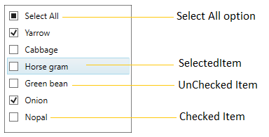
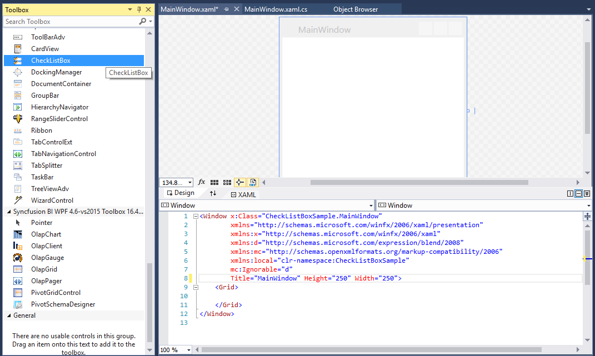
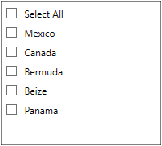

# Getting started with WPF CheckListBox

This section explains how to display and select the required items using WPF [CheckListBox](https://help.syncfusion.com/cr/wpf/Syncfusion.Windows.Tools.Controls.CheckListBox.html) control.

## Control Structure

## Assembly deployment
Refer to the [control dependencies](https://help.syncfusion.com/wpf/control-dependencies#checklistbox) section to get the list of assemblies or NuGet package that needs to be added as reference to use the control in any application.

You can find more details about installing the NuGet package in a WPF application in the following link:
[How to install nuget packages](https://help.syncfusion.com/wpf/visual-studio-integration/nuget-packages#installing-nuget-packages)

## Creating Application with CheckListBox control
In this walk through, user will create a WPF application that contains [ComboBox](https://help.syncfusion.com/cr/wpf/Syncfusion.Windows.Tools.Controls.CheckListBox.html) control.
1. [Creating project](#Creating-the-project)
2. [Adding control via designer](#Adding-control-via-designer)
3. [Adding control manually in XAML](#Adding-control-manually-in-XAML)
4. [Adding control manually in C#](#Adding-control-manually-in-C#)

## Creating project 
Below section provides detailed information to create new project in Visual Studio to display [CheckListBox](https://help.syncfusion.com/cr/wpf/Syncfusion.Windows.Tools.Controls.CheckListBox.html).

## Adding control via designer
The [CheckListBox](https://help.syncfusion.com/cr/wpf/Syncfusion.Windows.Tools.Controls.CheckListBox.html) control can be added to the application by dragging it from Toolbox and dropping it in designer. The required [assemblies]([control dependencies](https://help.syncfusion.com/wpf/control-dependencies#checklistbox)) will be added automatically.

## Adding control manually in XAML
In order to add [CheckListBox](https://help.syncfusion.com/cr/wpf/Syncfusion.Windows.Tools.Controls.CheckListBox.html) control manually in XAML, do the below steps,

1. Add the below required assembly references to the project,

    * Syncfusion.Shared.WPF
    * Syncfusion.Tools.Wpf

2. Import Syncfusion WPF schema **http://schemas.syncfusion.com/wpf** in XAML page.

3. Declare [CheckListBox](https://help.syncfusion.com/cr/wpf/Syncfusion.Windows.Tools.Controls.CheckListBox.html) in XAML page.





<Window
        xmlns="http://schemas.microsoft.com/winfx/2006/xaml/presentation"
        xmlns:x="http://schemas.microsoft.com/winfx/2006/xaml"
        xmlns:d="http://schemas.microsoft.com/expression/blend/2008"
        xmlns:mc="http://schemas.openxmlformats.org/markup-compatibility/2006"
        xmlns:local="clr-namespace:GettingStartedComboBox"
        xmlns:syncfusion="http://schemas.syncfusion.com/wpf" x:Class="GettingStarted.MainWindow"
        mc:Ignorable="d"
        Title="MainWindow" Height="450" Width="800">
    <Grid>
        <syncfusion:CheckListBox Height="200" Width="200">
            <syncfusion:CheckListBoxItem Content="Austria" />
            <syncfusion:CheckListBoxItem Content="Australia"/>
            <syncfusion:CheckListBoxItem Content="Canada"/>
            <syncfusion:CheckListBoxItem Content="Finland"/>
            <syncfusion:CheckListBoxItem Content="NewZealand"/>
        </syncfusion:CheckListBox>
    </Grid>
</Window>





## Adding control manually in C#
In order to add [CheckListBox](https://help.syncfusion.com/cr/wpf/Syncfusion.Windows.Tools.Controls.CheckListBox.html) control manually in C#, do the below steps,

1. Add the below required assembly references to the project,

    * Syncfusion.Shared.WPF
    * Syncfusion.Tools.Wpf

2. Import CheckListBox namespace **Syncfusion.Windows.Tools.Controls**.

3. Create CheckListBox control instance and add it to the page.





using System.Windows;
using Syncfusion.Windows.Tools.Controls;
namespace ComboBox
{
    /// 

    /// Interaction logic for MainWindow.xaml
    /// 

    public partial class MainWindow : Window
    {
        public MainWindow()
        {
            InitializeComponent();
            CheckListBox checkListBox = new CheckListBox();
            checkListBox.Height = 200;
            checkListBox.Width = 200;

            CheckListBoxItem item1 = new CheckListBoxItem() { Content = "Austria" };
            CheckListBoxItem item2 = new CheckListBoxItem() { Content = "Australia" };
            CheckListBoxItem item3 = new CheckListBoxItem() { Content = "Canada" };
            CheckListBoxItem item4 = new CheckListBoxItem() { Content = "Finland" };
            CheckListBoxItem item5 = new CheckListBoxItem() { Content = "NewZealand" };

            checkListBox.Items.Add(item1);
            checkListBox.Items.Add(item2);
            checkListBox.Items.Add(item3);
            checkListBox.Items.Add(item4);
            checkListBox.Items.Add(item5);

            this.Content = checkListBox;
        }
    }
}




 
## Populating items using CheckListBoxItem

You can add the items inside the [CheckListBox](https://help.syncfusion.com/cr/wpf/Syncfusion.Windows.Tools.Controls.CheckListBox.html) control using [CheckListBoxItem](https://help.syncfusion.com/cr/wpf/Syncfusion.Windows.Tools.Controls.CheckListBoxItem.html).




<syncfusion:CheckListBox Height="200" Width="200">
    <syncfusion:CheckListBoxItem Content="Austria" />
    <syncfusion:CheckListBoxItem Content="Australia"/>
    <syncfusion:CheckListBoxItem Content="Canada"/>
    <syncfusion:CheckListBoxItem Content="Finland"/>
    <syncfusion:CheckListBoxItem Content="NewZealand"/>
</syncfusion:CheckListBox>




CheckListBox checkListBox = new CheckListBox();
checkListBox.Height = 200;
checkListBox.Width = 200;

CheckListBoxItem item1 = new CheckListBoxItem() { Content = "Austria" };
CheckListBoxItem item2 = new CheckListBoxItem() { Content = "Australia" };
CheckListBoxItem item3 = new CheckListBoxItem() { Content = "Canada" };
CheckListBoxItem item4 = new CheckListBoxItem() { Content = "Finland" };
CheckListBoxItem item5 = new CheckListBoxItem() { Content = "NewZealand" };

checkListBox.Items.Add(item1);
checkListBox.Items.Add(item2);
checkListBox.Items.Add(item3);
checkListBox.Items.Add(item4);
checkListBox.Items.Add(item5);




## Populating items by DataBinding

You can populate items to the [CheckListBox](https://help.syncfusion.com/cr/wpf/Syncfusion.Windows.Tools.Controls.CheckListBox.html) control by using the `ItemsSource` property. The `DisplayMemberPath` property is used to the name or path of the property displayed for each data item in the control.

1. Create Model and populate it with required properties. Create ViewModel class and populate ObservableCollection object with Model objects.




//Model.cs
public class Model {
	public string Name { get; set; }
	public string Description { get; set; }
}

//ViewModel.cs
public class ViewModel {
	private ObservableCollection<Model> checkList;
	public ObservableCollection<Model> CheckListItems {
		get {
			return checkList;
		}
		set	{
			checkList = value;
		}
	}

	public ViewModel() {
		CheckListItems = new ObservableCollection<Model>();
		populateItem();
	}

	private void populateItem()	{
		CheckListItems.Add(new Model() { Name="Mexico", Description="Mexico"});
		CheckListItems.Add(new Model() { Name="Canada", Description="Canada"});
		CheckListItems.Add(new Model() { Name="Bermuda", Description="Bermuda"});
		CheckListItems.Add(new Model() { Name="Beize", Description="Beize"});
		CheckListItems.Add(new Model() { Name="Panama", Description="Panama"});
	}
}




2. Now create an instance of ViewModel in *DataContext* property of CheckListBox control in **MainWindow.xaml** and bind the collection property from ViewModel to `ItemSource` property of CheckListBox. 
Set the property from Model class to be displayed to `DisplayMemberPath` property. 




<!--Adding CheckListBox control -->
<syncfusion:CheckListBox ItemsSource="{Binding CheckListItems}"
                         DisplayMemberPath="Name" 
                         x:Name="checkListBox">
    <syncfusion:CheckListBox.DataContext>
        <local:ViewModel />
    </syncfusion:CheckListBox.DataContext>
</syncfusion:CheckListBox>




CheckListBox checkListBox = new CheckListBox();
checkListBox.DataContext = new ViewModel();
checkListBox.ItemsSource = (checkListBox.DataContext as ViewModel).CheckListItems;
checkListBox.DisplayMemberPath = "Name";



 

## Check or Uncheck items

You can check or uncheck the items in [CheckListBox](https://help.syncfusion.com/cr/wpf/Syncfusion.Windows.Tools.Controls.CheckListBox.html) by clicking on CheckBox or on content of the item. You can use `Space` key to uncheck or check the previously selected item.

You can programmatically check items in CheckListBox by adding the items in [SelectedItems](https://help.syncfusion.com/cr/wpf/Syncfusion.Windows.Tools.Controls.CheckListBox.html#Syncfusion_Windows_Tools_Controls_CheckListBox_SelectedItems) property.

## Checked event notification

When the checked state of an item is changed, it will be notified by using the [ItemChecked](https://help.syncfusion.com/cr/wpf/Syncfusion.Windows.Tools.Controls.CheckListBox.html) event. You can get the details about the checked item in [ItemCheckedEventArgs](https://help.syncfusion.com/cr/wpf/Syncfusion.Windows.Tools.Controls.ItemCheckedEventArgs.html).




<!--Adding CheckListBox control -->
<syncfusion:CheckListBox ItemChecked="CheckListBox_ItemChecked"  
                         x:Name="checkListBox">
</syncfusion:CheckListBox>




CheckListBox checkListBox = new CheckListBox();
checkListBox.ItemChecked += CheckListBox_ItemChecked;




You can handle the event as follows:




private void CheckListBox_ItemChecked(object sender, ItemCheckedEventArgs e)
{
    MessageBox.Show((e.Item as CheckListBoxItem).Content.ToString() + " is checked ");
}




## Get list of checked items

The [CheckListBox](https://help.syncfusion.com/cr/wpf/Syncfusion.Windows.Tools.Controls.CheckListBox.html) control gets all the checked items using the [SelectedItems](https://help.syncfusion.com/cr/wpf/Syncfusion.Windows.Tools.Controls.CheckListBox.html#Syncfusion_Windows_Tools_Controls_CheckListBox_SelectedItems) property. We can also get the currently selected item which is in either checked or unchecked state by using the [SelectedItem](https://help.syncfusion.com/cr/wpf/Syncfusion.Windows.Tools.Controls.CheckListBox.html#Syncfusion_Windows_Tools_Controls_CheckListBox_SelectedItem) property.

[View Sample in GutHub](https://github.com/SyncfusionExamples/wpf-checked-listbox-examples/tree/master/Samples/Getting-Started)
