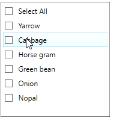
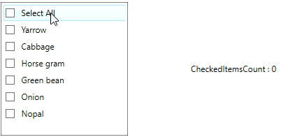

# Getting started with WPF CheckListBox

This section explains how to display and select the required items using WPF [CheckListBox](https://www.syncfusion.com/wpf-ui-controls/checkedlistbox) control.

## Control Structure

## Assembly deployment

Refer to the [control dependencies](https://help.syncfusion.com/wpf/control-dependencies#checklistbox) section to get the list of assemblies or NuGet package that needs to be added as reference to use the control in any application.

You can find more details about installing the NuGet package in a WPF application in the following link: 

[How to install nuget packages](https://help.syncfusion.com/wpf/nuget-packages)

## Adding WPF CheckListBox via designer

You can add the [CheckListBox](https://www.syncfusion.com/wpf-ui-controls/CheckedListBox) control to an application by dragging it from the toolbox to a view of the designer. The following dependent assembly will be added automatically:

* Syncfusion.Shared.WPF
* Syncfusion.Tools.Wpf

 
## Adding WPF CheckListBox via XAML

To add the `CheckListBox` control manually in XAML, follow these steps:
1. Create a new WPF project in Visual Studio.

2. Add the  following assembly references to the project,
   * Syncfusion.Shared.WPF
   * Syncfusion.Tools.Wpf
 
3. Import Syncfusion WPF schema **http://schemas.syncfusion.com/wpf** and declare the `CheckListBox` control in XAML page.

4.	Declare the `CheckListBox` control in XAML page.




<Window xmlns="http://schemas.microsoft.com/winfx/2006/xaml/presentation"
        xmlns:x="http://schemas.microsoft.com/winfx/2006/xaml"
        xmlns:syncfusion="http://schemas.syncfusion.com/wpf" 
        x:Class="CheckListBoxSample.MainWindow"
        Title="CheckListBox Sample" Height="350" Width="525">
    <Grid>
        <!--Adding CheckListBox control -->
        <syncfusion:CheckListBox x:Name="checkListBox" Width="200" Height="300" />
    </Grid>
</Window>



## Adding WPF CheckListBox via C\#

To add the `CheckListBox` control manually in C#, follow these steps:

1. Create a new WPF application via Visual Studio.

2. Add the  following assembly references to the project,
    * Syncfusion.Shared.WPF
    * Syncfusion.Tools.Wpf

3. Include the required namespace and create an instance of `CheckListBox` and add it to the window.

4.	Declare the `CheckListBox` control using C#.




using Syncfusion.Windows.Tools.Controls;

public partial class MainWindow : Window {
    public MainWindow() {
        InitializeComponent();

        //Creating an instance of CheckListBox control
        CheckListBox checkListBox = new CheckListBox();

        //Adding CheckListBox as window content
        this.Content = checkListBox;
    }
}




## Populating items using CheckListBoxItem

You can add the items inside the `CheckListBox` control using [CheckListBoxItem](https://help.syncfusion.com/cr/wpf/Syncfusion.Tools.Wpf~Syncfusion.Windows.Tools.Controls.CheckListBoxItem.html).




<!-- Adding CheckListBox -->
<syncfusion:CheckListBox Name="checkListBox">
    <!-- Adding CheckListBox items -->
   <syncfusion:CheckListBoxItem Content="Mexico" IsChecked="True" />
   <syncfusion:CheckListBoxItem Content="Canada" IsChecked="False"/>
   <syncfusion:CheckListBoxItem Content="Bermuda"  IsChecked="True"/>
</syncfusion:CheckListBox>




// Creating an instance of CheckListBox
CheckListBox checkListBox = new CheckListBox();

// Creating an instance of CheckListBoxItem
CheckListBoxItem checkListBoxItem1 = new CheckListBoxItem() { Content = "Mexico",IsChecked= true };
CheckListBoxItem checkListBoxItem2 = new CheckListBoxItem() { Content = "Canada", IsChecked = false };
CheckListBoxItem checkListBoxItem3 = new CheckListBoxItem() { Content = "Bermuda", IsChecked = true };

// Adding CheckListBoxItem to CheckListBox
checkListBox.Items.Add(checkListBoxItem1);
checkListBox.Items.Add(checkListBoxItem2);
checkListBox.Items.Add(checkListBoxItem3);




## Populating items using collection

You can populate items to the `CheckListBox` control by using the `ItemsSource` property. The `DisplayMemberPath` property is used to the name or path of the property displayed for each data item in the control.




//Model.cs
public class CountryListModel {
	public string Name { get; set; }
	public string Description { get; set; }
}

//ViewModel.cs
public class ViewModel {
	private ObservableCollection<CountryListModel> checkList;
	public ObservableCollection<CountryListModel> CheckListItems {
		get {
			return checkList;
		}
		set	{
			checkList = value;
		}
	}

	public ViewModel() {
		CheckListItems = new ObservableCollection<CountryListModel>();
		populateItem();
	}

	private void populateItem()	{
		CheckListItems.Add(new CountryListModel() { Name = "Mexico", Description = "Mexico" });
		CheckListItems.Add(new CountryListModel() { Name = "Canada", Description = "Canada " });
		CheckListItems.Add(new CountryListModel() { Name = "Bermuda", Description = "Bermuda" });
		CheckListItems.Add(new CountryListModel() { Name = "Beize", Description = "Beize" });
		CheckListItems.Add(new CountryListModel() { Name = "Panama", Description = "Panama" });
	}
}




* **MainWindow.Xaml**




<!--Adding CheckListBox control -->
<syncfusion:CheckListBox ItemsSource="{Binding CheckListItems}"
                         DisplayMemberPath="Name" 
                         x:Name="checkListBox">
    <syncfusion:CheckListBox.DataContext>
        <local:ViewModel></local:ViewModel>
    </syncfusion:CheckListBox.DataContext>>
</syncfusion:CheckListBox>




CheckListBox checkListBox = new CheckListBox();
checkListBox.DataContext = new ViewModel();
checkListBox.ItemsSource = (checkListBox.DataContext as ViewModel).CheckListItems;
checkListBox.DisplayMemberPath = "Name";



 

## Check or Uncheck items

The `CheckListBox` items can be checked or unchecked in a single click either by clicking the `CheckBox` or clicking the content of the item. Also, the checked state of an item can be handled using the `Space` key. If we wants to make some item as checked using programmatically, add that items into the [SelectedItems](https://help.syncfusion.com/cr/wpf/Syncfusion.Tools.Wpf~Syncfusion.Windows.Tools.Controls.CheckListBox~SelectedItems.html) collection.

## Checked event notification

When the checked state of an item is changed, it will be notified by using the [ItemChecked](https://help.syncfusion.com/cr/wpf/Syncfusion.Tools.Wpf~Syncfusion.Windows.Tools.Controls.CheckListBox~ItemChecked_EV.html) event. You can get the details about the checked item in [ItemCheckedEventArgs](https://help.syncfusion.com/cr/wpf/Syncfusion.Tools.Wpf~Syncfusion.Windows.Tools.Controls.ItemCheckedEventArgs.html).




<!--Adding CheckListBox control -->
<syncfusion:CheckListBox ItemChecked="CheckListBox_ItemChecked"  
                         x:Name="checkListBox">
</syncfusion:CheckListBox>




CheckListBox checkListBox = new CheckListBox();
checkListBox.ItemChecked += CheckListBox_ItemChecked;




You can handle the event as follows:




private void CheckListBox_ItemChecked(object sender, ItemCheckedEventArgs e)
{
    Console.WriteLine("ItemChecked event is raised");
}




## Get list of checked items

The `CheckListBox` control gets all the checked items using the [SelectedItems](https://help.syncfusion.com/cr/wpf/Syncfusion.Tools.Wpf~Syncfusion.Windows.Tools.Controls.CheckListBox~SelectedItems.html) property. We can also get the currently selected item which is in either checked or unchecked state by using the [SelectedItem](https://help.syncfusion.com/cr/wpf/Syncfusion.Tools.Wpf~Syncfusion.Windows.Tools.Controls.CheckListBox~SelectedItem.html) property.

Click [here](https://github.com/SyncfusionExamples/wpf-checked-listbox-examples/tree/master/Samples/Getting-Started
) to download the sample that showcases the basic features of `CheckListBox` control.
