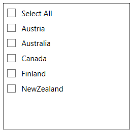
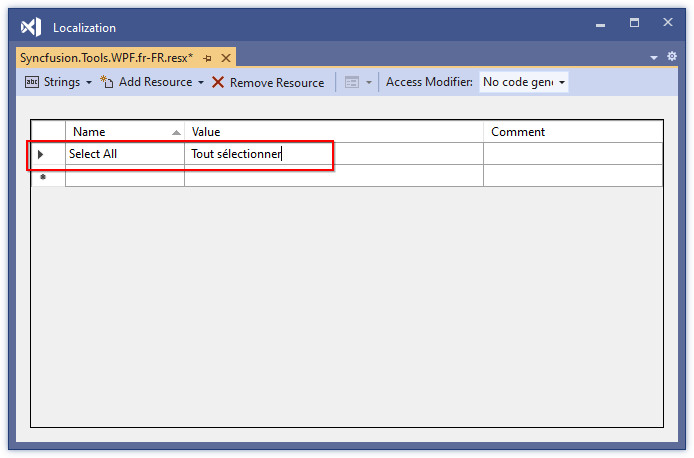
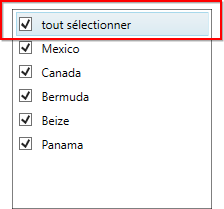

# Getting started with WPF CheckListBox

This section explains how to display and select the required items using the WPF [CheckListBox](https://help.syncfusion.com/cr/wpf/Syncfusion.Windows.Tools.Controls.CheckListBox.html) control.

## Control Structure

## Assembly deployment
Refer to the [control dependencies](https://help.syncfusion.com/wpf/control-dependencies#checklistbox) section to get the list of assemblies or NuGet package that needs to be added as reference to use the control in any application.

Further information on installing the NuGet package can be found in the following link: [How to install nuget packages](https://help.syncfusion.com/wpf/visual-studio-integration/nuget-packages).

You can also use the [Syncfusion Reference Manager](https://help.syncfusion.com/wpf/visual-studio-integration/visual-studio-extensions/add-references) to refer the CheckListBox's dependent assemblies.

## Creating simple application with CheckListBox control

In this walk through, the user will create a WPF application that contains the [CheckListBox](https://help.syncfusion.com/cr/wpf/Syncfusion.Windows.Tools.Controls.CheckListBox.html) control.

## Creating project

In Visual Studio, create a new WPF project to show the features of the [CheckListBox](https://help.syncfusion.com/cr/wpf/Syncfusion.Windows.Tools.Controls.CheckListBox.html) control and add the following namespace to the added assemblies.

## Adding control via designer

The [CheckListBox](https://help.syncfusion.com/cr/wpf/Syncfusion.Windows.Tools.Controls.CheckListBox.html) control can be added to the application by dragging it from Toolbox and dropping it in the designer. The required [assemblies](https://help.syncfusion.com/wpf/control-dependencies#checklistbox) will be added automatically.

## Adding control manually in XAML

To add the [CheckListBox](https://help.syncfusion.com/cr/wpf/Syncfusion.Windows.Tools.Controls.CheckListBox.html) control manually in XAML, follow these steps,

1.Add the following assembly references to the project.

* Syncfusion.Shared.WPF
* Syncfusion.Tools.WPF

2.Import Syncfusion WPF schema **http://schemas.syncfusion.com/wpf** in the XAML page.

3.Declare the `CheckListBox` control in XAML page.





<Window
        xmlns="http://schemas.microsoft.com/winfx/2006/xaml/presentation"
        xmlns:x="http://schemas.microsoft.com/winfx/2006/xaml"
        xmlns:d="http://schemas.microsoft.com/expression/blend/2008"
        xmlns:mc="http://schemas.openxmlformats.org/markup-compatibility/2006"
        xmlns:local="clr-namespace:GettingStartedComboBox"
        xmlns:syncfusion="http://schemas.syncfusion.com/wpf" x:Class="GettingStarted.MainWindow"
        mc:Ignorable="d"
        Title="MainWindow" Height="450" Width="800">
    <Grid>
        <syncfusion:CheckListBox x:Name="checkListBox" Width="200" Height="300"/>
    </Grid>
</Window>





## Adding control manually in C#

To add the `CheckListBox` control manually in C#, follow these steps,

1.Add the following assembly references to the project.

* Syncfusion.Shared.WPF
* Syncfusion.Tools.WPF

2.Import CheckListBox namespace **Syncfusion.Windows.Tools.Controls**.

3.Create the `CheckListBox` control instance and add it to the window.





using System.Windows;
using Syncfusion.Windows.Tools.Controls;
namespace ComboBox
{
    /// 

    /// Interaction logic for MainWindow.xaml
    /// 

    public partial class MainWindow : Window
    {
        public MainWindow()
        {
            InitializeComponent();

            //Creating an instance of CheckListBox control.
            CheckListBox checkListBox = new CheckListBox();

            //Adding CheckListBox as window content.
            this.Content = checkListBox;
        }
    }
}




 
## Populating items using CheckListBoxItem

You can add the items inside the [CheckListBox](https://help.syncfusion.com/cr/wpf/Syncfusion.Windows.Tools.Controls.CheckListBox.html) control using the [CheckListBoxItem](https://help.syncfusion.com/cr/wpf/Syncfusion.Windows.Tools.Controls.CheckListBoxItem.html).




<syncfusion:CheckListBox Height="200" Width="200">
    <syncfusion:CheckListBoxItem Content="Austria" />
    <syncfusion:CheckListBoxItem Content="Australia"/>
    <syncfusion:CheckListBoxItem Content="Canada"/>
    <syncfusion:CheckListBoxItem Content="Finland"/>
    <syncfusion:CheckListBoxItem Content="NewZealand"/>
</syncfusion:CheckListBox>




CheckListBox checkListBox = new CheckListBox();
checkListBox.Height = 200;
checkListBox.Width = 200;

CheckListBoxItem item1 = new CheckListBoxItem() { Content = "Austria" };
CheckListBoxItem item2 = new CheckListBoxItem() { Content = "Australia" };
CheckListBoxItem item3 = new CheckListBoxItem() { Content = "Canada" };
CheckListBoxItem item4 = new CheckListBoxItem() { Content = "Finland" };
CheckListBoxItem item5 = new CheckListBoxItem() { Content = "NewZealand" };

checkListBox.Items.Add(item1);
checkListBox.Items.Add(item2);
checkListBox.Items.Add(item3);
checkListBox.Items.Add(item4);
checkListBox.Items.Add(item5);

this.Content = checkListBox;




## Populating items by DataBinding

You can populate the items to the [CheckListBox](https://help.syncfusion.com/cr/wpf/Syncfusion.Windows.Tools.Controls.CheckListBox.html) control by using the `ItemsSource` property. The `DisplayMemberPath` property is used to the name or path of the property displayed for each data item in the control.

1.Create Model and populate it with required properties. Create the ViewModel class and populate ObservableCollection object with the Model objects.




//Model.cs
public class Model
{
	public string Name { get; set; }
	public string Description { get; set; }
}

//ViewModel.cs
public class ViewModel
{
	private ObservableCollection<Model> checkList;
	public ObservableCollection<Model> CheckListItems
    {
		get
        {
			return checkList;
		}
		set
        {
			checkList = value;
		}
	}

	public ViewModel()
    {
		CheckListItems = new ObservableCollection<Model>();
		populateItem();
	}

	private void populateItem()
    {
		CheckListItems.Add(new Model() { Name="Mexico", Description="Mexico"});
		CheckListItems.Add(new Model() { Name="Canada", Description="Canada"});
		CheckListItems.Add(new Model() { Name="Bermuda", Description="Bermuda"});
		CheckListItems.Add(new Model() { Name="Beize", Description="Beize"});
		CheckListItems.Add(new Model() { Name="Panama", Description="Panama"});
	}
}




2.Now create an instance of ViewModel in **DataContext** property of the CheckListBox control in **MainWindow.xaml** and bind the collection property from ViewModel to the `ItemSource` property of CheckListBox. Set the property from Model class to be displayed in the `DisplayMemberPath` property.




<!--Adding CheckListBox control -->
<syncfusion:CheckListBox ItemsSource="{Binding CheckListItems}"
                         DisplayMemberPath="Name" 
                         x:Name="checkListBox">
    <syncfusion:CheckListBox.DataContext>
        <local:ViewModel />
    </syncfusion:CheckListBox.DataContext>
</syncfusion:CheckListBox>




CheckListBox checkListBox = new CheckListBox();
checkListBox.DataContext = new ViewModel();
checkListBox.ItemsSource = (checkListBox.DataContext as ViewModel).CheckListItems;
checkListBox.DisplayMemberPath = "Name";



 

## Check or Uncheck items

You can check or uncheck the items in the [CheckListBox](https://help.syncfusion.com/cr/wpf/Syncfusion.Windows.Tools.Controls.CheckListBox.html) by clicking on the CheckBox or the content of the item. You can use `Space` key to uncheck or check the previously selected item.

You can programmatically check the items in CheckListBox by adding the items in the [SelectedItems](https://help.syncfusion.com/cr/wpf/Syncfusion.Windows.Tools.Controls.CheckListBox.html#Syncfusion_Windows_Tools_Controls_CheckListBox_SelectedItems) property.

## Checked event notification

When the checked state of an item is changed, it will be notified by using the [ItemChecked](https://help.syncfusion.com/cr/wpf/Syncfusion.Windows.Tools.Controls.CheckListBox.html#Syncfusion_Windows_Tools_Controls_CheckListBox_ItemChecked) event. You can get the details about the checked item in the [ItemCheckedEventArgs](https://help.syncfusion.com/cr/wpf/Syncfusion.Windows.Tools.Controls.ItemCheckedEventArgs.html).




<!--Adding CheckListBox control -->
<syncfusion:CheckListBox ItemChecked="CheckListBox_ItemChecked"  
                         x:Name="checkListBox">
</syncfusion:CheckListBox>




CheckListBox checkListBox = new CheckListBox();
checkListBox.ItemChecked += CheckListBox_ItemChecked;




You can handle the event as follows:




private void CheckListBox_ItemChecked(object sender, ItemCheckedEventArgs e)
{
    MessageBox.Show((e.Item as CheckListBoxItem).Content.ToString() + " is checked ");
}




## Get list of checked items

The [CheckListBox](https://help.syncfusion.com/cr/wpf/Syncfusion.Windows.Tools.Controls.CheckListBox.html) control gets all the checked items using the [SelectedItems](https://help.syncfusion.com/cr/wpf/Syncfusion.Windows.Tools.Controls.CheckListBox.html#Syncfusion_Windows_Tools_Controls_CheckListBox_SelectedItems) property. You can also get the currently selected item which is in either checked or unchecked state by using the [SelectedItem](https://help.syncfusion.com/cr/wpf/Syncfusion.Windows.Tools.Controls.CheckListBox.html#Syncfusion_Windows_Tools_Controls_CheckListBox_SelectedItem) property.

[View Sample in GitHub](https://github.com/SyncfusionExamples/wpf-checked-listbox-examples/tree/master/Samples/Getting-Started)

## Localization support

Localization is the process of translating the application resources into different language for the specific cultures. You can localize the `Select All` CheckListBoxItem in `CheckListBox` control by adding resource file for each language.

To localize the `CheckListBox` based on culture using resource files, follow the below steps.

1. Change application culture and create `.resx` files.

N> Refer [Localization of Syncfusion WPF Controls](https://help.syncfusion.com/wpf/localization#changing-application-culture) page to know more about how to Change application culture and create `.resx` files into a application.

2. After creating `.resx` file, add the Name/Value pair in Resource Designer of created `.resx` file and change its corresponding value to corresponding culture.

The following screenshot shows the localized `CheckListBox` control.

[View Sample in GitHub](https://github.com/SyncfusionExamples/wpf-checked-listbox-examples/tree/master/Samples/Localization)

## Theme

CheckListBox supports various built-in themes. Refer to the below links to apply themes for the CheckListBox,

  * [Apply theme using SfSkinManager](https://help.syncfusion.com/wpf/themes/skin-manager)
	
  * [Create a custom theme using ThemeStudio](https://help.syncfusion.com/wpf/themes/theme-studio#creating-custom-theme)

  