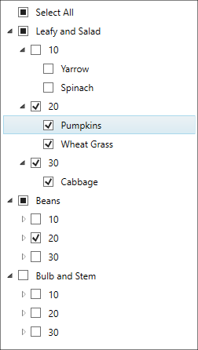

# Grouping in WPF CheckListBox

 By default, the [CheckListBox](https://www.syncfusion.com/wpf-ui-controls/CheckedListBox) items are in the listed view. We can group the `CheckListBox` items by adding the group description to the `CollectionView.GroupDescriptions` collection.

 The selection state of group header varies based on the checked or unchecked state of the child items. Group can be expanded or collapsed and the child items present in the group can be checked or unchecked based on the user’s perspective.




//Model.cs
class Vegetable {
    public string Category { get; set; }
    public string Price { get; set; }
    public string Name { get; set; }
}

//ViewModel.cs
class ViewModel {
    public ObservableCollection<Vegetable> Vegetables { get; set; }
    public ICommand LoadedCommand { get; set; }
    public void OnLoaded(object param) {
        CollectionView view = (CollectionView)CollectionViewSource.GetDefaultView(Vegetables);
       
        //Adding group description
            view.GroupDescriptions.Add(new PropertyGroupDescription("Price"));
    }
    public ViewModel() {
        Vegetables = new ObservableCollection<Vegetable>();
        Vegetables.Add(new Vegetable { Price = "$10", Name = "Yarrow", Category = "Leafy and Salad" });
        Vegetables.Add(new Vegetable { Price = "$20", Name = "Cabbage", Category = "Leafy and Salad" });
        Vegetables.Add(new Vegetable { Price = "$30", Name = "Horse gram", Category = "Beans" });
        Vegetables.Add(new Vegetable { Price = "$20", Name = "Green bean", Category = "Beans" });
        Vegetables.Add(new Vegetable { Price = "$10", Name = "Onion", Category = "Bulb and Stem" });
        Vegetables.Add(new Vegetable { Price = "$30", Name = "Nopal", Category = "Bulb and Stem" });

        //Initialize the CheckListBox LoadedCommand
        LoadedCommand = new DelegateCommand<object>(OnLoaded);
    }
}







<syncfusion:CheckListBox ItemsSource="{Binding Vegetables}" DisplayMemberPath="Name"
                         Name="checkListBox">
    <syncfusion:CheckListBox.DataContext>
        <local:ViewModel></local:ViewModel>
    </syncfusion:CheckListBox.DataContext>
    <i:Interaction.Triggers>
        <i:EventTrigger EventName="Loaded">
            <i:InvokeCommandAction Command="{Binding LoadedCommand}" />
        </i:EventTrigger>
    </i:Interaction.Triggers>
</syncfusion:CheckListBox>




Here, the `Vegetables` items are grouped based on their price.

Click [here](https://github.com/SyncfusionExamples/wpf-checked-listbox-examples/tree/master/Samples/Grouping) to download the sample that showcases the grouping support in the `CheckListBox`.

## Nested Grouping

 We can create a multi-level nested groups for the `CheckListBox` items by adding the two or more group descriptions to the `CollectionView.GroupDescriptions` collection. Child level groups are created by order of group descriptions added to the collection.




//Model.cs
class Vegetable {
    public string Category { get; set; }
    public string Price { get; set; }
    public string Name { get; set; }
}

//ViewModel.cs
class ViewModel {
    public ObservableCollection<Vegetable> Vegetables { get; set; }
    public ICommand LoadedCommand { get; set; }
    public void OnLoaded(object param) {
        CollectionView view = (CollectionView)CollectionViewSource.GetDefaultView(Vegetables);
       
        //Adding the multiple group description
            view.GroupDescriptions.Add(new PropertyGroupDescription("Category"));
            view.GroupDescriptions.Add(new PropertyGroupDescription("Price"));
    }
    public ViewModel() {
        Vegetables = new ObservableCollection<Vegetable>();
        Vegetables.Add(new Vegetable { Price = "$10", Name = "Yarrow", Category = "Leafy and Salad" });
        Vegetables.Add(new Vegetable { Price = "$20", Name = "Pumpkins", Category = "Leafy and Salad" });
        Vegetables.Add(new Vegetable { Price = "$30", Name = "Cabbage", Category = "Leafy and Salad" });
        Vegetables.Add(new Vegetable { Price = "$10", Name = "Spinach", Category = "Leafy and Salad" });
        Vegetables.Add(new Vegetable { Price = "$20", Name = "Wheat Grass", Category = "Leafy and Salad" });
        Vegetables.Add(new Vegetable { Price = "$30", Name = "Horse gram", Category = "Beans" });
        Vegetables.Add(new Vegetable { Price = "$10", Name = "Chickpea", Category = "Beans" });
        Vegetables.Add(new Vegetable { Price = "$20", Name = "Green bean", Category = "Beans" });
        Vegetables.Add(new Vegetable { Price = "$30", Name = "Garlic", Category = "Bulb and Stem" });
        Vegetables.Add(new Vegetable { Price = "$10", Name = "Onion", Category = "Bulb and Stem" });
        Vegetables.Add(new Vegetable { Price = "$20", Name = "Nopal", Category = "Bulb and Stem" });

        //Initialize the checklistbox LoadedCommand
        LoadedCommand = new DelegateCommand<object>(OnLoaded);
    }
}







<syncfusion:CheckListBox ItemsSource="{Binding Vegetables}" DisplayMemberPath="Name"
                         Name="checkListBox">
    <syncfusion:CheckListBox.DataContext>
        <local:ViewModel></local:ViewModel>
    </syncfusion:CheckListBox.DataContext>
    <i:Interaction.Triggers>
        <i:EventTrigger EventName="Loaded">
            <i:InvokeCommandAction Command="{Binding LoadedCommand}" />
        </i:EventTrigger>
    </i:Interaction.Triggers>
</syncfusion:CheckListBox>




Here, the `Vegetables` items are grouped based on their Category and then, the categorized properties are grouped by price.

Click [here](https://github.com/SyncfusionExamples/wpf-checked-listbox-examples/tree/master/Samples/NestedGrouping) to download the sample that showcases the nested grouping support in the `CheckListBox`.