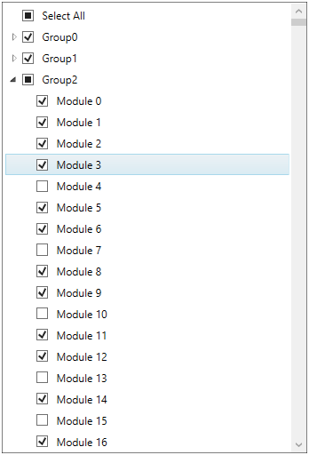

# Virtualization in WPF CheckListBox

UI Virtualization support is enabled by default in [CheckListBox](https://www.syncfusion.com/wpf-ui-controls/CheckedListBox), which allows the users to load large sets of data without affecting loading or scrolling performance. This feature allows users to reduce the loading time of CheckListBoxItems regardless of items count.




public class Model {
    public string Name { get; set; }
    public string GroupName { get; set; }
}
public class ViewModel {
    private ObservableCollection<Model> collection = new ObservableCollection<Model>();
    public ObservableCollection<Model> Collection {
        get { return collection; }
        set { collection = value;}
    }

    public ICommand LoadedCommand { get; set; }
    public void OnLoaded(object param) {
        CollectionView view = (CollectionView)CollectionViewSource.GetDefaultView(Collection);

        //Adding group description
        view.GroupDescriptions.Add(new PropertyGroupDescription("GroupName"));
    }

    public ViewModel() {
        Collection = new ObservableCollection<Model>();
        for (int i = 0; i < 10000; i++) {
            for (int j = 0; j < 10; j++) {
                Model myitem = new Model() { Name = "Module " + i.ToString(), GroupName = "Group" + j.ToString() };
                Collection.Add(myitem);
            }
        }

        //Initialize the checklistbox LoadedCommand
        LoadedCommand = new DelegateCommand<object>(OnLoaded);
    }
}




<syncfusion:CheckListBox ItemsSource="{Binding Collection}"
                         DisplayMemberPath="Name" 
                         Name="checkListBox"
                         Margin="20">
    <syncfusion:CheckListBox.DataContext>
        <local:ViewModel></local:ViewModel>
    </syncfusion:CheckListBox.DataContext>
    <i:Interaction.Triggers>
        <i:EventTrigger EventName="Loaded">
            <i:InvokeCommandAction Command="{Binding LoadedCommand}" />
        </i:EventTrigger>
    </i:Interaction.Triggers>
</syncfusion:CheckListBox>




Click [here](https://github.com/SyncfusionExamples/wpf-checked-listbox-examples/tree/master/Samples/Virtualization) to download the sample that showcases the virtualization support in the `CheckListBox`.

## Disable the Virtualization

We can only load the particular items to visible at a time. If we want to make some items as checked that are not in view, then we need to disable the virtualization, otherwise the items will not be checked until they are in view. We can disable the virtualization by using the `ItemsPanel` template.




<syncfusion:CheckListBox Name="checkListBox">
    <syncfusion:CheckListBox.ItemsPanel>
        <ItemsPanelTemplate>
            <StackPanel></StackPanel>
        </ItemsPanelTemplate>
    </syncfusion:CheckListBox.ItemsPanel>      
</syncfusion:CheckListBox>




CheckListBox checkListBox = new CheckListBox();
checkListBox.ItemsPanel = new ItemsPanelTemplate(new FrameworkElementFactory(typeof(StackPanel)));




Click [here](https://github.com/SyncfusionExamples/wpf-checked-listbox-examples/tree/master/Samples/CheckItem-By-Property) to download the sample that showcases disable the virtualization.